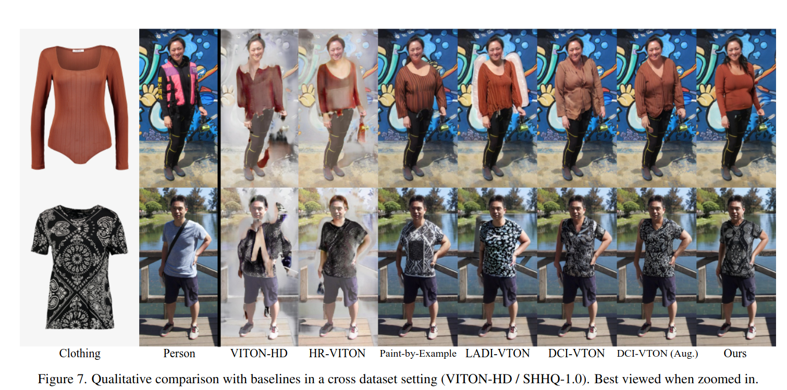
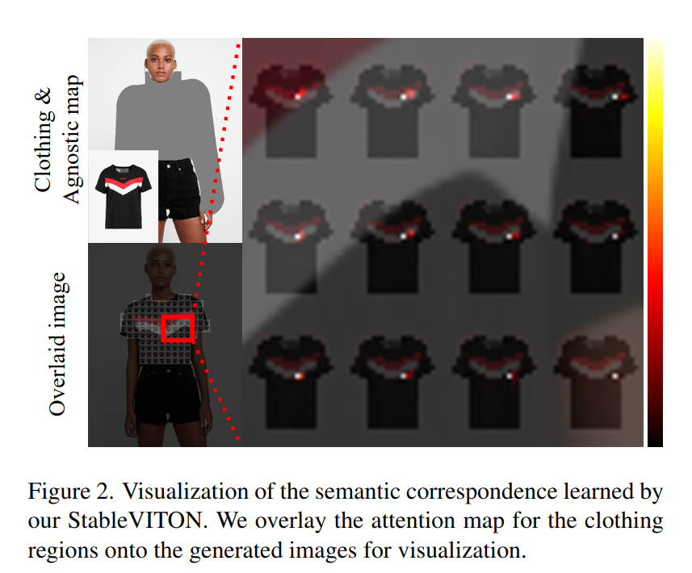
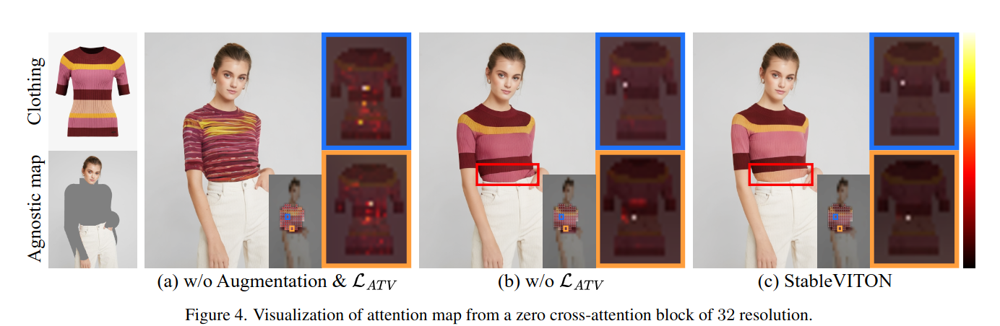
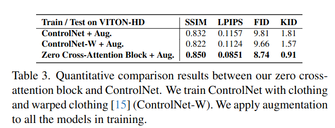
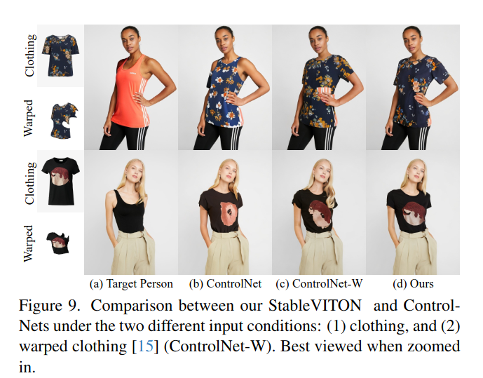
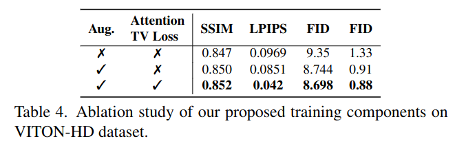
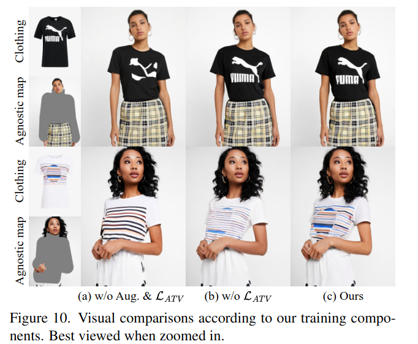

## StableVITON: Learning Semantic Correspondence with Latent Diffusion Model for Virtual Try-On
*arXiv(2023), 0 citation*

[Intro](#intro) 
[Related Work](#related-work) 
[Method](#method) 
[Experiment](#experiment) 
[Conclusion](#conclusion) 

> Core Idea

<strong>"ControlNet + Paint by Example for VITON + Attention Total Variation Loss + Augmentation"</strong> 

***

### <strong>Intro</strong>

본 논문에서 자주 언급되는 **Semantic Correspondence** 는 clothing image 를 target person 에 align 이 되게끔 잘 warping 하는 것을 의미한다. 

$\textbf{이 주제의 정의 및 요구사항과 중요한 이유}$

- Image-based VITON 은 clothing image 와 target person image 가 주어졌을때, target person 에 옷을 입히는 task 이다. 
- Dataset 은 clothing image - person image (clothing image 를 입고있는) paired dataset 을 학습한다.

$\textbf{이 주제의 문제점과 기존의 노력들}$

- 이전의 방법들은 일반적으로 $2$ 개의 module 을 포함한다. 
  1. Clothing 과 human body 사이의 semantic correspondence 를 학습하는 warping network 
  2. Warped clothing 과 target person image 를 융합시키는 generator

- 성공적인 발전을 달성했음에도 이러한 방법들은 여전히 문제가 존재한다.
  1. Generalizability: 다양한 상황에도 작동해야됨
     1. 특히, 임의의 사람 이미지에 복잡한 background 를 유지하는 게 어렵다.
     2. 이는 다양한 환경에서의 데이터를 수집하기가 어려워서 generator 의 생성 능력에 제한을 초래한다.  

- StableVITON: Generalizability 의 우월함을 보여준다.

$\textbf{최근 노력들과 여전히 남아있는 문제들}$

- Meanwhile (한편), large-scale pre-trained diffusion model 의 prior knowledge (강력한 생성능력) 을 바탕으로 high-fidelity human image 를 생성하는데 성공했다. 이는 VITON 으로 확장될 수 있음을 의미한다. 
- Strong prior knowledge 를 이용함에도, clothing detail 을 보존하는 것은 중요한 과제이다. 
  - 이 문제는 제공되는 dataset 을 이용하여 clothing 과 human body 사이의 semantic correspondence 를 학습하여 해결할 수 있다. 
  - Pre-trained diffusion model 을 사용하는 최근의 방법들은 $2$ 가지 이슈로 인해 제한적이다. 
    - Semantic correspondence 를 학습하기 위한 spatial information 이 부족하다. *[Ladi-vton]*
    - Pre-trained model 을 완전히 활용하지 않고, 외부 warping module 에 의존하여 condition 을 정렬하는 옛날 방식처럼 왜곡된 의상을 RGB 공간에 붙여넣는 방식에 의존한다. *[DCI-VTON]*

$\textbf{본 논문에서 해결하고자 하는 문제와 어떻게 해결하는지, 그 결과들}$

- Large-sclae pre-trained diffusion model 의 strong prior knowledge 를 이용하는 동시에 최근 방법들이 해결하지 못한 문제들을 해결하겠다. 
  - Semantic correspondence 를 latent space 상에서 학습하겠다.  
  - Semantic correspondence 를 학습하기 위해 clothing 의 spatial information 을 포함해야하는데, ControlNet with zero cross-attention block 을 통해 intermediate feature 를 전달하겠다. 
  - Pre-trained diffusion model 의 zero cross-attention block 을 통한 warping 은 $2$ 가지 이점이 있다. 
    1. Semantic correspondece 를 학습하여 clothing detail 을 보존할 수 있다. 
    2. Warping process 에서 human 에 대한 pre-trained model 의 내재된 지식을 이용하여 high-fidelity image 를 생성할 수 있다. 

- Latent space 에서의 attention mechanism 이 masked region 안에서 각 generated patch 가 clothing 과 일치하는 부분을 보여주면서 patch-wise warping 을 수행하고 있다. 
  - 즉, attention map 을 보여주면서 생성되는 patch 가 reference image 를 잘 참조하고 있다.

- 더불어서 attention map 을 sharp 하게 만들기 위해 새로운 attention total variation loss 와 augmentation 을 제안한다. 

$\textbf{본 논문의 주요 기여점}$

- Pre-trained diffusion model 을 온전히 (손상시키지않고) 이용하면서, 기존의 paired dataset 만을 사용하여 복잡한 배경이 포함된 이미지가 제공되더라도 고품질 이미지를 생성한다. (Generalizability)
- 독립적인 외부 warping module 이 없다. 
- Semantic correspondence 를 학습하는 zero-cross attention block 을 제안한다. 
- 새로운 attention total variation loss 와 augmentation 을 적용했다.

***

### <strong>Related Work</strong>

- GAN-based VITON
  - [Parser-free virtual try-on via distilling appearance flows, CVPR, 2021]
  - [High-resolution virtual try-on with misalignment and occlusion-handled conditions, ECCV, 2022]
  - [Gp-vton: Towards general purpose virtual try-on via collaborative local-flow global-parsing learning, CVPR, 2023]
  - $2$ stage 전략을 사용한다. 
    - 옷을 적절한 영역에 변환 (warping)
    - GAN 을 통해 warped clothing 을 person 과 융합

- 일반화 능력이 부족하다. (복잡한 배경이 있으면 성능이 떨어짐)

- **GAN-based 는 한번에 묶어서 설명함**

- Diffusion-based VITON
  - TryOnDiffusion: 두 개의 UNet 을 사용하여 수행. 이 방법은 대용량의 dataset 이 필요하고 모으기도 어렵다. 따라서 large-scale pre-trained diffusion model 을 사용하는 방향으로 연구가 진행된다. 
  - LADI-VTON: pseudo-word 로 clothing 을 표현
  - DCI-VTON: warping network 로 clothing 을 warping 하여 pre-trained diffusion model 에 condition 으로 준다. 
  - LADI-VTOn 과 DCI-VTON 은 배경과 관련된 문제들을 잘 다뤘지만, CLIP encoder 로부터의 과도한 공간적 정보 손실로 인해 high-frequency detail 을 보존하기 힘들다. 
  - 또한, 독립적인 warping network 로부터 상속된 warped cloth 가 부정확하다면 성능이 저하된다. 

***

### <strong>Method</strong>

- 본 논문에서는 robust capability of pre-trained diffusion model 를 효과적으로 활용 (**Using ControlNet**)하여 clothing detaile 을 보존하는 데 초점을 맞춰서 진행한다.
- Zero cross-attention block 은 semantic correspondence 를 학습함으로써, clothing detail 을 보존할 뿐만 아니라 warping process 에서 pre-trained model 의 고유 지식을 활용하여 높은 fidelity image 를 생성한다.
- 또한, attention total variation loss 와 augmentation 을 적용하여 정확한 clothing detail 을 초래하는 sharp attention map 을 구축한다. 

$\textsf{Problem}$
- GAN based: background consistency 가 없다.
- Diffusion-based: 옷의 detail 을 반영하지 못한다
  - 이는 attention 이 분산되어 있기에 발생하는 문제로써, 본 논문에서 attention total variation loss 를 제안하여 해결한다.

$\textsf{Method}$
- U-Net input: $13$ channels
  - 1. Noisy image: $Z_t$
  - 2. Latent agnoistic map $\mathcal{E}(X_a)$
  - 3. Resized clothing-agnostic mask $X_{m_a}$
  - 4. Latent densepose condition: $\mathcal{E}(X_p)$ to preseve person's pose
- Condition
  - $X_c$ for Image encoder
  - $\mathcal{E}(X_c)$ for ControlNet

- Zero cross-attention block 
  - Clothing & human body 사이의 semantic correspondence 를 학습한다.
  - Intermediate feature map of clothing 을 UNet 에 조건으로 넣는 것에 초점을 맞췄다.
  - Unaligned clothing feature map 을 human feature map 에 더하는 연산은 (기존의 ControlNet) human body 와 clothing 사이의 misalignment 로 인해 clothing detail 을 보존하기에 부적절하다. 
  - Add: human info 전달
  - Zero
    - 앞 단의 zero conv: 초기에는 cloth info 를 주지 않는다. 학습할수록 옷의 정보를 잘 학습하도록 kernel 값 조정
    - 뒷 단의 zero linear: 기존의 SD 능력을 유지한다. Zero conv 가 아니라면, model output (prediction) 이 정상적으로 나오지 않아서 그에 따라 loss 값의 변동이 커진다. 즉, 학습이 어려워진다. 
    - Semantic correspondence 를 성공적으로 달성하기 위해선, generated image 의 오른쪽 어깨는 clothing 의 오른쪽 어깨 부분과 연관이 있어야 한다; high attention score 

- (a): 정확한 semantic correspondence 를 달성하는 것을 실패했다. 이는 color correspondence 와 같은 문제를 발생시킨다. 

- Augmentation: random shift, horizontal flip, random scale
  - 이전에 언급했던 misalignment 를 완화시키기 위해 augmentation 을 적용했다. 

- Attention total variation loss
  - UNet decoder 에서 ControlNet 과 연결된 cross-attention module 은 $9$ 개이다. 
    - $[0, 1, 2, 3, 4, 5, 6, 7, 8]$: $3$ 개씩 같은 resol 이다. 차례대로 $16, 32, 64$ resolution. 
    - 실제 코드에선, $4$ index 즉, $32$ resolution 에 대해서 이 loss 가 적용되었다. 제안된 loss 는 학습된 모델이 어느정도의 location mapping 이 잘 aligin 되어있어야 효과적으로 쓸 수 있는 거 같다. 
  - 옷의 색깔이 맞지 않는데, attention score 가 분산되어 있어서라고 가정했다.
  - 잘 학습된 모델을 대상으로 (어느 정도의 location align 이 되어있어야 한다) attentio map 의 center coordinate 의 variation 을 최소화하면, 중심 좌표들간의 변동이 최소화되면서 일관된 위치에 주의를 집중하게 된다. 
  - 또한, Cross-attention 에서의 clothing 과 warped clothing 간의 location align 을 일치시키는 효과가 있다. (중심 좌표들간에 충돌을 막아주는 효과)
  - E.g., color discrepancies (옷의 색깔이 맞지 않는다)
  - 여기서 center coordinate map 이란, generated patch $i$ 에 영향을 주는 reference attribution map (clothing) 의 **high attention score 들의 average location** 이자 **map 에서 가장 중요한 위치** 라고 볼 수 있다. 
  - **일반적인 무게 중심을 구하는 식에서 각 위치에서의 attention score 를 곱해준 꼴인데, 이건 attention score 를 weight 로써 일반적인 무게중심이 아니라 high attention score 를 더 고려한 무게 중심이다.**
  - 극단적으로 양 극단의 중심좌표가 다를텐데, 이 사이의 값들의 total variation 을 줄여야 하므로 한 극단으로 갈수록 중심 좌표의 값들이 천천히 변화하여 도달할 것이다. 
  
- $32 \times 24$ cross-attention in zero cross-attention block
  - Attention totla variation loss 와 augmentation 을 사용하면, Cloth 와 human body 의 align 이 잘 된다.
  - Clear visualization 을 위해, generated image 를 $32 \times 24$ 로 먼저 downsampling 하고 다시 $32^2 \times 24^2$ 로 resize 했다.
  - 이후에, attention map 에 각 query token 을 overray 했다. 

***

### <strong>Experiment</strong>

- 본 모델은 $1024 \times 768$ resolution 으로도 가능하지만, fair evaluation 을 위해 $512 \times 384$ 로 학습했다.

$\textsf{Comparision method}$ 

- GAN-based: VITON-HD, HR-VITON, GP-VTON
- Diffusion-based: LADI-VTON, DCI-VTON
- Paint-by-Example

$\textbf{Dataset}$: VITON-HD, Dress-Code (virtual try-on datasets), SHHQ-1.0 (human image dataset)

- VITON-HD 와 upper-body images in DressCode 로 학습했다.
  - 근데 두 개를 합쳐서 학습은 하지 않고 독립적으로 학습. 즉, 모델이 $2$ 개
- Evaluation 은 SHHQ-1.0 으로 했다.

- Qualitative comparison
  - Single dataset evaluation: same Train/Test dataset source
  - Cross dataset evaluation: different Train/Test dataset source

- Quantitative comparison
  - Paired setting: person/original clothing
  - Unpaired setting: person/different clothing 

- Qualitative comparison with baselines in a cross dataset setting (VITON-HD / SHHQ-1.0).

- ControlNet 과의 비교

- Blending(Repaint) 을 사용하면 성능이 더 올라간다. 
  - Masked region 밖은 원본 이미지로 replace

- Ablation Study 

***

### <strong>Conclusion</strong>

- Pre-trained diffusion model: warping process, clothing detail
- Zero cross-attention block: train semantic correspondence $\rightarrow$ clothing detail
- Attention total variation loss: sharp attention map $\rightarrow$ clothing detail 
- Augmentation: clothing detail

***

### <strong>Question</strong>
- CLIP Image encoder 에 똑같이 cloth 를 넣어주는 이유?
  - Classifier free guidance 를 사용하기 위해서도 맞고
  - SD 를 copy 했다는 말은 ControlNet 구조에서도 condition 을 받아야한다는 말이 되므로 ControlNet 을 제외한 condition 이 하나 더 있어야 한다. 그게 CLIP Image encoder 

- What is difference from ControlNet?
  - ControlNet 과는 다르게 더해주지 않고 Cross attention 을 학습시켰다. 
  - Loss term

- Limitation

- 장신구의 보존/obejct 에 가려졌을 때, object 가 사라짐
  - 그럼에도 복잡한 환경에서 생성을 어느정도 잘 한다.

