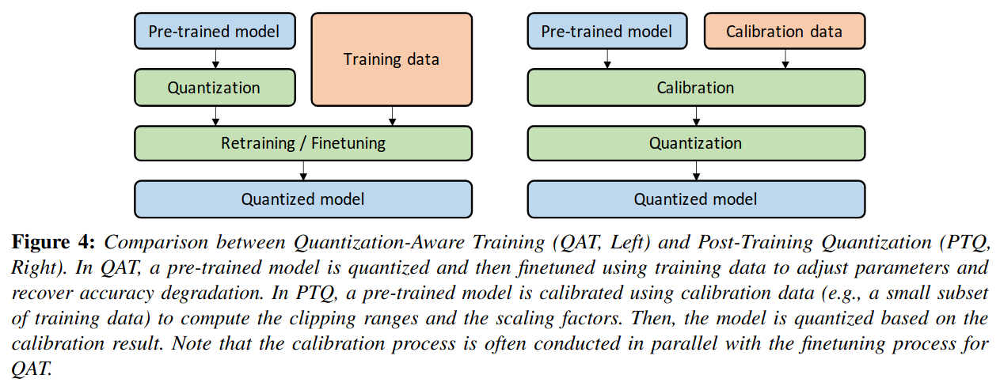
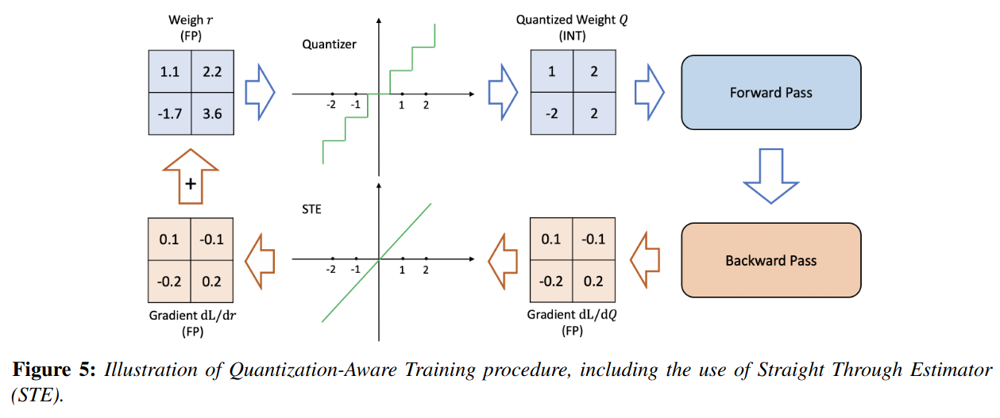
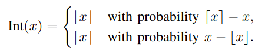
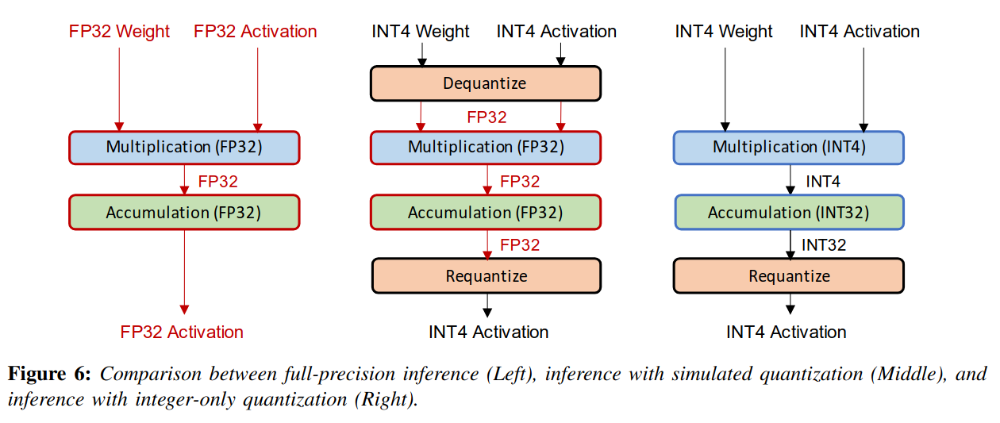
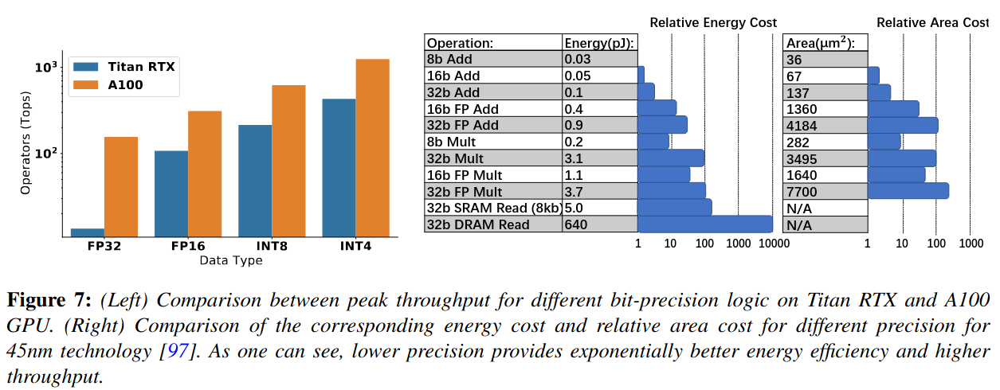
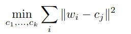

## A Survey of Quantization Methods for Efficient Neural Network Inference
*Low-power computer vision. Chapman and Hall/CRC(2022), 1390 citation, University of California, Berkeley, Review Data:2025.02.21*

> Core Idea

<strong>"test1"</strong> 

***

### <strong>Intro</strong>

- 심층 신경망 계산에서 수치 값을 정량화하는 문제에 대한 접근 방식을 조사하며, 현재 방법의 장단점을 다룬다.

- 지난 십년동안, NN의 정확도의 상당한 개선을 관찰했지만 이는 종종 over-parameterized model에 의해서 달성된다. 하지만, 이는 많은 resource-constrained application에 사용될 수 없다. (real-time inference, low energy consumption, hgih accuracy)

- 최적의 정확도를 유지하면서 효율적이고 실시간으로 동작하는 신경망(NN)을 구현하려면 신경망 모델의 설계, 학습, 배포 방식을 재고해야 한다. 
  - 이에 관한 연구가 활발히 진행되어 왔으며, NN 모델의 효율성을 높이는 동시에(지연 시간, 메모리 사용량, 에너지 소비 등) 정확도 및 일반화 성능 간의 최적의 균형을 유지하는 방법을 탐구하고 있다. 이러한 연구들은 크게 다음과 같이 분류할 수 있다.

1. Designing efficient NN model architectures: micro-architecture 관점에서 nn model을 최적화시키는 방법: depth-wise convolution or low-rank factorization 
   1. 또는 macro-architecture (module들이 쌓여서 이루는 모델): residual, inception
   2. 또는 AutoML이나 Neural Architecture Search (NAS): 제한적인 model size, depth, width가 주어졌을 때, 자동으로 옳은 NN architecture를 찾는다.

> depth-wise convolution: 각 channel 별로 kernel을 개별적으로 학습/ 일반적인 conv랑 다른점은 channel마다 각기 다른 kernel을 거친 output을 합치지 않는 것이다.

- Co-designing NN architecture and hardware together: 특정 타겟 hardware paltform을 위해 NN architecture를 적용시키는 것이다.

- Pruning가지치기는 중요도가 낮은 뉴런을 제거하여 희소한 계산 그래프를 생성하는 방식이다. 여기서 중요도가 낮은 뉴런이란, 제거해도 모델의 출력이나 손실 함수에 미치는 영향이 미미한 뉴런을 의미한다. 가지치기 방법은 크게 비구조적 가지치기(unstructured pruning)와 구조적 가지치기(structured pruning)로 구분된다.
  - Unstructured pruning: 비구조적 가지치기는 뉴런이 위치한 곳과 상관없이 중요도가 낮은 뉴런을 제거하는 방식이다. 이 방법을 사용하면 신경망의 대부분의 매개변수를 제거하는 공격적인 가지치기가 가능하며, 일반화 성능에 미치는 영향도 거의 없다. 그러나 이 접근법은 희소 행렬 연산을 유발하는데, 이는 가속화가 어렵고 메모리 대역폭에 의해 성능이 제한되는 것으로 알려져 있다.
  - Structured pruning: 반면, 구조적 가지치기는 뉴런 개별적으로가 아니라 특정 그룹의 매개변수(예: 전체 합성곱 필터)를 제거하는 방식이다. 이 경우, 레이어의 입력 및 출력 형태와 가중치 행렬이 변경되지만, 여전히 밀집 행렬 연산을 수행할 수 있다. 그러나 공격적인 구조적 가지치기는 모델 정확도에 큰 영향을 미칠 수 있다.

- Knowledge distillation
  - 대형 모델을 학습한 후, 이를 교사 모델(teacher)로 활용하여 더 작은 모델(student)을 학습하는 기법이다. 여기서 핵심 아이디어는 학생 모델의 학습 시 “정확한”(hard) 클래스 레이블 대신, 교사 모델이 생성하는 “부드러운”(soft) 확률값을 활용하는 것이다. 이러한 확률값에는 입력 데이터에 대한 추가적인 정보가 포함될 수 있기 때문이다.
  - 지식 증류에 대한 연구는 활발히 진행되어 왔지만, 여전히 오직 증류만으로 높은 압축률을 달성하는 것이 주요 도전 과제로 남아 있다. 정량화(quantization)나 가지치기(pruning) 기법과 비교하면, INT8 및 더 낮은 정밀도로도 성능을 유지하면서 4배 이상의 압축이 가능한 반면, 지식 증류는 공격적인 압축을 적용하면 성능 저하가 발생하는 경우가 많다.

- 정량화 (Quantization)
  - 신경망 정량화와 느슨하게 관련되거나, 일부 연구자들에게 동기를 제공한 분야가 신경과학(neuroscience)이다. 신경과학 연구에서는 인간의 뇌가 정보를 연속적인(continuous) 형태가 아니라, 이산적(discrete)/정량화된(quantized) 형태로 저장한다는 주장이 있다.
  - 이러한 가설의 주요 근거 중 하나는, 연속적인 정보 저장 방식은 필연적으로 노이즈(noise)에 의해 손상될 가능성이 크다는 점이다. 실제로 물리적 환경(예: 뇌)에서는 항상 열(thermal), 감각(sensory), 외부(external), 시냅스(synaptic) 등의 다양한 노이즈가 존재하며, 이는 연속 신호의 안정성을 위협할 수 있다. 반면, 이산적 신호(discrete signal) 표현 방식은 이러한 저수준 노이즈에 대해 더 강건할 가능성이 있다.
  - 또한, 이산적 표현 방식은 더 높은 일반화 성능을 제공할 수 있으며, 제한된 자원 환경에서 더 높은 효율성을 가질 수 있다
 
- 논문의 구성은 다음과 같다.
  - 2장에서는 정량화의 역사(history)를 간략히 소개한다.
  - 3장에서는 정량화의 기본 개념을 설명한다.
  - 4장에서는 더 발전된 주제를 다룬다.
  - 5장에서 하드웨어 가속기의 양자화 의미에 대해 논의하며, 특히 엣지 프로세서에 중점을 둡니다.
  - 마지막으로 6장에서 요약과 결론을 제공합니다.

***

### <strong>2장: Basic Concepts and Quantization</strong>

- 일반적인 notation과 problem setup을 소개하고, 기본적인 quantization concept 및 method를 설명한다. 

$\textbf{Problem Setup and Notations}$

- { $W_1, W_2, ..., W_L$ }의 trainable parameter를 가지는 $L$개의 layer가 있다고 가정한다. 
- Supervised learning에서 가장 일반적인 목표는 다음의 empirical risk minimization function을 최적화하는 것이다. 

$$ L(\theta)  = \frac{1}{N}\sum_{i=1}^{N} l(x_i,y_i;\theta) $$

- $(x,y)$: input data and the corresponding label
- 또한, $i^{\text{th}}$ layer의 input hidden activation을 $h_i$라고 하자. 그리고 그 output hidden activation은 $a_i$라고 하자.
- Trained model parameter $\theta$는 floating point precision으로 저장된다.
- Quantization에서의 목표는 parameter $\theta$와 intermediate activation maps $h_i, a_i$ precision을 줄이면서, model의 정확도와 일반화 능력의 최소한의 영향을 주는 것이다. 
- 이를 위해, floating point를 quantized value로 mapping하는 quantization operator를 정의할 필요가 있다. 이는 아래에서 다룬다.

$\textbf{Uniform Quantization}$

- Quantization function
  - $Q$: quantization operator
  - $r$: a real valued input (activation or weight)
  - $S$: a real valued scaling factor
  - $Z$: an integer zero point

$$ Q(r) = Int(r/S) - Z $$

- Dequantization
  - $\tilde r$: recovered real values
  - Rounding operation으로 인해 정확히 $r$과 일치하지 않는다.

$$ \tilde r = S(Q(r) + Z) $$

$\textbf{Symmetric and Asymmetric Quantization}$

- Quantization을 하려면, scaling factor를 구해야하는데 이를 정의하려면 결국 clipping range [$\alpha, \beta$]를 결정해야 한다. 
  - Clipping range를 고르는 과정을 *calibration*이라고 한다.
  - $b$: the quantization bit width
  - 가장 간단한 방법은 $r$의 min/max를 사용하는 것이다. i.e., $\alpha = r_{\text{min}}, \beta = r_{\text{max}}$. 이 접근법은 *asymmetric quantization*이다. 
  - *Symmetric quantization*은 $- \alpha = \beta$여야 한다. 
    - $- \alpha = \beta = max(|r_{\text{max}}|, |r_{\text{min}}|)$

$$ S = \frac{\beta - \alpha}{\beta_q - \alpha_q} = \frac{\beta-\alpha}{2^b -1} (\text {in full range quantization}) $$

> Restricted range vs full range
> > Full range in 8-bit: [0, 255], [-128, -127], 최대한의 데이터 활용

- Asymmetric quantiztion은 종종 symmetric quantization과 비교했을 때, 더 좋은 clipping range를 유도한다. 
  - 이는 특히 weight나 activation이 불균형할 때 중요한데, 예를 들어 항상 음수가 아닌 값을 가지는 ReLU 이후의 활성화 값과 같은 경우이다.
  - 즉, 음수가 나올 경우가 적은데도 불구하고 symmetric quantization은 음수까지 고려해서 low precision에 mapping을 한다.
  - 대신, symmetric quantization을 사용하면 아래와 같이 양자화 함수를 단순화 시킬 수 있으며 이를 통해 zero point를 $0$으로 대체할 수 있다. 

$$ Q(r) = Int(\frac{r}{S}) $$

- Symmetric quantization의 scaling factor는 "full range [-128, 127]"에서는 $\frac{2\text{max}(|r|)}{2^n -1}$이고 "restricted range [-127, 127]"에서는 $\frac{max(|r|)}{2^{n-1}-1}$ 이다. 
  - 예상할 수 있듯이, full range에서 정확도가 더 높다.
- Symmetric quantization은 실제로 많이 사용된다. 이는 zero point가 $0$이기에 구현도 쉽고 inference 시에 computational cost도 적게 든다. 

- Clipping range를 정하는 과정을 calibration이라고 했다. 지금까지 사용했던 방식은 min-max로 범위를 정했는데 사실 이 접근법은 outlier에 취약하다. 이상치는 불필요하게 범위를 증가시켜 양자화의 해상도를 감소시키는 원인이 될 수 있다. 
- 이를 해결하는 한 가지 방법은 percentile을 사용하는 것이다. 즉, 가장 크거나 작은 값 대신 $i$ 번째로 큰/작은 값을 설정하는 방법이다.
- 또 다른 방법으로는 실제 값과 양자화된 값 사이의 KL divergence 등이 있다. 

$\textbf{Range Calibration Algorithms: Static vs Dynamic Quantization}$

- Quantization의 또 다른 중요한 구별점은 언제 clipping range를 결정하느냐 입니다.
  - Weight는 대부분의 경우에 inference 동안 고정되어 있기에 정적으로 범위를 결정합니다.
  - 반면에 activation map은 각 input sample마다 다르기에 $2$가지 접근법이 있습니다. 

- Dynamic quantization
  - Runtime 동안 각 activation map마다 동적으로 clipping range를 계산합니다. 
  - 이 접근법은 min, max, percentile과 같은 실시간 계산을 필요로 하며, 매우 높은 overhead가 발생하지만 종종 정확한 계산으로 인해 더 높은 정확도를 달성합니다.
- Static quantization
  - Inference 동안 미리 계산된 clipping range를 사용합니다. 
  - Computational overhead가 발생하지 않지만, 일반적으로 dynamic quantization과 비교해서 더 낮은 정확도를 달성합니다. 
  - Pre-calculation 중 가장 많이 사용되는 방법은 activation의 range를 결정하기 위해 calibration dataset을 modeldp 넣는 것입니다. (e.g., MSE: original unquantized weight distribution and the corresponding quantized values)

$\textbf{Quantization Granularity}$

- 대부분의 computer vision task에서 layer의 activation input은 다양한 convolutional filter에 의해 연산된다. 
  - 이러한 convolutional filter는 각각 다른 범위의 값을 가지고 있으니 어떻게 clipping range를 계산할 것인지에 따라 세분화할 수 있다.

- *Layerwise* quantization: layer의 모든 filter를 통으로 같이 계산한다. 즉, 같은 layer의 서로 다른 filter들은 동일한 clipping range를 가진다. 
  - 구현하기 매우 쉽지만, 종종 sub-optimal 결과를 도출한다.

- *Groupwise* quantization (e.g., Q-BERT)

- *Channelwise* quantization: clipping range를 결정하는데 가장 유명한 방법이다. 각 convolutional filter마다 독립적으로 clipping range를 선택한다. 

- *Sub-channelwise* quantization

- 한 kernel이 한 channel을 만들고 그 channel들의 distribution을 보여준다.
  - Layerwise quantization의 경우, 같은 clipping range를 가지는데 서로 다른 channel의 distribution으로 인해서 mapping 능력이 저하되어 정확도가 떨어질 가능성이 있다. 

$\textbf{Non-Uniform Quantization}$

- The formal definition of non-uniform quantization
  - Real number $r$
  - $r$이 $[\Delta_i, \Delta_{i+1})$안에 있을 때, quantizer $Q$는 일치하는 quantization level $X_i$에 project시킨다. 
  - Non-Uniform quantization은 중요한 value region에 집중하거나 적절한 동적 범위를 찾음으로써, distribution을 잘 포착하므로 더 높은 정확도를 달성한다. 

$$ Q(r) = X_i, \quad \text{if } r \in [\Delta_i, \Delta_{i+1}). $$

- 일반적으로, non-uniform quantization은 signal information을 잘 capture한다. 하지만, general computation hardware (e.g., CPU and GPU)에 효율적으로 개발하기 어렵다. 따라서, uniform quantization이 흔히 de-facto method로 사용된다. 

$\textbf{Fine-tuning Methods}$

- 종종 quantization 이후에 neural network에서의 parameter를 조절할 필요가 있다. 이는 model을 retraining 함으로써 수행될 수 있다 (= QAT)

- Quantization-Aware Training
  - 학습된 모델이 주어졌을 때, quantization은 trained model parameter의 perturbation을 가져온다. 이로 인해 모델이 FP로 학습될 때 수렴했던 지점에서 벗어날 수 있다. 
  - 이를 해결하기 위해, quantized parameter를 사용하여 NN을 다시 학습시킨다.
  - 이 방법은 forward pass 및 backward pass를 FP로 수행하지만, 각 gradient update 이후 모델 파라미터를 quantization한다. 가중치 업데이트가 FP로 수행된 후에 quantization을 적용하는 것이 중요하다. 
  - 역전파에서 FP 연산을 수행하는 이유는, 양자화된 정밀도로 그래디언트를 누적하면 zero-gradient 또는 높은 오차를 가진 그래디언트가 발생할 가능성이 높기 때문이다.   
  - 역전파 과정에서 중요한 세부 사항 중 하나는 비미분 가능 연산자인 양자화 연산자를 어떻게 처리하는가이다. 별다른 근사 없이 해당 연산자의 그래디언트를 계산하면, 반올림(rounding) 연산이 조각별(piece-wise) 상수 함수이므로 거의 모든 영역에서 그래디언트 값이 0이 된다. 이를 해결하기 위한 대표적인 방법이 직통 추정자(Straight Through Estimator, STE)이다. STE는 반올림 연산을 무시하고 이를 항등 함수(identity function)로 근사하는 방식으로 동작하며, 이는 그림 5에 설명되어 있다.
  - STE가 대표적인 방법이긴 하지만, 다른 접근법들도 있다. 예를 들어, *stochastic neuron*, combinatorial optimization, target propagation, Gumbel-softmax이 있다. 
  - 이와는 다른 방법으로 Non-STE 방법도 있다.
  - 최근 연구로는 기존의 반올림 (round-to-nearest) 방식을 대체하는 적응형 반올림 (adaptive rounding) 기법인 **AdaRound**가 있다.

- Post-Training Quantization
  - QAT는 재훈련을 위해 충분한 양의 학습 데이터가 필요하지만, PTQ는 데이터가 제한적이거나 라벨이 없는 경우에도 적용할 수 있다는 장점이 있다. 
  - AdaRound에서는 단순한 반올림 (round-to-nearest) 방식이 직관과 달리 최적이 아닐 수 있음을 보이고, 보다 적은 손실을 유도하는 adaptive rounding 방법을 제안했다. 양자화된 가중치의 변경 폭을 원래의 부동소수점 값에서 $1$의 오차로 제한한다.
  - PTQ는 극단적으로 확장될 수도 있다. 즉, 양자화 과정에서 데이터를 사용하지 않는 시나리오이다. 

- Zero-Shot Quantization
  - 일반적으로는 훈련 데이터에 접근하여 calibration을 진행한다. 그러나 훈련 데이터셋이 지나치게 크거나, 독점적이거나, 보안 및 개인 정보 보호 문제로 인해 제할될 수 있다.
  - 이러한 문제를 해결하기 위해 다양한 방법들이 제안됐다. 

$\textbf{Stochastic Quantization}$

- Inference 과정에서 quantization은 일반적으로 deterministic이다. 그러나 이는 유일한 방법이 아니며, 일부 연구에서는 QAT 및 reduced precision training을 위해 확률적 양자화를 탐색해왔다.
- 이러한 접근 방식의 핵심은 확률적 양자화가 결정론적 양자화에 비해 신경망이 더 다양한 탐색을 할 수 있도록 돕는 것이다.
- 이를 뒷받침하는 일반적인 논리는 작은 가중치 업데이트가 양자화된 값의 변경을 유도하지 못할 수 있다는 점이다. 즉, 반올림 연산이 항상 동일한 값을 반환할 가능성이 있다. 
- 하지만 확률적 반올림을 허용하면 신경망이 이러한 문제를 피하고 가중치를 보다 유연하게 업데이트 할 수 있다. 

### <strong>3장: Advanced Concepts: Quantization Below 8-Bits</strong>

$\textbf{Simulated and Integer-only Quantization}$

- NN model을 quantization하는 $2$ 가지 대표적인 방법은 simulated quantization (fake quantization)과 integer-only quantization (fixed-point quantization)이다. 
  - 시뮬레이션 양자화에서는 모델의 매개변수를 저정밀도로 저장하지만, 행렬 곱셈이나 합성곱 연산과 같은 연산은 부동소수점(floating point) 연산으로 수행된다. 따라서, 양자화된 매개변수는 연산 전에 다시 복원(dequantization)되어야 한다. 이 방식은 저정밀도의 논리 회로를 통한 속도 및 효율성 향상을 온전히 활용할 수 없다는 단점이 있다.
  - 정수 전용 양자화에서는 모든 연산이 저정밀도의 정수 연산(integer arithmetic)으로 수행됩니다. 이를 통해 매개변수나 활성화 값(activation)을 부동소수점으로 복원할 필요 없이 효율적인 정수 연산을 이용한 추론이 가능합니다.
  - NVIDIA V100 및 Titan RTX와 같은 하드웨어 프로세서는 저정밀 연산을 빠르게 처리할 수 있도록 지원하며, 이를 통해 추론 처리량과 지연 시간을 크게 향상시킬 수 있다. 

- 저정밀 논리는 에너지 및 면적 효율성 측면에서도 뛰어난 성능을 보인다. 예를 들어, INT8 덧셈 연산은 FP32 덧셈과 비교했을 때 에너지 효율성이 30배, 면적 효율성이 116배 높다.

$\textbf{Mixed-Precision Quantization}$

- 하드웨어 성능은 낮은 정밀도의 양자화를 사용할수록 향상된다는 점은 쉽게 알 수 있다. 그러나 모델을 일괄적으로 초저정밀도로 양자화하면 정확도가 크게 저하될 수 있다. 이를 해결하기 위해 혼합 정밀도(mixed-precision) 양자화 기법이 제안되었다. 이 접근법에서는 각 층(layer)을 서로 다른 비트 정밀도로 양자화한다. 그러나 이 방법의 한 가지 과제는 각 층에 대한 비트 설정을 결정하는 검색 공간(search space)이 층의 개수에 따라 지수적으로 증가한다는 점이다. 이를 해결하기 위한 다양한 접근법이 연구되었다.

- 중요한(민감한) 동시에 효율적인 계층은 높은 정밀도를 유지하고, 민감하지 않고 비효율적인 계층에만 낮은 정밀도의 양자화를 적용하는 것이 목표이다. 효율성 지표는 하드웨어에 따라 달라지며, 지연 시간(latency) 또는 에너지 소비량이 될 수 있다.

- 각 층의 혼합 정밀도를 선택하는 것은 본질적으로 검색 문제(searching problem)이며, 이를 해결하기 위한 여러 방법이 제안되었다. 일부 연구는 강화 학습(RL) 기반 방법을 사용하여 자동으로 양자화 정책을 결정하였으며, 하드웨어 시뮬레이터를 활용하여 RL 에이전트의 피드백에 하드웨어 가속기의 피드백을 반영하였다. 또한 혼합 정밀도 설정 검색 문제를 신경망 구조 탐색(Neural Architecture Search, NAS) 문제로 공식화하고, 미분 가능한 NAS(Differentiable NAS, DNAS) 방법을 활용하여 검색 공간을 효율적으로 탐색하였다. 그러나 이러한 탐색 기반 방법은 일반적으로 많은 연산 자원이 필요하며, 성능이 하이퍼파라미터 및 초기화에 민감하다는 단점이 있다.

- 또 다른 혼합 정밀도 방법으로는 주기적 함수 정규화(periodic function regularization)를 사용하여 혼합 정밀도 모델을 훈련하는 기법이 있다. 이 방법은 자동으로 각 층의 중요도를 구분하고, 정확도에 미치는 영향을 고려하여 적절한 비트 폭을 학습한다.

- 탐색 및 정규화 기반 접근법과는 다르게, HAWQ는 모델의 2차 민감도를 기반으로 혼합 정밀도를 자동으로 설정하는 방법을 제안하였다. 이론적으로, 2차 연산자(예: 헤시안)의 트레이스(trace)를 활용하여 각 층이 양자화에 얼마나 민감한지를 측정할 수 있음이 입증되었다. 이는 신경망 가지치기(pruning) 분야에서 Optimal Brain Damage 연구와 유사한 결과를 보인다. 이후 HAWQv2에서는 이 기법을 혼합 정밀도 활성화(activation) 양자화로 확장하여, RL 기반 혼합 정밀도 방법보다 100배 이상 빠른 성능을 보였다. 최근에는 HAWQv3에서 하드웨어 친화적인(integer-only) 양자화가 도입되었으며, 이를 위해 빠른 정수 선형 프로그래밍(Integer Linear Programming) 방법을 활용하여 주어진 애플리케이션별 제약(예: 모델 크기 또는 지연 시간)에 최적화된 비트 정밀도를 찾는 방식을 제안하였다. 또한, 이 연구에서는 혼합 정밀도 양자화의 하드웨어 효율성에 대한 일반적인 의문을 해결하기 위해, 이를 T4 GPU에 직접 배포하여 INT8 양자화 대비 최대 50% 속도 향상을 달성하였다.

$\textbf{Hardware Aware Quantization}$

- Quantization의 목적 중 하나는 inference latency를 향상시키는 것이다. 그러나 특정 계층/연산을 양자화한다고 해서 모든 하드웨어에서 동일한 속도 향상이 이루어지는 것은 아니다. 실제로 양자화의 이점은 하드웨어에 따라 달라지며, 온칩 메모리, 대역폭, 캐시 계층 구조와 같은 다양한 요소가 양자화에 따른 속도 향상에 영향을 미친다.
- 최적의 성능을 얻기 위해서는 하드웨어를 고려한 양자화를 수행하는 것이 중요하다.

$\textbf{Distillation-Assisted Quantization}$

- 양자화에서 흥미로운 연구 방향 중 하나는 model distillation을 활용하여 양자화 정확도를 향상시키는 것이다. 
- 모델 증류는 높은 정확도를 가진 대형 모델 (teacher model)을 활용하여 작은 모델 (student model)의 학습을 돕는 것이다. 학생 모델의 학습 과정에서 단순히 정답 클래스 레이블(ground-truth)만 사용하는 것이 아니라, 교사 모델이 생성한 소프트 확률 분포(soft probabilities)를 활용하는 방식을 제안한다. 이러한 소프트 확률 분포는 입력 데이터에 대한 추가적인 정보를 포함할 수 있다.

$\textbf{Extreme Quantization}$

- 양자화의 가장 극단적인 형태는 이진화(binarization)로, 양자화된 값을 1비트 표현으로 제한하여 메모리 요구량을 32배 감소시킨다. 이진화는 메모리 절약뿐만 아니라, 비트 단위 연산(bit-wise arithmetic)을 활용하여 FP32나 INT8과 같은 높은 정밀도의 연산보다 크게 가속할 수 있다는 장점이 있다. 예를 들어, NVIDIA V100 GPU에서 이진 연산의 최대 처리 성능은 INT8보다 8배 높다. 그러나 단순한 이진화 방식은 정확도 저하가 심각하게 발생할 수 있다. 

- 대표적인 연구로 BinaryConnect [42]가 있으며, 이는 가중치를 +1 또는 -1로 제한하는 방법이다. 이 접근법에서는 가중치를 실수 값으로 유지하면서 순전파(forward pass)와 역전파(backward pass) 과정에서만 이진화를 수행하여 이진화 효과를 모사한다. 순전파 시, 실수 값 가중치는 부호 함수(sign function)에 따라 +1 또는 -1로 변환된다. 이후, 표준 학습 방법과 STE(Straight-Through Estimator)를 사용하여 미분 불가능한 부호 함수를 통해 그래디언트를 전파할 수 있다.

- Binarized NN(BNN) [107]은 이 개념을 확장하여 가중치뿐만 아니라 활성화 값(activations)도 이진화한다. 가중치와 활성화를 동시에 이진화하면 부동소수점 행렬 곱셈을 경량화된 XNOR 연산과 비트 카운팅(bit-counting)으로 대체할 수 있어 더욱 향상된 연산 속도를 제공한다.

- 또한, Binary Weight Network(BWN) 및 XNOR-Net [45]은 가중치에 스케일링 계수(scaling factor)를 도입하여 +1, -1 대신 +α, -α 값을 사용함으로써 더 높은 정확도를 달성한다. 여기서 α는 실수 가중치와 이진화된 가중치 간의 거리를 최소화하는 값으로 설정된다. 즉, 실수 가중치 행렬 W는 다음과 같은 최적화 문제를 만족하는 이진 가중치 행렬 B를 통해 근사적으로 표현될 수 있다:

- 또한, 많은 학습된 가중치가 0에 가까운 값이라는 관찰에서 영감을 받아, 네트워크를 삼진화하여 가중치 및 활성 값을 +1, 0, -1의 삼진 값으로 제한하는 연구가 진행되었다. 이는 양자화된 값이 명시적으로 0을 포함하도록 하여, 이진화와 마찬가지로 연산량을 줄이고 추론 속도를 향상시킨다. 이후, Ternary-Binary Network(TBN)는 이진 가중치와 삼진 활성화를 결합하면 정확도와 계산 효율성 간의 최적의 균형을 달성할 수 있음을 보였다.

- 그러나 단순한 이진화 및 삼진화 방법은 특히 ImageNet 분류와 같은 복잡한 작업에서 심각한 정확도 저하를 초래하기 때문에, 극단적인 양자화에서 정확도 저하를 최소화하기 위한 다양한 솔루션이 제안되었다.

$\textbf{Vector Quantization}$

- 양자화(quantization)는 머신러닝에서 새롭게 발명된 개념이 아니라, 지난 한 세기 동안 정보 이론과 특히 디지털 신호 처리(DSP) 분야에서 압축 도구로 널리 연구되어 왔다. 그러나 머신러닝에서의 양자화 방법과 기존 DSP 양자화 방법의 주요 차이점은, 머신러닝에서는 원본 신호와의 최소한의 변화(오차)로 신호를 압축하는 것이 아니라, 가능한 한 작은 손실(loss)로 정밀도를 낮춘 표현(reduced-precision representation)을 찾는 것이 목표라는 점이다. 따라서 양자화된 가중치/활성 값이 비양자화된 값과 크게 차이가 나더라도 이는 전혀 문제가 되지 않는다.
- 그럼에도 불구하고, DSP의 고전적인 양자화 방법에서 비롯된 흥미로운 개념들이 신경망(NN) 양자화에도 적용되고 있으며, 특히 벡터 양자화(vector quantization)가 중요한 역할을 한다. 예를 들어, 가중치를 여러 그룹으로 클러스터링하고, 각 그룹의 중심값(centroid)을 양자화된 값으로 사용하여 추론 시 적용하는 방식을 제안한다. 
  - $i$: 텐서 내 가중치의 인덱스
  - $c_1​,...,c_k$​는 클러스터링을 통해 찾은 $k$개의 중심값이며, 
  - $c_j$​는 $w_i$​에 대응하는 중심값을 의미한다. 클러스터링을 수행한 후, 가중치 $w_i$​는 코드북(look-up table)에서 $c_j$​와 관련된 클러스터 인덱스 $j$를 갖게 된다.
  - 연구에 따르면, k-평균(k-means) 클러스터링을 사용하면 모델 크기를 최대 8배까지 줄이면서도 정확도 저하를 최소화할 수 있음이 밝혀졌다. 또한, k-평균 기반 벡터 양자화를 가지치기(pruning) 및 허프만 코딩(Huffman coding)과 함께 적용하면 모델 크기를 더욱 줄일 수 있다.

***

### <strong>4장: Quantization and Hardware Processors</strong>

- 양자화는 모델 크기를 줄이는 것뿐만 아니라, 속도를 향상시키고 전력 소비를 줄이는 데에도 기여한다. 특히, 저정밀 연산을 지원하는 하드웨어에서는 이러한 장점이 더욱 두드러진다. 따라서 양자화는 사물인터넷(IoT) 및 모바일 애플리케이션과 같은 엣지(edge) 환경에서의 배포에 필수적인 요소로 작용한다. 엣지 디바이스는 연산 성능, 메모리, 그리고 특히 전력 소비 측면에서 엄격한 자원 제한을 갖고 있으며, 이는 많은 딥러닝 모델이 적용되기에 너무 높은 비용을 요구하는 경우가 많다. 또한, 많은 엣지 프로세서는 부동소수점 연산을 지원하지 않으며, 특히 마이크로컨트롤러(microcontroller)에서는 이러한 기능이 아예 포함되지 않은 경우도 있다.

- CMSIS-NN은 ARM에서 제공하는 라이브러리로, ARM Cortex-M 코어에 신경망 모델을 양자화하여 배포하는 과정을 지원한다. 특히, 이 라이브러리는 2의 거듭제곱 스케일링(power-of-two scaling) 기반의 고정소수점 양자화(fixed-point quantization)를 활용하여, 양자화 및 비양자화 연산을 비트 시프트(bit shifting) 연산으로 효율적으로 수행할 수 있도록 한다.

***

### <strong>5장: Future Directions for Research in Quantization</strong>

- Quantization Software
  - 현재의 방법론을 활용하면, 다양한 신경망 모델을 정확도 손실 없이 INT8로 양자화하여 배포하는 것이 비교적 간단하다. 이를 위해 Nvidia의 TensorRT, TVM 등과 같은 여러 소프트웨어 패키지를 활용할 수 있으며, 이들 패키지는 문서화가 잘 되어 있다. 또한, 구현 최적화도 상당히 이루어져 있어, 양자화를 적용하면 성능 향상을 쉽게 확인할 수 있다.
  - 그러나, 더 낮은 비트 정밀도의 양자화를 지원하는 소프트웨어는 아직 널리 제공되지 않으며, 경우에 따라서는 아예 존재하지 않는 경우도 있다. 예를 들어, Nvidia의 TensorRT는 현재 INT8 이하의 양자화를 지원하지 않는다. 또한, TVM에서 INT4 양자화 지원이 추가된 것도 비교적 최근의 일이다. 최근 연구에 따르면 INT4/INT8을 활용한 저정밀 및 혼합 정밀도 양자화가 실질적으로 작동함이 입증되었다. 따라서, 더 낮은 정밀도의 양자화를 지원하는 효율적인 소프트웨어 API를 개발하는 것이 중요한 연구 방향이 될 것이다.

- Hardware and NN Architecture Co-Design
  - 신경망의 너비를 변경해서 양자화 후 일반화 성능 저하를 줄이거나 제거할 수 있음을 보여줬다.
  - 따라서, 향후 연구 방향 중 하나는 양자화 과정에서 깊이나 개별 커널과 같은 다른 아키텍쳐 매개변수도 함께 조정하는 것이다.

- Coupled Compression Methods
  - 양자화는 신경망의 효율적인 배포를 위한 여러 기법 중 하나일 뿐이다. 기타 방법으로는 신경망 아키텍처 최적화, 하드웨어-아키텍처 공동 설계, 가지치기(Pruning), 지식 증류(Knowledge Distillation) 등이 있다. 양자화는 이러한 접근 방식들과 결합될 수 있다.
  - 그러나, 현재까지 이러한 방법들의 최적 조합을 탐색한 연구는 거의 없다. 예를 들어, 가지치기와 양자화를 함께 적용하면 모델의 연산 비용을 줄일 수 있지만, 구조적/비구조적 가지치기와 양자화 간 최적 조합을 이해하는 것이 중요하다. 마찬가지로, 향후 연구 방향 중 하나는 이러한 방법들을 상호 연계하여 최적의 조합을 찾는 것이다.

- Quantized Training
  - FP 16을 활용한 신경망 학습 가속화는 성공적인 양자화의 사례이다. 
  - 그러나, INT8 수준까지 확장하는 것은 여전히 어려운 문제이다. 이는 학습과정이 불안정해지고, 심한 경우 발산할 수 있다. 이 문제를 해결하는 것은 특히 엣지 디바이스에서의 학습을 고려할 때 매우 중요한 연구 과제가 될 것이다.