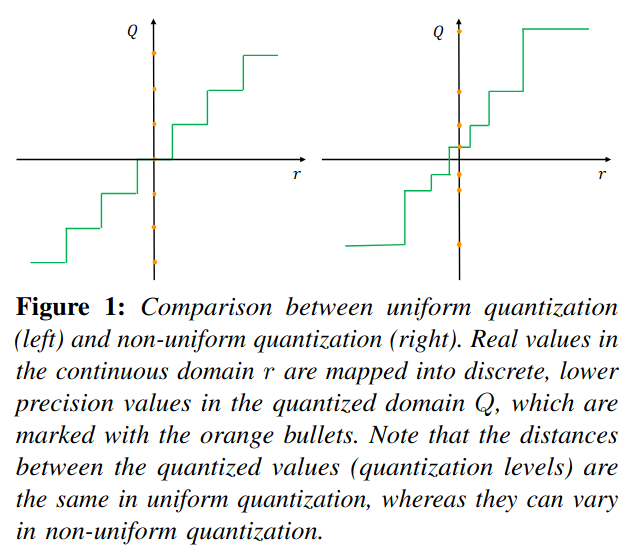
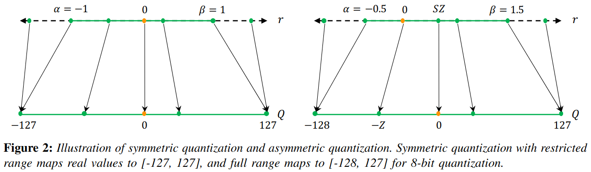
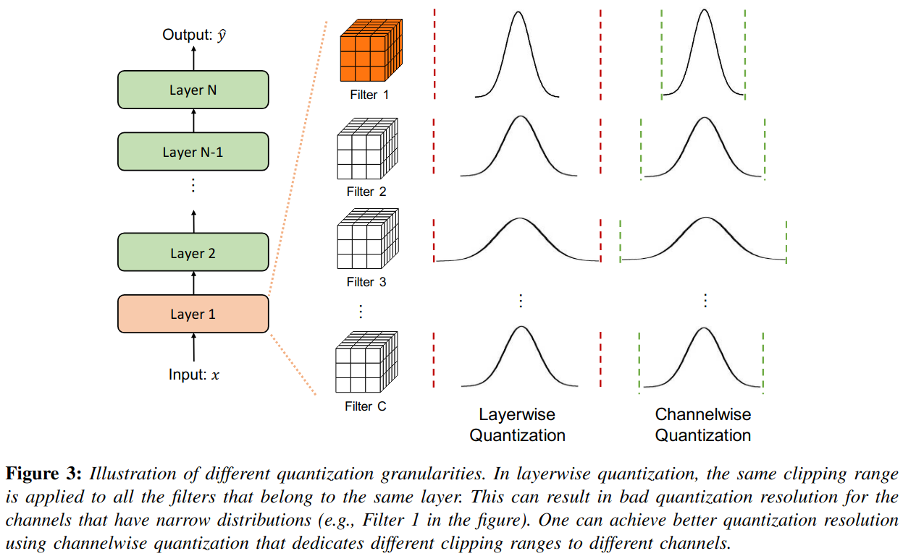

## A Survey of Quantization Methods for Efficient Neural Network Inference
*Low-power computer vision. Chapman and Hall/CRC(2022), 1390 citation, University of California, Berkeley, Review Data:2025.02.21*

> Core Idea

<strong>"test1"</strong> 

***

### <strong>Intro</strong>

- 심층 신경망 계산에서 수치 값을 정량화하는 문제에 대한 접근 방식을 조사하며, 현재 방법의 장단점을 다룬다.

- 지난 십년동안, NN의 정확도의 상당한 개선을 관찰했지만 이는 종종 over-parameterized model에 의해서 달성된다. 하지만, 이는 많은 resource-constrained application에 사용될 수 없다. (real-time inference, low energy consumption, hgih accuracy)

- 최적의 정확도를 유지하면서 효율적이고 실시간으로 동작하는 신경망(NN)을 구현하려면 신경망 모델의 설계, 학습, 배포 방식을 재고해야 한다. 
  - 이에 관한 연구가 활발히 진행되어 왔으며, NN 모델의 효율성을 높이는 동시에(지연 시간, 메모리 사용량, 에너지 소비 등) 정확도 및 일반화 성능 간의 최적의 균형을 유지하는 방법을 탐구하고 있다. 이러한 연구들은 크게 다음과 같이 분류할 수 있다.

1. Designing efficient NN model architectures: micro-architecture 관점에서 nn model을 최적화시키는 방법: depth-wise convolution or low-rank factorization 
   1. 또는 macro-architecture (module들이 쌓여서 이루는 모델): residual, inception
   2. 또는 AutoML이나 Neural Architecture Search (NAS): 제한적인 model size, depth, width가 주어졌을 때, 자동으로 옳은 NN architecture를 찾는다.

> depth-wise convolution: 각 channel 별로 kernel을 개별적으로 학습/ 일반적인 conv랑 다른점은 channel마다 각기 다른 kernel을 거친 output을 합치지 않는 것이다.

- Co-designing NN architecture and hardware together: 특정 타겟 hardware paltform을 위해 NN architecture를 적용시키는 것이다.

- Pruning가지치기는 중요도가 낮은 뉴런을 제거하여 희소한 계산 그래프를 생성하는 방식이다. 여기서 중요도가 낮은 뉴런이란, 제거해도 모델의 출력이나 손실 함수에 미치는 영향이 미미한 뉴런을 의미한다. 가지치기 방법은 크게 비구조적 가지치기(unstructured pruning)와 구조적 가지치기(structured pruning)로 구분된다.
  - Unstructured pruning: 비구조적 가지치기는 뉴런이 위치한 곳과 상관없이 중요도가 낮은 뉴런을 제거하는 방식이다. 이 방법을 사용하면 신경망의 대부분의 매개변수를 제거하는 공격적인 가지치기가 가능하며, 일반화 성능에 미치는 영향도 거의 없다. 그러나 이 접근법은 희소 행렬 연산을 유발하는데, 이는 가속화가 어렵고 메모리 대역폭에 의해 성능이 제한되는 것으로 알려져 있다.
  - Structured pruning: 반면, 구조적 가지치기는 뉴런 개별적으로가 아니라 특정 그룹의 매개변수(예: 전체 합성곱 필터)를 제거하는 방식이다. 이 경우, 레이어의 입력 및 출력 형태와 가중치 행렬이 변경되지만, 여전히 밀집 행렬 연산을 수행할 수 있다. 그러나 공격적인 구조적 가지치기는 모델 정확도에 큰 영향을 미칠 수 있다.

- Knowledge distillation
  - 대형 모델을 학습한 후, 이를 교사 모델(teacher)로 활용하여 더 작은 모델(student)을 학습하는 기법이다. 여기서 핵심 아이디어는 학생 모델의 학습 시 “정확한”(hard) 클래스 레이블 대신, 교사 모델이 생성하는 “부드러운”(soft) 확률값을 활용하는 것이다. 이러한 확률값에는 입력 데이터에 대한 추가적인 정보가 포함될 수 있기 때문이다.
  - 지식 증류에 대한 연구는 활발히 진행되어 왔지만, 여전히 오직 증류만으로 높은 압축률을 달성하는 것이 주요 도전 과제로 남아 있다. 정량화(quantization)나 가지치기(pruning) 기법과 비교하면, INT8 및 더 낮은 정밀도로도 성능을 유지하면서 4배 이상의 압축이 가능한 반면, 지식 증류는 공격적인 압축을 적용하면 성능 저하가 발생하는 경우가 많다.

- 정량화 (Quantization)
  - 신경망 정량화와 느슨하게 관련되거나, 일부 연구자들에게 동기를 제공한 분야가 신경과학(neuroscience)이다. 신경과학 연구에서는 인간의 뇌가 정보를 연속적인(continuous) 형태가 아니라, 이산적(discrete)/정량화된(quantized) 형태로 저장한다는 주장이 있다.
  - 이러한 가설의 주요 근거 중 하나는, 연속적인 정보 저장 방식은 필연적으로 노이즈(noise)에 의해 손상될 가능성이 크다는 점이다. 실제로 물리적 환경(예: 뇌)에서는 항상 열(thermal), 감각(sensory), 외부(external), 시냅스(synaptic) 등의 다양한 노이즈가 존재하며, 이는 연속 신호의 안정성을 위협할 수 있다. 반면, 이산적 신호(discrete signal) 표현 방식은 이러한 저수준 노이즈에 대해 더 강건할 가능성이 있다.
  - 또한, 이산적 표현 방식은 더 높은 일반화 성능을 제공할 수 있으며, 제한된 자원 환경에서 더 높은 효율성을 가질 수 있다
 
- 논문의 구성은 다음과 같다.
  - 2장에서는 정량화의 역사(history)를 간략히 소개한다.
  - 3장에서는 정량화의 기본 개념을 설명한다.
  - 4장에서는 더 발전된 주제를 다룬다.
  - 5장에서 하드웨어 가속기의 양자화 의미에 대해 논의하며, 특히 엣지 프로세서에 중점을 둡니다.
  - 마지막으로 6장에서 요약과 결론을 제공합니다.

***

### <strong>2장: Basic Concepts and Quantization</strong>

- 일반적인 notation과 problem setup을 소개하고, 기본적인 quantization concept 및 method를 설명한다. 

$\textbf{Problem Setup and Notations}$

- { $W_1, W_2, ..., W_L$ }의 trainable parameter를 가지는 $L$개의 layer가 있다고 가정한다. 
- Supervised learning에서 가장 일반적인 목표는 다음의 empirical risk minimization function을 최적화하는 것이다. 

$$ L(\theta)  = \frac{1}{N}\sum_{i=1}^{N} l(x_i,y_i;\theta) $$

- $(x,y)$: input data and the corresponding label
- 또한, $i^{\text{th}}$ layer의 input hidden activation을 $h_i$라고 하자. 그리고 그 output hidden activation은 $a_i$라고 하자.
- Trained model parameter $\theta$는 floating point precision으로 저장된다.
- Quantization에서의 목표는 parameter $\theta$와 intermediate activation maps $h_i, a_i$ precision을 줄이면서, model의 정확도와 일반화 능력의 최소한의 영향을 주는 것이다. 
- 이를 위해, floating point를 quantized value로 mapping하는 quantization operator를 정의할 필요가 있다. 이는 아래에서 다룬다.

$\textbf{Uniform Quantization}$

- Quantization function
  - $Q$: quantization operator
  - $r$: a real valued input (activation or weight)
  - $S$: a real valued scaling factor
  - $Z$: an integer zero point

$$ Q(r) = Int(r/S) - Z $$

- Dequantization
  - $\tilde r$: recovered real values
  - Rounding operation으로 인해 정확히 $r$과 일치하지 않는다.

$$ \tilde r = S(Q(r) + Z) $$

$\textbf{Symmetric and Asymmetric Quantization}$

- Quantization을 하려면, scaling factor를 구해야하는데 이를 정의하려면 결국 clipping range [$\alpha, \beta$]를 결정해야 한다. 
  - Clipping range를 고르는 과정을 *calibration*이라고 한다.
  - $b$: the quantization bit width
  - 가장 간단한 방법은 $r$의 min/max를 사용하는 것이다. i.e., $\alpha = r_{\text{min}}, \beta = r_{\text{max}}$. 이 접근법은 *asymmetric quantization*이다. 
  - *Symmetric quantization*은 $- \alpha = \beta$여야 한다. 
    - $- \alpha = \beta = max(|r_{\text{max}}|, |r_{\text{min}}|)$

$$ S = \frac{\beta - \alpha}{\beta_q - \alpha_q} = \frac{\beta-\alpha}{2^b -1} (\text {in full range quantization}) $$

> Restricted range vs full range
> > Full range in 8-bit: [0, 255], [-128, -127], 최대한의 데이터 활용

- Asymmetric quantiztion은 종종 symmetric quantization과 비교했을 때, 더 좋은 clipping range를 유도한다. 
  - 이는 특히 weight나 activation이 불균형할 때 중요한데, 예를 들어 항상 음수가 아닌 값을 가지는 ReLU 이후의 활성화 값과 같은 경우이다.
  - 즉, 음수가 나올 경우가 적은데도 불구하고 symmetric quantization은 음수까지 고려해서 low precision에 mapping을 한다.
  - 대신, symmetric quantization을 사용하면 아래와 같이 양자화 함수를 단순화 시킬 수 있으며 이를 통해 zero point를 $0$으로 대체할 수 있다. 

$$ Q(r) = Int(\frac{r}{S}) $$

- Symmetric quantization의 scaling factor는 "full range [-128, 127]"에서는 $\frac{2\text{max}(|r|)}{2^n -1}$이고 "restricted range [-127, 127]"에서는 $\frac{max(|r|)}{2^{n-1}-1}$ 이다. 
  - 예상할 수 있듯이, full range에서 정확도가 더 높다.
- Symmetric quantization은 실제로 많이 사용된다. 이는 zero point가 $0$이기에 구현도 쉽고 inference 시에 computational cost도 적게 든다. 

- Clipping range를 정하는 과정을 calibration이라고 했다. 지금까지 사용했던 방식은 min-max로 범위를 정했는데 사실 이 접근법은 outlier에 취약하다. 이상치는 불필요하게 범위를 증가시켜 양자화의 해상도를 감소시키는 원인이 될 수 있다. 
- 이를 해결하는 한 가지 방법은 percentile을 사용하는 것이다. 즉, 가장 크거나 작은 값 대신 $i$ 번째로 큰/작은 값을 설정하는 방법이다.
- 또 다른 방법으로는 실제 값과 양자화된 값 사이의 KL divergence 등이 있다. 

$\textbf{Range Calibration Algorithms: Static vs Dynamic Quantization}$

- Quantization의 또 다른 중요한 구별점은 언제 clipping range를 결정하느냐 입니다.
  - Weight는 대부분의 경우에 inference 동안 고정되어 있기에 정적으로 범위를 결정합니다.
  - 반면에 activation map은 각 input sample마다 다르기에 $2$가지 접근법이 있습니다. 

- Dynamic quantization
  - Runtime 동안 각 activation map마다 동적으로 clipping range를 계산합니다. 
  - 이 접근법은 min, max, percentile과 같은 실시간 계산을 필요로 하며, 매우 높은 overhead가 발생하지만 종종 정확한 계산으로 인해 더 높은 정확도를 달성합니다.
- Static quantization
  - Inference 동안 미리 계산된 clipping range를 사용합니다. 
  - Computational overhead가 발생하지 않지만, 일반적으로 dynamic quantization과 비교해서 더 낮은 정확도를 달성합니다. 
  - Pre-calculation 중 가장 많이 사용되는 방법은 activation의 range를 결정하기 위해 calibration dataset을 modeldp 넣는 것입니다. (e.g., MSE: original unquantized weight distribution and the corresponding quantized values)

$\textbf{Quantization Granularity}$

- 대부분의 computer vision task에서 layer의 activation input은 다양한 convolutional filter에 의해 연산된다. 
  - 이러한 convolutional filter는 각각 다른 범위의 값을 가지고 있으니 어떻게 clipping range를 계산할 것인지에 따라 세분화할 수 있다.

- *Layerwise* quantization: layer의 모든 filter를 통으로 같이 계산한다. 즉, 같은 layer의 서로 다른 filter들은 동일한 clipping range를 가진다. 
  - 구현하기 매우 쉽지만, 종종 sub-optimal 결과를 도출한다.

- *Groupwise* quantization (e.g., Q-BERT)

- *Channelwise* quantization: clipping range를 결정하는데 가장 유명한 방법이다. 각 convolutional filter마다 독립적으로 clipping range를 선택한다. 

- *Sub-channelwise* quantization

- 한 kernel이 한 channel을 만들고 그 channel들의 distribution을 보여준다.
  - Layerwise quantization의 경우, 같은 clipping range를 가지는데 서로 다른 channel의 distribution으로 인해서 mapping 능력이 저하되어 정확도가 떨어질 가능성이 있다. 

$\textbf{Non-Uniform Quantization}$

- The formal definition of non-uniform quantization
  - Real number $r$
  - $r$이 $[\Delta_i, \Delta_{i+1})$안에 있을 때, quantizer $Q$는 일치하는 quantization level $X_i$에 project시킨다. 
  - Non-Uniform quantization은 중요한 value region에 집중하거나 적절한 동적 범위를 찾음으로써, distribution을 잘 포착하므로 더 높은 정확도를 달성한다. 

$$ Q(r) = X_i, \quad \text{if } r \in [\Delta_i, \Delta_{i+1}). $$

- 일반적으로, non-uniform quantization은 signal information을 잘 capture한다. 하지만, general computation hardware (e.g., CPU and GPU)에 효율적으로 개발하기 어렵다. 따라서, uniform quantization이 흔히 de-facto method로 사용된다. 

$\textbf{Fine-tuning Methods}$

- 

***

### <strong>Experiment</strong>

***

### <strong>Conclusion</strong>

***

### <strong>Question</strong>

<a href="">link</a>

> 인용구
