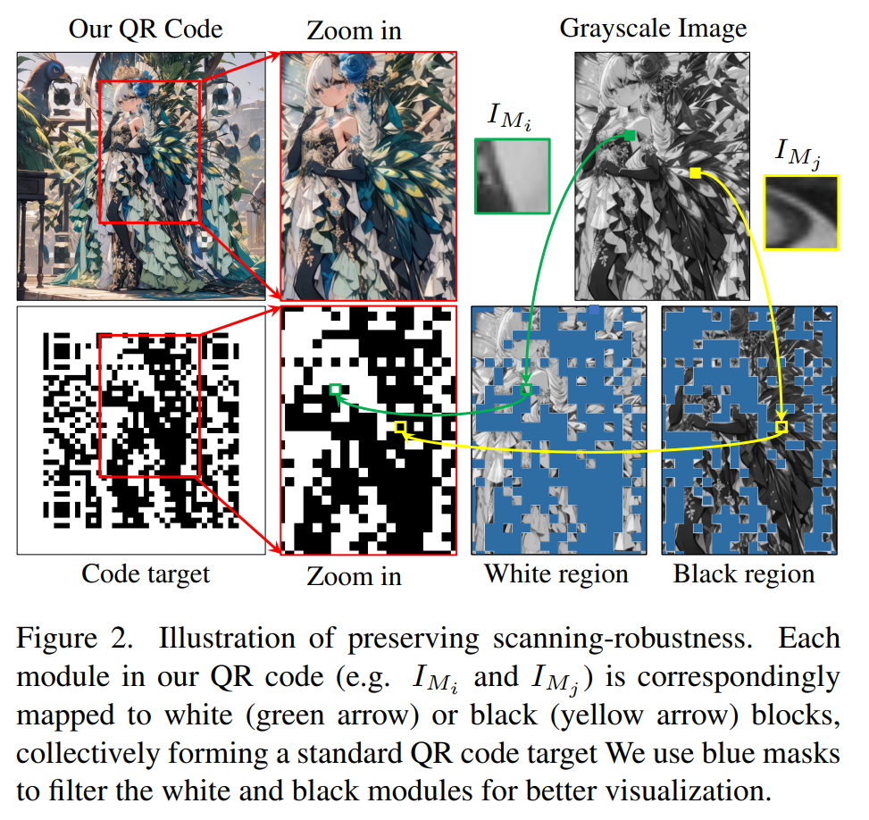

## Text2QR: Harmonizing Aesthetic Customization and Scanning Robustness for Text-Guided QR Code Genration
*CVPR(2024), 7 citation, Shanghai Jiao Tong University, Review Data: 2025.11.06*

[Intro](#intro) 
[Related Work](#related-work) 
[Method](#method) 
[Experiment](#experiment) 
[Conclusion](#conclusion) 

> Core Idea

<strong>"test1"</strong> 

***

### <strong>Intro</strong>

$\textbf{이 주제의 정의 및 요구사항과 중요한 이유}$

$\textbf{이 주제의 문제점과 기존의 노력들}$

$\textbf{최근 노력들과 여전히 남아있는 문제들}$

$\textbf{본 논문에서 해결하고자 하는 문제와 어떻게 해결하는지, 그 결과들}$

$\textbf{본 논문의 주요 기여점}$

***

### <strong>Related Work</strong>

***

### <strong>Method</strong>

***

### <strong>Experiment</strong>

***

### <strong>Conclusion</strong>

- 스타일이나 미학적 커스터마이징이 지나치게 복잡하거나 특수한 경우, 안정적인 생성 및 스캔 견고성 유지가 어려울 수 있음  
- QR Aesthetic Blueprint(QAB)와 SELR 과정을 거치지만, 일부 이미지나 코드 조합에서는 여전히 스캔 오류 가능성 존재
- 본 연구에서 주로 실험한 환경 및 디바이스가 제한적이어서, 모든 실제 사용 환경에서 완벽한 스캔 보장을 장담하기 어려움  
- 미적 완성도와 스캔 견고성 사이에서 트레이드오프가 존재하여, 극단적인 사용자 요구사항에는 맞추기 어려운 측면도 있음

***

### <strong>Question</strong>

<a href="">link</a>

> 인용구
