## Text2QR: Harmonizing Aesthetic Customization and Scanning Robustness for Text-Guided QR Code Genration
*CVPR(2024), 7 citation, Shanghai Jiao Tong University, Review Data: 2025.11.06*

[Intro](#intro) 
[Related Work](#related-work) 
[Method](#method) 
[Experiment](#experiment) 
[Conclusion](#conclusion) 

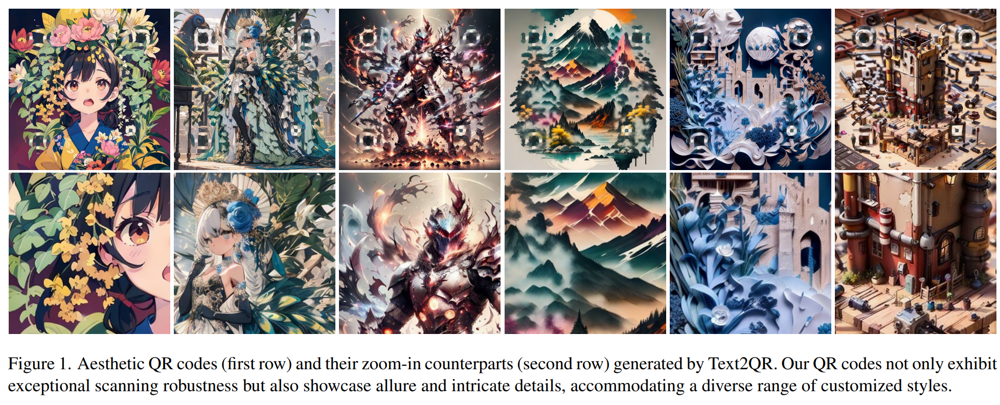

> Core Idea

<strong>"test1"</strong> 

***

### <strong>Intro</strong>

- 주목할 만하게도, Stable Diffusion 모델은 고품질이면서도 사용자 맞춤형 콘텐츠 생성을 가능하게 하는 새로운 시대를 열었다. 본 논문에서는 이러한 발전을 기반으로, 사용자 정의 미학과 스캔 강인성을 동시에 달성하는 근본적인 문제를 해결하기 위한 선도적인 접근법인 Text2QR을 제안한다. 
- 안정적인 미적 QR 코드 생성을 위해, 우리는 QR Aesthetic Blueprint (QAB) 모듈을 도입하여 전체 생성 과정을 제어하는 블루프린트 이미지를 생성한다. 
- 이후 Scannability Enhancing Latent Refinement (SELR) 과정을 통해 잠재 공간(latent space)에서 출력을 반복적으로 정제함으로써 스캔 강인성을 향상시킨다. 이 접근법은 Stable Diffusion 모델의 강력한 생성 능력을 활용하여, 이미지 미학과 QR 코드 판독성 간의 트레이드오프를 효과적으로 조율한다. 실험 결과, 제안한 방법은 시각적 매력과 미적 QR 코드의 실용성을 자연스럽게 결합하여 기존 방법들을 현저히 능가함을 입증하였다.

- 초기 연구들은 이미지-투-이미지 변환을 중심으로, 모듈 재배치 [33], 이미지 융합 [12, 40], 스타일 전이 기법 [33, 39] 등을 활용하였다. 
    - 이러한 방법들은 사전에 정의된 이미지 스타일을 생성하는 데는 효과적이었으나, 사용자마다 상이한 다양한 스타일 선호를 충분히 수용하지 못해, 개인화와 일관성을 동시에 만족시키는 통합적 해법에는 한계가 있었다. 
    
- 이후 이미지 생성과 제어 기술의 결합이 급속히 발전하면서, 새로운 전환점을 맞이하게 되었다. Stable Diffusion 모델 [28, 43]은 고품질·고유연성·넓은 표현 범위를 갖는 콘텐츠 생성을 가능하게 하는 강력한 엔진으로 부상하였다. 
0 동시에 ControlNet을 활용하여 QR 코드 내 밝기와 어두움의 관계를 조절하는 미적 QR 코드 생성 기법도 제안되었다 [10]. 그러나 이 접근법은 종종 불안정한 결과를 보였으며, 스캔 가능성과 콘텐츠 품질을 동시에 보장하기 위해 추가적인 제어 모델과 수동 파라미터 조정이 필요하다는 문제점을 안고 있었다 [10].

- 이러한 문제를 해결하기 위해, 본 논문에서는 Text2QR 파이프라인을 제안한다. 이는 사용자 정의 미학과 강인한 스캔 가능성을 균형 있게 만족시키는 QR 코드 생성을 가능하게 한다. 제안하는 프레임워크는 다음의 세 단계로 구성된다.
    - (1) 사용자는 Stable Diffusion 모델을 통해 원하는 이미지를 생성함과 동시에, 전달하고자 하는 메시지를 QR 코드로 인코딩한다.
    - (2) 이후 QR Aesthetic Blueprint (QAB) 모듈에서 사전 생성된 이미지(가이던스 이미지)와 QR 코드 정보를 결합하여 블루프린트 이미지를 생성한다. 이 블루프린트 이미지는 ControlNet의 입력으로 사용되어, Stable Diffusion 모델이 사용자 정의 미학을 유지하면서도 QR 코드의 밝기·어두움 블록 간 관계를 보존하도록 유도한다. 이 단계의 결과물은 디코딩 측면에서는 다소 불안정할 수 있으나, 사용자 선호와 일관성을 유지하면서도 흑백 블록 분포가 크게 개선된 출력을 제공한다.
    - (3) 마지막으로, 생성된 결과에서 콘텐츠와 메시지 간의 일관성을 정량화하는 에너지 함수를 구성하고, 이를 잠재 코드(latent code)에 대해 경사 상승(gradient ascent) 방식으로 최적화함으로써 스캔 강인성을 점진적으로 향상시킨다. 그 결과, 최종 QR 코드는 시각적 완성도와 판독성을 모두 만족시키며, 사용자 정의 커스터마이제이션과 실용성 사이의 미묘한 균형을 성공적으로 달성한다.

- 즉, 정리하자면 
    1. QR code image 생성, Stable diffusion model로 이미지 생성
    2. QAB로 미적 이미지 중점의 blueprint image 생성 
    3. ControlNet을 결합하여 blueprint image를 입력으로 미적 QR 이미지 생성 
    4. SELR로 scannable image로 변환

***

### <strong>Related Work</strong>

- 미적 2차원 바코드(Aesthetic 2D Barcode)
    - 미적으로 덜 매력적인 기존 QR 코드를 대체하기 위해, 다양한 미적 2차원 바코드들이 제안되어 왔다. **하프톤 QR 코드(Halftone QR codes)**는 QR 코드의 흑백 모듈을 재배치하여 입력 이미지와 의미적으로 일치하는 윤곽을 형성한다. 
    - QR Image [12, 40]는 QR 코드 인코딩 규칙에 내재된 중복성을 활용하여, 컬러 이미지를 QR 코드 내부에 삽입한다. 최근에는 Su 등[32, 33]이 QR 코드와 스타일 전이를 결합하여 예술적인 QR 코드를 생성하였다. 이러한 방법들은 모두 표준 QR 코드 인코딩 규칙을 준수하며, 일반적인 스마트폰 스캐너로 스캔 및 디코딩이 가능하다.
    - 위치 탐색 패턴(locating patterns)의 가시성을 줄이기 위해, Chen 등[3, 4, 21]은 인간 시각 시스템의 민감도를 고려한 인코딩 규칙을 설계하여, 탐색 패턴이 덜 눈에 띄도록 하였다. 또한 TPVM [11]은 화면과 인간의 시각 사이의 프레임률 차이를 이용해 QR 코드를 영상 속에 숨기는 기법을 제안하였다. 이와 유사하게, 카메라 촬영 이후에만 디코딩이 가능한 방식으로 정보를 보이지 않게 숨기는 비가시 정보 은닉(invisible information hiding) 기법들도 제안되었다 [8, 9, 13, 14, 34, 36].

- 확산 기반 생성 모델(Diffusion-Based Generative Models)
    - 최근 딥러닝 기반 이미지 처리 기법 [16–20, 29–31, 35, 37, 38]과 이미지 생성 방법 [22, 24, 27, 42]은 빠르게 발전하고 있다. GLIDE [24], DALL·E 2 [27], Latent Diffusion [28], Stable Diffusion [28]과 같은 확산 모델들은 새로운 유형의 생성 모델로 제안되었으며, 초기의 무작위 가우시안 노이즈를 반복적으로 제거하는 방식으로 이미지를 생성한다. 이러한 모델들은 다양한 생성 과제에서 기존 방법들을 능가하는 성능을 보여준다.
    - 이 중에서도 Stable Diffusion [28]은 디노이징 과정을 이미지 도메인에서 변분 오토인코더(VAE)의 **잠재 공간(latent space)**으로 이동시킴으로써, 데이터 차원과 학습 시간을 크게 줄인 점에서 특히 혁신적이다. 이러한 발전과 더불어, 확산 과정을 제어하기 위한 다양한 조건(condition)을 도입하는 연구들도 활발히 진행되고 있다. ControlNet [43]과 T2I-Adapter [23]는 구조적 제어(structural control)에 초점을 맞추고 있으며, ControlNet은 Stable Diffusion의 구조를 모사한 어댑터를 도입해 구조 조건 하에서 학습을 수행하고, T2I-Adapter는 경량 어댑터를 미세 조정하여 생성되는 장면과 콘텐츠를 세밀하게 제어한다. 반면, BLIP-Diffusion [15]과 SeeCoder [41]는 이미지 스타일 기반의 제어를 목표로 한다. BLIP-Diffusion [15]은 다중 모달 주제 표현을 추출해 텍스트 프롬프트와 결합하며, SeeCoder [41]는 텍스트 프롬프트를 배제하고 참조 이미지를 제어 파라미터로 사용한다.

***

### <strong>Method</strong>

$\textbf{Preliminaries}$

- 본 방법을 제시하기에 앞서, QR 코드 스캐너가 미적 QR 코드 이미지로부터 이진 정보를 디코딩하는 과정을 설명한다. QR 코드를 포함한 컬러 이미지가 주어지면, 먼저 해당 이미지를 휘도(luminance) 채널만을 추출하여 그레이스케일 이미지로 변환한다(YCbCr 색공간의 Y 채널). 이를 $I \in \mathbb{R}^{H\times W}$ 로 표기하며, 이는 $L$개의 그레이 레벨 (256)을 포함한다. 

- 스캐너는 먼저 Finder 패턴과 Alignment 패턴 [25, 40]을 검출하여 QR 코드 영역을 식별하고, 모듈의 개수와 모듈 크기와 같은 핵심 정보를 추출한다. QR 코드가 한 변에 $n$ 개의 모듈을 가지며, 각 모듈의 크기가 $a \times a$ pixel이라고 가정하면, $n\cdot a \leq min(H,W)$를 만족한다. 

- 마커 정보를 바탕으로, $n^2$ 개의 모듈로 구성된 격자를 생성하며, 각 모듈을 $M_k, k \in \{ 1, 2,,...,n^2 \}$로 표기한다. 

- 다시 이 격자는 이미지 $I$를 $n^2$개의 패치로 분할하며 각 패치는 $I_{M_k} \in \mathbb{R}^{a\times a}$로 표현된다. 

- $k$ 번째 모듈은 $0$ 또는 $1$로 표현되며 1비트 정보 $\tilde{I_k}$로 디코딩되며, 결과적으로 $\tilde I \in \mathbb{R}^{n\times n}$ 형태의 이진 이미지가 생성된다. 

- 일반적으로 QR code scanner는 각 모듈의 중앙 부분에 위치한 픽셀들만을 샘플링한다. 
    - 모듈 $M_k$의 중심에 위치한 크기 $x\times x$의 정사각형 영역을 $\theta$라 하고, $p \in \{1,2,...,H \} \times \{1, 2,...,W \}$를 이미지 $I$ 상의 픽셀 좌표라 하자. 
    - 이때 스캐너에 의해 계산되는 모듈 $M_k$의 디코딩 값 $\tilde{I}_k$는 다음과 같이 정의된다. 

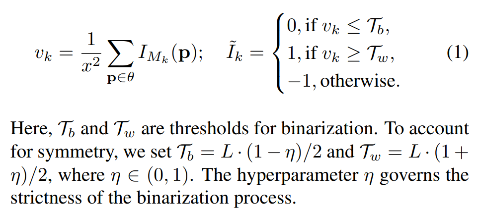

- QR 코드의 데이터 영역에서는, 샘플링되는 픽셀의 색상이 다소 변하더라도 이진 판독 결과가 유지되는 것이 스캔 강인성 측면에서 매우 중요하다. 그림 2에서 보이듯이, 색상과 형태가 미묘하게 혼합되고 변형되더라도, 샘플링된 픽셀들은 이상적인 QR 코드와 일치하는 이진 값을 지속적으로 생성하며, 이를 통해 표준 QR 코드 리더에서 안정적인 디코딩이 가능하다.
    - 분석의 편의를 위해, 이미지 $I$가 코드 타깃 $M \in \mathbb{R}^{n\times n}$ 에 대해 갖는 오류 수준을 평가하기 위해 $e(I) = p(\tilde{I}_k = M_k)$ 라는 확률을 정의한다. 여기서 함수 $e()$는 QR code의 데이터 영역에서의 오류 비율만을 특성화하며, finder 및 alignemnt 영역은 분석에서 제외한다.  

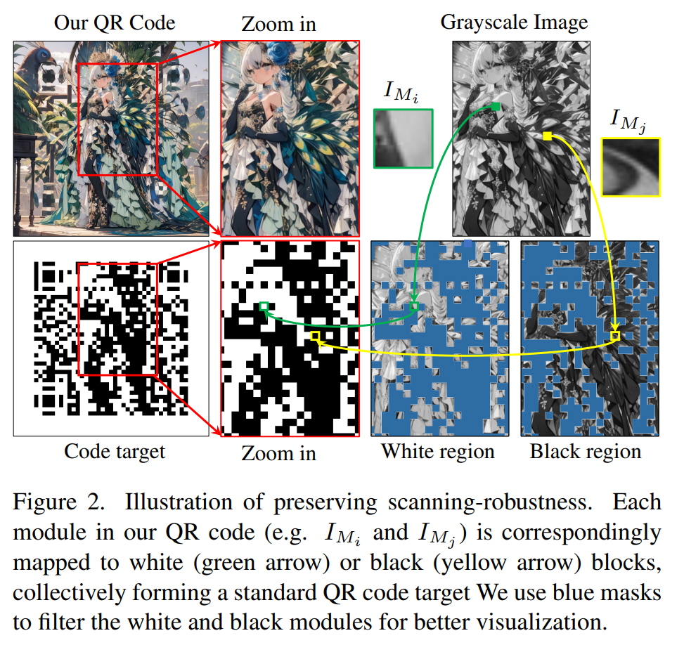

$\textbf{Main}$

- Overall
    - Text2QR은 SD model $G$를 기반으로 설계됐다. 
    - Text prompt $c$와 입력 노이즈 $z_0$를 이용하여 사용자가 원하는 이미지 $I_g$를 생성한다. 
    - 동시에 $n \times n$ 크기의 binary QR code $M$을 생성한다. 
    - 이미지 $I_g$와 target QR code $M$이 주어지면, Text2QR의 목표는 미적으로 만족스러운 QR code $Q$를 생성하는 것이다. 
    - 파이프라인은 $3$ 단계로 구성된다. 
        1. 사용자가 이미지 $I_g$와 target QR code $M$을 준비하고 이에 대응하는 파라미터 $c$와 $z_0$를 기록한다. 
        2. $I_g$와 $M$에 포함된 정보를 QR Aesthetic Blueprint (QAB) 모듈을 통해 통합하여 블루프린트 이미지 $I_b$를 생성한다. $I_b$는 ControlNet $C$의 입력으로 사용되어 SD model에 영향을 미친다. 
        3. $I_s$에 대해 Scannability Enhancing Latent Reinforcement (SELR) 모듈을 적용하여 반복적인 미세 조정을 수행한다. 이 과정은 스캔 강인성을 점진적으로 향상시킨다. 

$$ I_s = G(c, z_0 | C(I_b, c, z_0)) $$

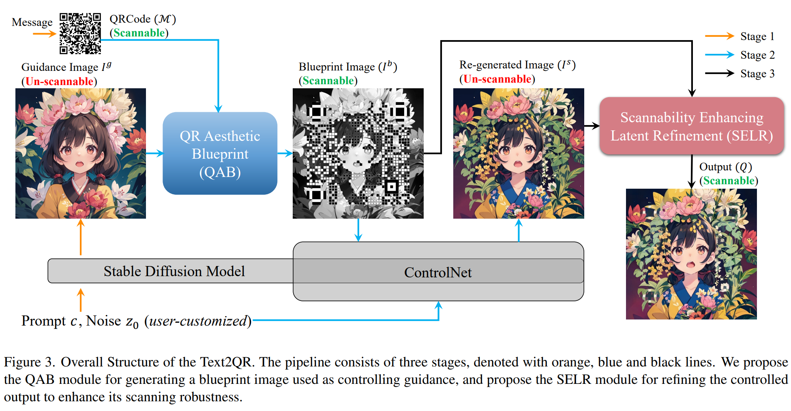

$\textbf{QR Aesthetic Blueprint}$
- 본 모듈은 QR code $M$ 과 이미지 $I_g$의 세부 정보를 통합하여 스캔 가능한 블루프린트를 생성하는 것을 목표로 한다. 
- 먼저 $I_g$로부터 휘도 채널을 추출하여 $I_g^y$로 표기한다. $I_g^y$에는 히스토그램 편극 (histogram polarization)을 적용하여 휘도를 조정하고, target QR $M$ 에는 모듈 재구성 (module reorganization) 기법을 적용하여 픽셀을 재배열한다. 
- 마지막으로 Adaptive-Halftone 기법을 이용해 두 정보를 블렌딩함으로써 블루프린트 이미지 $I_b$를 생성한다. 

- Histogram polarization 
    - 이 단계의 목적은 $I_g^y$의 히스토그램 분포를 QR code의 분포와 조화시키는 것이다. 이를 통해 $I_g^y$의 대비를 강화하여 고대비 grayscale image $I_{hc}$를 얻는다. 히스토그램 편극 연산은 하나의 lookup table $H$로 표현되며, 이는 한 그레이 레벨의 픽셀 값을 다른 그레이 레벨로 mapping한다. 각 픽셀 $p$에 대해 $\tau = I_g^y(p), \tau' = I_{hc}(p)$라 하면, 변환은 다음과 같이 정의된다. 
    - $\tau \in [0,L)$: gray level 
    - $n_{\tau}$: gray level $\tau$의 발생 빈도 
    - 해당 그레이 레벨에 대한 누적 분포 함수 (CDF)는 다음과 같이 정의된다. 
    - 목표는 데이터 구간 $[0, \tau_b) \cup [\tau_w, L)$에서 평탄한 히스토그램을 갖는 $I_hc$를 생성하고 구간 $[\tau_b, \tau_w)$의 발생은 배제하는 것이다. 
    - 이를 위해 먼저 값 범위 $[0,L-\tau_w + \tau_b]$ 에서 CDF가 선형화된 새로운 이미지 $I_{he}$를 생성한다. 
    - $\tilde{\tau} = I_{he}(p)$라고 하면, $\tilde{\tau} = (L - \tau_w + \tau_b)\cdot cdf(\tau)$
    - 이후 값 범위 $[\tau_b, L)$ 에 해당하는 픽셀들에 $\tau_w - \tau_b$를 더하여 최종적으로 $I_{hc}$를 얻는다. 

$$ cdf(\tau) = \sum_{i=0}^{\tau} \frac{n_i}{H \times W} $$

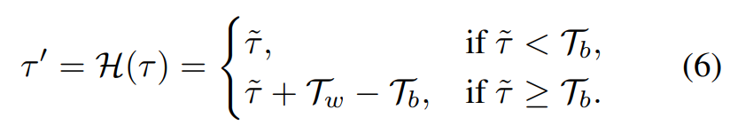

- Histogram polarization을 통해 히스토그램이 편극되고 휘도 대비가 강화된 이미지를 보여준다.
    - Grayscale image $I_g^y$의 히스토그램을 표시하고, 전체 히스토그램을 $[0, L-\tau_w + \tau_b]$ 크기로 압축한다. 즉, 중간의 회색 구간만큼 제거해서 압축한 것이다. 
    - 그리고, $\tau_b$보다 작은 건 그대로 두고 나머지는 중간 회색 구간의 길이만큼 다시 더해서 최종적으로 $[\tau_b, \tau_w)$ 구간에 intensity가 존재하지 않게 설계한 것이다.

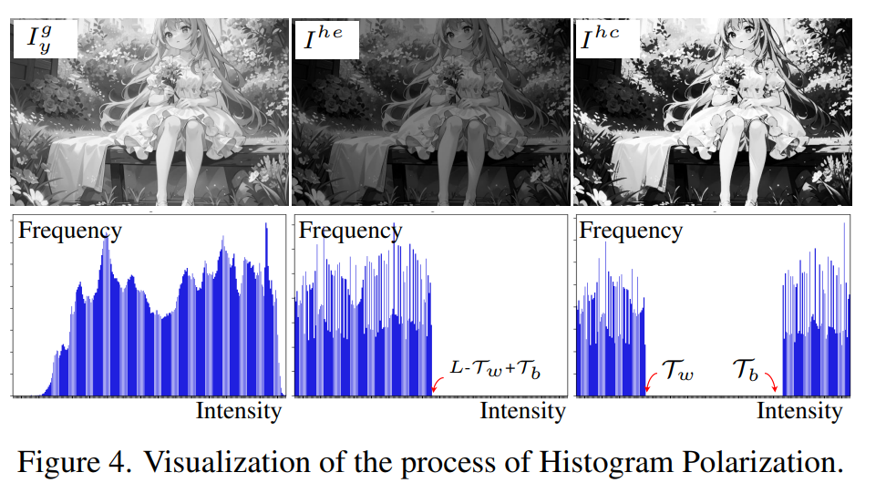

- Module Reorganization
    - QR code $M$을 $I_{hc}$와 블렌딩하기 위해, 먼저 $I_{hc}$를 이진 이미지 $I_{bin}$으로 변환한다. 
    - 이 이진 이미지 $I_{bin}$은 모듈 재구성 연산 $\mathcal{E}_r$을 유도하는데 사용되며, 해당 연산은 QR code의 인코딩 정보를 유지한채 모듈의 위치를 재배열한다. 

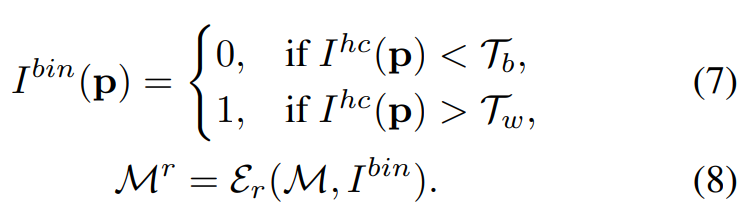

- Adaptive-Halftone blending
    - $k$번째 모듈 영역 $M_k$에 대해, 히스토그램 편극을 거친 이미지 패치 $I_{hc}^{M_k}$ 와 타깃 값 $M_k^r \in \{0,1 \}$이 주어진다. 
    - 목표는 정확한 정확한 디코딩을 보장하면서도 이미지 콘텐츠를 최대한 유지하는 블루프린트 이미지 $I_b$를 생성하는 것이다. 
    - 이를 위해 새로운 adaptive-halftone blending 기법을 도입한다. 
    - 각 모듈 $M_k$에 대해, 이미지 패치 $I_{hc}^{M_k}$의 중심에 크기 $u\times u$인 정사각형 영역 $\theta_k$를 정의하고, 이 영역을 값 $M_k^r$로 채워 $I_b^{M_k}$를 생성한다. 

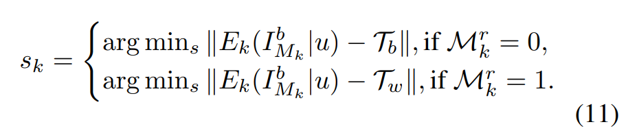

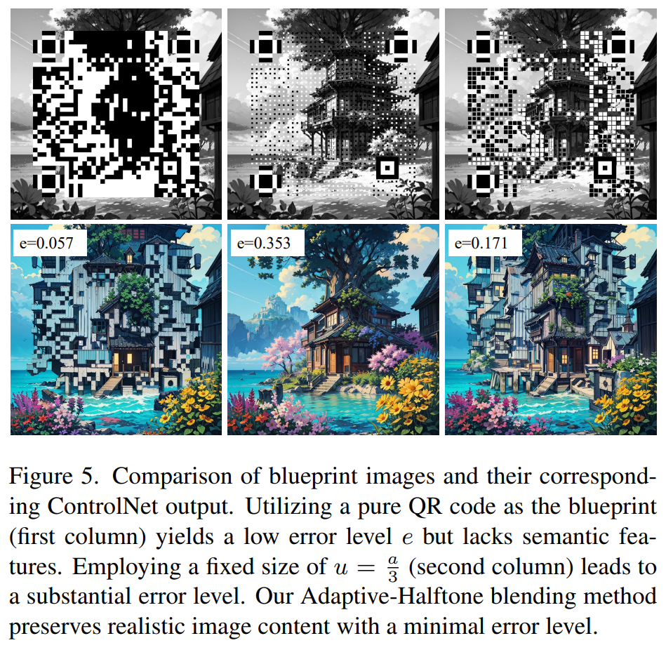

- 정리하자면, 
    1. grayscale 이미지의 히스토그램 분포를 일반적인 QR과 비슷하게 만들고
    2. 서브 중앙 모듈의 값들을 실제 모듈의 값으로 교체하여 blueprint를 만든다.

$\textbf{Scannability Enhancing Latent Refinement, SELR}$

- ControlNet과 Blueprint를 활용하여 재생성한 $I_s$는 $M_r$에 의해 부과된 구조적 제약을 만족하지만, 다수의 오류 모듈이 존재하여 스캔 가능성이 부족한 경우가 많다. 이러한 문제를 해결하기 위해 스캔 가능성 향상 잠재 정제 (SELR) 모듈을 도입한다. 

- Finder와 Alignement 패턴을 포함한 marker는 QR code의 위치와 각도를 결정하는 데 핵심적이며, 이는 스캔 가능성에 직접적인 영향을 미친다. 따라서 정제 이전에 이들 마커의 외관을 $I_s$에 통합한 이미지 $\hat{I}_{s}$를 구성한다. 

- 그림에서 보듯, pre-trained VAE의 encoder를 사용하여 augmented image $\hat{I}_{s}$를 잠재 코드 $z_s$로 인코딩한다. 
    - 전체 목적 함수 $L$은 marker loss $L_m$, code loss $L_c$, harmonizing loss $L_h$의 가중합으로 정의된다. 

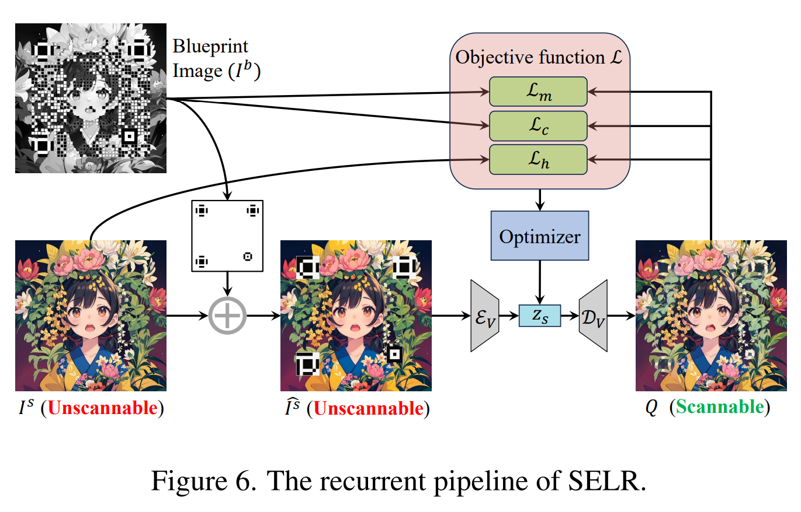

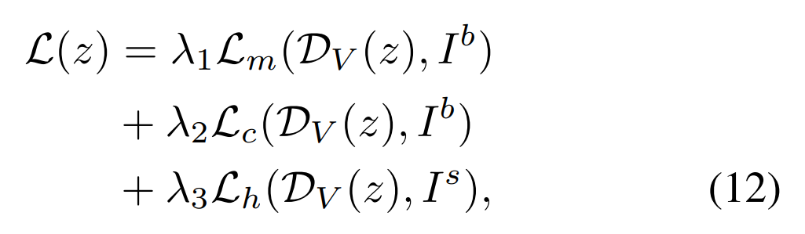

- Marker loss
    - QR code scanner는 마커 영역에서 특정 픽셀 비율을 기반으로 QR code를 인식한다. 이에 따라 cross-center region에 제약을 가하는 전략을 채택하며, 이 영역이 스캔 가능성 유지에 결정적임을 고려한다. 
    - 이를 위해 마커의 교차 중심 영역만을 필터링하는 이진 마스크 $K_cc$를 도입하여, 마커 특징이 훼손되는 것을 방지한다. 
    - $Q_y$: QR code $Q$의 휘도 채널

> 전통적인 QR 코드 마커는 정사각형 패턴으로 구성되어 있으나, 최근 연구들에 따르면 다양한 스타일로 변형되더라도 기존 QR 코드 스캐너에서의 판독성을 유지할 수 있음이 보고되었다 [3, 10, 21]. 이러한 적응성은 흑백 모듈 간의 특정 픽셀 비율(예: 1:1:3:1:1)을 유지함으로써 달성될 수 있으며, 이에 대한 자세한 내용은 [10, 25]에 기술되어 있다. 이러한 유연성에는 **중앙 교차 영역(cross center region)**을 유지하여 정보를 전달하는 방식도 포함된다.

- Code loss
    - Artcoder의 손실함수를 사용

- Harmonizing loss
    - 미적 품질을 보존하기 위해 조화 손실을 도입한다. 
    - $Q$와 $I_s$ 의 특징 맵 간 $L_2$ 를 계산한다. 특징 맵 $f_i$는 pre-trained VGG-19 network의 $i$번째 레이어에서 추출된다. 

***

### <strong>Experiment</strong>

***

### <strong>Conclusion</strong>

- 스타일이나 미학적 커스터마이징이 지나치게 복잡하거나 특수한 경우, 안정적인 생성 및 스캔 견고성 유지가 어려울 수 있음  
- QR Aesthetic Blueprint(QAB)와 SELR 과정을 거치지만, 일부 이미지나 코드 조합에서는 여전히 스캔 오류 가능성 존재
- 본 연구에서 주로 실험한 환경 및 디바이스가 제한적이어서, 모든 실제 사용 환경에서 완벽한 스캔 보장을 장담하기 어려움  
- 미적 완성도와 스캔 견고성 사이에서 트레이드오프가 존재하여, 극단적인 사용자 요구사항에는 맞추기 어려운 측면도 있음

***

### <strong>Question</strong>

<a href="">link</a>

> 인용구
