## [paper]
*CVPR(2024), 38 citation, University of Michigan, Review Data: 2026.02.19*

[Intro](#intro) 
[Related Work](#related-work) 
[Method](#method) 
[Experiment](#experiment) 
[Conclusion](#conclusion) 

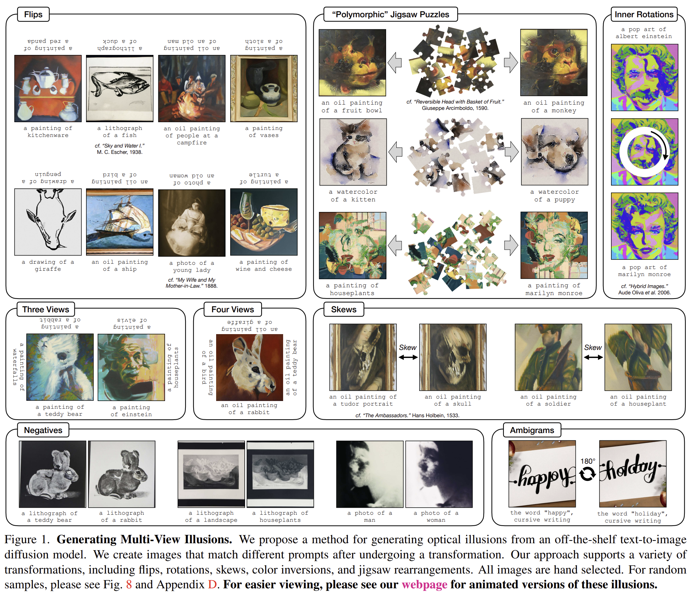

> Core Idea

<strong>"하나의 이미지가 변환(회전·뒤집기 등)에 따라 다른 의미를 갖도록 생성하는 방법을 제안한 논문."</strong> 

***

### <strong>Intro</strong>

- Visual Anagram (Multi-view optical illusion)
    - 이미지를 뒤집으면 다른 객체가 보이고, 회전하면 또 다른 의미가 나타나는 다중 해석 가능한 이미지 생성을 목표로 한다.

- 다중 시점(optical illusion) 착시 이미지를 합성하는 문제, 즉 뒤집기(flip)나 회전(rotation)과 같은 변환이 가해질 때 서로 다른 모습으로 보이는 이미지를 생성하는 문제를 다룬다.

- 이를 위해, 기존에 학습된(text-to-image) 확산 모델을 추가 학습 없이 그대로 활용하여 이러한 착시 이미지를 생성할 수 있는 간단한 zero-shot 방법을 제안한다.

- 역확산(reverse diffusion) 과정에서 하나의 노이즈 이미지에 대해 서로 다른 시점(view)에서의 노이즈를 각각 추정하고, 이 노이즈 추정값들을 결합한 뒤 이미지를 복원(denoise)한다.

- 이 방법에 대한 이론적 분석은, 이러한 접근이 직교 변환(orthogonal transformation) 으로 표현될 수 있는 시점들에 대해 정확히 동작함을 보여준다. 순열(permutation)은 이러한 변환의 한 부분집합에 해당한다.
    - 이로부터 시각적 아나그램(visual anagram) 이라는 개념을 도입한다. 이는 픽셀의 재배열에 따라 서로 다른 모습으로 보이는 이미지이다.

- 이러한 재배열에는 회전이나 뒤집기뿐 아니라, 퍼즐 조각을 다시 맞추는 것과 같은 보다 복잡한 픽셀 순열도 포함될 수 있다.또한 두 개를 넘는 다수의 시점을 갖는 착시 이미지로도 자연스럽게 확장된다.

- 회전이나 뒤집기와 같은 변환에 따라 서로 다른 모습으로 보이는 이미지는 오래전부터 지각(perception)을 연구하는 사람들의 관심을 끌어왔다. 이러한 착시가 매력적인 이유는 하나의 시각적 요소들을 여러 방식으로 해석될 수 있도록 정교하게 배치해야 한다는 도전성에 있다. 이러한 착시를 만들어내기 위해서는 시각 지각을 정확히 모델링하는 동시에, 그 지각을 의도적으로 “비틀어(subvert)”야 한다.

- 본 논문에서는 기존에 학습된(text-to-image) 확산 모델을 그대로 활용하여 다중 시점 착시 이미지를 생성하는 간단한 zero-shot 방법을 제안한다. 기존의 계산적 착시 생성 연구들 대부분이 명시적인 인간 지각 모델을 필요로 했던 것과 달리, 그러한 모델을 요구하지 않는다. 대신, 생성 모델이 인간과 유사한 방식으로 착시를 처리할 수 있음을 시사한 선행 연구들에 기반한다. 이러한 점에서 우리의 방법은 diffusion 모델을 활용해 착시를 생성한 최근 연구들과 유사한 맥락에 있다.

-  뒤집기나 회전에 따라 다른 모습으로 보이는 고전적인 착시 유형(그림 1)뿐 아니라, 우리가 visual anagram이라 부르는 새로운 유형의 착시도 생성할 수 있다.
    - Visual anagram은 픽셀의 순열(permutation)이 바뀔 때 다른 모습으로 보이는 이미지이다. 이미지의 뒤집기와 회전 역시 픽셀 순열로 표현될 수 있기 때문에 이러한 범주에 포함되지만, 여기서 더 나아가 보다 복잡한 순열도 고려한다. 예를 들어, 두 가지 서로 다른 방식으로 맞출 수 있는 직소 퍼즐을 생성할 수 있으며, 이를 **“polymorphic jigsaws”**라고 부른다. 또한 이 접근법은 세 개 또는 네 개의 시점을 갖는 착시 이미지 생성에도 성공적으로 적용된다(그림 1).

- 하나의 이미지를 여러 시점에서 동시에 복원(denoise)하도록 diffusion 모델을 사용하여, 서로 다른 노이즈 추정값들을 얻는 방식으로 동작한다. 이후 이 노이즈 추정값들을 결합하여 단일 노이즈 추정값을 만들고, 이를 역확산(reverse diffusion) 과정의 한 단계에 사용한다.
    - 다만 이러한 시점들을 선택할 때는 주의가 필요하다. 변환은 노이즈의 통계적 성질을 유지해야 하는데, 이는 diffusion 모델이 i.i.d. 가우시안 노이즈 가정 하에서 학습되었기 때문이다. 이러한 조건을 분석하고, 어떤 변환들이 지원 가능한지에 대한 정확한 범주를 제시한다.

***

### <strong>Related Work</strong>

- Diffusion Models.
    - 확산 모델(diffusion models)은 노이즈 분포에서 샘플을 시작해 이를 반복적으로 변환하여 데이터 분포의 샘플로 바꾸는 강력한 생성 모델 계열이다. 이러한 모델은 노이즈가 섞인 샘플에서 노이즈를 추정하고, DDPM이나 DDIM과 같은 업데이트 규칙에 따라 그 노이즈를 제거하는 방식으로 동작한다. 확산 모델의 대표적인 응용은 텍스트 조건 기반 이미지 생성으로, 이 경우 모델은 노이즈 이미지와 시간 단계(timestep)뿐 아니라 텍스트 프롬프트를 언어 모델 임베딩 형태로 함께 입력받아 조건(conditioning)으로 사용한다.
    - 본 논문은 에너지 기반 모델과 확산 모델을 결합하는 최근 연구들과 밀접한 관련이 있다. 이러한 연구들은 서로 다른 조건 분포에서 얻은 노이즈 추정값들을 결합하여, 학습된 분포들의 조합(composition)으로부터 샘플을 생성할 수 있음을 보였다. 우리는 이와 유사한 아이디어를 활용하여 다중 시점 착시 생성 문제에 적용한다.

- Computational Optical Illusions.
    - 본 논문은 착시를 계산적으로 생성하는 문제에 초점을 맞추며, 이 분야는 전통적으로 인간의 뇌가 외부 자극을 처리하는 방식을 모델링하는 접근에 의존해 왔다. 
    - 예를 들어, Freeman 등은 국소적으로 위상이 계속 변하는 필터를 적용해 특정 방향으로 지속적인 움직임이 있는 것처럼 보이는 착시를 만들었다. 
    - Oliva 등은 관찰 거리 변화에 따라 다른 모습으로 보이는 “하이브리드 이미지”를 제안했는데, 이는 인간 지각의 다중 해상도 특성을 활용해 한 이미지의 고주파 성분과 다른 이미지의 저주파 성분을 결합하는 방식이다. 
    - Chu 등은 장면 속 객체의 질감을 다시 입혀 위장(camouflage) 효과를 만들면서 밝기 제약을 추가해 객체의 주요 특징을 유지하도록 했으며, 
    - 다른 연구들은 3차원 장면에서 여러 시점에서 객체를 위장하는 방법을 제안했다. 최근에는 인간 시각의 베이지안 모델을 미분 가능하게 구성하여 색 항상성, 크기 항상성, 얼굴 지각과 관련된 착시를 설계한 연구도 있다.
    - 본 논문 역시 착시 이미지를 생성하지만, 인간 지각에 대한 명시적 모델에 의존하지 않는다. 대신 데이터로부터 암묵적으로 학습된 확산 모델의 시각적 사전지식(visual priors)을 활용한다. 이는 생성 모델이 착시를 인간과 유사하게 처리하고 동일한 모호성을 예측한다는 관찰과도 일치한다. 이러한 관점에서 우리의 방법은 판별(discriminative) 모델이 아니라 생성(generative) 모델을 활용해 인간을 대상으로 한 적대적 예시(adversarial example)를 합성하는 것으로 볼 수 있다.

- Oliva: 거리에 따른 착시 

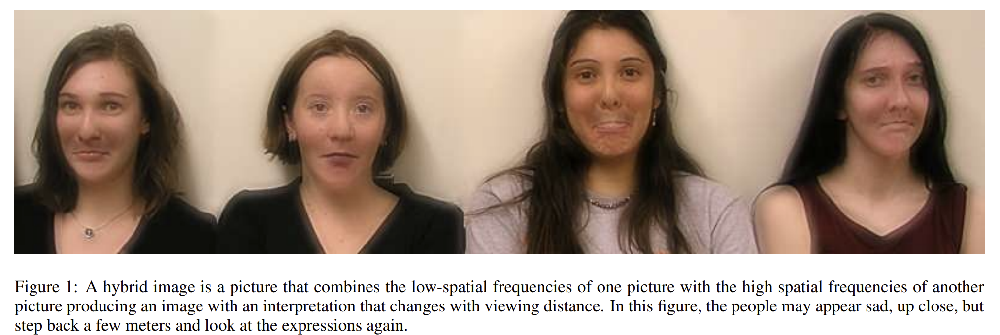

- Chu: 질감을 이용한 착시

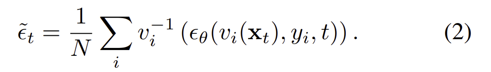

- Illusions with Diffusion Models.
    - 최근 예술가와 연구자들은 확산 모델을 활용해 착시를 생성할 수 있는 가능성을 보여주기 시작했다. 
    - 예를 들어, MrUgleh라는 가명을 사용하는 한 예술가는 QR 코드 생성을 위해 미세조정된 모델을 재활용하여, 전체 구조가 특정 템플릿 이미지와 미묘하게 일치하는 이미지를 만들었다. 
        - 반면 본 논문은 사전학습된 확산 모델을 그대로 사용하는 zero-shot 방식으로 다중 시점 착시를 연구하며, 이미지가 아니라 텍스트를 통해 착시를 지정한다. 
    - Burgert 등은 Score Distillation Sampling(SDS)을 사용해 서로 다른 시점에서 서로 다른 프롬프트에 맞는 이미지를 생성했지만, SDS 기반 방법은 결과 품질이 낮고 명시적인 최적화가 필요해 샘플링 시간이 길다는 단점이 있다. 
        - 본 방법은 Tancik의 개념 증명(proof-of-concept)과 가장 유사한데, 그는 잠재 확산 모델에서 서로 다른 시점과 프롬프트 사이를 번갈아가며 노이즈 추정을 수행해 회전 착시를 생성했다. 그러나 단순히 회전 착시에 그치지 않고 다양한 유형의 다중 시점 착시를 실험적으로 평가하고, 어떤 변환이 가능한지(또는 불가능한지)에 대한 이론적 분석을 제공한다. 또한 잠재 확산에서 발생하는 아티팩트의 원인을 규명하고 임의의 개수의 시점을 지원하도록 하는 등 여러 개선을 통해 정성적·정량적으로 더 우수한 착시 결과를 얻었다.

***

### <strong>Method</strong>

- 목표는 사전 학습된 확산 모델을 이용해 다중 시점 (optical illusion) 이미지를 생성하는 것이다. 즉, 뒤집기나 회전과 같은 변환이 적용될 때 이미지의 외형이나 정체성이 달라 보이도록 하는 이미지를 합성하고자 한다. 

$\textbf{Text-conditioned Diffusion Models}$

- 확산 모델은 i.i.d Gaussian noise $x_T$에서 시작하여 이를 반복적으로 제거함으로써 데이터 분포에서의 샘플 $x_0$를 생성한다. 
- 추정된 노이즈는 DDPM or DDIM 과 같은 update rule에 사용되어 $x_t$로부터 $x_{t-1}$을 계산한다. 
- 확산 모델을 텍스트와 같은 추가 입력에 조건화(conditioning)하기 위한 일반적인 방법은 classifier-free guidance를 사용하는 것이다.
    - 또한 이 방식은 negative prompting도 가능하게 한다. 즉, 빈 프롬프트 대신 “생성되지 않기를 원하는 내용”을 넣어 모델이 특정 요소를 피하도록 만들 수 있다.

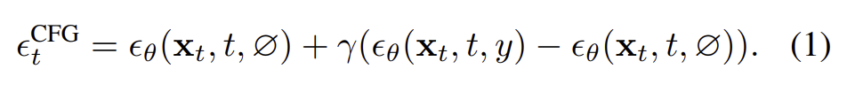

$\textbf{Parallel Denoising}$

- 우리는 하나의 이미지를 여러 시점에서 동시에 복원(denoise)하도록 확산 모델을 사용하여 다중 시점 착시를 생성한다.

- 구체적으로 $N$개의 prompt set $y_i$를 사용하며, 각 prompt는 이미지에 특정 변환을 적용하는 view function $v_i(\cdot)$과 연결된다. 
    - 이러한 변환에는 항등 (identity) 함수, 이미지 뒤집기 (flip), pixel permutation (픽셀 순열)등이 있다. 
    - 즉, 각 view $v_i$를 사용해 noisy image $x_t$를 변환한 뒤, 변환된 이미지에서 노이즈를 추정하고, 그 추정값에 역변환 $v_i^{-1}$를 적용하여 다시 원래 좌표계로 되돌린다. 
    - 이렇게 얻은 노이즈 추정값들을 평균하면 하나의 결합된 노이즈 추정값이 만들어지며, 이를 선택한 diffusion sampler에서 사용할 수 있다.
    - 이처럼 여러 노이즈 추정값을 결합하는 방식은, 여러 조건을 조합하는 compositionality 연구들과 유사한 접근이다. 또한 classifier-free guidance를 적용하기 위해서는 $\epsilon_{\theta}(v_i(x_t), y_i, t)$ 대신 classifier-free 추정값 $\epsilon_t^{CFG}$을 사용하면 된다.

- Process
    - Model은 정상적인 이미지를 생성하는 모델임 (학습 분포가 원래 그럼)
    - $v_i$가 identity function이 아닌 경우, $x_t$를 이미 변환된 이미지라고 생각
    - $v_i$를 통해 정상적인 $x_t$로 만들어서 model input으로 줌
    - output에 다시 $v_i$를 적용하면 변환된 결과가 나옴 

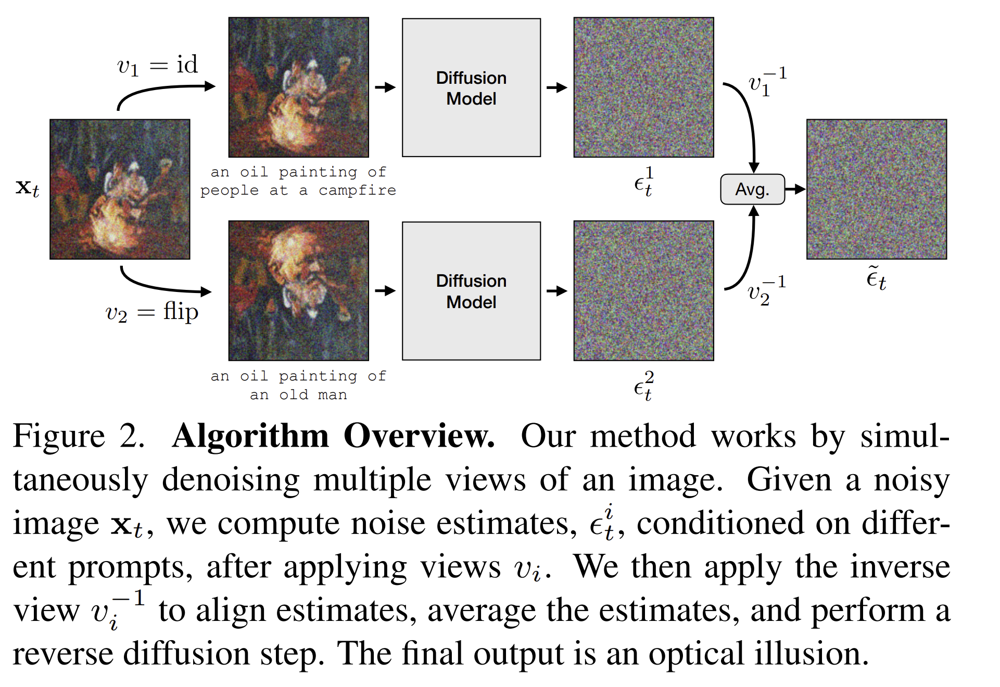

$\textbf{Conditions on Views}$

- View $v_i$에 대한 가장 기본적인 조건은 가역적 (invertible)이어야 한다는 것이다.
- 추가로 확산 모델은 암묵적으로 view에 대해 추가적인 조건들도 요구한다. 이 조건들이 만족되지 않으면, denoising 과정의 결과가 매우 나빠지는 것을 확인했다. 

1. 선형성 (linearity): forward 과정에서 $x_t$를 만들 때, 원래 이미지와 noise의 선형 결합으로 만든다. 따라서 view $v_i$는 $x_t$를 변환한 결과 $v_i(x_t)$ 역시 같은 가중치를 가진 신호와 노이즈의 선형 결합이 되도록 만들어야 한다. 
    - 이를 만족하려면 $v_i$는 다음과 같은 선형 변환 (linear transformation)이어야 한다. $v_i(x_t) = A_i x_t$ 
    - 여기서 $A_i$는 어떤 행렬이다. 
    - 선형성을 이용하면 view가 신호와 노이즈에 각각 따로 작용한다고 볼 수 있다. 
    - 즉, 변환된 신호 $A_i x_0$ , 변환된 노이즈 $A_i\epsilon$이 올바른 비율로 유지된다. 

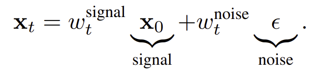

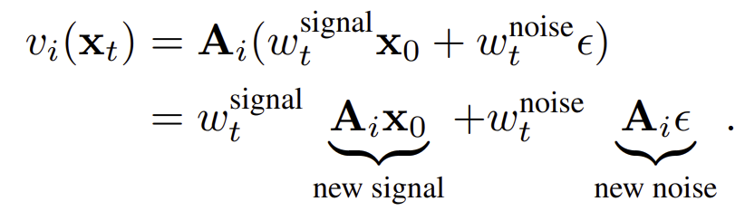

2. 통계적 일관성 (Statistical Consistency)
    - 확산 모델은 단순히 신호와 노이즈의 선형 결합만 기대하는 것이 아니라, 노이즈가 특정한 분포를 따르기를 기대한다.
    - 대부분의 확산 모델은 $\epsilon$이 표준 가우시안 노이즈로 가정한다. $\epsilon \sim \mathcal{N}(0,I)$ 즉 평균 0, 공분산 $I$ 
    - 따라서 변환된 노이즈 $A_i\epsilon$ 역시 같은 분포 $\mathcal{N}(0,I)$를 따라야 한다. 
    - 이 조건이 성립하는 것은 오직 $A_i$가 직교 행렬 (orthogonal matrix)일 때뿐이다. 
    - 직관적으로 이는 표준 가우시안 분포가 구면 대칭(spherical symmetry)을 가지기 때문이다. 직교 변환은 회전이나 반사처럼 이 대칭성을 보존하므로 분포를 바꾸지 않는다. 여기서 말하는 회전은 공간상의 회전이 아니라, 픽셀 값 벡터 공간에서의 회전을 의미한다.

- 두 성질을 왜 만족해야 하는지 정리해보자. 먼저 선형성이다. 
    - Diffusion model은 forward pass에서 다음과 같이 $x_t$를 구성한다. $x_t = w_t^{signal}x_0 + w_t^{noise}\epsilon$
    - 그리고 우리는 view $v_i$를 적용시켜서 정상적인 $v(x_t)$를 만들고 model에 입력으로 넣는다. 즉 모델에 입력은 signal + noise의 선형성을 만족해야한다. 
    - 그렇다면 model은 $v(x_t)$가 기존의 $x_t$의 구성을 따를거라고 가정한다. 
    - 즉 여전히 신호와 노이즈의 선형 결합 형태를 유지해야 하니, $v_i$를 적용해도 signal과 noise의 선형 결합 형태를 유지해야 한다. 
    - 반례로, view가 비선형이라 $v(x) = x^2$ 라면
        - $v(x_t) = (w_s x_0 + w_n\epsilon)^2 = w_s^2 x_0^2 + w_n^2\epsilon^2 + 2 w_sw_n x_0 \epsilon$ 이 되면서 더 이상 $x_t$의 분포로 표현할 수가 없다. 

- 다음은 통계적 일관성을 이해해보자 
    - 일반적인 diffusion model이 학습한 noise 분포는 $\mathcal{N}(0,I)$ 이다. 
    - 그리고 view를 적용해 변환된 noise는 $\epsilon' = A\epsilon$ 이고 그 분포는 $\epsilon' \sim \mathcal{N}(0, AA^T)$ 이다. 
    - 따라서 diffusion model이 제대로 작동하려면 반드시 $AA^T=I$여야 한다. 이 조건을 만족하는 $A$ matrix 는 orthogonal matrix여야 한다. 
    - 반례로, $A=2I$ 라면 $\epsilon' = \mathcal{N}(0, 4I)$ 가 된다. 
    - Orthogonal matrix는 row와 column 모두 정확히 하나의 $1$이 있는 경우만을 orthogonal matrix라고 한다. 

$\textbf{Views Considered}$

- 이미지에 적용할 수 있는 직교 변환 (orthogonal transformation)의 대부분은 직관적인 이미지 변환으로 해석되기 어렵다. 
    - 그러나 그중 일부는 실제로 의미 있는 시각적 변환에 해당한다. 

1. Identity (항등 변환)
    - 가장 단순한 변환은 항등 변환이다. 

2. Standard Image Manipulations (일반적인 이미지 조작)
    - Spatial rotation
        - 회전은 픽셀의 재배열 (permutation)으로 볼 수 있으며, 순열은 직교 변환이므로 이 방법이 성립한다. 
        - 다만 회전 view를 사용할 때는 주의가 필요하다. bilinear sampling과 같은 일반적인 anti-aliasing 연산은 노이즈의 통계를 바꿀 수 있기 때문이다. 
    - Reflection (좌우 뒤집기)
        - 역시 픽셀 순열이므로 동일하게 사용할 수 있다.   
    - Skew
        - 또한 각 열 (column)을 서로 다른 양만큼 이동시키는 방식으로 기울이기 (skew)를 근사적으로 구현했다. 
        - 진짜 skew 행렬은 orthogonal이 아니여서 근사적으로 구하여 orthogonality를 만족시킨다. 

- Flip

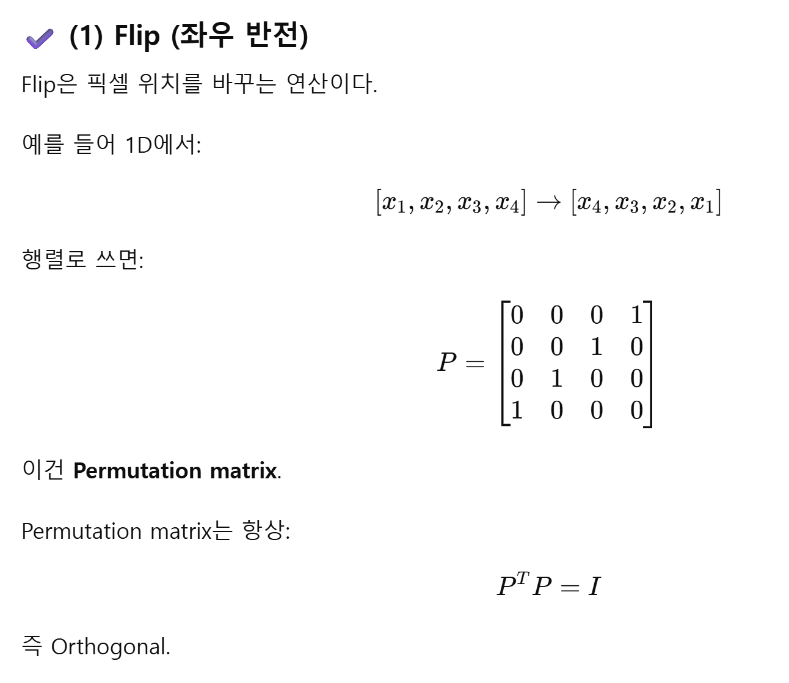

- Rotation

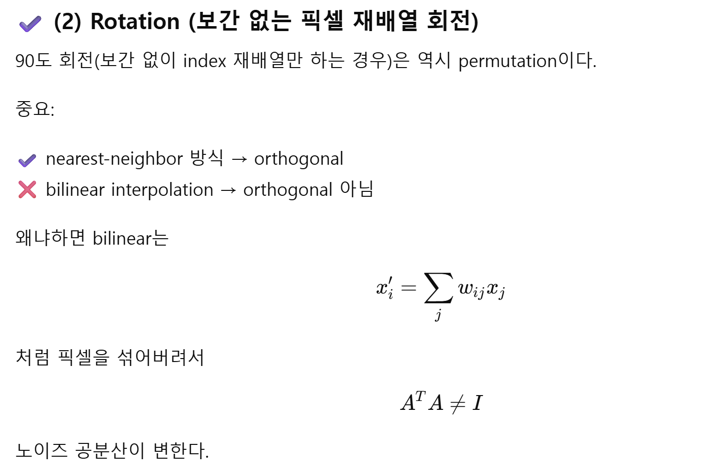

- Reflection, Jigsaw

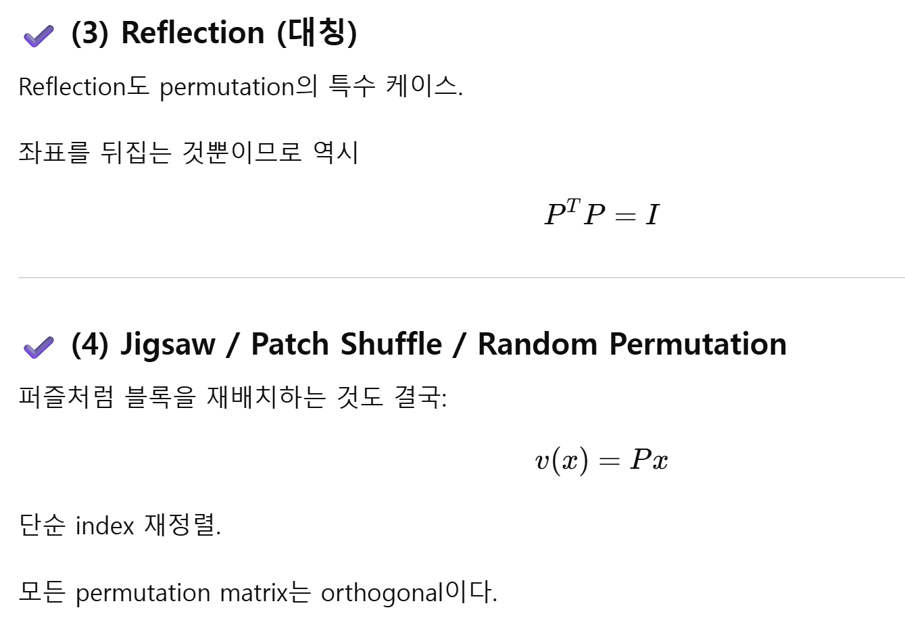

3. General Permutations (일반적인 순열)
    - 앞서 회전, 반사, skew와 같은 특수한 경우를 살펴보았지만, 그 외의 순열도 적용할 수 있다. 
    - 예를 들어 이미지를 퍼즐 조각 (Jigsaw pieces)로 나눈 뒤 재배열하여 두 가지 방식으로 맞출 수 있는 퍼즐을 만들 수 있는데 ,이를 polymorphic jigsaw puzzles라고 부른다. 
    - 또한 픽셀 전체를 완전히 무작위로 섞는 극단적인 경우도 고려했다. 복잡도를 줄이기 위해 개별 픽셀 대신 정사각형 패치 단위로 순열을 적용할 수도 있다. 
    - 마지막으로, 이미지 전체는 고정한 채 내부의 원형 영역만 회전시키는 변환도 고려했으며, 이를 **inner rotations** 라고 부른다. 

- 정사각형 패치 단위로 순열을 적용한 예시 

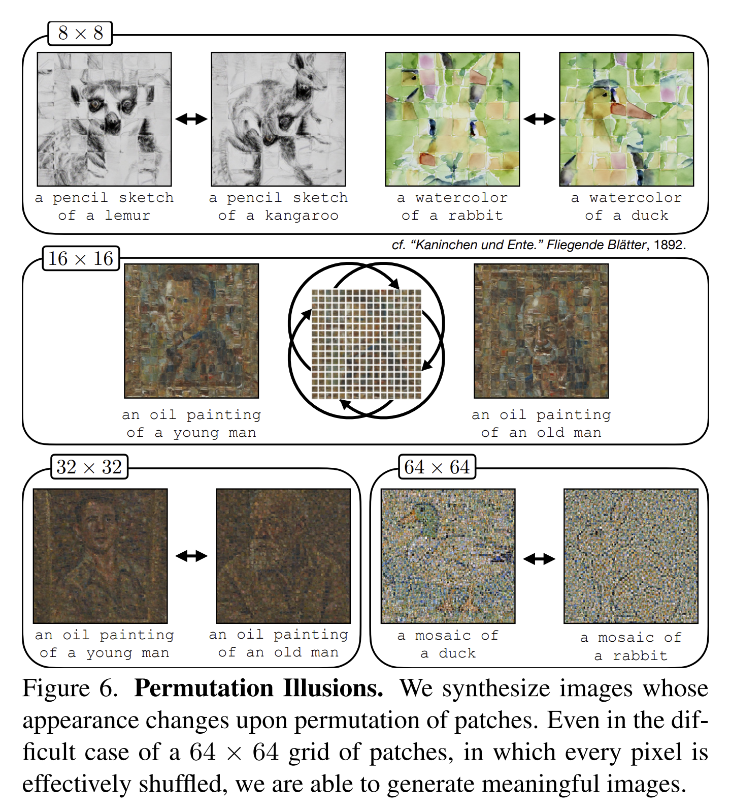

4. Color Inversion (색 반전)
    - 부호 반전 (negation)은 직교 변환이다. 
    - 이는 직관적으로 고차원 공간에서의 180도 회전에 해당한다. 
    - 따라서 픽셀 값이 $0$ 을 중심으로 정규화되어 있을 때 (e.g., $[-1,1]$), 색 반전에 따라 다른 모습으로 보이는 착시를 생성할 수 있다. 

- Color inversion, inner rotation

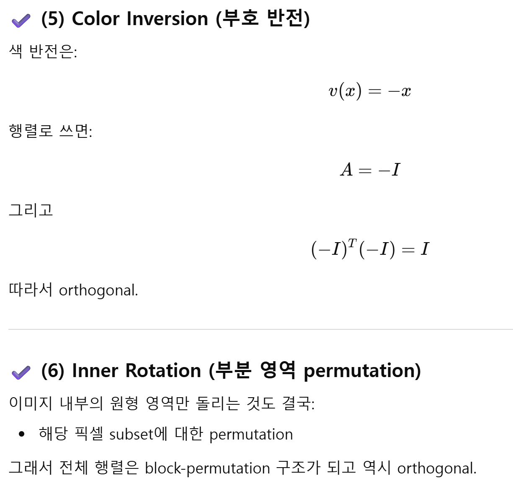

5. Arbitraty Orthogonal Transformations (임의의 직교 변환)
    - 픽셀 공간에서의 임의 회전은 인간에게는 해석 불가능한 경우가 많다. 
    - 그럼에도 불구하고 본 방법론은 이러한 변환에서도 정상적으로 작동함을 보였다.
    - 이러한 착시는 사람 눈에는 의미가 없지만, 본 방법론이 어떤 직교 변환에도 적용 가능함을 확인하는 실험적 증거이다. 

- 임의의 직교 변환 실험 

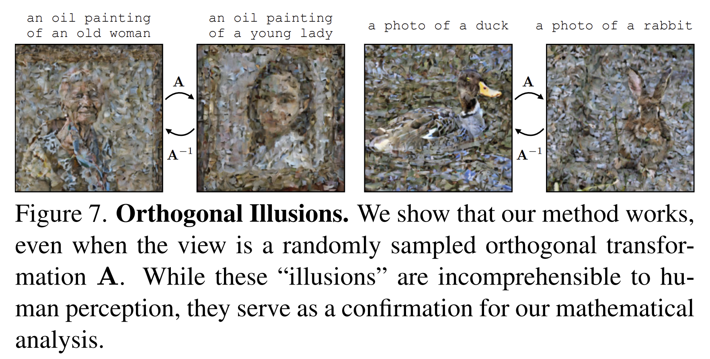

- Orthogonal transformation 
    - 픽셀 값을 섞지 않는다. (interpolation x)
    - 단순 재배열 또는 부호 변환 
    - Gaussian noise의 통계를 유지한다. 

$$ A^TA = I $$

$\textbf{Design Decisions}$

- 핵심 방법 외에도, 착시 (illusion)의 품질을 최대화하기 위한 여러 설계 선택 사항들을 함께 고려한다. 

- Pixel Diffusion Model 
    - 기존 연구에서는 Stable Diffusion과 같은 latent diffusion model을 사용하여 multi-view denoising을 수행했다. 
    - 하지만 latent representation은 실제로는 픽셀 패치 단위 정보를 압축한 코드에 가깝다. 이 때문에 회전이나 뒤집기를 적용하면 다음과 같은 문제가 발생한다. 
        - Latent의 위치는 바뀌지만, 각 latent block이 담고 있는 content와 orientation (방향)은 바뀌지 않는다. 그 결과 회전된 이미지를 제대로 표현하지 못하고 artifact가 생긴다. 

- 90도 회전 후 직선을 만들기 위해 모델이 초가지붕처럼 비스듬한 선 (thatched lines)를 생성하도록 강제되는 현상이 나타난다. 
    - 이 문제를 해결하기 위해 본 논문은 픽셀 공간에서 직접 동작하는 diffusio model인 DeepFloyd IF를 사용하여 방법을 구현했다. 
    - DeepFloyd는 latent가 아니라 실제 픽셀을 직접 denoise하기에 latent block의 방향성 문제를 자연스럽게 회피할 수 있다. 

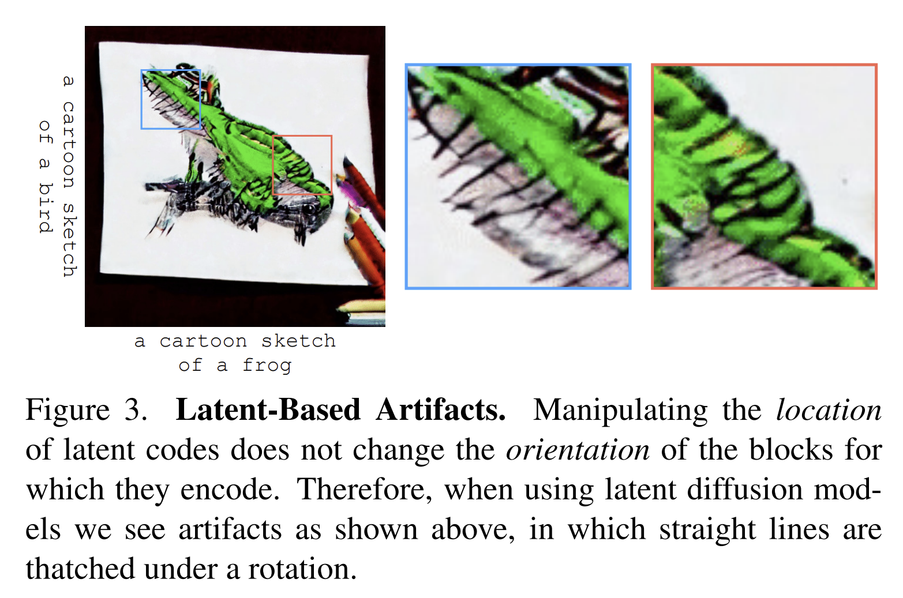

- DeepFloyd IF model architecture
    - 이미지 생성 모델로 $64\times 64$ image generation 
    - $256 \times 256 \rightarrow 1024 \times 1024$ up-scaling 

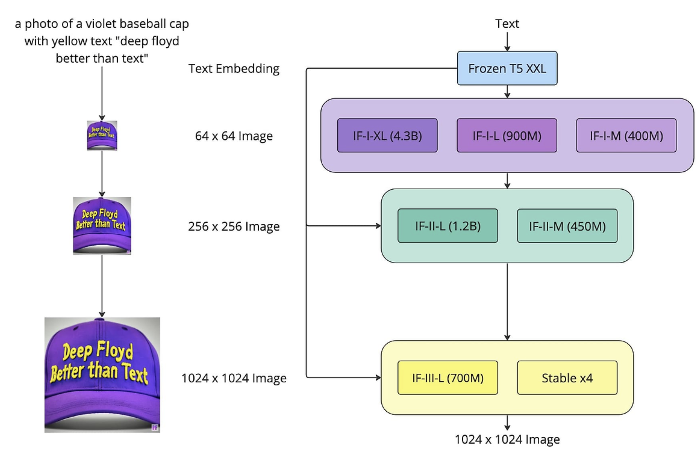

- Combinding Noise Estimates
    - 여러 view 에서 얻은 노이즈 추정값을 단순 평균하는 방법 외에도 timestep마다 번갈아 사용하는 방식도 실험헀다. 
    - 그러나 이후 ablation study 결과 평균을 취하는 게 성능이 더 좋았다. 

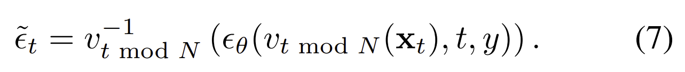

- Negative Prompting 
    - 2-view setting에서 negative prompting도 실험했다. 
    - 한 view의 prompt를 다른 view에서는 negative prompt로 사용하고 반대로도 동일하게 적용한다.
    - 즉, 각 view가 다른 view의 내용을 숨기도록 유도한다. 
    - 결과는 안하는 게 더 좋았다. 

***

### <strong>Experiment</strong>

- Model: DeepFloyd IF
    - pixel based의 두 단계만 사용한다. 64로 이미지 생성 후, 256으로 up-scaling 
    - 본 방법론은 두 stage 모두에 적용된다. 
    - DeepFloyd IF는 noise estimation 뿐만 아니라 variance도 함께 예측하는데, 여러 view에서 나온 분산 추정값 역시 평균을 취한다. 
    - CFG: 7 ~ 10
    - Inference step: 30 ~ 100 step 
    - M size model 사용

- Metric
    - CLIP (image - text pair) score $S$를 활용한 2개의 metric을 사용한다. 
    - Alignment score $\mathcal{A}$
        - min diag $(S)$로 CLIP score matrix에서 주 대각선만 뽑은 것이다. 이때, 주 대각선은 view $i$가 대응되는 prompt $i$와 얼마나 잘 맞는지에 대한 점수이다. 
        - 즉, 모든 view가 최소한 어느 정도는 제대로 보이는가에 대한 지표
    - Concealment score $\mathcal{C}$
        - Alignement score는 view $j$에서 다른 prompt $i$가 보이는 경우를 잡지 못한다. 이를 정량화하기 위해 $C$ 를 정의한다. 

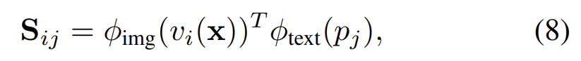

- Concealment score 
    - $\tau$: temperature parameter of CLIP 
    - Softmax를 CLIP score에 진행하니, view $i$와 여러 prompt $j$ 중 어떤 게 연관성이 높은지를 확률적으로 파악할 수 있다. 
    - 거기에 trace로 주대각선의 합을 구하니, view $i$가 prompt $i$로 맞게 분류될 확률을 측정하는 지표가 되는 것이다. 

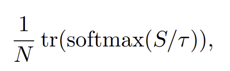

- Dataset 
    - 2-view illusion 평가를 위해 두 가지 prompt 쌍 데이터셋을 구성했다. 
    - CIFAR-10 dataset: 10개의 class 사용, 클래스 쌍마다 하나의 prompt 생성, 총 45개의 프롬프트 쌍 
        - 스타일 프롬프트는 고정 
        - class를 subject로 보고 쌍 구성 
        - 순서를 고려하지 않고 쌍을 구성하니 10C2로 45개이다. 
    - Ours dataset: 연구자가 직접 구성한 데이터셋, 총 50개의 프롬프트 쌍
        - style 목록: e.g., "a street art of ..."
        - subject list: e.g., "an old man"
        - 아이디어 도출은 GPT-3.5를 참고했다.  
        - 프롬프트 쌍은 다음 방식으로 도출된다. 
            - 스타일 프롬프트 하나 선택 
            - 두 개의 subject 선택
            - 스타일 문장을 두 주제 앞에 붙여서 두 개의 prompt 생성 

- Baseline
    - Burgert et al.
    - Tancik

- 두 데이터셋 모두에 대해 baseline 방법들과의 비교
    - Vertical flip 변환을 사용했다. 이를 선택한 이유는 baseline과 ours 모두에서 지원되는 공통 변환이기 때문이다. 
    - 각 prompt마다 10개의 샘플을 생성했으며, CIFAR는 450개, Ours dataset은 총 500개 sample을 사용했다. 
    - 최선의 경우 (best-case) 성능에도 관심이 있었기에 지표의 분위수 (quantile)도 함께 보고됐다. 예를 들어, $\mathcal{A}_{0.9}$는 90번째 분위수 (상위 10% 성능)을 의미한다. 
    - alignment score와 concealment score 모두에서 baseline보다 일관되게 더 좋은 성능을 보였다.

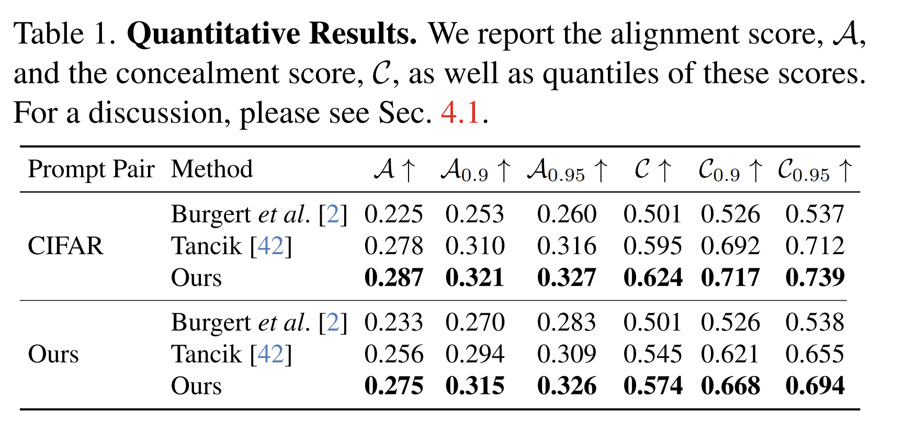

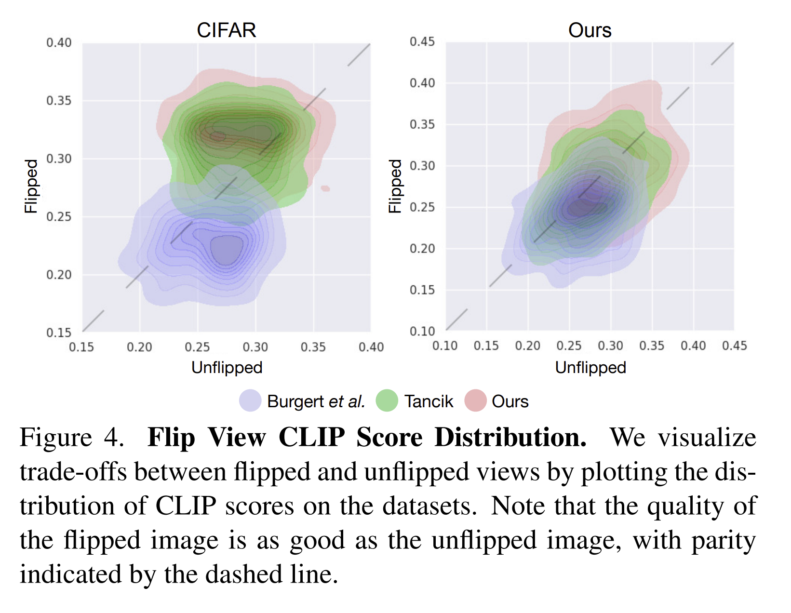

- Ablation
    - Negative prompting: 안한 게 더 좋음
        - 사용할 때, 스타일은 겹치니까 스타일 빼고 subject에 대한 내용만 넣어야 한다. 
        - 실험 결과 negative prompting은 concealment score 즉, 다른 개념을 숨기는 데는 실제로 도움이 된다. 하지만 그 대가로 alignment score는 감소했다. 
        - 그 이유는 negative와 positive prompt간의 근본적인 공유 특징이 있기 때문이다. 
            - prompt: "an oil painting of a dog"
            - negative: "a cat"
            - 털, 네 다리, 꼬리 등 필요한 특징까지 억제해버릴 수 있다. 
            - 이러한 이유로 negative prompting은 사용하지 않는다.
    - 노이즈 추정 결합 방식: 평균이 좋음
        - 번갈아가면서 적용하면 노이즈 방향이 계속 바뀌면서 최적화가 흔들리는 현상이 나타나고, 수렴이 나빠진다. 
        - 특히 view가 $2$개를 초과할 때 성능이 나빠졌다. 
            - 각 view가 사용할 수 있는 denoising step 수가 줄어들기 때문이다. 
    - Guidance scale (CFG): 10이 좋음
        - 더 높은 scale 값이 대체로 더 좋은 성능을 보였다. 이는 scale이 커질수록 sampling 분포가 더 날카로워져 조건에 더 강하게 맞는 이미지를 생성하기 때문으로 해석된다. 

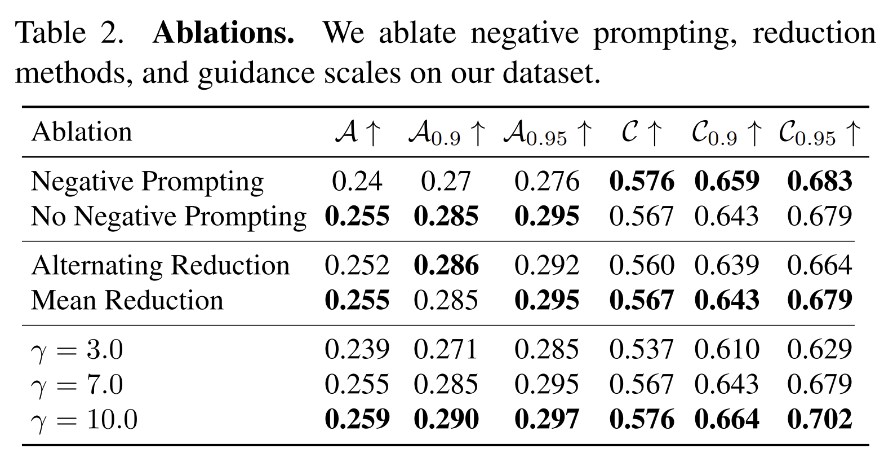

- View 가 4개일 때의 노이즈 추정결합 방식 비교 

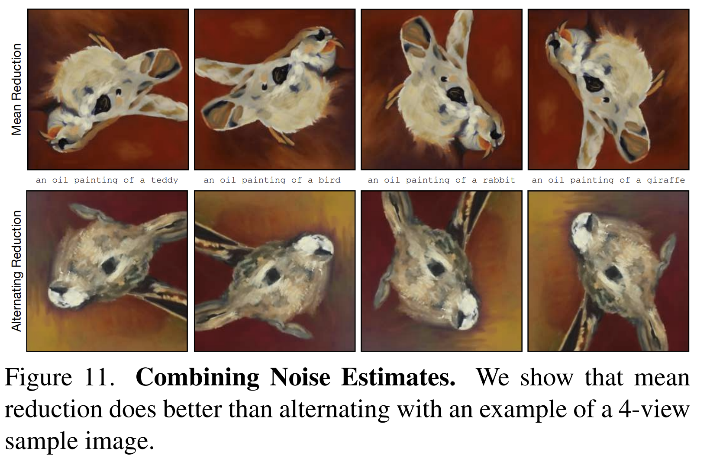

$\textbf{Qualitative Results}$

- 다양한 view에서 매우 높은 품질의 착시 이미지를 생성할 수 있음을 확인 
    - 흥미롭게도, 종종 한 view의 요소를 다른 view에서도 재활용하는 창의적인 구조를 스스로 찾아낸다. 
    - 예를 들어 “waterfalls / rabbit / teddy bear” 3-view 착시에서는 테디베어의 코가 → 토끼의 눈이 되고 동시에 → 폭포 속의 바위로도 해석된다. 즉 하나의 시각적 요소가 여러 의미를 동시에 만족하도록 구성된다.

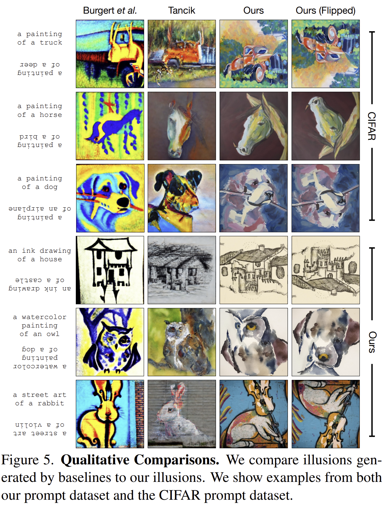

- 각 방법에서 생성된 100개의 sample 중 가장 좋은 결과 (sample)을 골라 정성적으로 비교했다. 
    - 본 방법은 두 view 모두에서 prompt와 잘 일치하며 baseline보다 전반적으로 더 높은 품질을 보인다. 

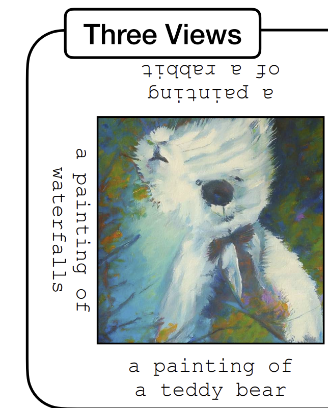

- 지금까지는 잘 생성된 sample을 보여준거고 이번엔 ramdom sample을 가지고 보여준다. 

$\textbf{Failures}$

- Independent Synthesis (first row)
    - 두 prompt를 결합하지 않고 각 prompt를 독립적으로 생성
    - 즉, 착시를 만들지 않고 두 개의 이미지를 따로 만든것처럼 보이는 결과가 나온다. 
    - 하지만 경험적으로 이러한 현상은 예상보다 드물게 발생한다. 
    - 이는 diffusion model이 contents를 이미지 중심에 배치하려는 경향 (bias)가 있기 떄문이라고 추정한다. 

- Noise Shift (second row)
    - 본 방법론이 성공하려면 noise statistics를 보존하는 view를 사용하는 것이 중요하다. 
    - 예를 들어, 유명한 드레스 착시 (파란색/검정색 vs 흰색/금색)을 재현하려고 시도했다. 
    - 이를 위해 간단한 white balancing view, 즉 픽셀 값을 일정 비율로 스케일하는 변환을 사용했다. 이 변환은 linear이긴 하지만 Guassian noise의 통계를 보존하지 않는다. 그 결과 이미지에 spot 형태의 artifact가 나타났다. 
    - 이는 모델이 스케일된 Gaussian noise를 signal로 잘못 해석하여 그 노이즈의 peak를 적극적으로 제거하려 하기 때문이라고 추정한다. 

- Correlated Noise 
    - 본 방법은 회전 변환을 지원하지만 회전 과정에서 노이즈 간 상관이 생기지 않도록 주의해야 한다. 예를 들어 bilinear sampling은 네 개의 인접 픽셀을 선형 결합하므로 노이즈 사이에 강한 상관관계를 만들어낸다. 
    - 따라서 겉보기에는 무해해 보이는 회전이라도 이러한 상관을 유발하면 샘플이 발산할 수 있다. 
    - 예시는 45도 bilinear 회전 사례이다. 

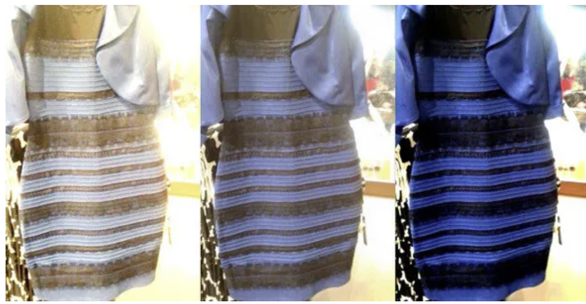

***

### <strong>Conclusion</strong>

***

### <strong>Question</strong>

<a href="">link</a>

> 인용구
