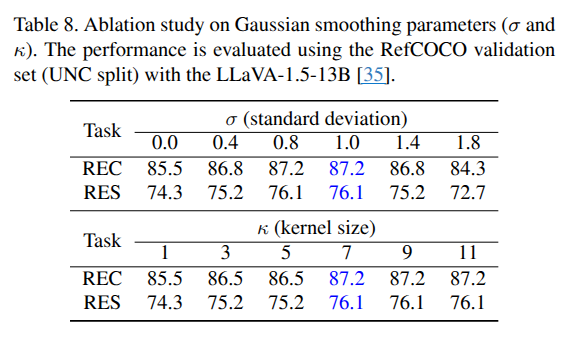

## Your Large Vision-Language Model Only Needs A Few Attention Heads For Visual Grounding
*CVPR(2025), 9 citation, Yonsei Universitiy, Review Data: 2025.10.01*

[Intro](#intro) 
[Related Work](#related-work) 
[Method](#method) 
[Experiment](#experiment) 
[Conclusion](#conclusion) 

> Core Idea

<strong>"test1"</strong> 

***

### <strong>Intro</strong>

$\textbf{이 주제의 정의 및 요구사항과 중요한 이유}$

- Visual grouding: localize the image region corresponding to a free-form text description.
- Large Vision-Language Models (LVLMs): 다음의 세 가지 주요 구성요소로 이루어진다.
  - 시각 인코더: 이미지를 분석하여 시각 토큰으로 변환
  - 어댑터: 시각 토큰을 LLM이 이해할 수 있는 언어 토큰 형식으로 변환 
  - LLM: 어댑터를 통해 전달된 시각적 토큰과 기존의 텍스트 입력 토큰을 결합하여 입력받아, 텍스트를 생성한다.

- LVLM 중 하나인 LLaVA model

$\textbf{이 주제의 문제점과 기존의 노력들}$

- Large Vision-Language Models (LVLMs)의 강력한 multimodal capabilities로 인해 visual grounding의 엄청난 발전이 있었지만, 필연적으로 명시적인 bounding box나 segmentation mask를 생성하기 위해 모델을 fine-tuning하거나 추가적인 model components를 필요로 한다. 

$\textbf{최근 노력들과 여전히 남아있는 문제들}$

- 기존의 ViT나 diffusion model은 관련된 text와 관련된 영역을 포착한다는 것을 쉽게 예상할 수 있다. 
  - 하지만, ViT나 DMs에서 관찰된 해석가능한 attention pattern과는 달리 LVLMs에서의 text-to-image attetion map에서는 sparse하고 significant noise를 함유하고 있다. 

- TS CAM (ViT)

- DAAM (DM)

- 이는 최신의 LVLM attention map이 정확하게 visual grounding에 대해 관련있는 객체를 포함하는 게 어렵다는 걸 의미한다. (Second column in below Figure)

$\textbf{본 논문에서 해결하고자 하는 문제와 어떻게 해결하는지, 그 결과들}$

- 하지만, average가 아닌 일부 attention head의 small subset이 정확한 text-image attention map을 제공가능하단는 것을 보여준다. (Third, Fourth column)

- 본 저자들은 a few attention heads in frozen LVLMs가 강력한 visual grounding capabilities를 가지고 있음을 발견했다. 
  - 일관되게 text semantics와 관련된 object location을 capture하는 이러한 head들을 본 논문에서는 localization head로 부른다.
  - 이 localization head를 이용하여 직관적이고 효율적인 training-free visual grounding framework를 제안한다. 
- 놀랍게도, 수천 개의 attention head 중 단 $3$ 개 만으로 경쟁력 있는 localization performance를 달성하기에 충분하다.
  - 이는, 기존의 fine-tuning이 필요한 LVLM-based visual grounding의 성능과의 비교이다. 

- 기존의 fine-tuning based method와 비교하여, 본 논문의 training-free framework가 추가적인 fine-tuning의 필요성을 제거하고 있음을 보여준다. 

- 기존의 fine-tuning based method: LISA ([SEG] token을 사용하여 SAM에게 전달하는 방식)

***

### <strong>Related Work</strong>

- Visual Grounding
  - Aims to identyfy the region in image based on a free-from natural language expression.
    - Referring Expression Comprehinsion (REC)와 Referring Expression Segmentation (RES)로 나눌 수가 있다.
      - REC: localizing a referred object in an image and generating a bounding box
      - RES: pixel-level segmentation mask 
- Application of LVLMs in Grounding Tasks
  - LVLM의 뛰어난 vision-language processing capabilities를 활용하여 visual grounding에서의 상당한 발전을 이뤘다. 
  - LVLM을 visual grounding task에 통합시키기 위해, training process에서 visual grounding dataset을 포함시키거나, localization information을 추출하기 위해 추가적인 components를 구현한다. 
    - LISA: [SEG] token을 mask embedding으로 도입하고 additional mask decoder를 사용하여 segmentation mask를 생성한다. 
    - F-LMM: frozen LVLMs의 attention weights를 이용하는데, 여저히 visual grounding datset에서의 mask refinement module에 대한 학습이 필요하다. 
    - 반면에 우리는 LVLMs을 바로 이용할 수 있는 training-free visual grounding method를 제안한다. 
- Training-Free Visual Grounding
  - 다양한 vision-language task들서 multimodal foundation model들의 높은 성능이 주어졌을 때, training-free visual grounding은 새로운 연구 방향으로 주어진다. 
  - 기존의 training-free method는 일반적으로 internal feature or attention maps from CLIP or DMs를 적용한다. 
  - 본 논문은 최초의 LVLM 기반 훈련 없는 visual grounding framework를 도입함으로써 이 연구 분야를 발전시켰다.

***

### <strong>Method</strong>

$\textbf{Notation}$

- LVLMS은 일반적으로 $3$개의 main components로 구성된다: vision encoder, projector, large language model 
- Image $X_v$는 vision encoder와 projector를 거쳐서 visual embedding $Z_v \in \mathbb{R}^{P^2 \times d}$.
  - $P^2$: number of flattened image tokens
  - $d$: hidden dimensions
- Text $X_t$는 token embedding $Z_t \in \mathbb{R}^{L\times d}$가 된다. 
  - $L$: number of tokens in the text
- The visual and textual embeddings are concatenated as $Z_0 = [Z_v; Z_t] \in \mathbb{R}^{(P^2 + L) \times d}$ and fed into the large lanuguage model (LLM)

$\textbf{Multi-Head Self-Attention}$

- $Z_0$는 LLM의 input으로 들어간다. (decoder blocks: multi-head self-attention and feed-forward)
- In layer $l$ and head $h$,

$\textbf{Investigation of Image-Text Interaction}$

- LLM decoding이 auto-regressive manner로 동작하는 걸 고려하면 final token의 정보는 전체 문장의 context를 담고 있다.
  - 따라서 last input text token $q_{txt}$는 문장 전체를 대표하는 쿼리로 작동한다고 본다. 
  - E.g., 아래 그림에서 "the pizza mouth."에서의 "."이 last token의 query vector로 사용된다. 
  - Image-text interaction을 조사하기 위해, 저자들은 key 중에서 image token과, query 중에서 $q_{txt}$ 간의 attention weight를 확인한다. 
  - 구체적으로, 위의 attention 수식을 수정하여 다음과 같이 표현한다. 

- 본 논문에서는 앞의 $P^2$ components에 대해서 집중한다: $a^{l,h}[1:P^2]$
  - 즉 text token $q_{txt}$과 각 image token과의 연관성을 확인한다. 
  - Self attention에서 내가 원하는 component들끼리의 연관성만을 확인하는 것.

$\textbf{Discovering Localization Heads}$

- <a href='https://arxiv.org/pdf/1906.04341'>최근 연구</a> 에서는 attention head가 구별되는 특징을 가지고 있고 특정 head가 text와 관련있는 localizer로써 제공될 가능성을 보여줬다. 
  - $2$가지 기준으로 이러한 head를 선택한다: sum and spatial entoropy 
  - 제안된 기준으로 텍스트 설명과 대응되는 객체를 포착하는 헤드를 성공적으로 식별할 수 있음을 검증한다. 
  - 특히, LLM의 초기 $2$개의 layer는 다른 layer들과는 다르게 동작하는 것으로 알려져 있어, 본 논문의 분석에서는 일관되게 제외된다. 
  - 다양한 LVLMs와 데이터셋을 대상으로 실험을 수행한다.

$\textit{Attention Sum}$

- 주로 전체 이미지에 집중하는 attention head를 식별하기 위해, 먼저 각 attention head 내에서 이미지 정보가 $q_{text}$와 얼마나 관련성 있는지를 정량화한다. 

$$ S_{img}^{l,h} = \Sigma_{i=1}^{P^2} a^{l,h}[i] $$

- RefCOCO training set에서 $1,000$ 개의 이미지를 랜덤으로 sampling하고 $1,000$ 장에 대해서 각각의 $S_{img}^{l,h}$ 값을 평균낸다.
  - Graph상에서 곡률이 가장 큰 값을 threshold로 설정한다. ($\tau$)
  - 대부분의 heas가 low $S_{img}^{l,h}$ 값을 보이고, 이는 상대적으로 적은 head만이 text-image interation에 상당한 영향을 준다는 것을 의미한다. 
  - 본 논문은 threshold를 설정하여 그 값보다 높은 head가 효율적으로 text-image interation에 참여한다고 간주한다. 

- Threshold에 대한 실험
  - Adaptive하게 설정하는 것이 아닌 고정된상수 값으로 top-3 localization head를 선정했을 때의 성능을 보여준다. 
  - 본 논문에서 설정한 maximum curvature가 다양한 모델에 대해서 robust하다는 것을 보여준다. 

$\textit{Spatial Entropy H}$

- Attention sum을 통해 전체 이미지와 text token $p_{text}$ 와 관계가 있는 head들을 선정할 수 있었다. 
- Object에 효과적으로 focusing하는 head들을 고려하기 위해선, 그 head들은 image에 대해 high attenntion sum을 가져야 할 뿐더러, object 주변에 구체적으로 집중해야한다.
  - Localization head를 구별하기 위해 각 attention map에서 얼마나 지역적으로 cluster를 형성하는지를 spatial entropy로 평가한다. 
  - Attention weight $a^{l,h}[1:P^2]$를 attention map $A^{l,h} \in \mathbb{R}^{P \times P}$로 reshape한다. 이는 이미지의 공간적인 정보를 유지하는 형태이다. 
  - 이후, attention map을 binarize하는데 map의 평균보다 높은 값은 $1$, 반대는 $0$이다. 
  - 각 8-neighbors로 cluster $C_i$를 구성한다. (주변에 $1$인 attention weight가 있으면 연결)

$\textbf{Finding Localization Heads via Criteria}$

- 위에서 정의한 $2$가지 기준으로 text와 연관된 object를 효율적으로 포착하는 head를 선정해야 한다.
- 먼저 RefCOCO training dataset $1000$장으로 Attention Sum의 threshold를 구하고, 그 값을 넘는 head들을 선정한다.
- 이후, 선정된 head들에 대해서 spatial entropy를 구하여 10-lowest spatial entropy head를 구한다.
- 이를 $1,000$장에 대해서 수행하여, 그 빈도수를 체크한다.

- 그렇게 최종적으로 선별된 head들의 selection frequency를 (a)에서 보여준다.
  - (b): rank별로 나열해서 그 head들이 포착하는 region을 pseudo mask로 표현하여 GT mask와 IoU를 계산한다. 이는 selection frequency로 선정된 head들이 실제 text semantic를 효과적으로 잘 포착하는 것과 연결된다. 
  - 이 semantic information을 강하게 포착하는 a small number of top-ranked head들을 이제 *localization head*라고 지칭한다. 
  - 본 논문에서는 이 경향성이 다양한 LVLMs에 대해서 나타나는 것을 관찰하고 이를 LVLMs의 고유한 특성이라고 주장한다.

- 이는 Appendix의 있는 다양한 LVLMs에서 "이미지와 연관있는 head를 sum으로 선정 $\rightarrow$ 그 중에서도 특정 object와 연관되는 head를 spatial entropy로 선정 $\rightarrow$ 이 $2$가지 기준으로 선정된 top-ranked head들은 text semantic와 연관이 있다" 의 경향성을 다양한 모델에 대해서 검증했다. 

$\textbf{Visual Grounding with Localization Heads}$

- 지금까지, $2$ 가지 기준으로 text와 연관된 localization head를 식별했다. 이를 바탕으로, localization heads를 사용하여 visual grounding task를 수행하는 간단하지만 효과적인 방법을 제시한다.
  - 본 논문에서는 localization head를 $3$개로 고정했다. 

- 각 localization head에 대해서 potential random noise를 최소화하기 위해 Gaussian smoothing을 적용한다. 이후,element-wise summation & binarized 로 최종적으로 map을 완성한다. 
  - Gaussian smoothing kernel size $k=7$, standard deviation $\sigma=1.0$
  - 이는 pseudo-mask로 간주하여 bounding box로 사용할 수 있고, 이를 SAM의 prompt로 제공하여 segmentation task를 수행할 수도 있다. 
  - Pseudo mask를 결정할때에는 convex hull algorithm을 사용했다. 

- Gaussian smoothing ablation study
  - Gaussian smoothing은 대부분의 경우에서 일관적으로 성능을 향상시킨다.

***

### <strong>Experiment</strong>

- Eval: Referring Expression Comprehension (REC) & Referring Expression Segmentation (RES)
- Dataset: RefCOCO, RefCOCO+, RefCOCOg and more challenging scenario (ReasonSeg)
  - ReasonSeg: requires complex reasoning or world knowledge
  - For REC task, using Acc@0.5 metric

- REC and RES task
  - 본 논문의 방법이 기존의 training-free method를 넘는 뛰어난 향상을 보였다. 
  - 놀랍게도, fine-tuned LVLMs와도 비교할만큼의 성능을 달성했다. 
    - REC task에 대해서는 Shikra와 Ferret와 동등한 성능을 달성한다. 같은 LLMs인 LLaVA 1.5를 사용함에도 fine-tuning based method와 동일하다. 
    - 비슷하게, RES task에서는 LISA와 동일하다. 
  - Visual grounding capability는 놀랍게도 1) 모델 크기가 커지거나, 2) 구조적으로나 training data의 발전이 있으면 향상된다. 
    - 1.3B to 13B
    - LLaVA to LLaVA-1.4
    - 이 관찰은 LVLM의 grounding ablility이 larger model과 more diverse training data로 더 향상될 수 있음을 보여준다. 

- 정성적 결과

$\textbf{Ablation studies}$

- Number of locaization heads
  - 모든 실험에서 localization head를 $3$개로 고정했었다. 
  - $1 \rightarrow 3$: 성능이 일반적으로 향상된다. 이는 top-3 heads가 더 정확한 localization을 제공하기위해 서로 보완한다는 걸 의미한다. 
  - 하지만 더 증가하면 더 나은 성능을 보장하지 못한다. 이는 추가적인 헤드가 noise를 도입하거나 중복된다는 걸 보여준다.  
  - 최적의 $k=3$이 다양한 LVLMs에 대해 일관되게 유지된다는 점에 주목할 필요가 있다. 

- Validation of Criteria and Selection methods for localization heads
  - $2$ 가지 기준으로 헤드를 선정했었는데, 이에 대한 검증이다. 각 기준으로 heads를 filtering (criteria)하고 최종적으로 selection을 하는데, 이때 Greedy의 경우 training data $1,000$ 개에 대해서 frequency selection을 하지 않고 한 sample에 대해 filtering된 head를 바로 localization으로 사용하는 것이다. ㄴ

$\textbf{Limitation}$

- 정확한 물체를 파악하는데 실패한 사례를 보여준다.
  - 오른쪽에서부터 세 번째 바나나를 식별해야 하는데 localization head는 세 번째와 네 번째 바나나들을 focusing하고 있다. 이는 정확한 물체의 위치를 파악하는데 LVLMs이 어려움을 겪고 있음을 시사한다. 이러한 결과를 통해, LVLM이 이 어디에 집중하는지를 투명하게 이해할 수 있게 해주는 localizaiton head의 잠재력을 보여준다.

***

### <strong>Conclusion</strong>

***

### <strong>Question</strong>

<a href="">link</a>

> 인용구
