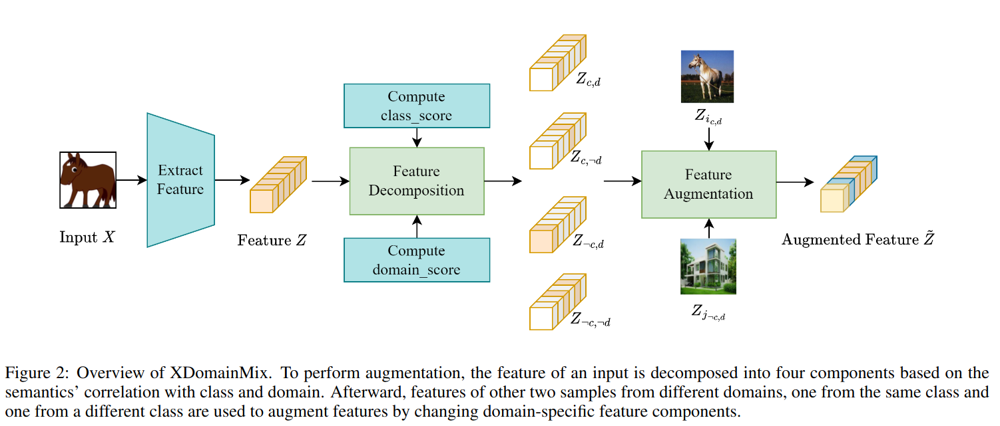

## XDomainMix: Cross-Domain Feature Augmentation for Domain Generalization
*IJCAI(2024), 0 citation, Singapore, Review Data: 2024.08.01*

[Intro](#intro) 
[Related Work](#related-work) 
[Method](#method) 
[Experiment](#experiment) 
[Conclusion](#conclusion) 

> Core Idea

<strong>"Although Domain of An Image is Changed to the Others, Can Predict Class (Invariant and Robust Model)"</strong> 

***

### <strong>Intro</strong>

$\textbf{이 주제의 정의 및 요구사항과 중요한 이유}$

- Deep learning은 일반적으로 training과 testing data가 i.i.d라고 가정한다. 
  - 같은 확률분포에서 독립적으로 sampling.
- 하지만, 이 가정은 종종 실제 환경에선 위반되고 다른 distribution을 다룰 때 성능이 떨어진다.  
- Domain generalization은 이러한 distribution shift에 강건한 model을 개발하는 것에 초점을 맞추고있다. 

$\textbf{이 주제의 문제점과 기존의 노력들}$

- 기존의 방법론들은 model robustness를 강화시키기 위해 domain에 대한 불변성을 배우는 데 초점을 맞췄다.
- Invariant predictor (강건한 model)를 학습하기 위해 data augmentation는 input space (아마 pixel-space를 의미하는 거 같다.)에서 광범위하게 사용된다. 
- Input space에서의 data augmentation은 diversity에 제한이 있는 반면, feature space에서의 augmentation은 다재다능하다. 

$\textbf{최근 노력들과 여전히 남아있는 문제들}$

- 그럼에도 불구하고 feature semantics는 거의 고려되지 않으며 기존의 feature augmentation 방법들은 증강된 특징의 다양성이 제한적이다. 

$\textbf{본 논문에서 해결하고자 하는 문제와 어떻게 해결하는지, 그 결과들}$

- 생성된 특징의 다양성 부족은 feature를 feature semantics에 따라 분해하도록 동기를 부여했다. 
- 본 논문은 feature를 calss-generic, class-specific, domain-generic, domain-specific 요소로 분해했다.
  - Class-specific: 특정 클래스에 고유한 정보를 담고 있다. 
  - Class-generic: 클래스 간에 공유되는 정보를 담고 있다. 
  - 동일한 클래스 내에서도 다른 도메인에서 온 샘플의 특징을 구별함을 발견하고 domain도 분해했다.
  - E.g., 같은 강아지여도 realistic, anime
- 본 논문은 XDomainMix를 제안
  - Cross domain feature augmentation method
  - Class-specific 구성 요소를 유지하면서 feature의 domain-specific 구성 요소를 변경한다. 이를 통해 **모델은 특정 도메인에 국한되지 않는 특징을 학습할 수 있게 되며, 도메인 간에 불변하는 특징을 기반으로 예측을 할 수 있게 된다.** 즉, 도메인이 달라져도 class에 대한 예측을 진행할 수 있다. 
  - Domain generalization을 달성하기 위해 invariant representations의 학습을 강조하면서 sample diversity를 증가시킬 수 있다. 
  - 정량적 분석은 우리의 특징 증강 접근 방식이 다른 도메인에서도 불변하는 효과적인 모델 학습을 촉진한다는 것을 나타낸다.

- 사전 학습된 auto-encoder를 사용하여 증강된 특징을 시각화한다. 재구성된 이미지에서, DSU의 증강된 특징은 원본 이미지 특징과 거의 동일하게 유지되는 반면, XDomainMix를 사용하여 얻은 특징에서 재구성된 이미지는 더 풍부한 다양성을 지니면서 클래스의 중요한 특징을 유지하는 것을 볼 수 있다.
  - 클래스는 유지하되 domain 특징을 조금 바꾼 결과?

***

### <strong>Related Work</strong>

- Invariance를 학습하는 기존의 domain generalization approaches 는 representation learning과 data augmentation으로 분류할 수 있다. 
- Feature augmentation은 더 많은 flexibility와 potential을 제공한다. 

***

### <strong>Method</strong>

- Source domain set (dataset): $\mathcal{D}_S = S_1, ..., S_N$
  - $S_i = (x_j^{(i)}, y_j^{(i)})|_{j=1}^{n_i}$
  - $x, y$: input and label 
- Unseen domains $\mathcal{D}_U$ 
- Source domain과 unssen domain은 class distribution은 다르지만 class label은 같은 space를 공유한다. 
- 이 논문의 목적은 domain이 변화되더라도 class label은 유지시키는 것이다. 

- Feature augmentation을 살펴보자
  - 두 이미지 모두 다른 domain에 존재한다.
  - Class-specific domain-specific인 $Z_{c,d}$와 class-generic domain-specific $Z_{\neq c, d}$ 를 제공
  - Input image의 class-specific domain-generic $Z_{c, \neq d}$ 및 class-generic domain-generic $Z_{\neq c, \neq d}$는 보존
  - 즉, Input image의 domain과는 상관없는 class 정보 + Input image의 class 및 domain과는 상관없는 정보 + Input image와 다른 domain이지만 같은 class의 정보 + Input image와 다른 domain이고 class에 상관없는 정보를 주입한다.
  - Domain은 다른 $2$ sample로 전이되면서 class 정보는 보존되는 효과

- $g: x \rightarrow y$ 
  - $g$는 $2$개로 분해할 수 있는데,
  - $f: x \rightarrow Z$, $f$는 feature extractor. $Z$는 latent feature space 
  - $c: Z \rightarrow y$, $y$는 output label 
  - 이상적으로, $f$는 domain invariant feature를 추출하면서 class-specific information은 유지해야 한다. 
    - 즉, domain적으로 공통적인 특성을 추출하면서 class 정보는 남아있어야 한다. 
  - Input의 feature는 $2$ 요소로 분해될 수 있다: class-specific and class-generic 
  - Class-specific component는 class label과 강력하게 연관되어 있는 feature semantics로 구성되어 있다. (class를 구별지을 수 있는)
  - 또한, feature는 domain-specific과 domain-generic components로도 분해될 수 있다. 
    - 이는 같은 class여도 domain이 다를 수 있기 때문이다. 
  - 본 논문은 이를 활용하여 feature extracor $f$로  총 $4$가지의 구별되는 요소로 feature를 분해한다.
    - Class-specific domain-specific $(Z_{c,d})$
    - Class-specific domain-generic $(Z_{c,\neq d})$
    - Class-generic domain-specific $(Z_{\neq c,d})$
    - Class-generic domain-generic $(Z_{\neq c,\neq d})$
  - 각 요소의 판단 기준은 각 클래스와 도메인의 예측에 대한 중요도로 판단한다.
    - E.g., feature가 class prediction에는 중요하지만 domain prediction에는 중요하지 않다면 class-specific domain-generic로 분류된다. 

- Feature vector의 한 channel $z_k$이 Class-specific인지 class-generic인지는 feature extractor로 뽑은 feature vector의 class importance score를 통해 결정한다. 
  - $c$: class classifier 
  - $v_c$: input image $x$의 ground truth class의 predicted logit (activation 통과 전)
  - $z_k$: $Z$의 $k$번째 dimension

- 마찬가지로 $z_k$가 domain-specific인지 domain-generic인지 결정하기 위해서 domain classifier $d$를 통해 domain socre를 구한다. 

- 각 $z_k$가 어떤 요소인지 판단하기 위해, 각 score에 mask를 곱한다. 이 mask는 미리 정한 threshold값을 넘으면 해당 component로 인정하기 위한 값이다. 

- 구체적으로, feature augmentation을 하는 방법은 다음과 같다. 
  - Random으로 sampling한 $2$개의 sample의 feature vector를 뽑는다. 이때, 하나는 class가 input image와 동일하고 다른 하나는 달라야 한다. 또한, $2$개의 sample은 input image의 domain과 달라야 한다. 
  - 그리고 일정 비율 섞는다.

***

### <strong>Experiment</strong>

***

### <strong>Conclusion</strong>

***

### <strong>Question</strong>

