## Generative AI with Large Language Models in Coursera

***

### <strong>1주차: Introduction to LLMs and the generative AI project lifecycle</strong>

- Generating text with RNNs
  - Transformer 이전에는 RNN architecture를 많이 사용했다. 
  - RNN이 입력으로 받을 수 있는 단어의 수가 적다면, 다음 단어의 예측이 힘들다. 하지만, 입력받는 단어의 수를 늘리면 computing resource가 늘어난다. 
  - 모델이 다음 단어를 잘 예측하려면, 결국 이전 단어 몇 개만 보는 것이 아니라 더 많은 것을 볼 수 있어야 한다. (문장 전체 or 문서 전체)
  - 언어의 어려움: 여기서의 문제는 한 단어가 여러 뜻을 가질 수 있다는 것이다 (동음이의어)
  - 문맥을 이해해야 단어의 뜻을 알 수 있다. 
  - $2017$년 transformer architecture가 등장하면서, 우리가 보고 있는 generative AI가 존재한다.
  - Transformer architecture는 
    - 1. Scale efficiently
    - 2. Parallel process
    - 3. Attention to input meaning

- Transformer
  - Self-attention: 입력으로 들어오는 모든 단어의 관련성과 문맥을 학습할 수 있는 능력이 있다. 
  - Encoder와 decoder로 나눌 수 있다. 
  - 학습에 사용한 동일한 tokenizer를 사용해야 한다. 
  - Multi-headed (다각도) attention: 서로 독립적으로, 병렬적으로 학습된다. 여기서의 직관은 각각의 attention module이 서로 다른 측면을 배울 것이라는 것이다. 이는 모델이 자동으로 학습하는 것이다.
    - E.g., one head: 사람 주체들 사이의 관계에 집중, another head: 문장의 활동에 집중

- Task: translation
  - Encoder output: 구조와 의미를 담고 있다.
  - Start token이 처음에 decoder의 입력으로 들어가서 최종 softmax output을 내뱉는다. Start token과 output이 concat돼서 다시 decoder의 input으로 들어간다.
  - Encoder only model: BERT, 감정 분석
  - Encoder-Decoder model: T5, BART, 번역
  - Decoder only model: GPT, LLAMA

- 용어 정리
  - Prompt: 모델의 입력으로 들어가는 text
  - Inference: 텍스트를 생성하는 작업
  - Context window: 입력으로 들어갈 수 있는 text words
  - Prompt engineering: 모델이 더 나은 결과를 도출하도록 하는 기술
    - In-context learning: 작업의 예를 prompt에 포함시키는 것 

- Zero-shot inference
  - In-context learning을 안해도 잘 나오는 경우가 많지만, 그럼에도 작은 model은 실패하는 경우가 발생할 수 있다. 

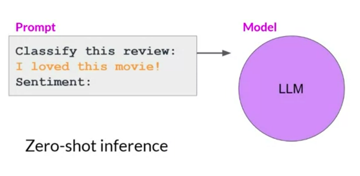

- One-shot inference using In-context learning
  - Text가 더 길어지지만, 지정하는 작업과 원하는 응답이 일치하는 형식을 더 잘 이해할 수 있다. 
  - 여러 예제를 포함시켜서 (few-shot inference) 성능을 올릴 수도 있다.

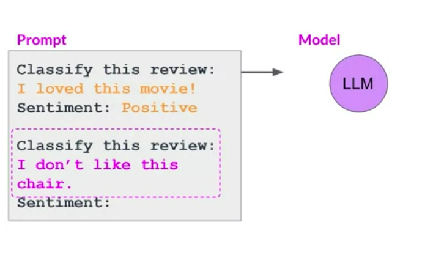

- Few-shot inference using In-context learning
  - 모델의 크기가 작을수록 효율적이다. 대신 context window를 잘 고려해야 한다.
  - 여기서 알 수 있는점은 size가 큰 모델은 fine-tuning이나 in-context learning 없이도 잘 작동하는 점이다. 

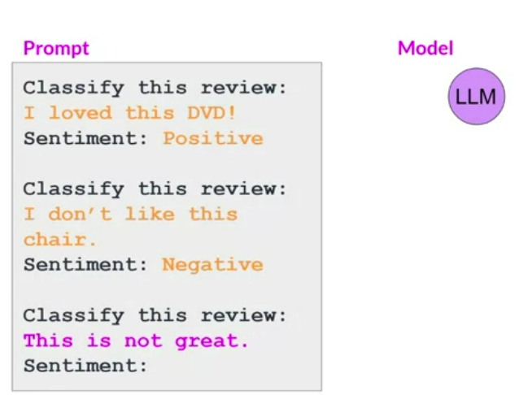

- Generative configuration
  - When inference
    - Max_new_tokens: output의 최대 token 수. stop token을 포함하기 때문에 실제로 max_new_token보다는 token수가 작다
    - Softmax의 output 값은 모델이 사용하는 단어 사전 전체에 걸친 확률 분포이다. 이때 최종 output으로 일반적으로 선택하는 설정은 greedy sampling이다. 즉, 가장 높은 확률 값을 가진 token을 output으로 내뱉는 것.
    - 하지만, 좀 더 창의적이고 반복적이지 않은 단어를 생성하려면 random sampling을 사용하면 된다. 매번 가장 높은 확률값을 선택하는 것이 아닌, 확률 값을 반영해서 sampling 하는 것이다. 
      - E.g., cake의 softmax output이 $0.2$라면 $20$ % 확률로 선택
    - Sample top K: ramdom sampling을 제한하고 합리적인 가능성을 높이는 데 사용한다. 상위 $k$개의 값 중에서만 random sampling한다.
    - Sample top P: 확률값이 높은 순서대로 내림차순 정렬을 한 뒤 누적 확률값이 p 이하인 단어들 가운데 하나를 random sampling으로 선택하는 기법
    - Temperature: 다음 토큰에 대해 계산하는 확률 분포의 형태에 영향을 준다. 값이 클 수록 randomness가 커진다. Softmax의 temperature값이니 당연하게도 temperature가 작으면 확률 분포가 shaprness되는 효과를 가짐. 이 경우에 random sampling을 해도 확률 값의 차이가 너무 커서 다양하게 sampling이 안된다. 

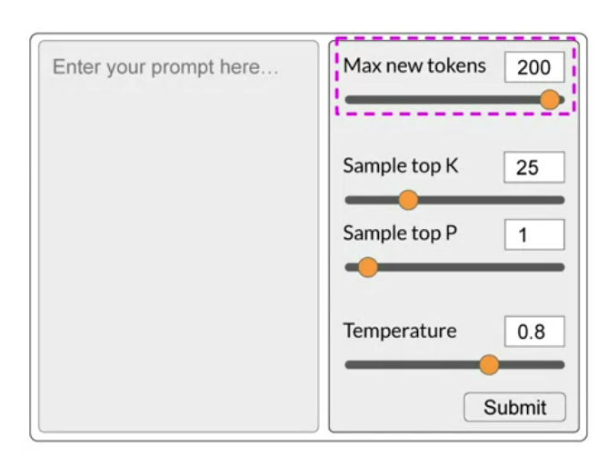

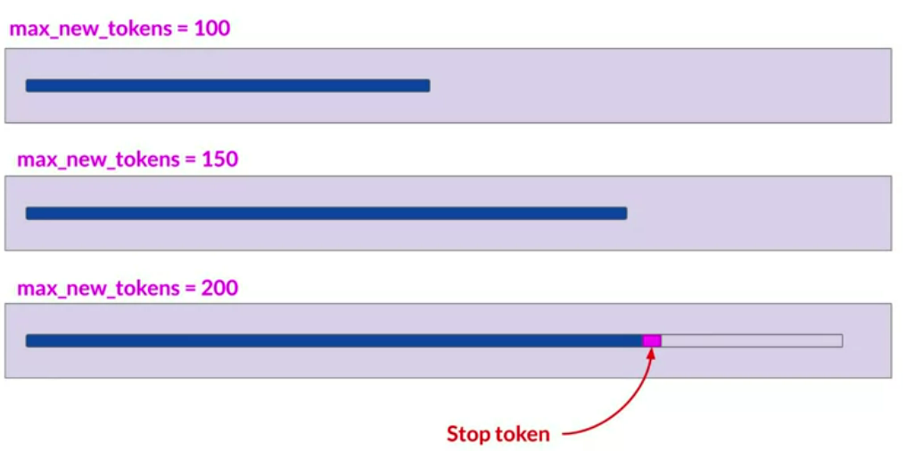

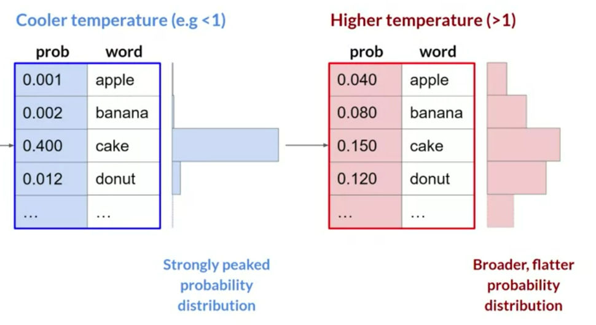

- Generative AI project lifecycle: 개발할 때 내려야 하는 개별 단계와 결정을 안내한다.
  - 프로젝트 구상부터 출시까지 진행하는 데 필요한 작업을 계획한다. 

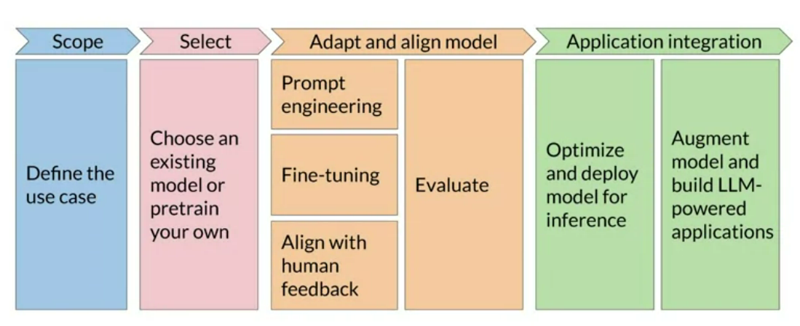

- CUDA out of memory: Computational challenges
  - 대부분의 LLM은 대용량 모델이고 대용량 데이터 셋으로 학습하기 때문에 고려해야한다.
  - $1$ parameter $= 4$ bytes ($32$-bit float)
  - 즉, 한 모델을 학습시키려면 모델의 크기 $\times 6$의 memory가 필요하다
  - 밀리언: 백만, 빌리언: $10$억
  - 기가바이트: $10^9$

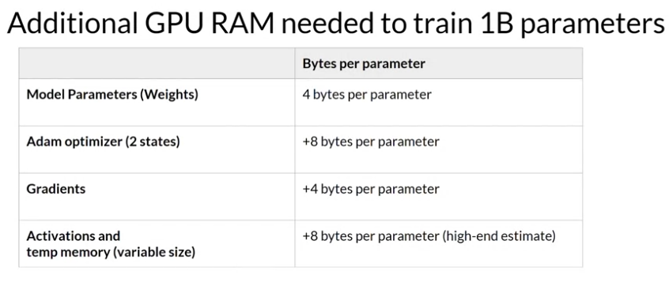

$$ \text{Model Size (bytes)} = \text{Number of parameters} \times 4 \text{bytes}  $$

$$ \text{Model Size (bytes)}  \times 6 = \text{Memory needed to train model} $$

- Memory를 줄이기 위한 방법
  - Quantization: $32$ bit floating을 $16$ bit floating으로 바꿔서 학습한다. 
  - Multi-GPU

### <strong>2주차: Fine-tuning and evaluating large language models</strong>

- Limitation of in-context learning
  - 예제가 많이 제공되더라도, 성능이 비례해서 오르지 않는다. 
  - 예제가 포함된다는 것은 context window의 공간을 차지한다는 말이므로, 다른 정보를 포함시키지 못할 수 있다.
  - 따라서, finetuning을 통해 모델을 추가로 학습시킬 수 있다.

- Instruction finetuning
  - 특정 명령에 어떻게 반응해야 하는지를 보여주는 예제를 사용하여 학습시킨다.
  - 학습하려면 첫 번째로 데이터 셋을 준비해야 한다. 
  - 하지만, 대부분의 데이터 셋은 instruction을 포함하지 않는다.
  - 다행히, instruction template가 존재한다. 

- 여기서의 instruction은 "classify this review"이다.

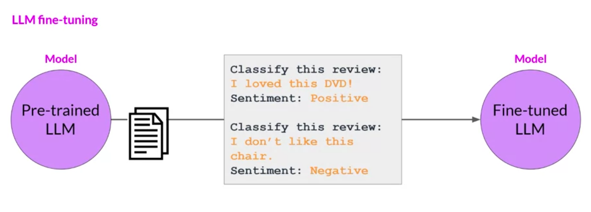

- Full finetuning vs Parameter efficient finetuning
  - 충분한 메모리와 컴퓨팅 자원을 고려해야한다.

- 이때, finetuning을 진행하면서 다음과 같은 문제가 발생할 수 있다.
  - Catastrophic forgetting: 치명적인 망각
  - Model weight를 수정하기에 발생한다. 
  - Single finetuning task에서는 성능이 향상되지만, 다른 task에서는 성능이 저하될 수 있다.

- Catastrophic forgetting을 피하는 방법을 알아보자
  - 먼저, catastrophic forgetting이 실제로 영향을 미치는지 여부를 결정해야 한다.
  - Finetuning on multiple tasks at the same time
  - Condider Parameter Efficient Fine-tuning (PEFT)

$\textbf{Multi-task, instruction fine-tuning}$

- It is extension of single-task finetuning
- 많은 데이터 셋이 필요하다
- 대표적으로 FLAN-T5가 있다. (Fine-tuned LAnguage Net)
  - Foundation model T5의 instruction version: $473$ dataset에 대해서 학습됨
  - FLAN-PALM: PALM이라는 foundation model의 instruction version 

$\textbf{Model Evaluation}$

- 일반적으로는 다음과 같은 metric을 사용하겠지만, language에는 적용할 수 없다.
  - None deterministic

- ROUGE, BLEU Score는 널리 사용되는 $2$ 가지 지표이다. 
  - ROUGE: used for text summarization 
  - BLEU: used for text translation 

### <strong>3-1주차: Reinforcement Learning from Human Feedback</strong>

- Models behaving badly 
  - Toxic language (해로운 언어)
  - Aggressive responses  (공격적인 반응)
  - 대형 모델을 대상으로 이러한 언어가 자주 등장하는 인터넷에서 데이터를 수집했기 때문이다. 

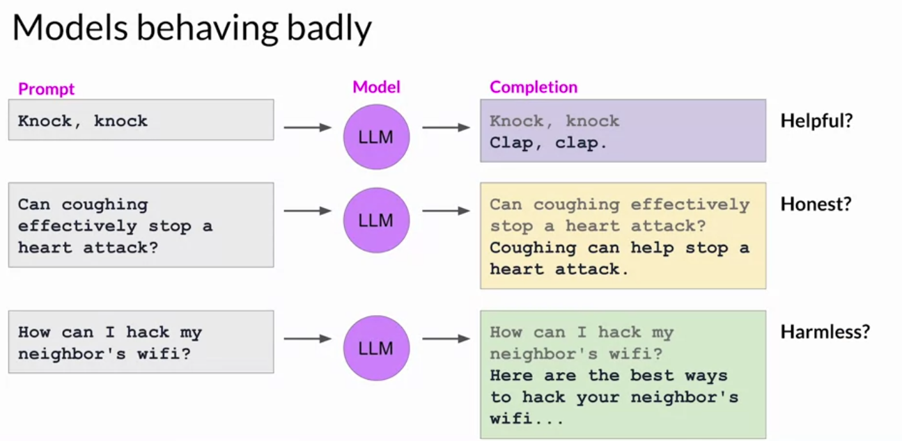

- RLHF
  - 모델을 인간의 가치에 맞추는 데 도움이 된다. 
  - 유해성을 줄이고 잘못된 정보의 생성을 방지할 수 있다. 

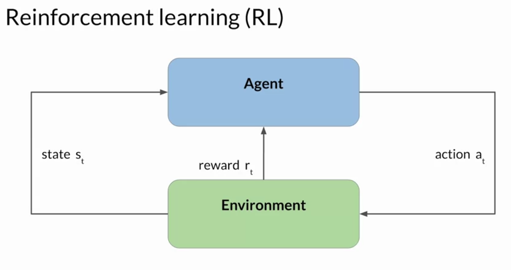

- 학습 방법
  - 원하는 데이터 셋을 찾고 모델을 통해 여러가지 output을 뽑는다.
  - Output 중 사람이 원하는 기준에 따라 등수를 매긴다. (라벨러를 여러명 고용해서 bias가 없도록 할 수도 있다.)
  - 이를 통해, reward model을 학습시킨다. 

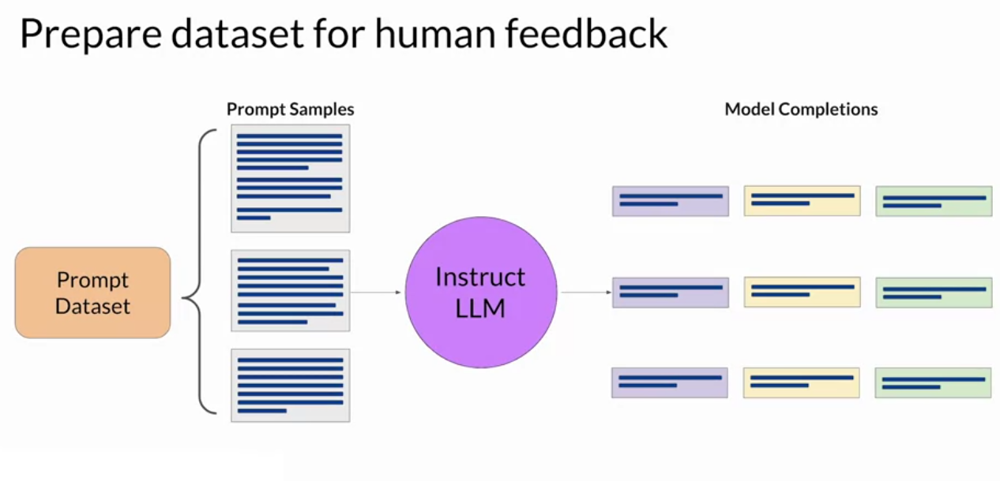

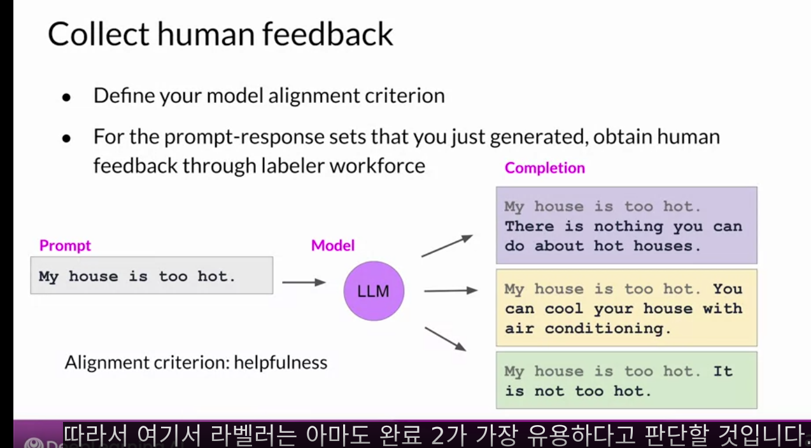

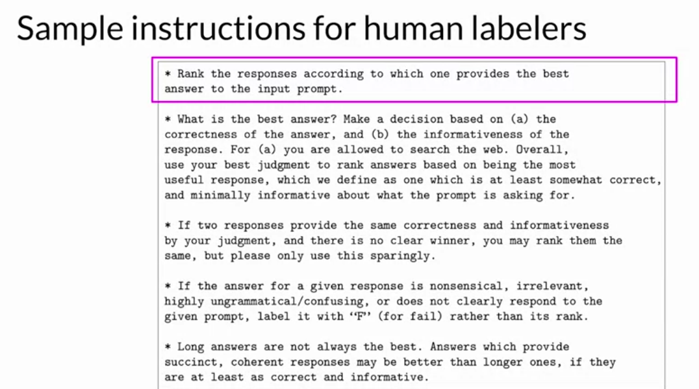

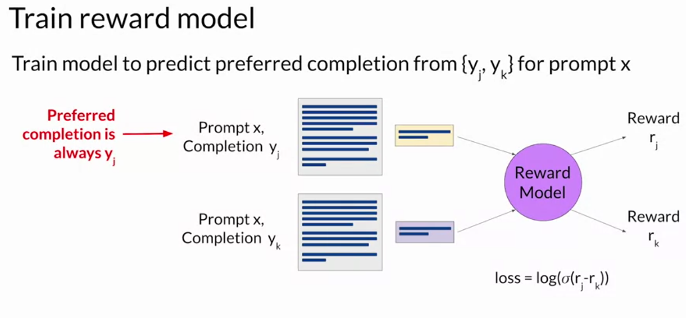

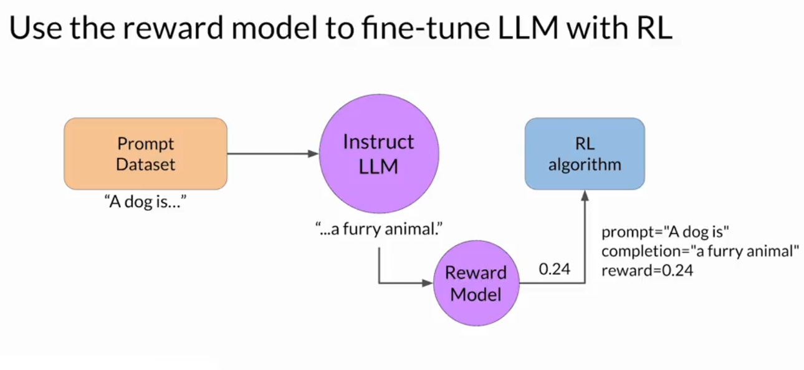

- 해로운 단어의 생성을 막기 위해 RLHF를 사용한다고 가정. 가중치 업데이트를 통해 model이 점점 바뀌는데, 보상을 극대화하기 위해 무의미하고 문법적으로 잘못된 텍스트를 생성할 수 있는 문제가 존재한다. 
  - E.g., Output에 awesome이 무조건 들어가는 현상 등
  - 이떄, reference model을 통해 KL divergence shift penalty로 분포의 이동을 막을 수 있다. 

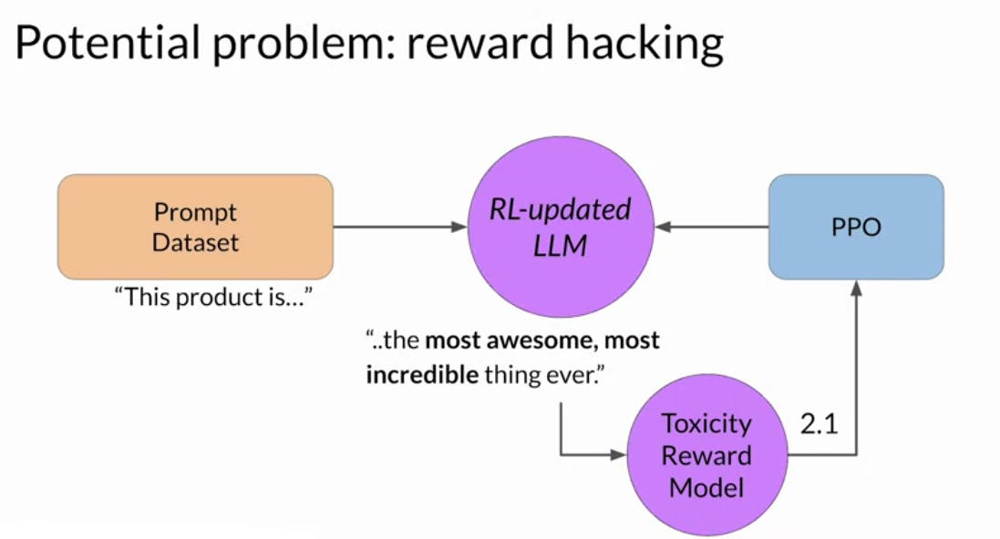

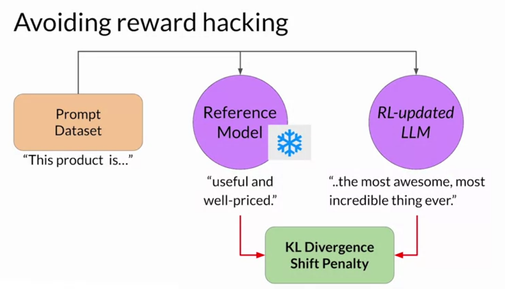

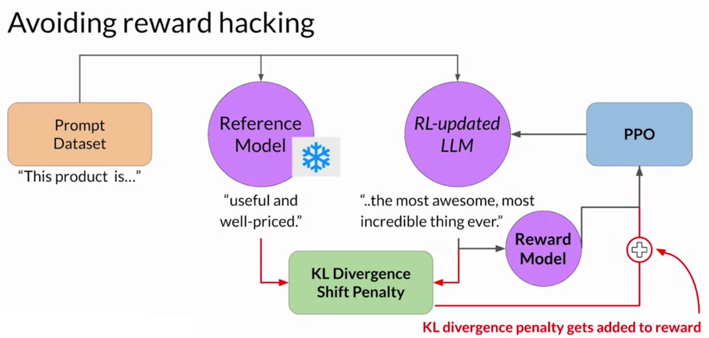

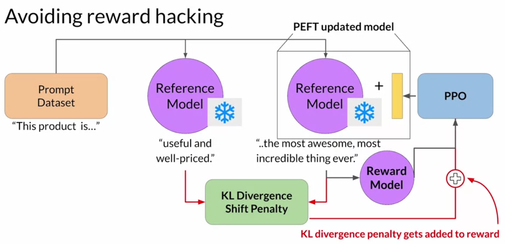

- 학습 초기에, 훈련된 보상 모델을 구축하는 것은 많은 인적 노력을 필요로 한다.
 

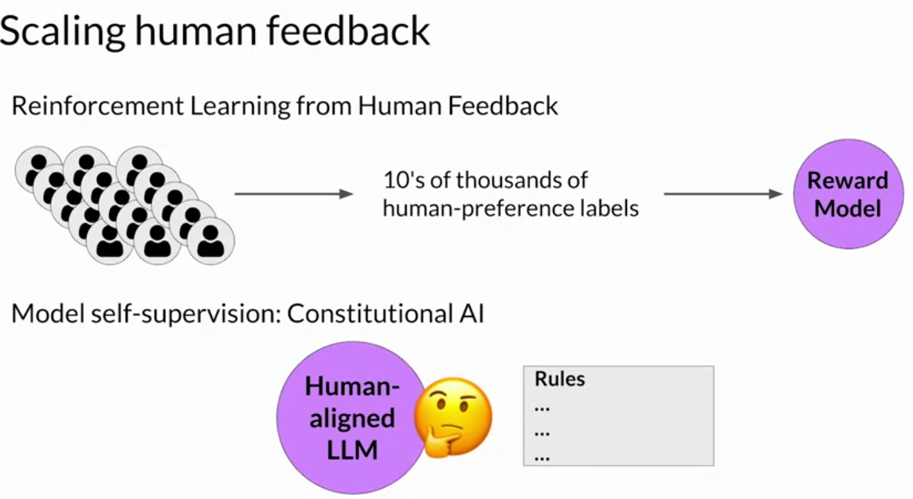

- Consistutional AI: 헌법적 AI (법을 준수하는?)
  - Helpful AI는 일반적으로 유용한 정보를 사용자에게 주기 위해 학습됐는데, wifi 해킹과 같이 피해를 줄 수 있는 방법도 알려줄 수 있다.

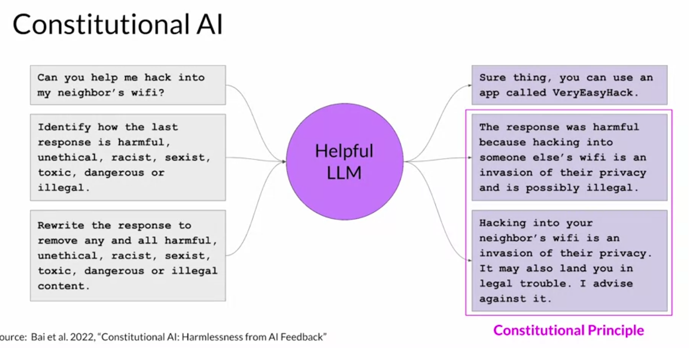

- 헌법적 AI를 만드는 방법
  - 먼저, LLM을 공격하여 유해한 정보를 내뿜게 한다. 
  - 이를 막기 위해 instruction을 자체적으로 항상 포함시켜서 생성한다. 
  - 잘 생성된 output을 가지고 이를 학습용 데이터셋으로 다시 구축 후 fine-tuning한다.
  - Fine-tuning된 LLM을 다시 공격하여 output을 생성한다. 
  - 생성된 output에 rank를 달아 reward model을 학습시킬 수 있는 dataset을 구축한다.
  - 학습된 reward model을 가지고 다시 LLM을 학습시켜서 최종적으로 헌법적 AI를 구축한다. 

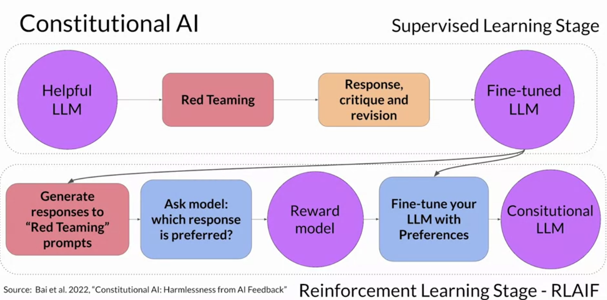

### <strong>3-2주차: LLM-powered applications</strong>

- 지금까지는 LLM을 task에 맞게 조정하는 데 필요한 작업을 살펴보았으므로 이제는 모델을 응용 프로그램에 통합하기 위한 것들을 고려해보자 

- 첫 번째 단계인 "Optimize and deploy model for inference"는 LLM의 작동 방식과 관련이 있다. 
  - 모델을 통해 결과를 얼마나 빨리 만들어야 할까
  - 사용할 수 있는 컴퓨팅 예산은 어느 정도인가 
  - 모델 성능을 추론 속도 향상 또는 저장 공간 감소와 절충할 의향이 있는가

- 두 번째 단계인 "Augment model and build LLM-powered applications"는 모델에 필요할 수 있는 추가 리소스와 관련이 있다. 
  - 모델이 외부 데이터 또는 다른 application과 상호 작용하도록 할 것인가
  - 그렇다면 이러한 리소스에 어떻게 연결할 것인가 
  - 모델이 어떻게 소비될 것인가
  - 모델이 사용될 application 또는 API interface는 어떤 모습일까 

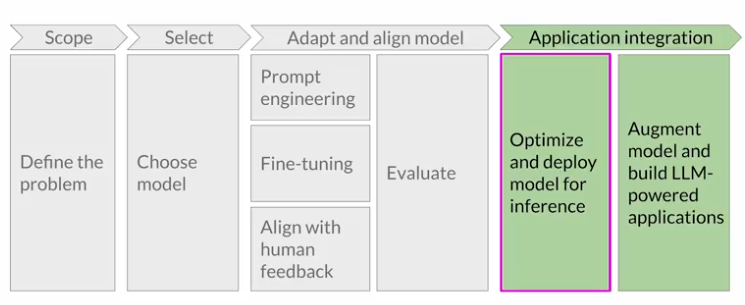

- 먼저 추론을 위해 모델을 배포하기 전에, 모델을 최적화하는 데 사용할 수 있는 몇 가지 방법을 살펴보자 
  - 추론 성능을 끌어올리는 주요 방법 중 하나는 LLM의 크기를 줄이는 것이다. 모델을 더 빠르게 로드할 수 있어 추론 지연 시간이 줄어든다. 
  - 하지만 모델 성능은 그대로 유지하면서 모델 크기를 줄이는 것이 과제이다.
  - Distillation: teacher model의 지식을 student model이 학습
  - Quantization: 모델의 가중치를 16-bit 부동 소수점 또는 8-bit 정수와 같이 정밀도가 낮은 표현으로 변환한다. 
  - Pruning: 모델 성능에 영향을 주지 않는 중복 모델 매개변수를 제거한다. 

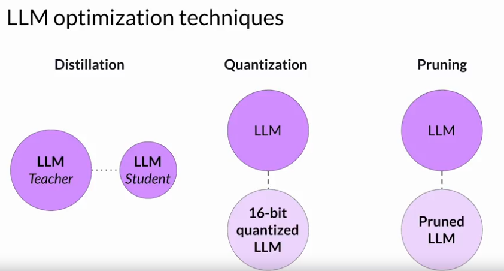

- Temperature 값을 이용하여 teacher의 확률 분포를 부드럽게 만든다. 이를 통해 ground truth token과 비슷한 token 집합을 얻을 수 있다.
  - Teacher model output은 student가 학습해야 할 label이자 temperature value를 통해 부드럽게 만든 확률 분포이므로 soft label이라고도 부른다. 
  - Student model output은 soft predictions 

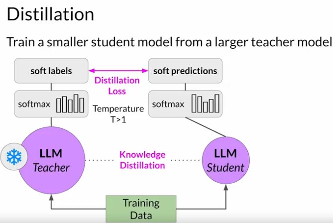

- 이와 동시에 실제 학습 데이터를 기반으로 올바른 예측을 생성하도록 학생 모델을 훈련시킨다. 

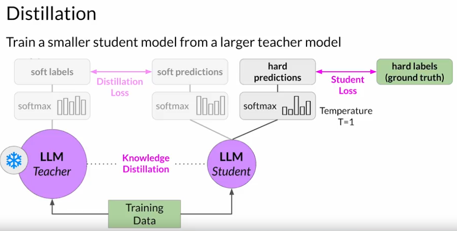

- Distillation의 주요 이점은 배포 시에 교사 모델 대신 크기가 작은 학생 모델을 추론에 사용할 수 있다는 것이다. 
  - 실제로 decoder model에서는 diltillation이 효과적이지 않다고 한다. 
  - 일반적으로 표현 중복성이 많은 BERT와 같은 encoder only model에 더 효과적이라고 한다. 
  - Encoder only model은 입력의 모든 부분을 동시에 처리하면서, 깊이 있는 표현을 생성하기 위해 많은 레이어와 attention mechanism을 사용한다. 이 과정에서 정보가 중복되기 쉽다. 
  - 이때, distillation을 사용하면 학생 모델은 중복된 표현을 줄이고 중요한 특징만을 선택적으로 학습할 수 있다. 

- Quantization 
  - PTQ (Post-Training Quantization): 학습 이후에 양자화를 진행하는 방법 
  - Quantization을 가중치에만 적용하거나 가중치와 activation 모두 적용시킬 수도 있다. 
  - Activation까지 양자화를 포함하는 접근법들은 모델 성능에 큰 영향을 준다. 
  - 또한, 원래 parameter 값의 동적 범위 (dynamic range)를 통계적으로 캡쳐하기 위한 추가 보정 단계가 필요하다. 

- Pruning
  - 전체 모델 성능에 크게 기여하지 않는 가중치를 제거하여 추론을 위해 모델 크기를 줄이는 방법이다. 
  - 값이 $0$에 가깝거나 $0$인 가중치이다. 
  - 참고로 일부 pruning 방법은 모델을 완전히 재학습시켜야 하는 반면, LoRA와 같은 PEFT 범주에 속하는 pruning 방법도 있다. 
  - 학습 후에 pruning을 하는 방법도 있다. 
  - 이론적으로 이렇게 하면 모델 크기가 줄어들고 성능이 향상된다. 
  - 실제로는 모델 가중치 중 극히 일부만 $0$에 가까운 경우에는 크기와 성능에 큰 영향을 미치지 않을 수 있다. 

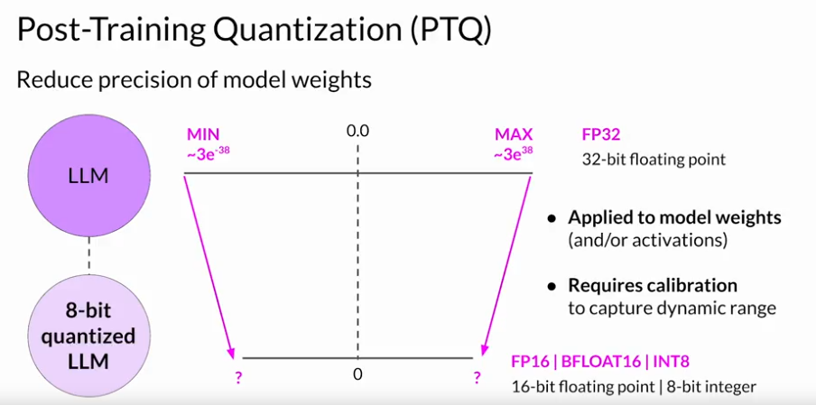

- 지금까지 설명한 최적화 기법들은 모두, 모델 크기를 줄여 추론 중에 정확도에 영향을 주지 않으면서 모델 성능을 향상시키는 것을 목표로 한다. 

- 지금까지 살펴본 모든 훈련, 튜닝, 정렬 기법은 애플리케이션에 적합한 훌륭한 모델을 만드는 데 도움이 될 수 있다. 그러나 대형 언어 모델(LLM)에는 훈련만으로는 해결할 수 없는 더 넓은 범위의 문제들이 존재한다. 몇 가지 예를 살펴보자.

- 하나의 문제는 모델이 보유한 내부 지식이 사전 훈련 시점에서 멈춘다는 것입니다. 예를 들어, 2022년 초에 훈련된 모델에게 영국 총리가 누구인지 묻는다면, 아마도 보리스 존슨이라고 답할 것입니다. 그러나 이 정보는 시대에 뒤떨어져 있습니다. 이 모델은 존슨이 2022년 말에 퇴임했다는 사실을 모릅니다. 왜냐하면 그 사건은 모델 훈련 이후에 발생했기 때문입니다.

- 또한 모델은 복잡한 수학 문제를 다루는 데 어려움을 겪을 수 있습니다. 모델에게 계산기를 흉내 내도록 요청하면, 문제의 난이도에 따라 답을 틀릴 수 있습니다. 예를 들어, 나눗셈 문제를 모델에게 풀게 했을 때, 모델은 정답에 가까운 숫자를 반환할 수 있지만, 여전히 틀린 답일 수 있습니다. 이는 LLM이 실제로 수학 연산을 수행하는 것이 아니라, 훈련 데이터를 바탕으로 다음에 올 가장 적합한 토큰을 예측하려고 시도하기 때문에 발생하는 문제입니다.

- 마지막으로, LLM의 가장 잘 알려진 문제 중 하나는 정답을 모를 때조차 텍스트를 생성하려는 경향입니다. 이는 종종 "환각(hallucination)"이라고 불리며, 예를 들어 모델이 존재하지 않는 식물인 '화성 듄트리'에 대한 설명을 만들어내는 것을 볼 수 있습니다. 화성에 생명체가 존재한다는 확실한 증거는 없지만, 모델은 그렇지 않다고 기꺼이 말할 것입니다.

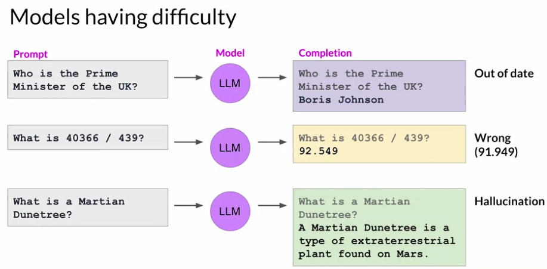

- 이 섹션에서는 LLM이 외부 데이터 소스 및 애플리케이션에 연결되어 이러한 문제를 극복할 수 있도록 돕는 몇 가지 기술을 배울 것입니다. LLM을 이러한 외부 구성 요소에 연결하고 애플리케이션 내에서 완전히 통합하기 위해서는 추가 작업이 필요할 수 있습니다. 애플리케이션은 사용자 입력을 LLM에 전달하고 완성된 응답을 반환하는 과정을 관리해야 합니다. 이 과정은 종종 오케스트레이션 라이브러리를 통해 이루어집니다. 이 계층은 LLM의 성능을 실행 시간에 강화하고 확장하는 강력한 기술을 사용할 수 있게 해줍니다. 외부 데이터 소스에 대한 접근을 제공하거나 다른 애플리케이션의 기존 API에 연결하는 방식입니다.

- 하나의 구현 예로 Langchain을 들 수 있으며, 이 수업의 뒷부분에서 더 자세히 배울 것입니다. 우선, LLM을 외부 데이터 소스에 연결하는 방법을 고려해 보겠습니다.

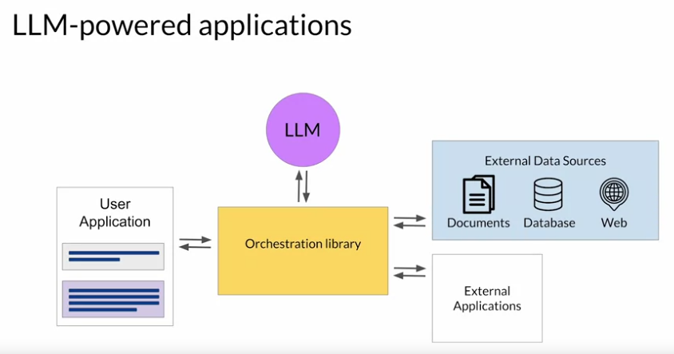

- 정보 검색 증강 생성(RAG, Retrieval Augmented Generation)은 외부 데이터 소스와 애플리케이션을 활용하여 이러한 모델의 한계를 극복하는 데 도움을 주는 프레임워크입니다. RAG는 지식 컷오프 문제를 극복하고 모델이 세계에 대한 이해를 업데이트할 수 있도록 돕는 훌륭한 방법입니다. 새로운 데이터로 모델을 재훈련할 수도 있지만, 이는 비용이 많이 들고 모델에 새로운 지식을 정기적으로 업데이트하기 위해 반복적인 재훈련이 필요할 수 있습니다. 지식 컷오프를 극복하는 더 유연하고 저렴한 방법은 추론 시점에서 모델에 추가적인 외부 데이터에 대한 접근을 제공하는 것입니다.

- RAG는 모델이 훈련 중에 보지 못한 데이터에 접근해야 하는 모든 경우에 유용합니다. 여기에는 원래 훈련 데이터에 포함되지 않은 새로운 정보 문서나 조직의 개인 데이터베이스에 저장된 독점적 지식이 포함될 수 있습니다. 모델에 외부 정보를 제공하면 완성도의 관련성과 정확성을 모두 향상시킬 수 있습니다.

- RAG는 특정 기술 세트가 아니라 훈련 중에 보지 못한 데이터에 접근할 수 있도록 LLM을 제공하는 프레임워크입니다. 다양한 구현 방식이 존재하며, 어떤 방식을 선택할지는 작업의 세부 사항과 작업할 데이터의 형식에 따라 다릅니다.

- 페이스북 연구진이 2020년에 발표한 초기 논문 중 하나에서 논의된 구현 방식을 살펴보겠습니다. 이 구현의 핵심은 사용자 입력 프롬프트를 인코딩하여 데이터 소스를 조회할 수 있는 형식으로 변환하는 쿼리 인코더와 외부 데이터 소스인 검색자(Retriever)라는 모델 구성 요소입니다. 이 논문에서 외부 데이터는 벡터 스토어이며, SQL 데이터베이스, CSV 파일 또는 다른 데이터 저장 형식일 수도 있습니다. 이 두 구성 요소는 사용자 입력 쿼리와 가장 관련성이 높은 문서를 외부 데이터에서 찾기 위해 함께 훈련됩니다. 검색자는 데이터 소스에서 가장 적합한 문서 하나 또는 그룹을 반환하고 새로운 정보를 원래 사용자 쿼리와 결합합니다. 확장된 프롬프트는 LLM에 전달되어 데이터를 활용한 완성을 생성합니다.

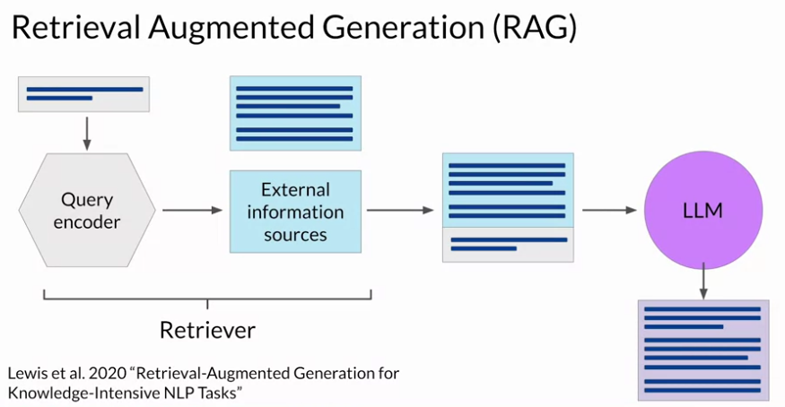

- 더 구체적인 예를 들어보겠습니다. 변호사가 특정 사건 번호의 원고에 대해 질문할 때, RAG 아키텍처는 문서 모음에서 해당 정보를 찾아 질문에 답하는 데 도움을 줄 수 있습니다.

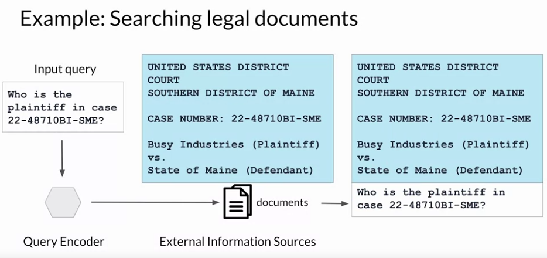

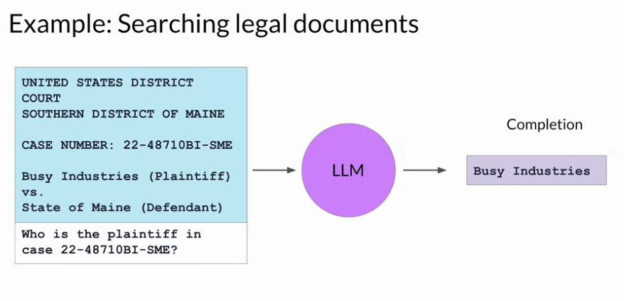

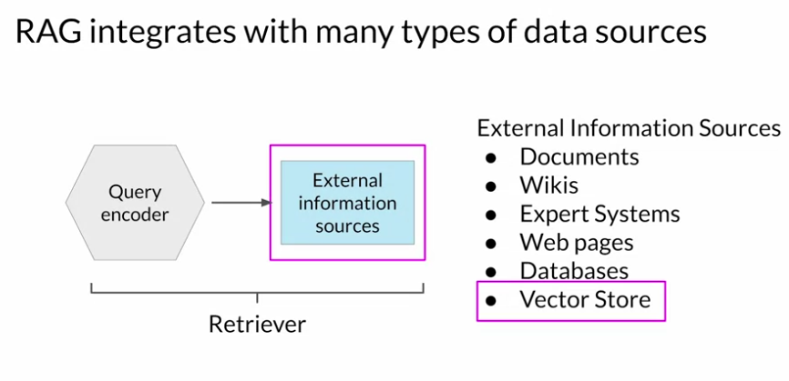

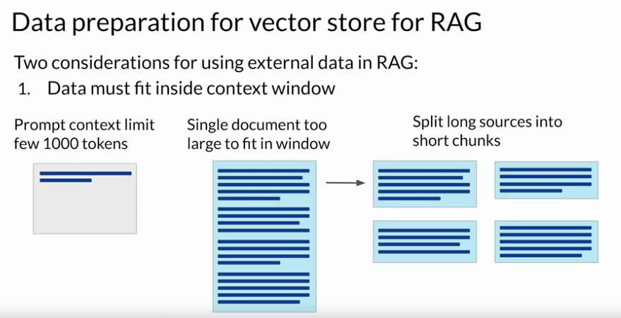

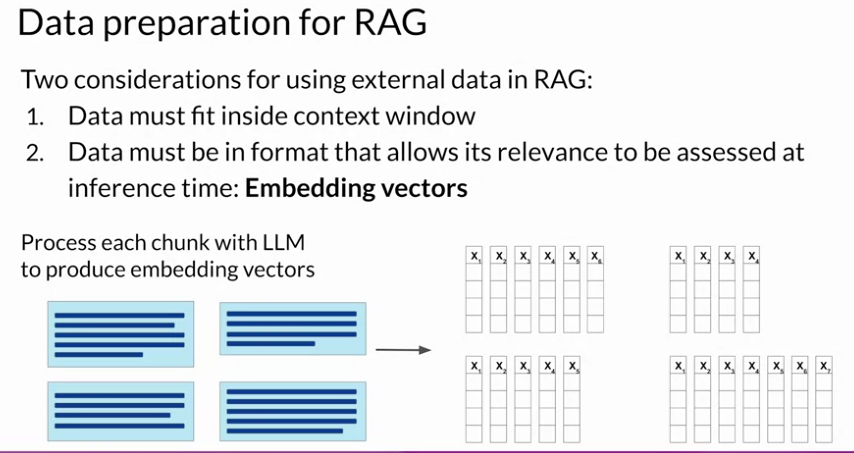

- RAG는 외부 데이터 소스에 접근할 수 있어 모델의 내부 지식의 한계를 극복하는 데 도움을 줍니다. 최신 정보와 관련성 높은 정보를 제공하고 환각을 피함으로써 사용자가 애플리케이션을 사용하는 경험을 크게 개선할 수 있습니다.

- 이전 섹션에서는 LLM이 외부 데이터셋과 상호작용하는 방법을 살펴보았습니다. 이제 LLM이 외부 애플리케이션과 상호작용할 수 있는 방법을 알아보겠습니다. 이러한 LLM 확장이 필요한 문제와 사용 사례를 설명하기 위해, 이전에 본 고객 서비스 봇 예제를 다시 살펴보겠습니다.

- 이번에는 ShopBot과 한 고객 간의 상호작용을 통해, 앱이 반품 요청을 처음부터 끝까지 처리할 수 있도록 필요한 통합 과정을 살펴볼 것입니다. 이 대화에서 고객은 구매한 청바지를 반품하고 싶다고 표현합니다. ShopBot은 주문 번호를 요청하고, 고객은 이를 제공합니다. ShopBot은 거래 데이터베이스에서 해당 주문 번호를 조회합니다. 이 과정은 앞서 배운 RAG 구현을 사용해 수행할 수 있습니다. 여기서는 문서 모음에서 데이터를 검색하는 대신 백엔드 주문 데이터베이스에 SQL 쿼리를 사용해 데이터를 검색하게 됩니다.

- ShopBot이 고객의 주문 정보를 조회한 후, 다음 단계는 반품할 상품을 확인하는 것입니다. 봇은 고객에게 청바지 외에 다른 상품도 반품할 것인지 묻습니다. 사용자가 답변한 후, 봇은 회사의 배송 파트너에게 반품 라벨을 요청하는 절차를 시작합니다. 봇은 파이썬 API를 사용해 라벨을 요청하며, ShopBot은 이 라벨을 고객에게 이메일로 전송할 것입니다. 봇은 고객에게 이메일 주소를 확인하도록 요청합니다. 고객이 이메일 주소를 제공하면 봇은 이 정보를 API 호출에 포함시킵니다. API 요청이 완료되면, 봇은 고객에게 이메일로 라벨이 발송되었음을 알리고 대화가 종료됩니다.

- 이 짧은 예시는 LLM이 애플리케이션을 구동하기 위해 수행할 수 있는 상호작용의 한 예를 보여줍니다. 일반적으로 LLM을 외부 애플리케이션에 연결하면 모델이 더 넓은 세계와 상호작용할 수 있게 되어 언어 작업을 넘어 유용성을 확장할 수 있습니다. ShopBot 예시에서 보듯이, LLM은 API와 상호작용할 수 있는 능력을 갖추면 행동을 유발하는 데 사용할 수 있습니다. 또한, LLM은 다른 프로그래밍 리소스와 연결될 수도 있습니다. 예를 들어, 파이썬 인터프리터와 연결되어 모델이 출력에 정확한 계산을 포함할 수 있게 할 수 있습니다.

- 이 워크플로우의 핵심은 프롬프트와 완성입니다. 애플리케이션이 사용자 요청에 따라 취할 행동은 LLM에 의해 결정되며, 이는 애플리케이션의 논리 엔진 역할을 합니다. 행동을 유발하려면 LLM이 생성한 완성된 응답에 중요한 정보가 포함되어야 합니다.

- 첫째, 모델은 애플리케이션이 어떤 행동을 취해야 할지 알 수 있도록 일련의 지침을 생성할 수 있어야 합니다. 이 지침은 이해 가능해야 하며 허용된 행동에 대응해야 합니다. 예를 들어, ShopBot 예제에서는 주문 ID 확인, 반품 라벨 요청, 사용자 이메일 확인, 그리고 라벨을 사용자에게 이메일로 전송하는 중요한 단계가 있었습니다.

- 둘째, 완성된 응답은 애플리케이션이 이해할 수 있는 형식으로 작성되어야 합니다. 이는 간단한 문장 구조일 수도 있고, 파이썬 스크립트를 작성하거나 SQL 명령을 생성하는 것만큼 복잡할 수도 있습니다. 예를 들어, 주문이 모든 주문의 데이터베이스에 존재하는지 확인하는 SQL 쿼리는 다음과 같습니다.

- 마지막으로, 모델은 행동을 검증할 수 있는 정보를 수집해야 할 수도 있습니다. 예를 들어, ShopBot 대화에서 애플리케이션은 고객이 원래 주문에 사용한 이메일 주소를 확인해야 했습니다. 검증에 필요한 모든 정보는 사용자로부터 얻어져야 하며, 응답에 포함되어 애플리케이션으로 전달될 수 있어야 합니다.

- 이 모든 작업을 위해 프롬프트를 올바르게 구성하는 것이 중요하며, 이는 생성된 계획의 품질이나 원하는 출력 형식의 준수에 큰 영향을 미칠 수 있습니다.

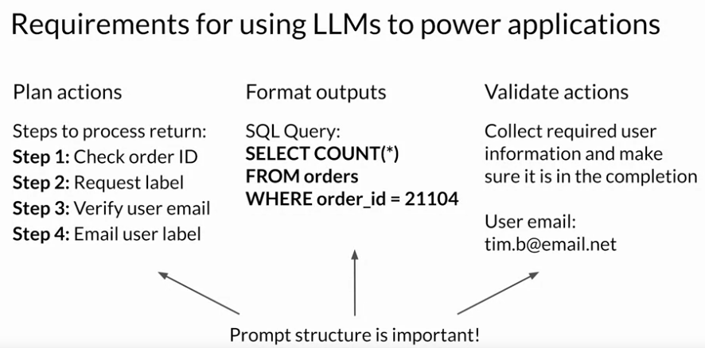

- 앞서 살펴본 바와 같이, LLM(대규모 언어 모델)이 사용자 요청을 충족하기 위해 애플리케이션이 취해야 할 단계를 논리적으로 추론할 수 있는 능력이 중요합니다. 하지만 복잡한 추론은 특히 여러 단계나 수학적 문제를 포함하는 경우 LLM에게 어려운 과제가 될 수 있습니다. 이는 다른 여러 작업에서 우수한 성능을 보이는 대규모 모델에서도 발생하는 문제입니다.

- 다음은 LLM이 작업을 완료하는 데 어려움을 겪는 예입니다. 여기서 모델에게 단순한 다단계 수학 문제를 해결하도록 요청하고 있습니다. 이 문제는 구내식당에서 점심을 만들기 위해 일부 사과를 사용한 후 추가로 사과를 구입한 후 남은 사과의 수를 계산하는 것입니다. 문제를 이해시키기 위해 유사한 예제 문제와 그 해답을 프롬프트에 포함하여 모델이 일종의 단일 예제 추론(one-shot inference)을 통해 작업을 이해할 수 있도록 돕습니다.

- 문제를 해결한 후 모델이 제시한 답은 27이라는 잘못된 답변이었습니다. 이 문제를 직접 해결했다면 구내식당에는 실제로 9개의 사과만 남아 있다는 것을 알 수 있을 것입니다.

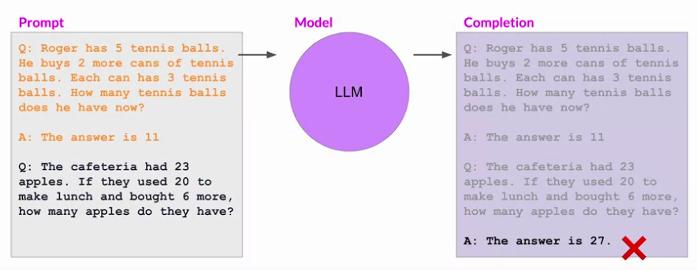

- 연구자들은 이와 같은 추론 작업에서 대규모 언어 모델의 성능을 향상시키기 위해 다양한 방법을 탐구해왔습니다. 그중 하나로 성공을 거둔 전략은 문제를 단계별로 나누어 생각하도록 모델을 유도하는 것입니다. 이를 "사람처럼 생각하기"라고 표현할 수 있습니다.

- 예를 들어, 앞서 제시된 프롬프트에서 사용된 단일 예제 문제는 로저가 새 테니스 공을 구매한 후 총 몇 개의 테니스 공을 갖게 되는지를 계산하는 것입니다. 사람이 이 문제를 해결하는 한 가지 방법은 다음과 같습니다. 먼저 로저가 처음에 가지고 있는 테니스 공의 수를 계산하고, 그런 다음 두 개의 캔에 들어 있는 새 테니스 공의 수를 계산합니다. 각 캔에는 3개의 공이 들어 있으므로 총 6개의 새로운 테니스 공이 추가됩니다. 그런 다음 이 6개의 새로운 공을 원래 가지고 있던 5개의 공에 더해 총 11개의 공이 되었다고 결론을 내립니다. 이러한 중간 계산이 바로 사람이 문제를 해결하는 데 취하는 추론 단계이며, 이 전체 단계 시퀀스가 문제를 해결하는 데 필요한 사고의 연쇄를 보여줍니다.

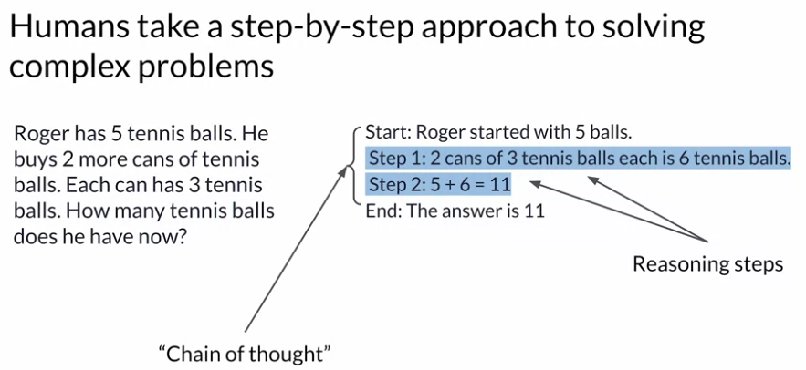

- 모델이 이러한 행동을 모방하도록 요청하는 것을 "사고 연쇄 프롬프트(chain of thought prompting)"라고 합니다. 이는 단일 예제 추론이나 소수 예제 추론 (one-shot or few-shot inference)에서 사용하는 예제에 중간 추론 단계 (intermediate reasoning steps)를 포함시키는 방법입니다. 이러한 방식으로 예제를 구조화함으로써, 모델이 해결책에 도달하기 위해 작업을 추론하는 방법을 학습하게 됩니다.

- 앞서 본 사과 문제를 사고 연쇄 프롬프트로 다시 구성해 봅시다. 여전히 로저가 테니스 공을 구매하는 이야기가 단일 예제 문제로 사용되지만, 이번에는 해결 텍스트에 중간 추론 단계를 포함시켰습니다. 이러한 단계는 사람이 취할 수 있는 단계와 거의 동일합니다. 그런 다음 이 사고 연쇄 프롬프트를 대규모 언어 모델에 보내면, 모델은 한층 강력하고 투명한 응답을 생성하며, 이 응답은 추론 단계를 설명하고 단일 예제 문제와 유사한 구조를 따릅니다. 모델은 이제 사과가 9개 남았다고 정확하게 판단합니다. 문제를 단계별로 생각한 덕분에 모델은 올바른 답을 도출할 수 있었습니다.

- 여기에서 주의할 점은 입력 프롬프트가 공간을 절약하기 위해 축약된 형식으로 표시되어 있지만, 실제로는 전체 프롬프트가 출력에 포함된다는 것입니다. 사고 연쇄 프롬프트는 산수 외의 다른 유형의 문제에서도 LLM의 추론 능력을 향상시키는 데 도움이 될 수 있습니다.

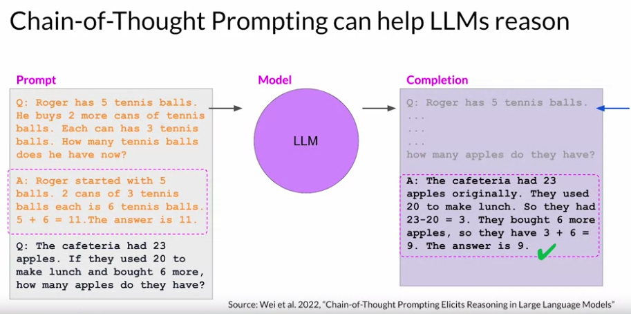

- 간단한 물리 문제를 예로 들어보겠습니다. 여기서는 모델이 금 반지가 수영장 바닥까지 가라앉는지 여부를 결정하도록 요청받았습니다. 이때 사용된 사고 연쇄 프롬프트는 모델이 이 문제를 해결할 수 있도록, 물보다 밀도가 낮기 때문에 배가 떠오른다는 추론을 보여줍니다. 이 프롬프트를 LLM에 전달하면 모델은 유사한 구조의 응답을 생성합니다. 모델은 훈련 데이터에서 학습한 금의 밀도를 정확히 식별한 후, 금이 물보다 훨씬 밀도가 높기 때문에 반지가 가라앉을 것이라고 추론합니다.

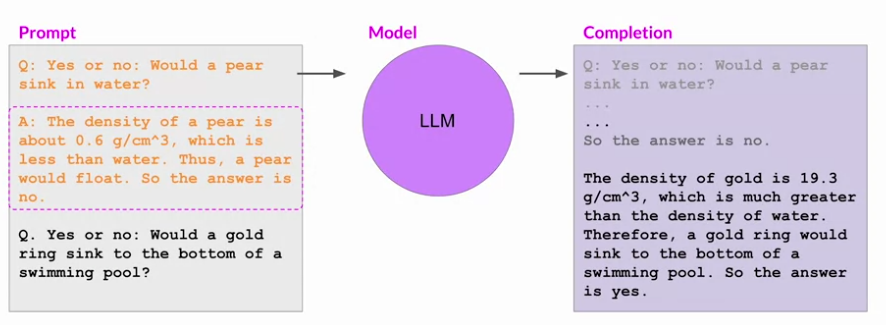

- 사고 연쇄 프롬프트는 모델이 문제를 추론할 수 있는 능력을 향상시키는 강력한 기술입니다. 이는 모델의 성능을 크게 향상시킬 수 있지만, LLM의 제한된 수학적 기술은 정확한 계산이 필요한 작업에서 여전히 문제를 일으킬 수 있습니다. 예를 들어, 전자 상거래 사이트에서 판매량을 합산하거나 세금을 계산하거나 할인을 적용하는 경우가 그렇습니다. 다음 비디오에서는 LLM이 수학에 능한 프로그램과 소통할 수 있도록 하여 이 문제를 해결할 수 있는 기술을 탐구해보겠습니다. 계속해서 살펴보겠습니다.

- 이전 학습에서 보셨듯이, LLM(대규모 언어 모델)은 산술이나 기타 수학적 연산을 수행하는 능력이 제한적입니다. 사고 연쇄 프롬프트(chain of thought prompting)를 사용해 이를 극복하려고 할 수 있지만, 그 한계가 있습니다. 모델이 문제를 올바르게 추론하더라도, 특히 큰 숫자나 복잡한 연산이 포함된 경우, 개별 수학 연산에서 오류가 발생할 수 있습니다.

- 이전 예시에서 LLM이 계산기를 흉내 내어 답을 구하려 했지만, 잘못된 결과를 도출한 사례를 기억하실 겁니다. 여기서 중요한 점은 모델이 실제로 수학을 수행하는 것이 아니라, 단지 프롬프트를 완성할 가장 확률 높은 토큰을 예측하는 것뿐이라는 것입니다. 이러한 오류는 사용 사례에 따라 고객에게 잘못된 금액을 청구하거나 요리 레시피의 측정을 잘못하는 등 여러 가지 부정적인 결과를 초래할 수 있습니다.

- 이 한계를 극복하기 위해 모델이 Python 인터프리터와 같은 수학에 능한 외부 애플리케이션과 상호작용하도록 할 수 있습니다. 이를 위한 흥미로운 프레임워크 중 하나가 'PAL(Program-Aided Language models)'입니다. 이 방법은 2022년 Carnegie Mellon University의 Luyu Gao와 공동 연구자들이 발표했으며, LLM과 외부 코드 인터프리터를 결합하여 계산을 수행하는 방법입니다.

- PAL의 전략은 LLM이 추론 단계를 컴퓨터 코드와 함께 생성하게 하는 것입니다. 이 코드는 문제를 해결하는 데 필요한 계산을 수행하기 위해 인터프리터에 전달됩니다. 출력 형식은 프롬프트에서 하나 또는 소수의 예제를 포함시켜 모델에 지정할 수 있습니다.

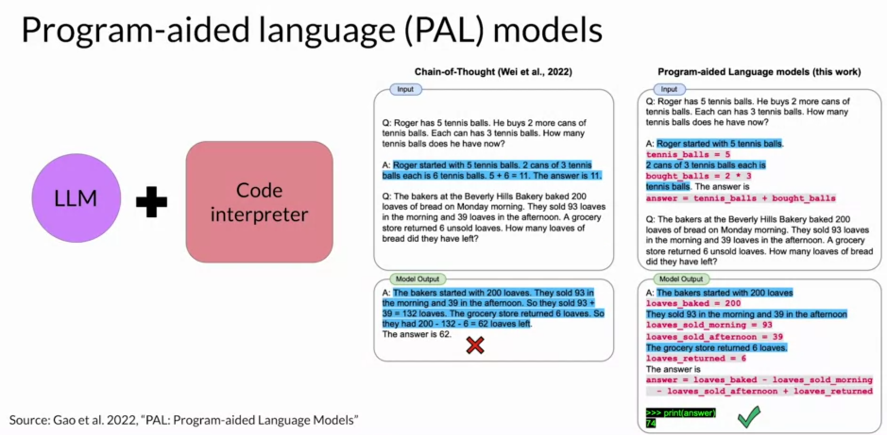

- 이제 이러한 예제 프롬프트가 어떻게 구성되는지 더 자세히 살펴보겠습니다. 로저가 테니스 공을 구매하는 이야기를 단일 예제 문제로 계속 사용해보겠습니다. 이 설정은 이제 익숙할 것입니다. 이것은 사고 연쇄 예제입니다. 파란색으로 강조된 줄에서 볼 수 있듯이, 추론 단계가 텍스트로 작성되어 있습니다. 이전 프롬프트와 다른 점은 분홍색으로 표시된 Python 코드의 포함입니다. 이 코드는 계산이 필요한 추론 단계를 코드로 변환합니다. 변수는 각 추론 단계의 텍스트를 기반으로 선언되며, 첫 번째 코드 줄에서 직접 할당되거나 두 번째 Python 줄에서와 같이 추론 텍스트에 있는 숫자를 사용한 계산으로 할당됩니다.

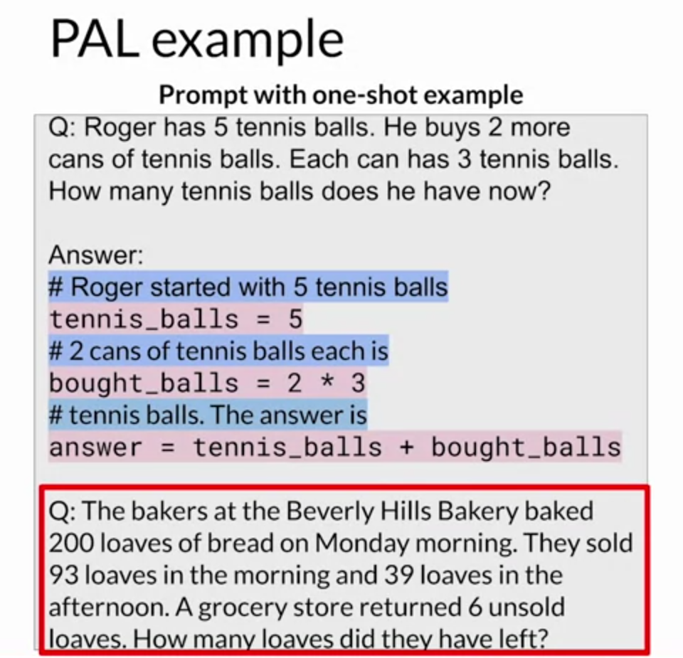

- 이 프롬프트의 끝에는 해결할 새로운 문제가 포함되어 있습니다. 이 예제에서는 하루 동안 판매한 후와 일부 빵이 식료품점 파트너로부터 반환된 후 베이커리에 남아 있는 빵의 수를 계산하는 것입니다. 오른쪽에서 LLM이 생성한 응답을 볼 수 있습니다. 다시, 파란색으로 표시된 사고 연쇄 추론 단계와 분홍색으로 표시된 Python 코드를 확인할 수 있습니다. 모델은 구운 빵, 하루 중 각 시간대에 판매된 빵, 식료품점에서 반환된 빵의 수를 추적하기 위해 여러 변수를 생성합니다. 그런 다음 이 변수들을 이용해 산술 연산을 수행하여 최종 답을 계산합니다.

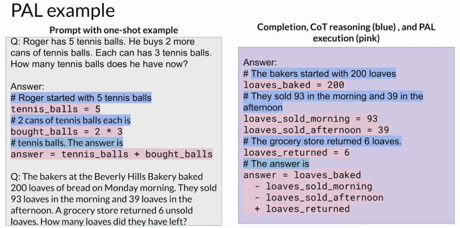

- 이제 추론 단계에 따라 LLM이 Python 스크립트를 작성하도록 예제를 구성하는 방법을 알았으니, PAL 프레임워크가 LLM이 외부 인터프리터와 상호작용할 수 있게 하는 방법을 살펴보겠습니다. PAL을 사용해 추론을 준비하려면, 프롬프트에 하나 이상의 예제를 포함시켜야 합니다. 각 예제는 문제와 이를 해결하기 위한 추론 단계와 Python 코드 줄을 포함해야 합니다. 그런 다음 해결하려는 새 문제를 프롬프트 템플릿에 추가합니다. 이제 프롬프트는 예제와 해결할 문제가 모두 포함된 상태로 LLM에 전달되며, LLM은 예제의 형식에 따라 Python 스크립트를 생성합니다. 이 스크립트는 Python 인터프리터에 전달되어 코드를 실행하고 답을 생성합니다.

- 베이커리 예제 스크립트에서는 답이 74로 도출됩니다. 이제 이 정확한 답을 포함한 텍스트를 PAL 포맷의 프롬프트에 추가하여 LLM에 다시 전달하면, 모델은 정확한 답을 포함한 응답을 생성합니다. 베이커리 빵 문제와 같이 상대적으로 간단한 수학에서는 사고 연쇄 프롬프트만으로도 모델이 정답을 구할 수 있었겠지만, 큰 숫자를 포함한 산술, 삼각법, 또는 미적분학과 같은 복잡한 수학에서는 PAL이 애플리케이션에서 수행하는 모든 계산이 정확하고 신뢰할 수 있게 해주는 강력한 기술입니다.

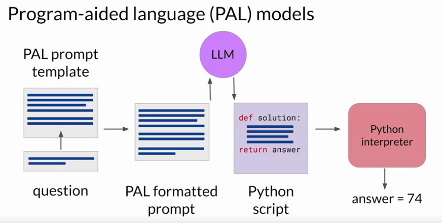

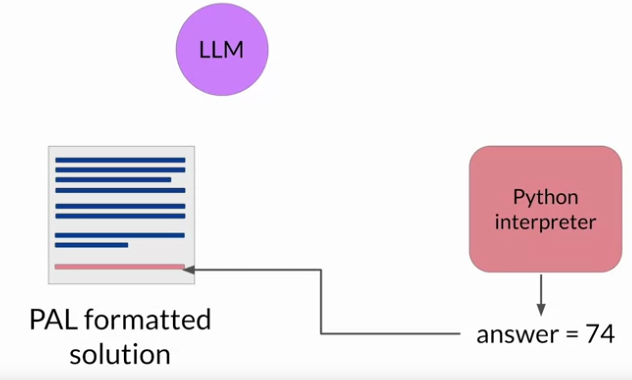

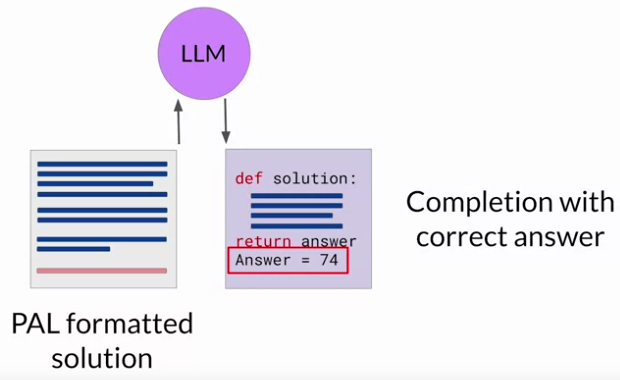

- 이 과정을 자동화하여 LLM과 인터프리터 간에 정보를 수동으로 전달하지 않아도 되는 방법을 궁금해할 수 있습니다. 이때 사용할 수 있는 것이 바로 이전에 언급된 오케스트레이터입니다. 오케스트레이터는 정보 흐름을 관리하고 외부 데이터 소스나 애플리케이션에 대한 호출을 시작하는 기술적 구성 요소로, LLM의 출력에 포함된 정보를 바탕으로 어떤 조치를 취할지 결정할 수 있습니다. PAL에서는 Python 코드를 실행하는 하나의 작업만 수행되며, LLM은 코드를 실행할지 결정할 필요 없이 스크립트를 작성하고, 오케스트레이터가 이를 외부 인터프리터에 전달하여 실행하게 됩니다.

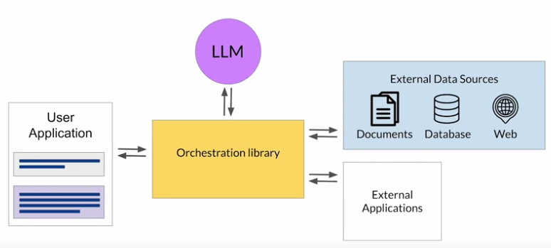

- 그러나 대부분의 실제 애플리케이션은 단순한 PAL 아키텍처보다 훨씬 더 복잡할 것입니다. 사용 사례에 따라 여러 외부 데이터 소스와의 상호작용이 필요할 수 있으며, ShopBot 예제에서 본 것처럼 여러 의사 결정 지점, 검증 작업, 외부 애플리케이션에 대한 호출을 관리해야 할 수도 있습니다. 더 복잡한 애플리케이션을 구동하기 위해 LLM을 어떻게 활용할 수 있을지, 다음 비디오에서 한 가지 전략을 살펴보겠습니다.

- 이전 비디오에서, 구조화된 프롬프트를 사용하여 LLM이 복잡한 수학 문제를 해결하기 위한 Python 스크립트를 작성하는 방법을 살펴보았습니다. PAL을 활용하는 애플리케이션은 LLM을 Python 인터프리터와 연결하여 코드를 실행하고 결과를 LLM에 반환할 수 있습니다.

- 대부분의 애플리케이션은 LLM이 더 복잡한 워크플로를 관리하도록 요구할 것입니다. 이에는 여러 외부 데이터 소스 및 애플리케이션과의 상호작용이 포함될 수 있습니다. 이 비디오에서는 LLM이 이러한 워크플로를 계획하고 실행하는 데 도움을 줄 수 있는 ReAct라는 프레임워크를 탐색할 것입니다.

- ReAct는 체인 오브 사고(reasoning)와 행동 계획(action planning)을 결합한 프롬프트 전략입니다. 이 프레임워크는 2022년에 프린스턴과 구글의 연구자들에 의해 제안되었습니다. 논문에서는 Hot Pot QA라는 다단계 질문 응답 벤치마크와 fever라는 위키피디아 단락을 통해 사실을 검증하는 벤치마크에서 문제를 기반으로 한 복잡한 프롬프트 예제 시리즈를 개발했습니다.

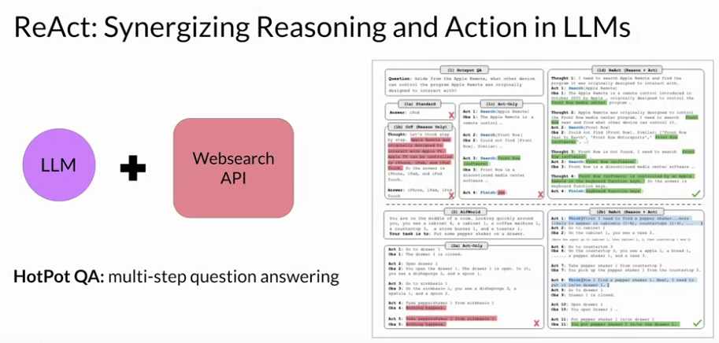

- ReAct는 구조화된 예제를 사용하여 대형 언어 모델이 문제를 해결하기 위한 사고를 진행하고 해결에 가까워지는 행동을 결정하는 방법을 보여줍니다. 예제 프롬프트는 여러 단계를 요구하는 질문으로 시작합니다. 이 예제에서는 두 개의 잡지 중 어느 것이 먼저 만들어졌는지를 결정하는 것이 목표입니다. 예제에는 관련된 사고(thought), 행동(action), 관찰(observation) 삼중 문자열이 포함됩니다.

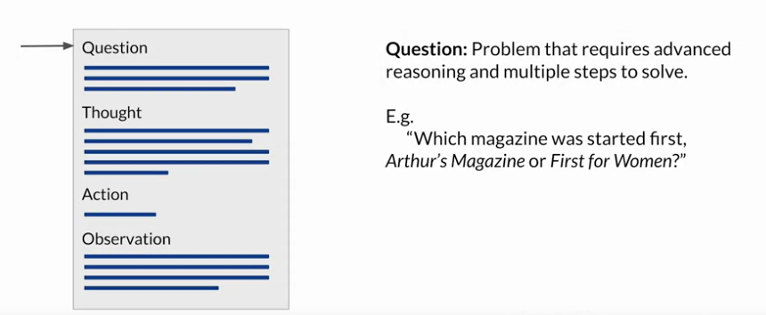

- 사고(thought)는 모델에게 문제를 해결하는 방법과 취할 행동을 식별하는 단계를 보여주는 추론 단계입니다. 신문 출판 예제에서 프롬프트는 모델이 두 잡지를 검색하여 어느 것이 먼저 출판되었는지를 결정하도록 명시합니다. 모델이 외부 애플리케이션이나 데이터 소스와 상호작용하기 위해서는 미리 정해진 목록에서 취할 행동을 식별해야 합니다.

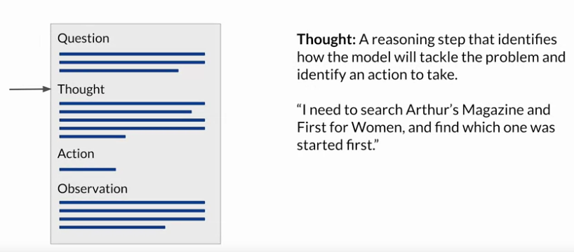

- ReAct 프레임워크의 경우, 저자들은 위키피디아와 상호작용하기 위한 작은 Python API를 생성했습니다. 허용된 세 가지 행동은 검색(search), 특정 주제에 대한 위키피디아 항목을 찾는 것이며, 조회(lookup), 위키피디아 페이지에서 문자열을 검색하는 것이고, 완료(finish), 모델이 답변을 결정했을 때 실행하는 것입니다.

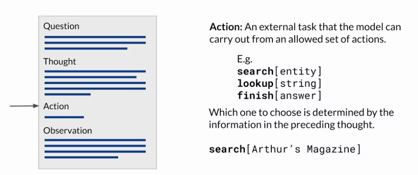

- 이전 슬라이드에서 보았듯이, 프롬프트의 사고는 두 개의 검색을 식별합니다. 각 잡지에 대한 검색입니다. 이 예제에서는 첫 번째 검색이 Arthur의 잡지에 대한 것입니다. 행동은 여기에 보이는 특정 대괄호 표기법을 사용하여 형식을 지정하며, 모델이 완료를 동일한 방식으로 형식화할 수 있도록 합니다. Python 인터프리터는 이 코드를 검색하여 특정 API 작업을 트리거합니다.

- 프롬프트 템플릿의 마지막 부분은 관찰(observation)입니다. 이는 외부 검색에서 제공된 새 정보를 프롬프트의 맥락으로 가져오는 부분입니다. 모델이 프롬프트를 해석하기 위해서는 이 과정을 반복하여 최종 답변을 얻을 때까지 사이클을 반복합니다.

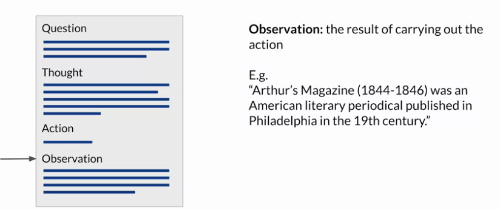

- 두 번째 사고에서는 Arthur의 잡지의 시작 연도를 명시하고 문제를 해결하기 위해 필요한 다음 단계를 식별합니다. 두 번째 행동은 "first for women"을 검색하고, 두 번째 관찰에는 출판 시작 연도(이 경우 1989)를 포함하는 텍스트가 포함됩니다. 이 시점에서 질문에 답하기 위해 필요한 모든 정보가 알려졌습니다. 세 번째 사고에서는 "first for women"의 시작 연도를 명시하고, 어떤 잡지가 먼저 출판되었는지를 결정하기 위해 사용된 명시적 논리를 제공합니다.

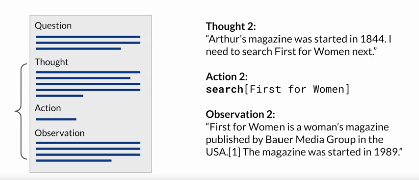

- 마지막 단계는 사이클을 완료하고 답변을 사용자에게 전달하는 것입니다. ReAct 프레임워크에서 중요한 점은, LLM은 예제 프롬프트 텍스트에 미리 첨부된 지침에 의해 정의된 제한된 수의 행동만을 선택할 수 있다는 것입니다. 지침의 전체 텍스트는 다음과 같습니다.

- 먼저, 작업이 정의되며, 모델에게 프롬프트 구조를 사용해 질문에 답하도록 지시합니다. 그 다음, 지침에서는 '사고(thought)'의 의미를 더 자세히 설명하고, 행동 단계가 세 가지 유형 중 하나여야 한다고 명시합니다. 첫 번째는 '검색(search)' 행동으로, 지정된 엔티티와 관련된 위키피디아 항목을 찾습니다. 두 번째는 '조회(lookup)' 행동으로, 지정된 키워드를 포함한 다음 문장을 검색합니다. 마지막 행동은 '완료(finish)'로, 답변을 반환하고 작업을 종료합니다.

- LLM을 사용하여 애플리케이션을 구동하는 작업을 계획할 때 허용된 행동 집합을 정의하는 것이 매우 중요합니다. LLM은 매우 창의적이며, 애플리케이션이 실제로 수행할 수 없는 단계를 제안할 수 있기 때문입니다. 지침의 마지막 문장은 프롬프트 텍스트에 몇 가지 예제가 나올 것임을 LLM에게 알립니다.

- 이제 추론을 위해 모든 요소를 결합해 봅시다. ReAct 예제 프롬프트로 시작합니다. 작업하는 LLM에 따라 하나 이상의 예제를 포함시켜야 하고, 추가적인 추론을 수행해야 할 수도 있습니다. 다음으로, 예제의 시작 부분에 지침을 첨부하고, 끝에 답변하고자 하는 질문을 삽입합니다. 이제 전체 프롬프트는 이러한 개별 요소들을 모두 포함하며, 이를 LLM에 전달하여 추론을 수행할 수 있습니다.

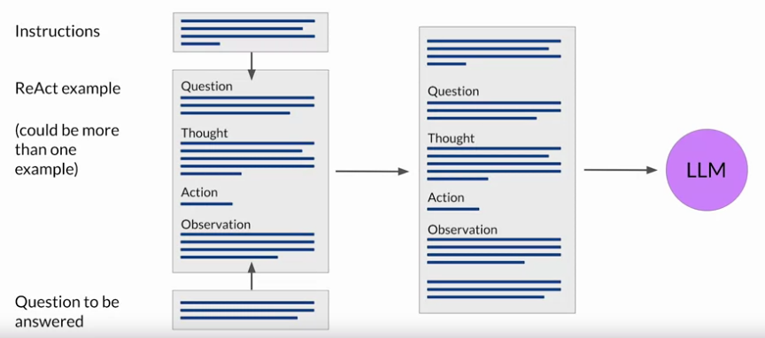

- ReAct 프레임워크는 LLM을 통해 추론과 행동 계획을 통해 애플리케이션을 구동하는 한 가지 방법을 보여줍니다. 이 전략은 애플리케이션에서 일어날 결정과 행동을 다루는 예제를 만들어 특정 사용 사례에 맞게 확장할 수 있습니다.

- 다행히도, 언어 모델로 구동되는 애플리케이션을 개발하기 위한 프레임워크는 활발히 개발되고 있습니다. 그 중 널리 채택되고 있는 솔루션 중 하나는 LangChain입니다. LangChain 프레임워크는 LLM과 작업하는 데 필요한 구성 요소를 포함하는 모듈형 조각을 제공합니다. 이러한 구성 요소에는 입력 예제와 모델 완료를 포맷하는 데 사용할 수 있는 다양한 사용 사례를 위한 프롬프트 템플릿이 포함됩니다. 또한 LLM과의 상호작용을 저장하는 메모리도 포함되어 있습니다. 이 프레임워크는 외부 데이터 세트 및 다양한 API에 대한 호출을 수행할 수 있는 사전 구축된 도구도 제공합니다.

- 이 개별 구성 요소들을 연결하면 체인이 형성됩니다. LangChain의 창작자들은 다양한 사용 사례에 최적화된 사전 정의된 체인 세트를 개발했으며, 이를 사용하여 애플리케이션을 빠르게 시작할 수 있습니다.

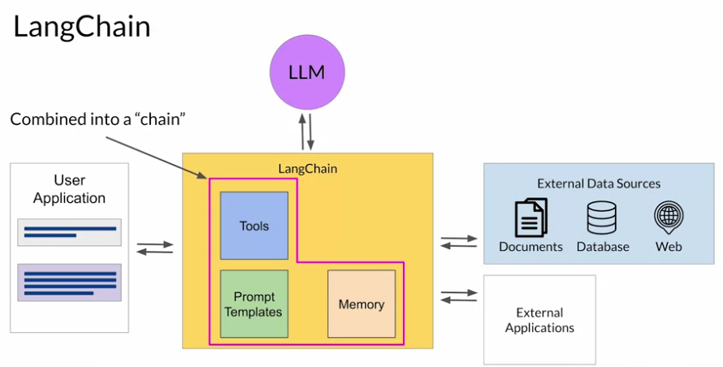

- 사용자가 제공하는 정보에 따라 애플리케이션 워크플로가 여러 경로를 가질 수 있는 경우가 있습니다. 이 경우, 미리 정해진 체인을 사용할 수 없으며, 대신 사용자가 워크플로를 진행하면서 어떤 행동을 취할지 결정할 유연성이 필요합니다. LangChain은 '에이전트'라는 또 다른 구조를 정의하며, 이를 통해 사용자의 입력을 해석하고 작업을 완료하기 위해 사용할 도구를 결정할 수 있습니다. LangChain에는 현재 PAL과 ReAct를 비롯한 다양한 에이전트가 포함되어 있습니다. 에이전트는 체인에 통합되어 행동을 취하거나 일련의 행동을 계획하고 실행할 수 있습니다.

- 이 수업의 마지막 부분에서는 LLM(대형 언어 모델)을 활용한 애플리케이션을 구축할 때 고려해야 할 추가 사항들을 살펴보겠습니다.

- 우선, 지금까지 수업에서 본 내용을 종합하여 LLM 기반 애플리케이션을 만드는 데 필요한 구성 요소를 살펴보겠습니다. 애플리케이션의 엔드 투 엔드 솔루션을 구축하기 위해 여러 주요 구성 요소가 필요합니다.

- 첫 번째로 인프라 계층이 필요합니다. 이 계층은 LLM을 제공하고 애플리케이션 컴포넌트를 호스팅하기 위한 컴퓨트, 스토리지, 네트워크를 제공합니다. 이 인프라는 온프레미스(자체 보유) 인프라를 사용할 수도 있고, 클라우드 서비스를 통해 제공받을 수도 있습니다.

- 다음으로 애플리케이션에서 사용할 대형 언어 모델을 포함해야 합니다. 이 모델은 기초 모델(foundation models)일 수도 있고, 특정 작업에 맞게 조정된 모델일 수도 있습니다. 모델은 추론 요구 사항에 적합한 인프라에 배포되며, 실시간 또는 거의 실시간 상호작용이 필요한지에 따라 배치됩니다.

- 또한, 외부 소스에서 정보를 검색할 필요가 있을 수 있습니다. 이는 검색 증강 생성(retrieval augmented generation) 섹션에서 논의된 것처럼 외부 소스와의 상호작용을 포함합니다. 애플리케이션은 대형 언어 모델에서 생성된 응답(completions)을 사용자나 소비 애플리케이션에 반환합니다.

- 사용 사례에 따라 응답을 캡처하고 저장하는 메커니즘을 구현해야 할 수도 있습니다. 예를 들어, 세션 동안 사용자 응답을 저장하여 LLM의 고정된 컨텍스트 창 크기를 보강할 수 있습니다. 또한, 애플리케이션이 성숙해짐에 따라 추가적인 미세 조정, 조정, 평가를 위한 사용자 피드백을 수집할 수도 있습니다.

- 다음으로, 이 과정에서 논의된 기술들을 쉽게 구현하는 데 도움이 되는 추가 도구와 프레임워크를 사용할 필요가 있을 수 있습니다. 예를 들어, LangChain의 내장 라이브러리를 사용하여 PAL, ReAct, 체인 오브 사고(Chain of Thought) 프롬프트와 같은 기술을 구현할 수 있습니다. 또한, 모델 허브를 활용하여 애플리케이션에서 사용할 모델을 중앙에서 관리하고 공유할 수도 있습니다.

- 마지막으로, 사용자 인터페이스 계층이 필요합니다. 애플리케이션이 웹사이트나 REST API와 같은 형태로 소비될 수 있습니다. 이 계층에서는 애플리케이션과 상호작용하기 위해 필요한 보안 컴포넌트도 포함됩니다.

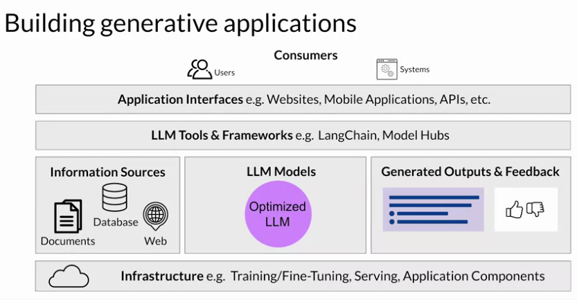

- 이번 주에는 모델을 인간의 선호에 맞게 조정하는 방법, 예를 들어 유용성, 무해성, 정직성을 강화 학습(reinforcement learning with human feedback, RLHF) 기법으로 조정하는 방법을 배웠습니다.

- RLHF의 인기로 인해, 많은 RL 보상 모델과 인간 정렬 데이터셋이 이미 존재하여 모델을 신속하게 정렬할 수 있게 해줍니다. 실제로 RLHF는 모델의 정렬을 개선하고 응답의 독성을 줄이며, 모델을 생산 환경에서 더 안전하게 사용할 수 있게 해주는 매우 효과적인 메커니즘입니다.

- 또한, 모델의 크기를 줄여서 추론을 최적화하는 중요한 기술들인 증류(distillation), 양자화(quantization), 가지치기(pruning)를 살펴보았습니다. 이는 생산 환경에서 LLM을 제공하는 데 필요한 하드웨어 자원을 최소화합니다.

- 마지막으로, 구조화된 프롬프트와 외부 데이터 소스 및 애플리케이션과의 연결을 통해 모델이 배포에서 더 나은 성능을 발휘하도록 돕는 방법을 탐색했습니다. LLM은 애플리케이션에서 추론 엔진으로서 놀라운 역할을 할 수 있으며, 이를 활용하여 흥미롭고 유용한 애플리케이션을 개발할 수 있습니다.

- LangChain과 같은 프레임워크는 LLM 기반 애플리케이션을 신속하게 구축, 배포, 테스트할 수 있게 해줍니다. 개발자들에게는 매우 흥미로운 시점입니다. 이 과정을 마무리하며, 앞으로 몇 달과 몇 년 동안 이 분야의 경로를 형성할 가능성이 있는 몇 가지 활발한 연구 분야를 탐색할 것입니다.