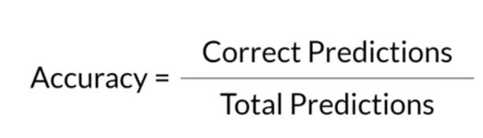

## Generative AI with Large Language Models in Coursera

***

### <strong>1주차: Introduction to LLMs and the generative AI project lifecycle</strong>

- Generating text with RNNs
  - Transformer 이전에는 RNN architecture를 많이 사용했다. 
  - RNN이 입력으로 받을 수 있는 단어의 수가 적다면, 다음 단어의 예측이 힘들다. 하지만, 입력받는 단어의 수를 늘리면 computing resource가 늘어난다. 
  - 모델이 다음 단어를 잘 예측하려면, 결국 이전 단어 몇 개만 보는 것이 아니라 더 많은 것을 볼 수 있어야 한다. (문장 전체 or 문서 전체)
  - 언어의 어려움: 여기서의 문제는 한 단어가 여러 뜻을 가질 수 있다는 것이다 (동음이의어)
  - 문맥을 이해해야 단어의 뜻을 알 수 있다. 
  - $2017$년 transformer architecture가 등장하면서, 우리가 보고 있는 generative AI가 존재한다.
  - Transformer architecture는 
    - 1. Scale efficiently
    - 2. Parallel process
    - 3. Attention to input meaning

- Transformer
  - Self-attention: 입력으로 들어오는 모든 단어의 관련성과 문맥을 학습할 수 있는 능력이 있다. 
  - Encoder와 decoder로 나눌 수 있다. 
  - 학습에 사용한 동일한 tokenizer를 사용해야 한다. 
  - Multi-headed (다각도) attention: 서로 독립적으로, 병렬적으로 학습된다. 여기서의 직관은 각각의 attention module이 서로 다른 측면을 배울 것이라는 것이다. 이는 모델이 자동으로 학습하는 것이다.
    - E.g., one head: 사람 주체들 사이의 관계에 집중, another head: 문장의 활동에 집중

- Task: translation
  - Encoder output: 구조와 의미를 담고 있다.
  - Start token이 처음에 decoder의 입력으로 들어가서 최종 softmax output을 내뱉는다. Start token과 output이 concat돼서 다시 decoder의 input으로 들어간다.
  - Encoder only model: BERT, 감정 분석
  - Encoder-Decoder model: T5, BART, 번역
  - Decoder only model: GPT, LLAMA

- 용어 정리
  - Prompt: 모델의 입력으로 들어가는 text
  - Inference: 텍스트를 생성하는 작업
  - Context window: 입력으로 들어갈 수 있는 text words
  - Prompt engineering: 모델이 더 나은 결과를 도출하도록 하는 기술
    - In-context learning: 작업의 예를 prompt에 포함시키는 것 

- Zero-shot inference
  - In-context learning을 안해도 잘 나오는 경우가 많지만, 그럼에도 작은 model은 실패하는 경우가 발생할 수 있다. 

- One-shot inference using In-context learning
  - Text가 더 길어지지만, 지정하는 작업과 원하는 응답이 일치하는 형식을 더 잘 이해할 수 있다. 
  - 여러 예제를 포함시켜서 (few-shot inference) 성능을 올릴 수도 있다.

- Few-shot inference using In-context learning
  - 모델의 크기가 작을수록 효율적이다. 대신 context window를 잘 고려해야 한다.
  - 여기서 알 수 있는점은 size가 큰 모델은 fine-tuning이나 in-context learning 없이도 잘 작동하는 점이다. 

- Generative configuration
  - When inference
    - Max_new_tokens: output의 최대 token 수. stop token을 포함하기 때문에 실제로 max_new_token보다는 token수가 작다
    - Softmax의 output 값은 모델이 사용하는 단어 사전 전체에 걸친 확률 분포이다. 이때 최종 output으로 일반적으로 선택하는 설정은 greedy sampling이다. 즉, 가장 높은 확률 값을 가진 token을 output으로 내뱉는 것.
    - 하지만, 좀 더 창의적이고 반복적이지 않은 단어를 생성하려면 random sampling을 사용하면 된다. 매번 가장 높은 확률값을 선택하는 것이 아닌, 확률 값을 반영해서 sampling 하는 것이다. 
      - E.g., cake의 softmax output이 $0.2$라면 $20$ % 확률로 선택
    - Sample top K: ramdom sampling을 제한하고 합리적인 가능성을 높이는 데 사용한다. 상위 $k$개의 값 중에서만 random sampling한다.
    - Sample top P: 확률값이 높은 순서대로 내림차순 정렬을 한 뒤 누적 확률값이 p 이하인 단어들 가운데 하나를 random sampling으로 선택하는 기법
    - Temperature: 다음 토큰에 대해 계산하는 확률 분포의 형태에 영향을 준다. 값이 클 수록 randomness가 커진다. Softmax의 temperature값이니 당연하게도 temperature가 작으면 확률 분포가 shaprness되는 효과를 가짐. 이 경우에 random sampling을 해도 확률 값의 차이가 너무 커서 다양하게 sampling이 안된다. 

- Generative AI project lifecycle: 개발할 때 내려야 하는 개별 단계와 결정을 안내한다.
  - 프로젝트 구상부터 출시까지 진행하는 데 필요한 작업을 계획한다. 

- CUDA out of memory: Computational challenges
  - 대부분의 LLM은 대용량 모델이고 대용량 데이터 셋으로 학습하기 때문에 고려해야한다.
  - $1$ parameter $= 4$ bytes ($32$-bit float)
  - 즉, 한 모델을 학습시키려면 모델의 크기 $\times 6$의 memory가 필요하다
  - 밀리언: 백만, 빌리언: $10$억
  - 기가바이트: $10^9$

$$ \text{Model Size (bytes)} = \text{Number of parameters} \times 4 \text{bytes}  $$

$$ \text{Model Size (bytes)}  \times 6 = \text{Memory needed to train model} $$

- Memory를 줄이기 위한 방법
  - Quantization: $32$ bit floating을 $16$ bit floating으로 바꿔서 학습한다. 
  - Multi-GPU

### <strong>2주차: Fine-tuning and evaluating large language models</strong>

- Limitation of in-context learning
  - 예제가 많이 제공되더라도, 성능이 비례해서 오르지 않는다. 
  - 예제가 포함된다는 것은 context window의 공간을 차지한다는 말이므로, 다른 정보를 포함시키지 못할 수 있다.
  - 따라서, finetuning을 통해 모델을 추가로 학습시킬 수 있다.

- Instruction finetuning
  - 특정 명령에 어떻게 반응해야 하는지를 보여주는 예제를 사용하여 학습시킨다.
  - 학습하려면 첫 번째로 데이터 셋을 준비해야 한다. 
  - 하지만, 대부분의 데이터 셋은 instruction을 포함하지 않는다.
  - 다행히, instruction template가 존재한다. 

- 여기서의 instruction은 "classify this review"이다.

- Full finetuning vs Parameter efficient finetuning
  - 충분한 메모리와 컴퓨팅 자원을 고려해야한다.

- 이때, finetuning을 진행하면서 다음과 같은 문제가 발생할 수 있다.
  - Catastrophic forgetting: 치명적인 망각
  - Model weight를 수정하기에 발생한다. 
  - Single finetuning task에서는 성능이 향상되지만, 다른 task에서는 성능이 저하될 수 있다.

- Catastrophic forgetting을 피하는 방법을 알아보자
  - 먼저, catastrophic forgetting이 실제로 영향을 미치는지 여부를 결정해야 한다.
  - Finetuning on multiple tasks at the same time
  - Condider Parameter Efficient Fine-tuning (PEFT)

$\textbf{Multi-task, instruction fine-tuning}$

- It is extension of single-task finetuning
- 많은 데이터 셋이 필요하다
- 대표적으로 FLAN-T5가 있다. (Fine-tuned LAnguage Net)
  - Foundation model T5의 instruction version: $473$ dataset에 대해서 학습됨
  - FLAN-PALM: PALM이라는 foundation model의 instruction version 

$\textbf{Model Evaluation}$

- 일반적으로는 다음과 같은 metric을 사용하겠지만, language에는 적용할 수 없다.
  - None deterministic

- ROUGE, BLEU Score는 널리 사용되는 $2$ 가지 지표이다. 
  - ROUGE: used for text summarization 
  - BLEU: used for text translation 