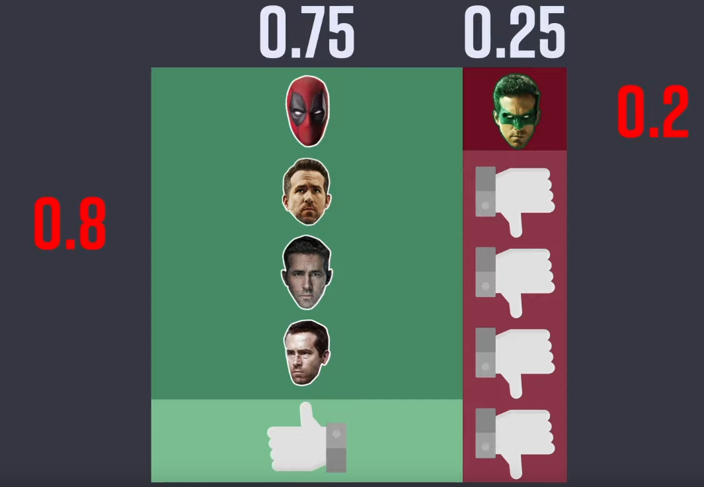

## Bayes's Theorem
*MLE &MAE*

[Intro](#intro) 
[Related Work](#related-work) 
[Method](#method) 
[Experiment](#experiment) 
[Conclusion](#conclusion) 

***

### <strong>Definition</strong>

$$ p(A|B) = \frac{p(B|A)p(A)}{p(B)} $$

- Machine Learning 의 관점으로 notation 을 수정해보자면, 다음과 같다.
    - 이때, $\theta$ 는 모수 (parameter) 로써 주어진 확률분포나 함수의 모수를 나타내는 변수로 사용된다. 즉, 모델이 어떤 분포를 따르고 그 분포의 특징을 설명하는데 사용되는 매개변수이다. 
    - E.g., 
        - 정규분포. $\theta$ 는 평균과 분산을 나타낼 수 있다.
            - $\theta = (\mu, \sigma^2)$
        - 베르누이 분포. $\theta$ 는 베르누이 시행의 성공 확률을 나타낸다.
        - VAE (Variational Autoencoder). $\theta$ 는 잠재 공간 (latent space) 에서의 확률적 변수를 나타낸다. 따라서 VAE 에서의 $\theta = (\mu, \sigma^2)$ 이다.
    - D: 내가 관측한 Data

$$ p(\theta|D) = \frac{p(D,\theta)}{p(D)} = \frac{p(D|\theta)p(\theta)}{p(D)} = \frac{p(D|\theta)p(\theta)}{\Sigma_i{p(D,\theta_i)}} = \frac{p(D|\theta)p(\theta)}{\Sigma_i{p(D|\theta_i)p(\theta_i)}} $$

- $p(\theta|D)$: posterior, 사후 확률
- $p(\theta)$: prior, 사전 확률
- $p(D|\theta)$: likelihood, 가능도
- $p(D)$: normalizaing constant/evidence, 정규화 상수/증거 (확률의 크기 조정)
  - 볼츠만 정리에서의 normalizing constant 와는 다르다.

- 베이즈 정리를 보는 두 가지 관점
  - 전통적인 관점: 빈도주의 (frequentism)
  - 새로운 관점: 베이지안 주의 (Bayesianism)
    - 확률을 '주장에 대한 신뢰도'로 해석하는 관점
    - **추가되는 정보를 바탕으로 사전 확률을 갱신한다.** 
  - E.g., 동전의 앞면이 나올 확률이 $50$ % 이다.
    - 빈도주의: $100$ 번 동전을 던지면 $50$ 번은 앞면이 나온다.
    - 베이지안 주의: 동전의 앞면이 나왔다는 주장의 신뢰도가 $50$ % 이다.

- 베이지안 주의 관점으로 보는 베이즈 정리

$$ p(\theta|D) = \frac{p(D|\theta)p(\theta)}{p(D)} $$

- $\theta$: Hypothesis, 가설 혹은 '어떤 사건이 발생했다는 주자어'
- $D$: Evidence, '새로운 정보'
- $p(\theta|D)$: 새로운 정보를 받은 후, 갱신된 신뢰도
- $p(\theta)$: 어떤 사건이 발생했다는 주장에 관한 신뢰도

- **Example Problem 1.**
  - 구하고자 하는 건, 초콜릿을 받았을 때 상대방이 날 좋아할 확률 (**Posterior**)
  - 상대방이 날 좋아할 확률 (**Prior**): $0.5, 0.5$
    - 아무런 정보가 없는 상황에서 확률을 동등하게 생각하는 것을 '이유 불충분의 원리'라고 한다. (수학자 라플라스가 주장)
  - 이성이 상대방을 좋아할 때 초콜릿을 줄 확률 (**Likelihood**): $0.4$
  - 이성이 상대방을 좋아하지 않아도 예의상 초콜릿을 줄 확률: $0.3$
  - 초기에 상대방이 날 좋아할 확률 즉, prior 를 주관적으로 선택했기 때문에 전혀 신뢰성이 없다. 하지만, 관측된 데이터를 활용하여 올바른 의사결정을 할 수 있게끔 사전확률을 업데이트한다. 

$$ p(사랑|초콜릿) = \frac{p(초콜릿|사랑)p(사랑)}{p(초콜릿)} = \frac{p(초콜릿|사랑)p(사랑)}{p(초콜릿,사랑) + p(초콜릿, 사랑^c)} = \frac{p(초콜릿|사랑)p(사랑)}{p(초콜릿|사랑)p(사랑) + p(초콜릿|사랑^c)p(사랑^c)} = \frac{4}{7} $$

- 방금 구한 사후 확률 $p(사랑|초콜릿)=\frac{4}{7}$ 이 다음의 사전 확률 $p(사랑)$ 이 된다. 

- **Example Problem 2.**
  - Neflix 추천 시스템
  - 구하고자 하는 건, 좋아요를 눌렀을 때 액션 영화를 좋아할 확률 (**Posterior**)
  - 넷플릭스는 초기 사용자가 무엇을 좋아할지 모른다. (cold start)
  - 따라서 액션 영화를 좋아할 확률/영화를 싫어할 확률 (**Prior**): $0.5$ / $0.5$ 로 가정
  - 시간이 지나고 해당 시청자는 $10$ 편의 영화를 추천받아서 봤고, $5$ 편의 영화에 좋아요를 눌렀다. (그 중 $3$ 편이 액션 영화)
  - 나머지 $5$ 편의 영화에는 싫어요를 눌렀는데, 그 중 $1$ 편이 액션 영화이다. 

- 따라서, 사후 확률인 좋아요를 눌렀을 때 액션 영화를 좋아한 확률은 $0.75$ 로 update 가 된다.
 

- 이번엔, 출연 배우에 초점을 맞춰서 update 를 해보자
  - 구하고자 하는 것은 이 시청자가 박준서가 출연한 액션 영화를 얼마나 좋아하는지이다.
  - 이때, 액션 영화를 좋아할 확률은 이전에 update 했던 $0.75$ 를 사용한다.
  - 똑같이 $10$ 편의 영화를 봤고, $5$ 편의 영화를 좋아요 나머지는 싫어요를 눌렀다. 
  - 좋아요를 누른 $5$ 편의 영화 중, 박준서가 나온 영화는 $4$ 편
  - 싫어요를 누른 $5$ 편의 영화 중, 박준서가 나온 영화는 $1$ 편이다.

- 사후 확률인, 박준서가 출연한 액션 영화를 얼마나 좋아하는 지에 대한 값이 $92.3$ % 가 된다. 

- <a href='https://www.youtube.com/watch?v=Y4ecU7NkiEI'>reference youtube</a>
- <a href='https://www.youtube.com/watch?v=me--WQKQQAo'>reference youtube2</a>

- 베이지 정리는 기존의 정보에 새로운 정보를 추가하여 더 정확한 결론을 도출하는 방법을 제공한다. 특히 불확실한 상황에서 의사결정을 내리는 데 유용하다. 
***

### <strong>Maximum Likelihood Estimation</strong>

- MLE 는 주어진 데이터에 대한 최적의 모델 파라미터를 찾는데 사용된다. 
  - 이때, 사후확률 (posterior) 이나 사전확률 (prior) 은 고려되지 않는다.
  - 주어진 데이터가 분포를 대표할 수 있는 데이터라는 가정이 있다. 즉, 확률 분포에서 독립적으로 추출되었다.

$$ \hat{\theta}{MLE} = \argmax_{\theta}{p(D|\theta)} = \argmax_{\theta}\prod_{i=1}^{N} p(D_i|\theta) $$

- log 를 씌우면, log-likelihood function $L(\theta|D)$ 이 된다.
  - log-likelihood fucntion 과 사후확률과는 다르다.
    - $L(\theta|D) \neq P(\theta|D)$

$$ L(\theta|D) = \log{p(D|\theta)} = \Sigma_{i=1}^{N}{\log{p(D_i|\theta)}} $$

- $L(\theta|D)$ 를 maximize 하면 된다. $\theta$ 에 대해서 convex function 이라면, 

$$ \frac{\partial}{\partial\theta}L(\theta|D) = \frac{\partial}{\partial\theta}\log{p(D|\theta)} =  \Sigma_{i=1}^{N}{\frac{\partial}{\partial\theta}\log{p(D_i|\theta)}} =0 $$

- Non-convex fucntion 이라면 일반적으로 gradient ascent 를 사용하면 된다. 

***

### <strong>Maximum A Posteriori Estimation</strong>

- MLE 는 주어진 데이터에 대한 **가능도(likelihood)를 최대화**하여 모델의 파라미터를 추정하는 방법이다. 가능도는 주어진 데이터가 특정 모델에서 발생할 확률을 나타낸다. MLE는 주어진 데이터가 가장 "가능성이 높게" 나올 수 있는 모델의 파라미터를 찾는 것이 목표이다.
- MAP는 MLE와 유사하지만, 사전확률(prior)을 고려하여 모델의 파라미터를 추정하는 방법이다. **사후확률을 최대화**하는 파라미터를 찾는 것이 목표이다.
- 우리의 지식이나 경험을 추가하여 더욱 그럴듯한 확률을 추정하고자 한다. (e.g., 동전은 평평하다)

$$ \hat{\theta}{MLE} = \underset{\theta}{\operatorname{\argmax}}p(\theta|D) = \argmax_{\theta}{\frac{p(D|\theta)p(\theta)}{p(D)}} $$

- $\theta$ 에 대해서 $p(D)$ 는 상수 취급이므로, 제거할 수 있다.

$$ \hat{\theta}{MLE} \propto \argmax_{\theta}{p(D|\theta)p(\theta)} $$

- $\log$ 를 씌우면,

$$ \hat{\theta}{MLE} \propto \argmax_{\theta}{\log{p(D|\theta)} + \log{p(\theta)}} $$

- Prior 를 고려해서 $\theta$ 를 추정하는 것을 알 수 있다. 이때, uniform prior distribution 이라고 한다면 MAP 는 MLE 와 같아지게 된다. 따라서, MLE 를 MAP 의 특수한 경우라고 볼 수 있다. 
  - Uniform prior distribution 이라고 하면, $p(\theta)$ 가 모든 $\theta$ 에 대해서 constant 이므로 $p(\theta)$ 항을 무시할 수 있다. 
  - 또한, prior 를 일종의 regularizer 의 역할을 한다고 볼 수도 있는데, data 가 적은 상황에서 prior 의 정보를 고려함으로써, overfitting 을 완화할 수도 있다.
  - 사실 data 가 무한정으로 많다면 MAP 에서의 첫 번째 항이 지배적이게 되므로 결국 MAP 와 MLE 가 같아지는 상황에 도달하게 된다. 즉, 우리의 사전 지식은 더 이상 고려되지 않는다. 

### <strong>Intro</strong>

***

### <strong>Related Work</strong>

***

### <strong>Method</strong>

***

### <strong>Experiment</strong>

***

### <strong>Conclusion</strong>

***

### <strong>Question</strong>

<a href="">link</a>

> 인용구
