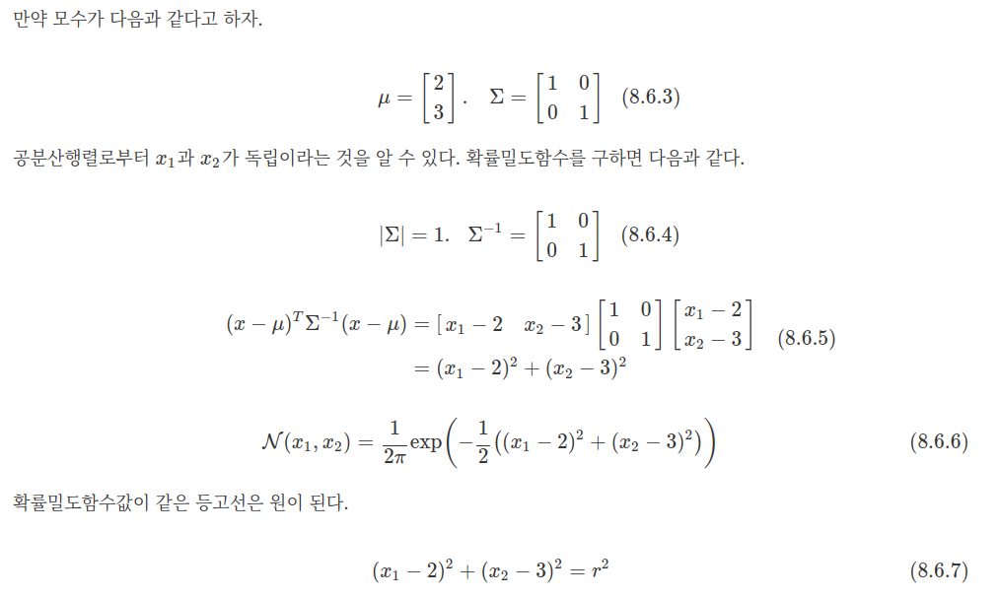
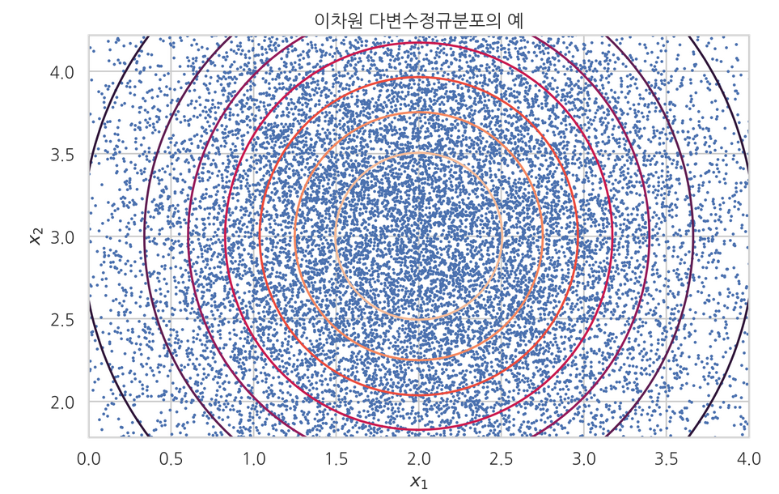
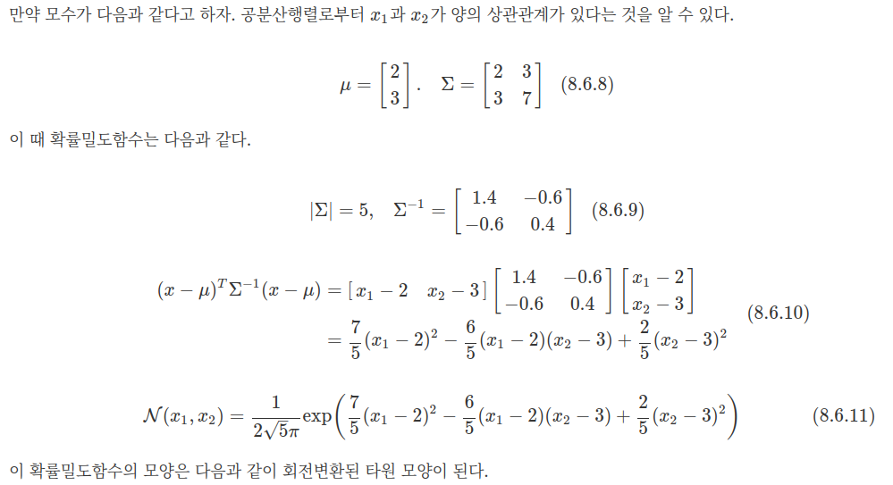
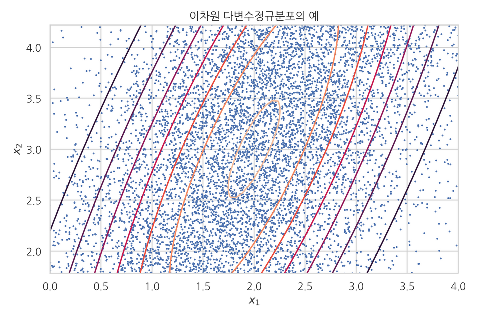
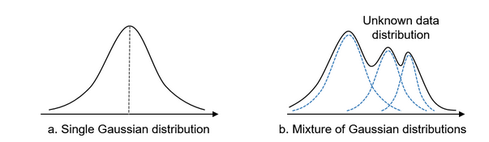

## Guassian Distribution
*Gaussian Distribution*

[Definition](#definition) 

<a href='https://norman3.github.io/prml/'>확률 분포 관련 책</a>

***

### <strong>Definition</strong>

- 일변수 정규 분포는 다음과 같다.  

$$  f(x) \frac{1}{\sqrt{2\pi\sigma^2}}\exp({-\cfrac{(x-\mu)^2}{2\sigma^2}})  $$

- 다변량 정규 분포는 다음과 같다.
  - 일변량 정규 분포를 둘 이상의 확률 변수로 일반화한 것이다.
  - 이는 상관관계가 있는 변수로 구성된 확률 벡터에 대한 분포이다.
  - 벡터의 각 요소는 일변량 정규 분포를 가진다.
  - 공분산 행렬은 양의 정부호인 대칭행렬이어야 한다. 따라서 역행렬이 항상 존재한다. 

$$ \mathcal{N}(x ; \mu, \Sigma) = \dfrac{1}{(2\pi)^{D/2} |\Sigma| ^{1/2}} \exp \left( -\dfrac{1}{2} (x-\mu)^T \Sigma^{-1} (x-\mu) \right) $$

- 다변량 정규 분포에서 각 확률 변수가 분산이 동일하고 서로 독립이라면 다음과 같이 완전한 원의 분포 형태를 가진다.
  - E.g., 

- 하지만 각 확률 변수가 독립이 아니라면 다음과 같다.
  - E.g., 

- 정규 분포를 따르는 두 확률 변수의 합은 다음과 같이 표현된다.

$$ X+Y \sim N(\mu_x + \mu_y , \sigma_x^2 + \sigma_y^2) $$

- 정규 분포를 따르는 두 확률 분포의 합은 다음과 같이 표현된다. 
  - Mixture of Gaussian Distribution
  - Mode 가 여러 개인 확률 분포를 가진다.

- Gaussian distribution 을 $k = 3$ 개 선형 결합

$$ p(x) = \sum_{k=1}^K \pi_k N(x;\mu_k, \Sigma_k) $$