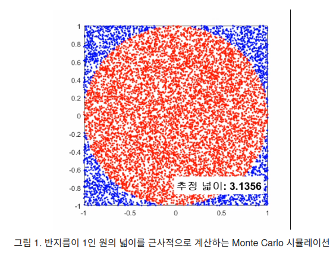
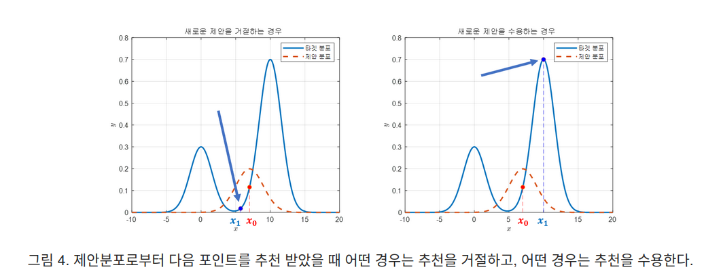
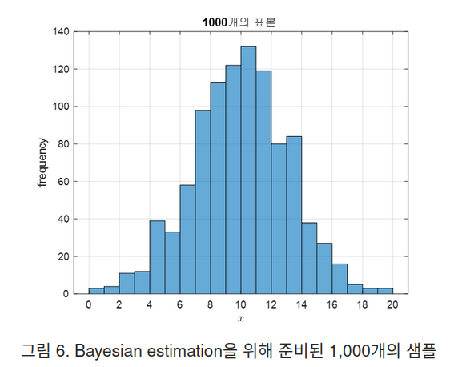
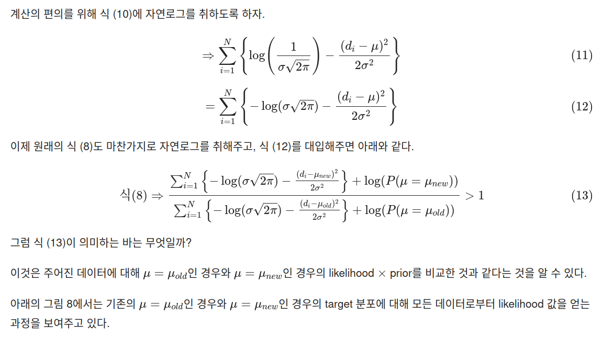
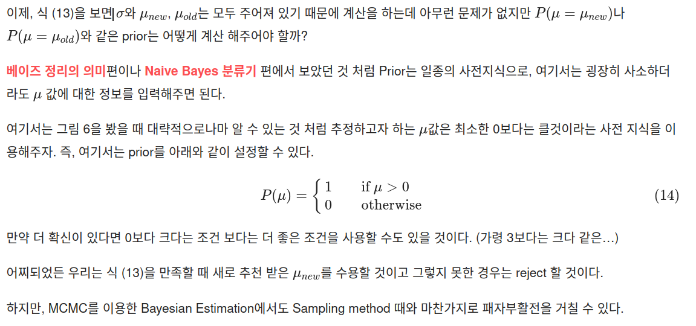
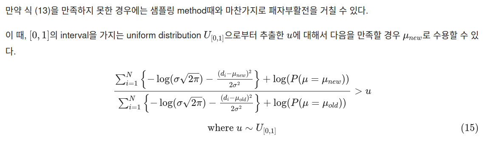

## MCMC
*Marcov Chain Monte Carlo*

[Definition](#definition) 
[MLE](#maximum-likelihood-estimation) 
[MAP](#maximum-a-posteriori-estimation) 

***

### <strong>Definition</strong>

- **MCMC 는 sampling/parameter estimation 에 사용하는 알고리즘이다.**
- Monte Carlo
  - 통계적인 수치를 얻기 위해 수행하는 시뮬레이션 같은 것이다.
  - E.g., 원의 넓이를 계산하는 시뮬레이션 

- Marcov Chain
  - 어떤 상태에서 다른 상태로 넘어갈 때, 바로 이전 단계의 상태에만 영향을 받는 확률 과정을 의미한다. 

### <strong>MCMC Sampling</strong>

- Monte Carlo + Marcov Chain: "가장 마지막에 뽑힌 샘플이 다음 샘플을 추천해준다"
- 여기서 리뷰하는 MCMC sampling algorithm 은 Metropolis algorithm 이다. 

1. 먼저, sample 을 추출하고자 하는 target 분포를 정한다. 
   1. 이때, target 분포는 정확히 확률 밀도 함수가 아니라 대략적으로 비례하는 함수를 이용해도 된다. 
   2. 즉, 전체 면적이 $1$ 이 아니여도 됨

2. Random Initialization
   1. Sample space 에서 아무런 입력값을 선택한다.

3. 제안 분포로부터 다음 sample 추천받기
   1. 제안 분포는 어떤 확률 분포를 이용해도 상관 없으나 ,Metropolis 는 symmetric 한 확률 분포를 사용하는 경우에 대한 알고리즘을 제안했다.
   2. E.g, 정규 분포

4. 다음 기준에 따라 추천받은 sample 을 선택할 것인지를 결정한다. 
   1. $f$: target 분포의 높이 
$$ \frac{f(x_1)}{f(x_2)} > 1 $$

5. 패자 부활전
   1. 앞서 거절된 sample 들은 버리는 것이 아니라 통계적으로 수용할 수 있게끔 설계했다.
   2. Uniform distribution $U_{(0,1)} 에서 추출한 임의의 임계값 $u$ 에 대해서 다음의 수식을 만족하면 $4.$ 의 기준을 만족못해도 수용한다. 

$$ \frac{f(x_1)}{f(x_2)} > u $$

6. $3$ ~ $5$ 를 반복한다.

### <strong>Bayesian Estimation</strong>

- 다음과 같이 평균이 $10$ , 표준편차가 $3$ 인 정규 분포를 따르는 $30,000$ 개의 원소들로 구성된 모집단에서 $1,000$ 개의 표본을 추출할 수 있었다고 가정해보자.

- 우리가 알고싶은 것은 이 $1,000$ 개의 샘플만을 이용해서 $30,000$ 개의 전체 모집단을 평균 값을 잘 추정해보는 것이다.

1. Random Initialization
   1. 기본적으로 MCMC sampling 과정과 동일하게 파라미터 추정 시에도 random initialization 으로 시작된다.
   2. 우리가 추정하고자 하는 모집단의 확률밀도함수는 정규분포를 따른다고 하자
   3. 우리는 평균과 표준편차 $2$ 가지 파라미터에 대해 추정해볼 수 있다.
   4. 하지만, 여기서는 평균 값에 대해서만 추정하고 표본 표준편차를 그대로 사용한다. 

2. 제안 분포를 이용해 mean 값 제안 받기
   1. 제안 분포를 통해 새로운 mean 값을 추천 받는다.

3. 추천 받은 제안에 대한 수락 혹은 거절
   1. 이제 추천 받은 mean 값을 accept 하거나 reject 해야 한다.
   2. 그 기준은 이전의 sampling method 와 마찬가지로 타켓 함수의 높이 비교를 통해 이뤄질 수 있다.
   3. 하지만, 다른 점은 타겟 함수의 파라미터가 변경된 두 경우를 비교하는 것이다. 
   4. 다음의 기준을 만족해야 한다. 

$$ \frac{f_{new}(x)}{f_{old}(x)} > 1 $$

- 이때의 data 는 $1,000$ 개의 sample 을 의미한다. 

$$ \frac{p(\theta = \theta_{new}|Data)}{p(\theta = \theta_{old}|Data)} > 1 $$

- 여기서 **<a href='../Bayes-theorem/Bayes-theorem.md'>베이즈 정리</a>** 에 따라 식을 변형시키면 다음과 같다.

$$ \frac{f(D|\theta = \theta_{new})p(\theta = \theta_{new})/f(D)}{f(D|\theta = \theta_{old})p(\theta = \theta_{old})/f(D)} > 1 $$

- $f(D)$ 제거
  
$$ \frac{f(D|\theta = \theta_{new})p(\theta = \theta_{new})}{f(D|\theta = \theta_{old})p(\theta = \theta_{old})} > 1 $$

- 분자나 분모에서의 $f(D|\theta)$ 항들은 모두 전체 데이터의 likehood 를 의미한다. 즉, 모든 데이터가 독립적으로 얻어졌다고 가정하면 다음과 같이 각각의 데이터에 대해 풀어쓸 수 있다.

$$ f(D|\theta) = \prod_{i=1}^{N}{f(d_i|\theta)} $$

- 여기서 우리의 target 분포는 정규분포이므로 

$$ \prod_{i=1}^{N}{\frac{1}{\sigma \sqrt{2\pi}} \exp{- \frac{(d_i - \mu)^2}{2 \sigma^2}}} $$

- 계산의 편의를 위해서 자연로그를 취하면, 

4. 패자부활전

***

