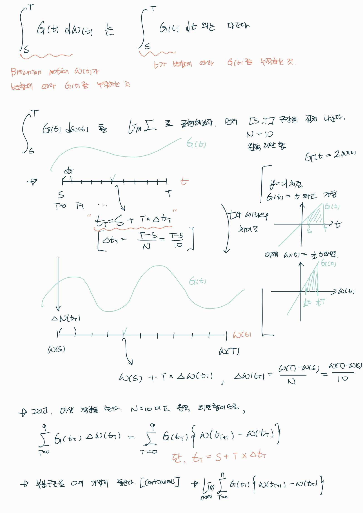

## SDE: Stochastic Differential Equation
*확률 미분 방정식*

[Definition](#definition) 

***

### <strong>Definition</strong>

- Difference (차분): 두 값 사이의 차이를 나타낸다. 

$$ \Delta x = x_2 - x_1 $$

- 만일, 차분값이 0 에 가까워 지면 다음과 같다. 
  - 이때의 $dx$ 를 derivative 라고 부른다. 
  - Differential 은 $\frac{dy}{dx}$ 와 같이 derivative 가 포함된 함수식이다. 

$$ \Delta x \rightarrow dx $$

- Difference Equation

$$ x_{n+1} - x_n = f(x_n,n)(n+1 - n) $$

$$ \Delta x = f(x,n)\Delta n $$

- Differential Equation

$$ dx = f(x,t)dt $$

$$ \frac{dx}{dt} = f(x,t) $$

- Stochastic Difference Equation

$$ x_{n+1} - x_n = f(x_n,n) + G(x_n,n)"noise" $$

$$ \Delta x = f(x,n)\Delta n + G(x_n,n) \Delta n Z_n $$

- Stochastic Differential Equation

$$ dx = f(x,t)dt + G(x,t)Z_t dt $$

$$ \frac{dx}{dt} = f(x,t) + G(x,t)Z_t $$

- White Gaussian Noise (백색 가우시안 잡음)
  - 통신 시스템에서, 열잡음이 신호에 영향을 주는 특성에 따라 붙여진 이름이다. 모든 주파수에 걸쳐서 나타난다.
    - 열 에너지에 의해 발생하는 것으로 저항기에서 많이 발생하며 기기 내부 잡음의 주요한 원인이 된다.
  - Stochastic process $\text{Noise} \ n(t) \in R^d, \ t \in [t_0, \infty ]$ 가 다음을 만족할 때 White Gaussian Noise 라고 부른다.
    - 1. $t_1 \neq t_2$ 일 때, $n(t_1), n(t_2)$ 가 독립
      - 즉, noise 가 더해지는게 시간 축과는 상관없다.
    - 2. $n(t)$ 가 Gaussian Process
    - 3. $E[n(t)] = 0, \ E[n(t)n(s)^T] = 0 \ (\text{if} \ t = s, \ E[n(t)n(t)^T] = Q)$
      - $t \neq s$ 인 상황에서는 확률적 독립이기에 다음과 같이 표현할 수 있다. $E[n(t)n(s)^T] = E[n(t)] \times E[n(s)]$ 이때, $E[n(t)] =\ E[n(s)] = 0$ 이라서, $E[n(t)n(s)^T] = 0$ 이다.
      - 여기서 $Q$ 는 spectral density 라고 부른다.
      - $t = s$ 일때 $n(t) \sim N(0,Q)$ 의 분포를 따른다. 
  - 특징
    - $n(t)$ 는 $t$ 에 관해서 불연속이다. 
    - $n(t)$ 는 $[t_0, \infty)$ 의 모든 부분 구간 $[t_1,t_2], \ t_0 \leq t_1 \leq t_2$ 안에서 unbounded 이고 아주 큰 값과 아주 작은 값을 갖는다.

- Brownian Motion (브라운 운동)
  - Stochastic process $w(t) \in R^d, \ t \in [t_0, \infty]$ 가 다음을 만족할 때, Brownian motion 이라고 부른다.
    - 1. $s < t$ 일 때, $w(t) - w(s) \sim N(0, (t-s)Q)$
      - **일차원이면, $w(t) - w(s) \sim N(0, t-s)$**
          - $\Delta w = \sqrt{t-s}z = \sqrt{\Delta t}z, \ z \sim N(0,1)$
    - 2. $w(t_0) = 0$
    - 3. $t_1 < t_2 < t_3 < \cdots < t_N$ 에 대하여 $w(t_2) - w(t_1), w(t_3) - w(t_2), \cdots , w(t_N) - w(t_{N-1})$ 는 독립이고 가우시안 분포를 따른다.
      - 여기서 $Q$ 는 diffusion matrix 라고 부른다.
  - 특징
    - 브라운 운동은 시간에 대해 연속적이지만 경로 자체는 대부분 미분 불가능한 지점이 존재한다. 
    - $w(t)$ 는 $t$ 에 관해서 미분 불가능하다. (weak derivative 로 미분 불가능한 지점에서도 동작하게끔 정의한다)
    - White Gaussian noise $n(t)$ 의 specatral density 가 $Q$ 라면 다음을 만족한다.
      - 브라운 운동에서의 증가량은 gaussian distribution 을 따르고, 시간 간격이 작을 때 브라운 운동의 변화는 white gaussian distribution 에 근사할 수 있다.
      - $\frac{w(t+1) - w(t)}{t+1 - t} \sim N(0,Q)$ 
      - <a href='http://mbhauser.com/informal-notes/white-gaussian-noise.pdf'>증명 pdf</a>

$$ n(t) = \frac{dw(t)}{dt} \ [\textbf{Weak Derivative}]$$

- Ito Integration (이토 적분)
  - $G(t) \in R^d \times R^d$ 를 stochastic process 라고 가정.
  - $w(t) \in R^d$ 를 Brownian motion 이라고 가정.
  - $\displaystyle\int_S^T G(t) dw(t) = \lim_{n \rightarrow \infty} \displaystyle\sum_{i=0}^{n-1} G(t_i)(w(t_{i+1}) - w(t_i))$
    - $S = t_0 < t_1 < \cdots < t_n = T$
    - 여기서 $G(t)$ 에 $t=t_i$ 가 들어오는 것에 주목.
    - $t_i$ 는 partition $(t_i, t_{t+1})$ 에서 왼쪽 점이다.
    - $\displaystyle\sum_{i=0}^{n-1} G(\hat t_i)(w(t_{i+1}) - w(t_i)), \ t_i \leq \hat t_i \leq t_{i+1}$ 임의의 점이면 적분이 존재하지 않을 수 있다.

- Stochastic Differential Equation (SDE: 확률 미분 방정식)
  - 원래 함수를 모를 때 도함수와 함수값을 이용하여 원래 함수를 추정하거나, 현재 관측하지 않은 변수에서의 함수값을 추정하는 것이다. 
  - 배경
    - 상미분 방정식 (ODE)   $\\ \frac{dx}{dt} = f(x,t)$
    - 미분 방정식에 noise 가 낀 경우,    $\\ \frac{dx}{dt} = f(x,t) + L(x,t)n(t)$  
      - $n(t)$ 는 spectral density 가 $Q$ 인 white noise
      - 정의가 잘 되는가?

$$ dx = f(x,t)dt + L(x,t)n(t)dt $$

- 실제로는 정의가 안된다.

$$ x(t+ \Delta) - x(t) = \displaystyle\int_t^{t+\Delta} f(x,s) ds + \displaystyle\int_t^{t+\Delta} L(x,s)n(s) ds $$

- White noise n(t) 는 unbounded 이고 **discontinuous** 하므로 $\displaystyle\int_t^{t+\Delta} L(x,s)n(s) ds$ 는 존재하지 않는다.
  - 하지만 diffusion matrix 가 $Q$ 인 브라운 운동 $w$ 에 대하여 $n(t) = \frac{dw(t)}{dt} \ [\text{weak derivative}]$ 로 표현할 수 있으므로,
  - 브라운 운동을 이용해서 $\displaystyle\int_t^{t+\Delta} L(x,s)n(s) ds$ 대신 이토 적분 $\displaystyle\int_t^{t+\Delta} L(x,s)dw(s)$ 를 이용한다.

$$ x(t+ \Delta) - x(t) = dx = \displaystyle\int_t^{t+\Delta} f(x,s) ds + \displaystyle\int_t^{t+\Delta} L(x,s)dw(s) $$

- 시작점이 $x_0$ 로 고정이라면 다음과 같다.

$$ dx = f(t,X)dt + G(t,X)dW $$

$$ X_t = X_0 + \int_0^t f(s,X_s) ds + \int_0^t G(s,X_s)dW_s $$

$$ X_m = X_0 + \sum_{0 \leq j \leq m-1} f(t_j,X_j)\Delta t_j + \sum_{0 \leq j \leq m-1} G(t_j, X_j) \Delta W_j, \ \text{discretization} $$

- 상미분 방정식 $\frac{dx}{dt} = f(x,t)$ 에 white noise 가 낀 것으로 해석이 가능하다.
- 수학적인 이유 때문에 white noise 에 대한 적분이 아닌 이토 적분으로 정의힌다.
  - 하지만, Brownian motion 은 $t$ 에 대해서 연속적이지만 미분 불가능하기 때문에 이산적으로 정의한다.
  - $S$ 에서 $T$ 까지의 구간에서 $G(t)$ 함수를 $w(t)$ 에 대해 적분한다면, 리만 합으로 바꾸기 위해 시간 구간을 여러 작은 구간으로 나눈다.
  - 작은 구간의 길이를 $\Delta t_i$ 로 표기하고, 각 부분 구간에서의 t 값은 $t_i = S + i \Delta t_i$ 로 나타낸다. 

$$ \displaystyle\int_S^T G(t) dw(t) = \lim_{n \rightarrow \infty} \displaystyle\sum_{i=0}^{n-1} G(t_i)(w(t_{i+1}) - w(t_i)) $$

- 기호정리
  - $X_t$: 확률 미분 방정식을 따르는 stochastic process
  - $B_t$: Brownian motion

$$ dX_t = b(t, X_t) dt + \sigma(t, X_t) dB_t  $$

$$ X_t \in R^n, b(t,X_t) \in R^n, \sigma(t,X_t) \in R^n \times R^m, B_t \in R^m $$

$$ b(t,x): \text{drift coefficient} $$

$$ \sigma(t,x): \text{diffusion coefficient} $$

- Ito Diffusion
  - 확률 미분 방정식이 $t$ 에 의존하지 않으면서 Lipschitz continuous 를 만족하는 Stochastic process $X_t$ 를 ito diffusion 이라고 한다.
  - 이때, unique strong solution 을 가진다.

$$ dX_t = b(X_t) dt + \sigma(X_t) dB_t  $$

- Lipschitz continuous: 두 점 사이의 거리를 일정 비 이상으로 증가시키지 않는 함수

$$ |b(x) - b(y)| + |\sigma(x) - \sigma(y)| \leq |x-y| $$

***

- Langevin Dynamics Sampling
  - 특정 데이터 확률 분포인 $p(x)$ 에서 sampling 하고 싶을 때 사용하는 방법이다.
  - $z_i$ 는 평균이 $0$ 이고 covariance 가 $I$ 인 가우시안 분포를 따른다.
  - $T > 0$ 가 엄청 크고, $\epsilon > 0$ 이 엄청 작으면 원하는 분포 $p(x)$ 로부터 데이터를 sampling 할 수 있다. 
  - $for \ i=1,2,3, \cdots T$

$$ x_i = x_{i-1} + \frac{\epsilon}{2} \nabla_x \log{p(x)} + \sqrt{\epsilon}z_i $$

$$ x_i - x_{i-1} = \frac{1}{2} \nabla_x \log{p(x)}\epsilon + \sqrt{\epsilon}z_i $$

$$ dx = \frac{1}{2} \nabla_x \log{p(x)}dt + dw $$

- 우리는 위에서 Brownian motion 이 다음의 성질을 갖는 걸 알고 있다.

$$ \Delta w = \sqrt{t-s}z = \sqrt{\Delta t}z, \ z \sim N(0,1) $$

- 연속 시간으로 본다면, $dt = \epsilon$, $dw = \sqrt{\epsilon}z_i = \sqrt{dt}z_i \sim N(0,\epsilon(=dt))$ 를 만족하는 *SDE* 로 볼 수 있다.

### <strong>Numerical SDE solvers</strong> 

- SDE 를 이산적인 시간 그리드에서 수치적으로 푸는 알고리즘이다. 

- Euler-Maruyama Method: 이 방법은 간단하고 직관적으로 구현될 수 있으며, 작은 시간 간격에서 미분 방정식을 근사화합니다.

- Milstein Method: Euler-Maruyama의 확장으로, 특히 diffusion term이 XtXt​에 대해 편미분 가능한 경우 더 나은 근사화를 제공합니다.

- Runge-Kutta Methods: 고전적인 미분 방정식에 사용되는 Runge-Kutta 방법을 확장하여 SDE에 대한 수치 해법을 제공합니다.

- Stochastic Taylor Expansion Methods: 고차원의 정확도를 제공하는 방법 중 하나로, 테일러 전개를 사용하여 미분 방정식을 근사화합니다.

### <strong>Example</strong>

- 예를 들어 쇠구슬을 $3$ 층에서 떨어뜨렸을 때, 일정 시간 뒤에 물체의 낙하지점은 중력가속도를 이용한 미분 방정식으로 풀 수 있다. 그렇기에, 수 차례의 반복실험에서도 같은 결과를 얻을 수 있다. (물론, 실험에 의한 오차는 있을 수 있다) **[결정론적 모형]**
- 그러나, 비커에 물을 한 컵 채워놓고 꽃가루를 뿌리면 이 가루의 움직임은 위의 현상처럼 간단하게 구해지지 않는다. 바로 물 분자의 우연한 변동에 의해 매번의 실험마다 서로 다른 결과값을 보이기 때문이다. 이렇게 애매한 운동을 모델링하기 위해 나온 것이 바로 **[확률론적 모형]** 기법이고 대표적인 것이 **브라운 운동** 이다. 
