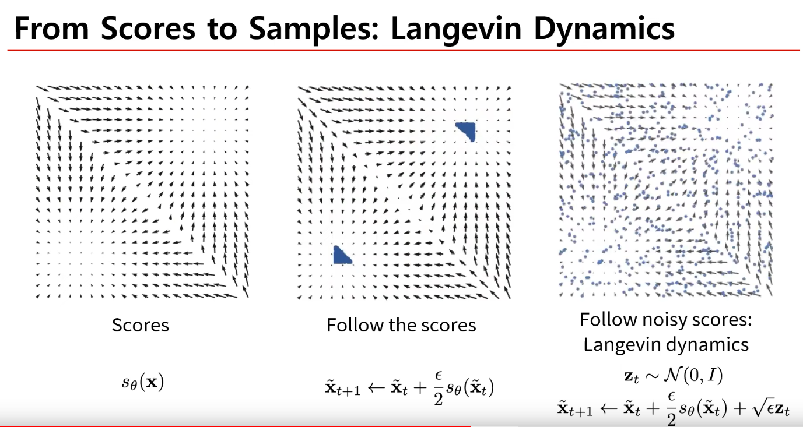
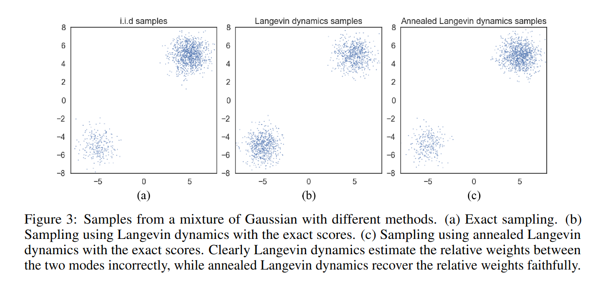

## Score-Based Generative Models
*A representative reference: <a href='https://yang-song.net/blog/2021/score/'>Yang Song blog</a>*

[Intro](#intro) 
[Method](#method) 
[Conclusion](#conclusion) 

> Core Idea

$$ utilize \ \nabla_x \log{p(x)} $$

***

### <strong>Intro</strong>

*Generative Modeling by Estimating Gradients of the Data Distribution, 2019, Neurips, 1825 citation*

*Score-based generative modeling through stochastic differential equations, 2020, arXiv, 2238 citation*

$$ p(x) = \frac{p(x|y)p(y)}{p(y|x)} $$

- 존재하는 생성 모델은 확률 분포를 표현하는 방법에 따라 두 category 로 분류할 수 있다.
    1. Likelihood-based models
        - 분포의 PDF/PMF 를 (approximate) maximum likelihood 를 통해 직접적으로 학습한다. 
        - <a href='../Bayes-theorem/Bayes-theorem.md'>Bayes's Theorem 정리</a>
        - E.g., 
          - Autoregressive models (PixelRNN, etc.)
          - Normalizing flow models
          - <a href='../Energy-based-model/Energy-based-model.md'>Energy-based models (EBMs)</a>
          - VAE: 
            - Bayes rule 로 표현한 값의 사후 확률까지 approximation 하고자 했다.
            - ELBO trick 으로 확률 분포를 근사한다.  
    2. Implicit generative models 
        - 확률 분포를 sampling process 로 암시적으로 나타낸다. 
        - E.g.,    
          - GAN: 확률 분포를 직접 근사하지는 않고, 다른 loss 를 이용한다. 이때 이 loss 를 푸는 과정이 암시적으로는 확률 분포를 푸는 문제와 동일하다고 볼 수 있다. 즉, 간접적으로 푸는 형태.
            - Generator: $p(x) = \int_z{p(x|z)p(z)dz}$ , *implicit PDF 학습*

- 하지만, 이 두 가지 방법론은 significant limitation 이 존재한다. 
  - Likelihood-based models
    - Tractable normalizing constant 를 보장해야 해서 model 구조의 강력한 제한이 있거나
      - E.g., invertible networks in normalizing flow models
    - Approximate the normalizing constant: 계산 비용이 많이 든다.
      - E.g., energy-based model 
    - Maximum likelihood 를 근사하는 objective 로 설정. 정확한 계산이 아니다.
      - E.g., ELBO of VAE
    - Sampling speed 가 느리다. 
      - E.g., Autoregressive models
  - Implicit generative models
    - Adversarial training: unstable, mode collapse

> Mode collapse: generator 가 다양한 이미지를 만들어내지 못하고, 비슷한 이미지를 생성하는 경우를 말한다. 
>> MNIST 를 예를 들면, mode 는 총 0-9까지 10개이고, generator 는 random noise 를 입력으로 받아서 생성한 이미지가 discriminator 를 속이기를 원한다. 이때, 0-9 의 다양한 mode 를 이용하지 않고 하나의 mode 만 생성하는 것.

> <a href='../MCMC/MCMC.md'>MCMC: Markov chain Monte Carlo</a>

*** 

- 본 review 에선, 이런 제한을 우회하면서 확률 분포를 표현하는 다른 방법을 소개한다.
    - Normalizing constant 가 tractable 하지 않아도 된다.
    - Score matching 을 통해, 확률 분포를 직접 배운다. 

$$ \nabla_x \log{p(x)} = Score \ function $$

> score fucntion 은 분포가 밀집되어 있는 방향을 가리킨다. 다시 말해, score function 이 증가하는 방향으로 sampling 을 하면 된다! 

***

### <strong>Method</strong>
Process: learn score matching -> Langevin dynamics sampling

- $\Vert \Vert_2^2$ : 유클리드 norm 의 제곱 ($x^2 + y^2 + \cdots$)

- $\Vert \Vert_2$ : 우리가 아는 거리 공식 (유클리드안 거리) 이자 $L_2$ norm

#### Score fucntion
  
- Dataset $\{x_1,x_2, \cdots, x_N\}$ 이 주어졌을 때, model 이 $p(x)$ 를 배우기를 원한다. 
  - $p(x)$ 를 먼저 표현할 줄 알아야 model 을 통해 근사시킬 수 있다.

$$ p_\theta(x) = \frac{e^{-f_\theta(x)}}{Z_\theta} , \ Let \ f_\theta(x) \ is \ scalar, \ learnable\ parameter\  \theta $$

$$ Z_\theta > 0, \ is \ a \ normalizing \ constant \ dependent \ on \ \theta, \ such \ that \int{p_\theta(x)dx = 1} $$

> $f_\theta(x)$ 는 unnormalized probabilistic model or energy-based model 이라고 부른다. 
- 따라서, maximizing log-likelihood of the data 를 통해 $p_\theta(x)$ 를 학습할 수 있다.

$$ max_\theta \Sigma_{i=1}^{N}{\log{p_\theta(x_i)}} $$

- 하지만, log-likelihood 를 maximize 하기 위해선 $p_\theta(x)$ 가 정규화된 PDF(*normalized probability density function*)여야 한다. 이건 계산상의 어려움을 일으키는데, 우리는 일반적인 $\theta$ 에 대해 일반적으로 복잡한 양인 정규화 상수 $Z_\theta$ 를 계산해야 하기 때문이다.
- 따라서, maximum likelihood 를 가능하게 하려면 likelihood-based model 은 모델 구조를 제한하거나 정규화 상수를 다루기 쉽게 만들기 위해 정규화 상수를 근사해야 했다. 
- Density function 대신 Score function 을 modeling 함으로써, 우리는 intractable normalizing constant 의 어려움을 피할 수 있다. 

> Score function 에 대한 model 을 **Score-based model** 이라고 부른다.

- Score-based model $s_\theta(x)$ 는 Score fucntion 을 학습한다. 
    - $s_\theta(x)$ 가 normalizing constant $Z_\theta$ 에 독립적이라는 것에 주목해야 한다.
    - Normalizing constant tractable 을 보장하기 위해 특별한 모델 구조를 설계할 필요가 없다.

- 즉 loss 는 다음과 같이 정의된다. using Fisher divergence.

- 직접적으로 divergence 를 계산하려고 했지만, $\nabla_x \log{p(x)}$ 를 알지 못한다.
  - 다행히, score matching method 를 통해 ground-truth data score 를 몰라도 Fisher divergence 를 minimize 할 수 있다.

#### Score matching

- Score matching 을 이용하여 loss 를 바꿔주면, real log distribution 을 몰라도 된다. 하지만 여러 번의 backpropagation 을 해야해서 계산량이 많다. 
- Score network 의 Jacobian trace 를 구해야 된다.
  - Data 가 image 이고 그 dim 이 $300 \times 300$ 이라면 $90,000$ dimension 을 갖는다. 
  - 따라서 score 의 dimension 도 $90,000$ 을 가지고 
  - 거기에서 Jacobian trace 를 구하는 건 $90,000 \times 90,000$ 을 dimension 을 가지게 된다.  
  - 즉, 계산량이 많다.
- 따라서 scalable 하지 않다. 
- Score Matching 의 직관적인 이해: 우리의 목적은 다음의 loss function 을 minimize 하는 것이다. 
  - 첫 번째 텀 (Trace) 은 $-inf$ 로 가야하는데 score fucntion 에 한 번 더 미분한 값이니 ($p(x)$ 를 $2$ 번 미분) $p(x)$ 의 local maxima 를 의미한다. 
  - 두 번째 텀 (제곱 텀) 은 score function 이므로 분포의 꼭대기에 도달했다면 당연하게도 $0$ 의 값을 가져야 한다.  

- Score Matching 증명
  1. Expectation 을 적분으로 풀어서 쓴다.
  2. 제곱을 풀어쓴다.
  3. $\theta$ 와 관련 없는 항은 지운다.
  4. 마지막 항이 문제인데, 부분 적분으로 풀어서 쓰면 앞의 텀이 $-inf / inf$ 일때, sampling 될 확률 값을 $0$ 으로 가정하여 소거한다. (실제로 그 범위에 있을 확률은 매우 적으니까)

> Trace: 주대각선 성분들의 합

#### Sampling: <a href='../SDE/SDE.md'>Langevin dynamics</a>
Langevin dynamics: 
- Score-based model $s_\theta(x) \approx \nabla_x \log{p(x)}$ 을 학습했으면, Langevin dynamics 라고 불리는 iterative procedure 을 통해 sampling 을 하면 된다. 
- Langevin dynamics 는 오직 score function $\nabla_x \log{p(x)}$ 만을 사용해, $p(x)$ 로부터 MCMC procedure 를 제공한다.  
- 구체적으로, 이 방법은 arbitrary prior distribution $x_0 \sim \pi(x)$ 에서 다음을 반복한다.
- $\epsilon$ > 0: step size
- 마지막 term 은 일종의 perturbation 을 추가하여 deterministic 한 local maxima 에 빠지지 않게 도와주는 역할이다. 
- **Thus, sampling 시 score 방향으로 가되 local maxima 에 빠져나가려고 perturbation 을 추가했다. 즉, sampling 의 개선**

#### Denoising Score Matching with Langevin Dynamics (SMLD)
- 'Score matching 이 정확한 score 를 계산하는 식이지만 scalable 하지는 않다' 라는 점에서 출발했다. 즉, advanced score matching 을 제안. 
- Noisy 한 data 간의 score matching 을 학습한다. 
- Noisy 하기 때문에 clean data 의 score matching 과 정확하지는 않지만, 그 noise 가 충분히 작으면 원래 데이터의 score 를 예측 가능하다는 점에서 효과적이다.
- Denoising score matching 을 통해 얻고자 한 점은, scalable 하면서도 computation cost 가 비싸지 않은 loss 를 구하고자 하는 것이다.
- 하지만, 정확한 data distribution 의 score 를 계산하지는 못한다. 즉 noise 가 낀 data 의 distribution 을 계산하는 것
- **Thus, 학습 데이터에 약간의 noise 를 추가하여 loss function 을 내가 표현할 수 있는 값들로 바꾸면서 동시에 scalability 를 챙겼다. 즉, loss 의 개선**

- $\log{q_{\sigma}(\tilde{x}|x)}$ : $x$ 를 조건으로 $\tilde{x}$ 가 일어날 확률을 우리가 정의한다. (여기서는 Gaussian distribution)

$$ q(\tilde{x}|x): Noise \ distribution $$

- $q(\tilde{x})$ 는 $q(\tilde{x}|x)$ 를 $x$ 에 대해서 marginalize 해서 구할 수 있다.

$$ q(\tilde{x}) = \int  q(\tilde{x}|x) p_{data}(x)dx $$

$$ E_{q(\tilde{x})}[\frac{1}{2} \Vert S_{\theta}(\tilde{x}) - \nabla_{x} \log{q(\tilde{x})} \Vert_2^2 ] = E_{q(x, \tilde{x})}[\frac{1}{2} \Vert S_{\theta}(\tilde{x}) - \nabla_x \log{q(\tilde{x}|x)} \Vert_2^2] + constant $$

#### *Proof* via <a href='../denoising_score_matching_techreport.pdf'>6, 12p in Technical Report</a> (Pascal Vincent)

- 먼저 $x$ 와 $\tilde{x}$ 는 $q(\tilde{x}|x)p_{data}(x)$ 의 분포에서 sampling 한다. 이때, $q(\tilde{x}|x)p_{data}(x) = q(\tilde{x},x)$ 이므로 joint density probability 이다. 즉, $x,\tilde{x} \sim q(\tilde{x},x)$ 임을 기억하면 된다. 
  
- 그런 다음, 우리가 원하는 objective function 을 다시 보자.

$$ E_{q(\tilde{x})}[\frac{1}{2} \Vert S_{\theta}(\tilde{x}) - \nabla_{\tilde{x}} \log{q(\tilde{x})} \Vert_2^2 ] $$

- 제곱을 풀어쓴다. $C_2$ 는 $\theta$ 에 관한 함수가 아니기 때문에 이 목적 함수에서는 상수 취급이다.

$$ E_{q(\tilde{x})}[\frac{1}{2} \Vert S_{\theta}(\tilde{x}) \Vert_2^2] - \eta(\theta) + C_2 $$

$$ C_2 = E_{q(\tilde{x})}[\frac{1}{2} \Vert \nabla_{\tilde{x}}\log q(\tilde{x}) \Vert_2^{2}] $$

- 이때, $\eta(\theta)$ 는 다음과 같다.

$$ \eta(\theta) = E_{q(\tilde{x})}[S_{\theta}(\tilde{x}) \nabla_{\tilde{x}}\log q(\tilde{x})] $$

- 적분으로 풀면

$$ = \int_{\tilde{x}} q(\tilde{x}) S_{\theta}(\tilde{x}) \nabla_{\tilde{x}}\log q(\tilde{x}) d\tilde{x} $$

- $\log$ 미분

$$  = \int_{\tilde{x}} q(\tilde{x}) S_{\theta}(\tilde{x}) \frac{\nabla_{\tilde{x}}q(\tilde{x})}{q(\tilde{x})} d\tilde{x}  $$

- 약분

$$ = \int_{\tilde{x}} S_{\theta}(\tilde{x}) \nabla_{\tilde{x}}q(\tilde{x}) d\tilde{x}  $$

- $q(\tilde{x}) = \int  q(\tilde{x}|x) p_{data}(x)dx$ 

$$ = \int_{\tilde{x}} S_{\theta}(\tilde{x}) (\nabla_{\tilde{x}} \int_{x}  q(\tilde{x}|x) p_{data}(x)dx) d\tilde{x}  $$

- $\nabla_{\tilde{x}}$ 를 $x$ 에 대한 적분 안으로 집어 넣는다. ($x$ 에 대해서 적분이니까 가능)

$$ = \int_{\tilde{x}} S_{\theta}(\tilde{x}) (\int_{x}  (\nabla_{\tilde{x}}q(\tilde{x}|x)) p_{data}(x)dx) d\tilde{x}  $$

- $\log$ 미분을 역으로 이용 (score function trick)

$$ = \int_{\tilde{x}} S_{\theta}(\tilde{x}) (\int_{x}  p_{data}(x)q(\tilde{x}|x)\nabla_{\tilde{x}}\log q(\tilde{x}|x) dx) d\tilde{x}  $$

- $S_{\theta}(\tilde{x})$ 는 $x$ 와 관련이 없으니, 마찬가지로 적분 안에 넣을 수 있다.

$$ = \int_{\tilde{x}} \int_{x} S_{\theta}(\tilde{x})   p_{data}(x)q(\tilde{x}|x)\nabla_{\tilde{x}}\log q(\tilde{x}|x) dx d\tilde{x}  $$

- $q(\tilde{x}|x)p_{data}(x) = q(\tilde{x},x)$ 

$$ = \int_{\tilde{x}} \int_{x} S_{\theta}(\tilde{x})   q(\tilde{x},x)\nabla_{\tilde{x}}\log q(\tilde{x}|x) dx d\tilde{x}  $$

- $\eta(\theta)$ 가 결합 확률 분포의 기댓값으로 표현이 된다.

$$ = E_{q(x,\tilde{x})}[S_{\theta}(\tilde{x})\nabla_{\tilde{x}}\log q(\tilde{x}|x)] $$ 

- 다시 obejctive function 을 보면,

$$ E_{q(\tilde{x})}[\frac{1}{2} \Vert S_{\theta}(\tilde{x}) - \nabla_{\tilde{x}} \log{q(\tilde{x})} \Vert_2^2 ] = E_{q(\tilde{x})}[\frac{1}{2} \Vert S_{\theta}(\tilde{x}) \Vert_2^2] - E_{q(x,\tilde{x})}[S_{\theta}(\tilde{x})\nabla_{\tilde{x}}\log q(\tilde{x}|x)] + C_2  $$

- 그리고 우리가 구하고자 하는 건 다음과 같다. (우리가 표현할 수 있는 값들로만 이루어져 있으니)
  - 기댓값의 아래 첨자가 바뀐 이유는 목적 함수에서 $x$ 를 sampling 해야 하기 때문이다.

$$ E_{q(x,\tilde{x})}[\frac{1}{2} \Vert S_{\theta}(\tilde{x}) - \nabla_{\tilde{x}} \log{q(\tilde{x}|x)} \Vert_2^2 ] $$

- 우리가 구하고자 하는 목적 함수를 마찬가지로 제곱을 풀어써보면, 처음의 목적 함수와 $\theta$ 입장에서 같다는 걸 알 수 있다.
  - 첫 번째 항의 기댓값의 아래 첨자가 바뀐 이유는 역시나, 첫 번째 항에 $x$ 가 없기 때문이다.
  - $+C_2 - C_3$ 를 하면 동일하다.

$$ E_{q(\tilde{x})}[\frac{1}{2} \Vert S_{\theta}(\tilde{x}) \Vert_2^2] - E_{q(x,\tilde{x})}[S_{\theta}(\tilde{x})\nabla_{\tilde{x}}\log q(\tilde{x}|x)]  + C_3 $$

$$ C_3 = E_{q(x,\tilde{x})}[\frac{1}{2} \Vert \nabla_{\tilde{x}}\log q(\tilde{x}|x) \Vert_2^{2}] $$

$$ E_{q(\tilde{x})}[\frac{1}{2} \Vert S_{\theta}(\tilde{x}) \Vert_2^2] - E_{q(x,\tilde{x})}[S_{\theta}(\tilde{x})\nabla_{\tilde{x}}\log q(\tilde{x}|x)] + C_2 = E_{q(\tilde{x})}[\frac{1}{2} \Vert S_{\theta}(\tilde{x}) \Vert_2^2] - E_{q(x,\tilde{x})}[S_{\theta}(\tilde{x})\nabla_{\tilde{x}}\log q(\tilde{x}|x)]  + C_3 + C_2 - C_3$$

- 따라서, 우리는 목적 함수를 다음과 같이 바꿀 수 있게 된다.

$$ E_{q(\tilde{x})}[\frac{1}{2} \Vert S_{\theta}(\tilde{x}) - \nabla_{x} \log{q(\tilde{x})} \Vert_2^2 ] = E_{q(x, \tilde{x})}[\frac{1}{2} \Vert S_{\theta}(\tilde{x}) - \nabla_x \log{q(\tilde{x}|x)} \Vert_2^2] + constant $$

- For a Gaussian perturbation kernel

$$ \nabla_x \log{q(\tilde{x}|x)} = \nabla_x \log{N(\tilde{x}|x, \sigma^2 I)} = \frac{(\tilde{x} - x)}{\sigma^2} $$

- Loss 를 보면 $\tilde{x} -x = noise$ 로 볼 수 있는데, 결국 noise 를 맞추는 objective 즉, DDPM 에서의 목적과 동일하다. 

- Sampling 은 마찬가지로 Langevin dynamics 를 사용한다.

#### Problem in Low Density Regions (Inaccurate score estimation)
- 지금까지는 score matching 을 사용하여, score-based model 을 훈련하고 Langevin dynamics 를 통해 sampling 을 하는 방법을 살펴봤다. 그러나 이러한 단순한 접근 방식은 실제로는 제한된 성공을 거뒀다. 
- 이제는 score matching 의 몇 가지 문제들에 대해 얘기를 해본다.

1. 주요 문제는 적은 데이터 포인트가 존재하는 낮은 밀도 영역에서의 학습은 불완전하기 때문에 추정된 score function 이 부정확하다는 사실이다. 이는 score matching 이 Fisher divergence 를 최소화하도록 설계되었기 때문에 예상된 결과라고 볼 수 있다.  
   1.  Langevin dynamics 로 sampling process 를 시작할 때, 초기 sample 은 높은 확률로 low density region 에 위치한다. 따라서 부정확한 score-based model 로 인해, sampling 이 올바른 방향으로 진행되지 않는다. 

2. 마찬가지로, 낮은 밀도 영역으로 인해 발생하는 문제이다.
   1. $2$ 개의 mode 로 구성된 mixture data distribution 을 가정.
   2. $p_{data}(x) = \pi p_1(x) + (1-\pi)p_2(x)$
   3. $\nabla_x \log$ 를 씌워보면, $\pi$ 와 관련된 항들은 사라진다.
   4. $\pi = 0.99$ 라면, $p_1(x)$ 에서 많이 sampling 이 되어야 하는데 그 구분이 되어있지 않기에 문제가 생긴다.
   5. 즉, 실제 분포와 상관없이 균일하게 sampling 된다는 것을 의미하고 기존의 Langevin dynamics sampling 을 사용한 multi variative distribution 을 추정할 수 없다는 것을 의미한다. 

$$ \nabla_x \log{p_{data}(x)} = \nabla_x \log{p_1(x)} + \nabla_x \log{p_2(x)} $$

#### Solution (NCSN)

- 낮은 데이터 밀도 지역에서 정확한 score matching  의 어려움을 우회하는 해결책으로 데이터 포인트에 noise 를 적용하고 noise 가 추가된 데이터 포인트에서 score-based model 을 훈련하는 것을 제시한다. 
- Noise 의 크기가 충분히 큰 경우, 낮은 데이터 밀도 지역에 데이터를 채워 넣어 estimated score 의 정확도를 향상시킬 수 있다. 
  - noise 를 추가하면, 데이터 분포는 smooth 해지기 때문에 데이터 밀도가 낮은 지역을 어느 정도 학습 할 수 있게 된다. 즉, 실제 데이터 분포는 아니지만 밀도가 낮은 지역에서 어디로 가야 하는 지에 대한 방향성을 제시할 수 있다.
- 그럼 우리가 생각해야 될 것은, '적절한 noise 크기를 어떻게 선택할 것인가' 이다. 큰 노이즈는 분명히 더 많은 낮은 밀도 영역을 포함하여 더 나은 score 를 추정할 수 있지만, 데이터를 지나치게 손상시키고 원래 분포에서 상당히 벗어날 수 있다. 반면 작은 노이즈는 원래 데이터 분포를 적게 손상시키지만 우리가 원하는 만큼 낮은 밀도 영역을 충분히 커버하지 못할 수 있다.  
  - 초기에는 noise 를 많이 더해서 low density region 에서 벗어나고
  - 시간이 지날수록 noise 를 적게 줘서, Denoising score matching 처럼 적은 noise 상태에서 정확한 $p(x)$ 의 score 를 예측함으로써, 올바른 sampling 을 할 수 있다.
- **Thus, 학습용 data 에 multi-scale noise 추가. 내가 가지고 있는 데이터는 확률값이 높은 곳에서 sampling 된 데이터들이고 그 데이터들로 학습을 한다. 하지만 model 을 통해 sampling 을 할 때는 초기에 랜덤하게 시작하기 때문에 확률값이 낮은 공간에서는 score 값이 부정확하다. 따라서, 큰 noise 부터 작은 noise 까지 multi-scale 로 data 에 noise 를 더해줌으로써 score 값의 방향성을 제시해준다. 그에 따라, noise 가 network 에 condition 으로 추가되고 sampling 방식도 바뀐다 (Annealed Langevin Dynamics). 즉, loss 와 sampling 의 개선**
- Data 에 noise 를 더하는 denoising score matching 과 유사하다. (Advanced denoising score mathcing?)

- 따라서, multiple scaled of noise perturbations 를 제안한다. (Loss 는 Denoising Score Matching with Langevin Dynamics 와 같다)

- 이때의, model 은 *Noise Conditional Score-Based Model* $s_\theta(\bar x,\sigma)$ 로써, NCSN 이라고 부른다. 

#### Sampling: Annealed Langevin dynamics

<!-- 

 -->

<!-- 

 -->

#### Additional Score Matching: Sliced Score Matching

#### DDPM 과의 연관성: Score-based Generative Modes Through SDEs

- Ordinary Differential Equation(ODE, 상미분 방정식)
  - ODE 를 푼다는 얘기는 상미분 방정식에 대응이 되는 함수를 찾는 것이다. 

- SDE 를 푸는 것은 random process 를 찾는 것이다. 즉, 어떤 time step 에 대해서 snap shot 을 봤을 때, 그때의 확률 분포를 찾는 것.
  - SDE 는 자연 현상을 modeling 하기에 ODE 보다 더 적합하다.

 

- SDE 가 DDPM 보다 더 general 한 fomulation 이다. time 에 대해서 연속적이고 더 정확한 값이기 때문에.
 

- 각 forward process 를 보면 다음과 같다.
 

 

- 이때 Reverse SDE in DDPM 을 보면, 다음과 같이 표현할 수 있다. (분산을 $\beta_t$ 로 봤을 때)

$$ x_{t-1} = \frac{1}{\sqrt{\alpha_t}}(x_t- \frac{1-\alpha_t}{\sqrt{1-\bar\alpha_t}}\epsilon_\theta(x_t,t)) + \sqrt{\beta_t}z_t $$

- Reverse SDE 끼리의 동일한 항들을 제거하다 보면, 결국 남는건 아래와 같다.
  - 해당 수식을 classifier guidance 및 classfier-free 에 사용한다.
  - 이 수식이 말하고자 하는 것은, $\beta$ 및 $\alpha$ 가 상수 값이니 결국 $\epsilon$ 을 학습하는 게 SDE 관점에서 score function 을 학습하는 것과 같다라는 말이다!!

$$ \nabla_x \log{p_{\sigma_i}(x)} \approx s_\theta(x_t,t\ or \ \sigma) = - \frac{1}{\sqrt{1-\bar\alpha_t}}\epsilon_\theta(x_t, t\ or \ \sigma) $$

***

### <strong>Conclusion</strong>
- Advangtage of Score-based generative models
  - GAN-level sample without adversarial training.
  - Flexibel model architecture.
  - Exact log-likelihood computation.
  - Inverse problem solving without re-training models.
- Process
    1. Large number of noise-perturbed data distributions
    2. Learn score function using score matching
    3. Samples with Langevin-type sampling 
- SDE 구조 내에서 NCSN 과 DDPM 을 통합
***

### <strong>Question</strong>