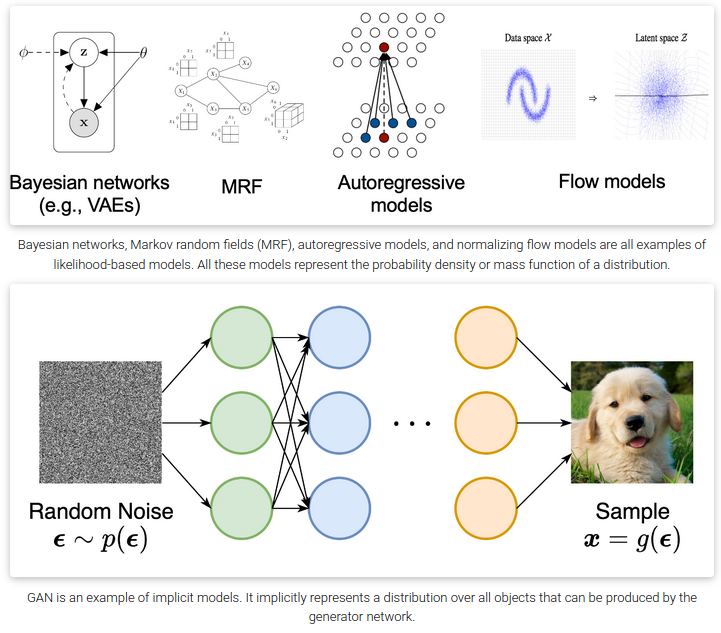
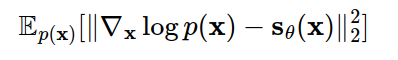
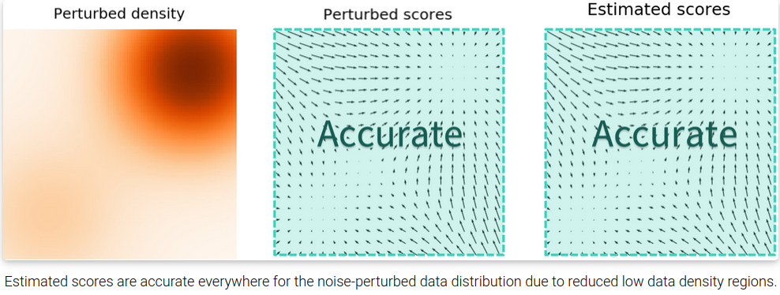
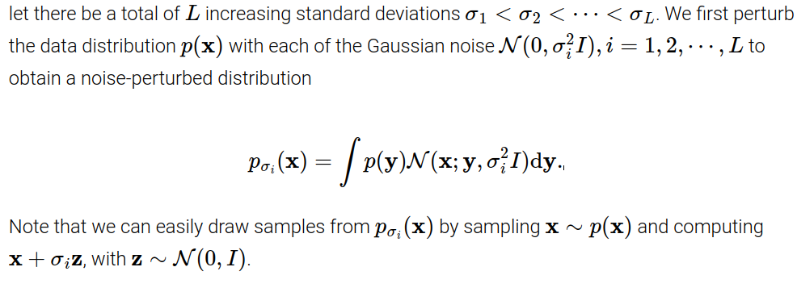
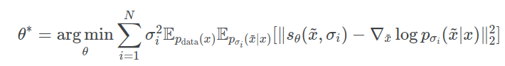
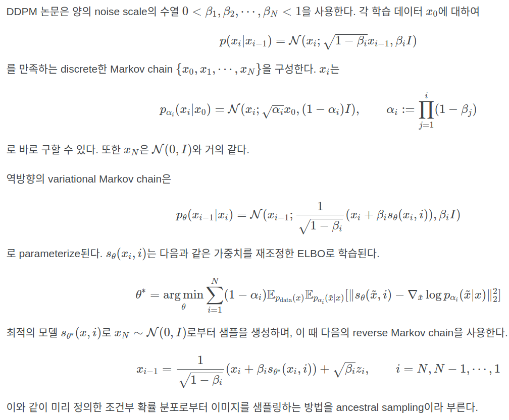
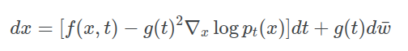
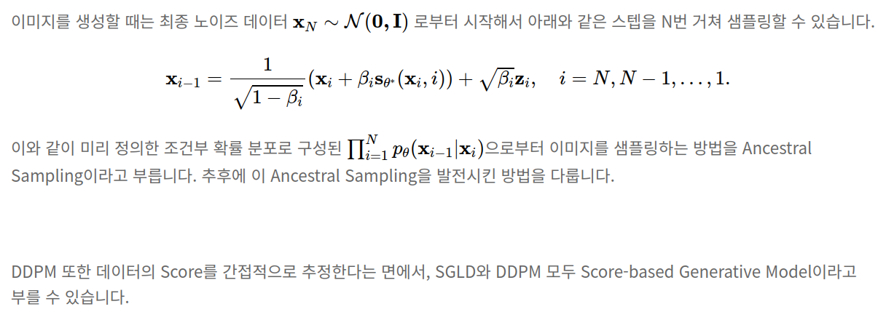

## Score-Based Generative Models
*A representative reference: <a href='https://yang-song.net/blog/2021/score/'>Yang Song blog</a>*

[Intro](#intro) 
[Method](#method) 
[Conclusion](#conclusion) 

> Core Idea

$$ utilize \ \nabla_x \log{p(x)} $$

***

### <strong>Intro</strong>

$$ p(x) = \frac{p(x|y)p(y)}{p(y|x)} $$

- 존재하는 생성 모델은 확률 분포를 표현하는 방법에 따라 두 category 로 분류할 수 있다.
    1. Likelihood-based models
        - 분포의 PDF/PMF 를 (approximate) maximum likelihood 를 통해 직접적으로 학습한다. 
        - E.g., 
          - Autoregressive models (PixelRNN, etc.)
          - Normalizing flow models
          - Energy-based models (EBMs)
          - VAE: 
            - Bayes rule 로 표현한 값의 사후 확률까지 approximation 하고자 했다.
            - ELBO trick 으로 확률 분포를 근사한다.  
    2. Implicit generative models 
        - 확률 분포를 sampling process 로 암시적으로 나타낸다. 
        - E.g.,    
          - GAN: 확률 분포를 직접 근사하지는 않고, 다른 loss 를 이용한다. 이때 이 loss 를 푸는 과정이 암시적으로는 확률 분포를 푸는 문제와 동일하다고 볼 수 있다. 즉, 간접적으로 푸는 형태.

- 하지만, 이 두 가지 방법론은 significant limitation 이 존재한다. 
  - Likelihood-based models
    - Tractable normalizing constant 를 보장해야 해서 model 구조의 강력한 제한이 있거나
      - E.g., causal convolutions in autoregressive models, invertible networks in normalizing flow models
    - Approximate the normalizing constant -> 계산 비용이 많이 든다.
      - E.g., variational inference in VAEs, MCMC sampling used in contrastive divergence
    - Maximum likelihood 를 근사하는 objective 로 설정. 정확한 계산이 아니다.
      - E.g., ELBO of VAE
  - Implicit generative models
    - Adversarial training: Unstable, mode collapse

> Mode collapse: generator 가 다양한 이미지를 만들어내지 못하고, 비슷한 이미지를 생성하는 경우를 말한다. 
>> MNIST 를 예를 들면, mode 는 총 0-9까지 10개이고, generator 는 random noise 를 입력으로 받아서 생성한 이미지가 discriminator 를 속이기를 원한다. 이때, 0-9 의 다양한 mode 를 이용하지 않고 하나의 mode 만 생성하는 것.

> MCMC: Markov chain Monte Carlo

- 본 review 에선, 이런 제한을 우회하면서 확률 분포를 표현하는 다른 방법을 소개한다.
    - Normalizing constant 가 tractable 하지 않아도 된다.
    - Score matching 을 통해, 확률 분포를 직접 배운다. 

$$ \nabla_x \log{p(x)} = Score \ function $$

> score fucntion 은 분포가 밀집되어 있는 방향을 가리킨다. 다시 말해, score function 이 증가하는 방향으로 sampling 을 하면 된다! 

> Normalizing constant
>> 정규화 상수의 개념은 확률 이론 및 기타 영역에서 다양하게 발생한다. 정규화 상수는 확률 함수를 전체 확률이 $1$인 확률 밀도 함수로 변환하는 데 사용된다. 

***

### <strong>Method</strong>
Process: learn score matching -> Langevin dynamics sampling

#### Score fucntion
  
- Dataset $\{x_1,x_2, \cdots, x_N\}$ 이 주어졌을 때, model 이 $p(x)$ 를 배우기를 원한다. 
  - $p(x)$ 를 먼저 표현할 줄 알아야 model 을 통해 근사시킬 수 있다.

$$ p_\theta(x) = \frac{e^{-f_\theta(x)}}{Z_\theta} , \ Let \ f_\theta(x) \ is \ scalar, \ learnable\ parameter\  \theta $$

$$ Z_\theta > 0, \ is \ a \ normalizing \ constant \ dependent \ on \ \theta, \ such \ that \int{p_\theta(x)dx = 1} $$

> $f_\theta(x)$ 는 unnormalized probabilistic model or energy-based model 이라고 부른다. 
- 따라서, maximizing log-likelihood of the data 를 통해 $p_\theta(x)$ 를 학습할 수 있다.

$$ max_\theta \Sigma_{i=1}^{N}{\log{p_\theta(x_i)}} $$

- 하지만, log-likelihood 를 maximize 하기 위해선 $p_\theta(x)$ 가 정규화된 PDF(*normalized probability density function*)여야 한다. 이건 계산상의 어려움을 일으키는데, 우리는 일반적인 $\theta$ 에 대해 일반적으로 복잡한 양인 정규화 상수 $Z_\theta$ 를 계산해야 하기 때문이다.
- 따라서, maximum likelihood 를 가능하게 하려면 likelihood-based model 은 모델 구조를 제한하거나 정규화 상수를 다루기 쉽게 만들기 위해 정규화 상수를 근사해야 했다. 
- Density function 대신 Score function 을 modeling 함으로써, 우리는 intractable normalizing constant 의 어려움을 피할 수 있다. 

> Score function 에 대한 model 을 **Score-based model** 이라고 부른다.

- Score-based model $s_\theta(x)$ 는 Score fucntion 을 학습한다. 
    - $s_\theta(x)$ 가 normalizing constant $Z_\theta$ 에 독립적이라는 것에 주목해야 한다.
    - Normalizing constant tractable 을 보장하기 위해 특별한 모델 구조를 설계할 필요가 없다.

- 즉 loss 는 다음과 같이 정의된다. using Fisher divergence.

- 직접적으로 divergence 를 계산하려고 했지만, $\nabla_x \log{p(x)}$ 를 알지 못한다.
  - 다행히, score matching method 를 통해 ground-truth data score 를 몰라도 Fisher divergence 를 minimize 할 수 있다.

#### Score matching

- Score matching 을 이용하여 loss 를 바꿔주면, real log distribution 을 몰라도 된다. 하지만 여러 번의 backpropagation 을 해야해서 계산량이 많다. 
- 따라서 scalable 하지 않다. 

> Trace: 주대각선 성분들의 합

#### Sampling: Langevin dynamics
Langevin dynamics 
- Score-based model $s_\theta(x) \approx \nabla_x \log{p(x)}$ 을 학습했으면, Langevin dynamics 라고 불리는 iterative procedure 을 통해 sampling 을 하면 된다. 
- Langevin dynamics 는 오직 score function $\nabla_x \log{p(x)}$ 만을 사용해, $p(x)$ 로부터 MCMC procedure 를 제공한다.  
- 구체적으로, 이 방법은 arbitrary prior distribution $x_0 \sim \pi(x)$ 에서 다음을 반복한다.

#### Advanced method
- 지금까지는 score matching 을 사용하여, score-based model 을 훈련하고 Langevin dynamics 를 통해 sampling 을 하는 방법을 살펴봤다. 그러나 이러한 단순한 접근 방식은 실제로는 제한된 성공을 거뒀다. 
- 이제는 score matching 의 몇 가지 문제들에 대해 얘기를 해본다.

- 주요 문제는 적은 데이터 포인트가 존재하는 낮은 밀도 영역에서의 학습은 불완전하기 때문에 추정된 score function 이 부정확하다는 사실이다. 이는 score matching 이 Fisher divergence 를 최소화하도록 설계되었기 때문에 예상된 결과라고 볼 수 있다.  
  - Langevin dynamics 로 sampling process 를 시작할 때, 초기 sample 은 높은 확률로 low density region 에 위치한다. 따라서 부정확한 score-based model 로 인해, sampling 이 올바른 방향으로 진행되지 않는다. 

- 낮은 데이터 밀도 지역에서 정확한 score matching  의 어려움을 우회하는 해결책으로 데이터 포인트에 noise 를 적용하고 noise 가 추가된 데이터 포인트에서 score-based model 을 훈련하는 것을 제시한다. 
- Noise 의 크기가 충분히 큰 경우, 낮은 데이터 밀도 지역에 데이터를 채워 넣어 estimated score 의 정확도를 향상시킬 수 있다. 
  - noise 를 추가하면, 데이터 분포는 smooth 해지기 때문에 어느 정도의 방향성을 제시할 수 있다.
- 그럼 우리가 생각해야 될 것은, '적절한 noise 크기를 어떻게 선택할 것인가' 이다. 큰 노이즈는 분명히 더 많은 낮은 밀도 영역을 포함하여 더 나은 score 를 추정할 수 있지만, 데이터를 지나치게 손상시키고 원래 분포에서 상당히 벗어날 수 있다. 반면 작은 노이즈는 원래 데이터 분포를 적게 손상시키지만 우리가 원하는 만큼 낮은 밀도 영역을 충분히 커버하지 못할 수 있다.  

- 따라서, multiple scaled of noise perturbations 를 제안한다.

- 각 noise-perturbed distribution $\nabla_x \log{p_{\sigma_i}(x)}$ 를 예측하면 된다. 

#### Denoising Score Matching with Langevin Dynamics (SMLD)
- Model score 가 data score 에 잘 matching 되기를 원한다.
- 'Score matching 이 정확한 score 를 계산하는 식이지만 scalable 하지는 않다' 라는 점에서 출발했다.
- 여기선, noisy 한 data 간의 score matching 
- Noisy 하기 때문에 clean data 의 score matching 과 정확하지는 않다.

- 이때의, model 은 *Noise Conditional Score-Based Model* $s_\theta(x,i)$ 로써, NCSN 이라고 부른다. 

$$ s_\theta(x,i) \approx \nabla_x \log{p_{\sigma_i}(x)} , \ for \ all \ i=1,2, \cdots , L$$

#### Sampling: Langevin dynamics

#### Additional Score Matching: Sliced Score Matching

#### DDPM 과의 연관성
- SMLD 와 같은 방법론은 noise 를 점점 증가시켜 가면서 학습 데이터를 특정한 noise distribution 으로 변환한 후, 다시 이러한 noise distribution 으로부터 학습 데이터를 복원하는 방법이라고 설명할 수 있다.
- DDPM 또한, 원본 데이터 분포를 noise 분포로 변환한 후, 다시 이 noise 분포를 원본 데이터 분포로 변환한다는 점에서는 유사하지만, 전체 변환 과정을 명시적인 확률 모델로 이루어진 discrete markov chain 으로 표현한다는 점에서 차이가 있다. 

- Diffusion process 는 다음과 같은 SDE 의 해로 모델링 할 수 있다.

$$ dx=f(x,t)dt + g(t)dw $$

- 여기서 w는 브라운 운동과 같은 standard Wiener process이다. f는 drift coefficient라 불리는 벡터 함수이고 g는 diffusion coefficient라 불리는 스칼라 함수이다.
- SDE는 coefficient가 상태와 시간 모두에서 전역적으로 Lipschitz인 경우 고유하고 강력한 해를 갖는다.

> Lipschitz 함수: 두 점 사이의 거리를 일정 비 이상으로 증가시키지 않는 함수

여기서부터 x(t)의 확률 밀도를 pt(x)로 표시하고 pst(x(t)|x(s))는 x(s)에서 x(t)로의 transition kernel을 나타낸다. (0≤s<t≤T

)

- 일반적으로 $p_T$ 는 $p_0$ 의 정보를 가지고 있지 않은 unstructured prior distribution이다. (ex. 고정된 평균과 분산을 가지는 가우시안 분포.) 다양한 방법으로 데이터 분포가 고정된 사전 확률 분포로 확산하도록 위 식을 이용하여 SDE를 설계할 수 있다.

- $x(T) \sim p_T$에서 시작하여 process를 reverse하여 샘플 $x(0) \sim p_0$를 얻을 수 있다. Diffusion process의 reverse도 diffusion process이며 시간의 반대 방향으로 진행되는 reverse-time SDE는 다음과 같다.

- $\bar w$는 standard Wiener process이고, 시간이 $T$에서 $0$으로 뒤로 흐른다. $dt$는 $0$에 가까운 음의 무한소 timestep이다. 주변 확률 분포의 score $\nabla_x \log{p_t(x)}$를 모든 $t$에 대해 알고 있다면 위의 식으로부터 reverse diffusion process을 유도할 수 있으며, $p_0$에서 샘플링하도록 시뮬레이션할 수 있다.

***

### <strong>Conclusion</strong>
- Advangtage of Score-based generative models
  - GAN-level sample without adversarial training.
  - Flexibel model architecture.
  - Exact log-likelihood computation.
  - Inverse problem solving without re-training models.
- Process
    1. Large number of noise-perturbed data distributions
    2. Learn score function using score matching
    3. Samples with Langevin-type sampling 

***

### <strong>Question</strong>