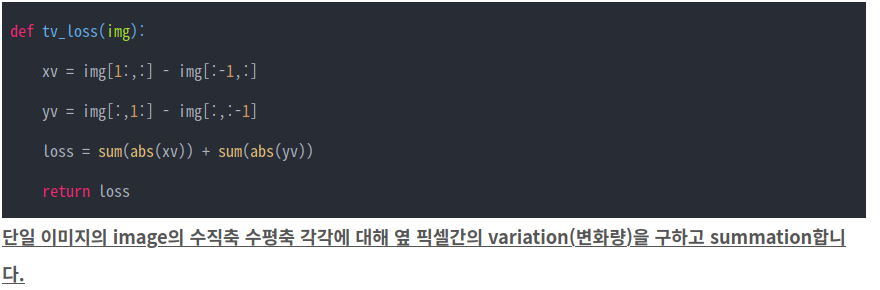
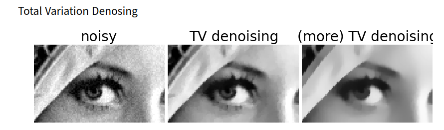
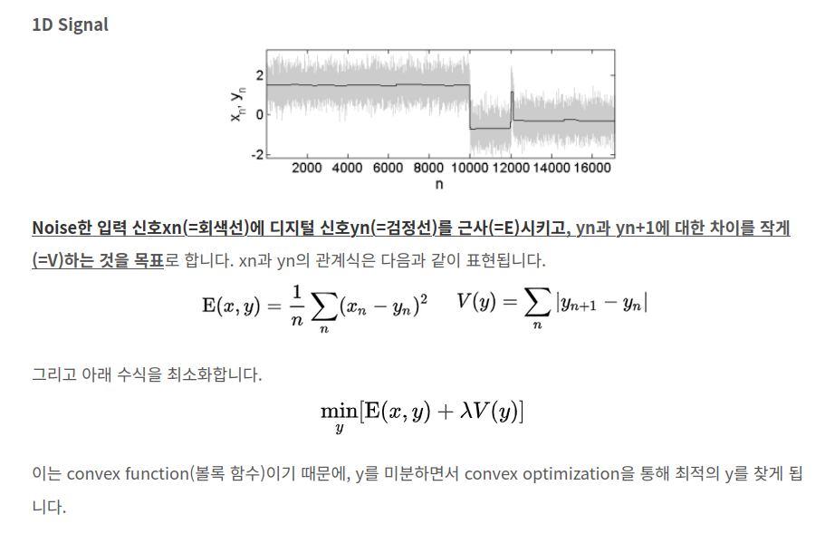

## Total Variation Loss
*For Image Generation*

[Definition](#definition) 

- 이미지 생성 모델에서는 apatial smoothness 를 만드는데 사용된다. 

- Total Variation Denoising
  - 이미지 잡음 제거 기법으로도 사용 가능.
  - Noise 영상에서 signal 의 total variation 을 줄이면, 필요한 경계선을 유지하면서 필요없는 noise 들을 제거한다. 

***

### <strong>Definition</strong>

