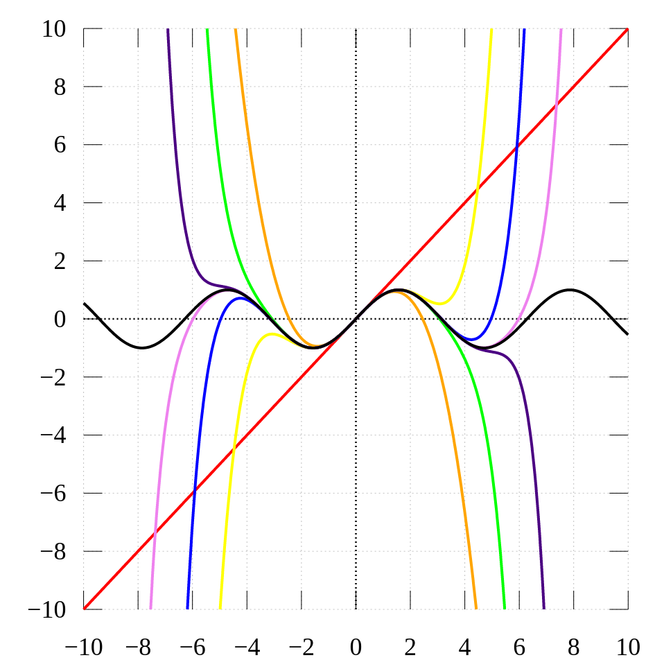

## Taylor 
*Taylor*

[Definition](#definition) 

***

### <strong>Definition</strong>

- Taylor's Series: 복잡하거나 잘 모르는 함수를 다항 함수 (polynomial function) 으로 대체 할 수 있다.
  - 테일러 급수가 성립하기 위한 조건: $y = f(x)$ 함수가 $x=a$ 에서 미분가능해야 한다.
  - 한 번 미분한 거 까지가 first-order 이다.

$$ f(x) = \sum_{n=0}^{\infty} \frac{f^{(n)}(a)}{n!}(x-a)^n = f(a) + \frac{f'(a)}{1!}(x-a) + \frac{f''(a)}{2!}(x-a)^2 + \cdots $$

- Taylor's series 에서 $x=a+h$ 로 치환하고 다시 전개하면 다음과 같다.
  - 즉, $f(a+h)$: $a$ 근처의 점을 $a$ 로 근사하는 것으로 볼 수 있다.
  
$$ f(a+h) = \sum_{n=0}^{\infty} \frac{f^{(n)}(a)}{n!}(h)^n = f(a) + \frac{f'(a)}{1!}(h) + \frac{f''(a)}{2!}(h)^2 + \cdots $$

- $sin$ 함수의 테일러 급수의 수렴($a=0$)을 보여준 것이다. 검은 선은 $sin$ 함수의 그래프이며, 색이 있는 선들은 테일러 급수를 각각 1차($\textcolor{red}{빨강}$), 3차($\textcolor{orange}{주황}$), 5차($\textcolor{yellow}{노랑}$), 7차($\textcolor{green}{초록}$), 9차($\textcolor{blue}{파랑}$), 11차($\textcolor{indigo}{남색}$), 13차($\textcolor{purple}{보라}$) 항까지 합한 것이다.
  - 차수를 늘려가면서 근사하는게 더 정확한 걸 알 수 있다.
  - 테일러 급수가 모든 $x$ 에대해서 근사하는 것이 아닌, $x=a$ 근처에서만 성립한다는 걸 알 수 있다.  
  - $a=0$ 에서의 테일러 급수를 매클로린 급수 (Maclaurin's series) 라고 한다. 

