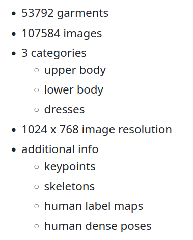
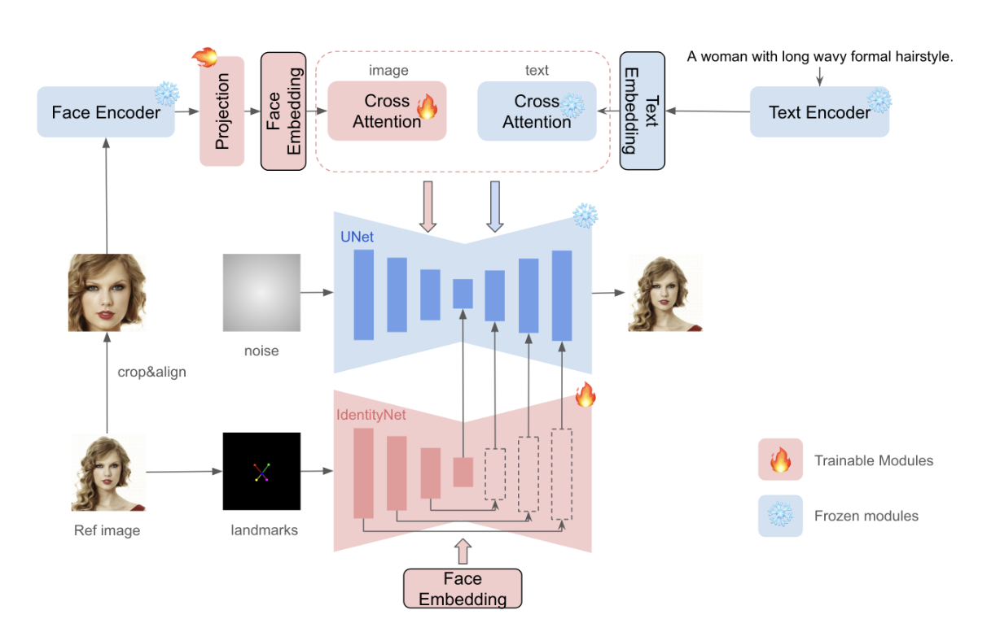
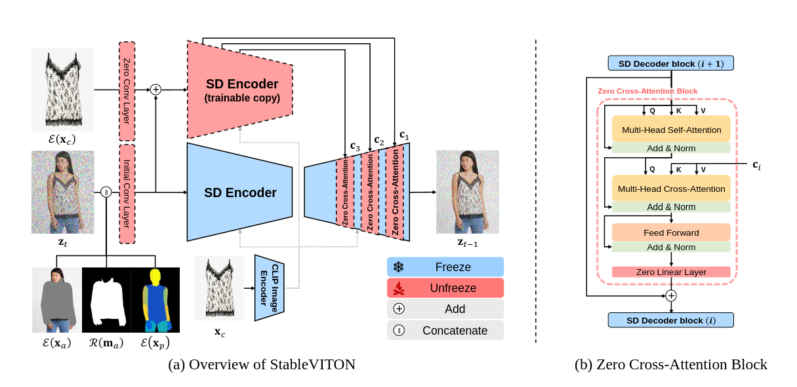
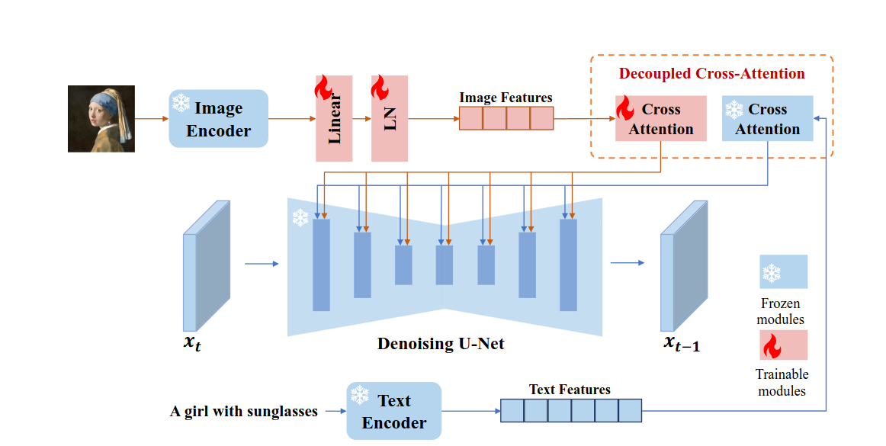
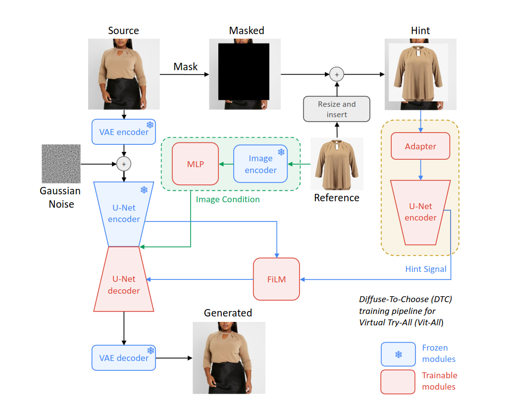
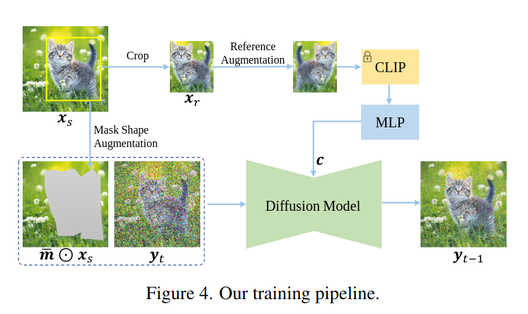

## VITON (Virtual Try On)
*가상 옷 fitting*

<a href='https://github.com/minar09/awesome-virtual-try-on'>Reference Github</a>

[Definition](#definition) 

***

### <strong>Definition</strong>
- Target person 에게 원하는 옷을 가상으로 입히는 task 이다.

### <strong>Type of Task</strong>
- Prompt-based Virtual Try On
  - <a href='../../딥러닝 논문/ControlNet_231018_163832.pdf'>ControlNet</a>
  - <a href='../../딥러닝 논문/Multimodal Garment Designer_231015_171057.pdf'>Multimodal Garment Designer</a>
  - EditAnything
- Image-based (2D) Virtual Try On
  - VITON
  - CP VITON
  - LA-VITON
  - CP-VTON+
  - ACGPN
  - PF-AFN
  - <a href='../../딥러닝 논문/VITON-HD/VITON-HD.md'>VITON-HD</a>
  - Dress Code
  - Single Stage Virtual Try-on via Deformable Attention Flows
  - High-Resolution Virtual Try-On with Misalignment and Occlusion-Handled Conditions
  - C-VTON: Context-Driven Image-Based Virtual Try-On Network
  - <a href='../../딥러닝 논문/TryOnDiffusion/TryOnDiffusion.md'>TryOnDiffusion</a>
  - GP-VTON
  - DCI-VTON
  - LADI-VTON
  - <a href='../../딥러닝 논문/stableVITON/stableVITON.md'>Stable VITON</a>
- Multi-Pose Guided Virtual Try On
- Video Virtual Try On
- Non-clothing Virtual Try On
- Pose-Guided Human Synthesis
- Datasets for Virtual Try On
- In the Wild Virtual Try On
- Etc. (3D Virtual Try On, Mix-and-match Virtual Try On ...)

### <strong>Image-based (2D) Virtual Try On</strong>

- 소비자가 원하는 contents 를 생성하기 위해선 좋은 text prompt 를 작성하는 것은 복잡한 prompt 엔지니어링이 필요한 경우가 많기 때문에 쉽지 않다. 또한, text 는 복잡한 장면이나 개념을 표현하는 데에는 유익하지 않아 콘텐츠 제작에 방해될 수 있다. 
- 그에 반해, 이미지는 텍스트에 비해 더 많은 내용과 디테일을 표현할 수 있다. 

#### <strong>Difficulty</strong>
- 옷을 입혔을 때의 artifacts
- 체형이 바뀜에 따른 옷의 변화 (주름, 근육의 표현 등)
- 옷의 길이에 따른 변화
  - 옷의 길이 조절
  - Target person 이 긴팔을 입고 있는데, 반팔을 입히려면 target person 이 반팔을 부족한 정보 (e.g., 팔의 모양, 길이, 포즈, etc.)를 model 이 채워야한다. 
- 문신 및 시계 등 악세서리의 보존
  - 생성 시에 없어지는 경우가 많다. 
- target person 과 그 배경은 유지한채 옷만 바꿔야 한다.

#### <strong>Training Approach</strong>

#### <strong>Dataset</strong>

크게 $2$ 가지 (VITON-HD, Dress Code) 정도가 존재한다. 

1. VITON-HD ($11,647/2,032$) ($1024 \times 768$ resolution)
2. Dress Code ($1024 \times 768$ resolution)

3. SHHQ-1.0
4. AI hub in Korea

- <a href='https://openaccess.thecvf.com/content_ECCV_2018/papers/Ke_Gong_Instance-level_Human_Parsing_ECCV_2018_paper.pdf'>Densepose</a>

- VITON paper 에서 사용한 dataset set 은 VITON-HD 의 lower resolution 이라고 보면 된다. 
  - $256 \times 192$

#### <strong>Comparison Methods</strong>

VITON-HD, HR-VITON, StableVITON 은 같은 저자라고 보면 된다. 

- Train
  1. VITON-HD: VITON-HD 
  2. HR-VITON: VITON-HD 
  3. StableVITON: VITON-HD & Upper body in DressCode

- Test
  1. VITON-HD: VITON-HD
  2. HR-VITON: VITON-HD
  3. StableVITON: VITON-HD & Upper body in DressCode & SHHQ-1.0 & Web-crawled images

- Exception
  1. TryOnDiffusion: train - $4$ Million sample, test - $6$ K sample

- To DO
  1. PF-AFN
  2. ACGPN
  3. CP-VTON
  4. CP-VTON+
  5. GP-VTON

#### <strong>Evaluation</strong>

1. VITON-HD: SSIM (structural similarity), LPIPS (learned per-
ceptual image patch similarit), FID ( frechet inception distance)
2. HR-VITON: FID, KID, LPIPS, SSIM
3. StableVITON: FID, KID, LPIPS, SSIM

- Paired setting: person/original clothing
  - Use SSIM, LPIPS
- Unpaired setting: person/different clothing 
  - Use KID, FID

- Exception
  1. TryOnDiffusion: FID, KID
  2. VITON: IS

#### <strong>My Method</strong>

$\textbf{Problem 및 전개}$

1. 기존의 방법들: $2$ stage system
   1. 우리가 ai를 쓰는 이유는 복잡한 전처리(hand crafted feature) 를 하지 않고, 간단하면서도 간편한 입력만으로도 처리할 수 있는 능력을 가진 ai를 활용하는 것. 하지만 기존의 방법들은 투스테이지로, 후처리도 해야하고, 학습할때 모델 여러개를 복합적으로 엮어서 해야한다.

2. Diffusion Model 의 등장
   1. 최근에는 diffusion model이 강력하면서도 놀라운 생성능력을 보여줌.

3. Controlling Generative model.
   1. Controlnet 및 다양한 통제 기법들 소개하면서 controlnet 장단점 자세히 설명
   2. 하지만 controlnet도 모델 구조상 Image-based VITON task에 적합하진 않다.
      1. Text driven 이기 때문에 input 이 image 가 아닌 noise 이다. Noise 에서 시작함
      2. 심지어 text 는 해당 task 에 필요가 없다.
      3. Input 에 noise 하나만 들어가서 (적어도, cloth-agnoistic image 가 같이 들어가야 된다) target person 의 정보를 줄 수 없으니 target person 자체를 정의할 수도 없고 보존할 수도 없다. 

$\textbf{We Want}$

1. 적은 데이터셋에도 학습이 잘 되는 모델 $\rightarrow$ trainable parameter 가 적은 model
2. 배경이 복잡해도 작동하는 model
3. 상하의 다 적용가능할 뿐만 아니라, full body 여도 처리가능한 모델
4. 사람/옷의 detail (시계, 문신, 옷 색깔 조합 등) 이 보존되는 모델 
   1. target person detail 의 손실 발생 원인: agnostic-v3.2 가 상반신을 다 덮어서 시계나 문신이 가려지기 때문이다. 
   2. 이 경우, inference 때에는 해당 부분에는 mask 를 칠하지 않고 진행?

$\textbf{Solution}$

- Method
  - Zero-Kernel: image-encoder 도 person info 를 받을때에는 해당 부분을 그대로 이용하면 된다. 
  - Condition
    - 1. cloth
    - 2. agnostic_mask: 왜 필요하지
      - agnoistic_mask 만 다운 샘플링해서 들어간다. 
    - 3. image-densepose: pose, shape info of target person 
    - 4. agnostic-v3.2: target clothing region 을 제외한 나머지 정보 제공 (e.g., 배경, 바지에 대한 모든 정보, 얼굴, etc.)
    - 5. Canny edge: 원본을 보존할 순 없고, 형태를 보존한다. 
      - Canny edge 는 target person info 보단, target person cloth info 를 더 많이 제공을 한다. Train 시에는 target person cloth 와 cloth 가 같아서 상관 없겠지만, test 에는 target person cloth 와 cloth 가 달라서 잘못된 정보를 받을 가능성이 있다. 따라서 image-densepose 가 적합하다. 
  - Implicit Warping: person info 가 들어가야 한다.
  - Image-encoder: ControlNet 구조를 사용하면 CLIP image encoder 를 사용해서 condition 으로 받을 수 있어야 한다. 
    - 어떤 image 를 ControlNet 에 줄까
    - 어떤 image 를 CLIP image encoder 에 줄까
    - 어떤 image 를 ControlNet 과 CLIP image encoder 에 concat 할까
    - CLIP image encoder 의 경우, self-referencing 을 걱정하지 않아도 된다. 즉, 정보 병목 현상을 제거해도 된다. ([CLS] token 만 사용하는 것이 아닌, 모든 token 을 사용해도 됨)
      - 1. Paint-by-Example 과는 달리 input 과 reference 가 완전 동일하지 않다. 
      - 2. 일반적으로 clothing 을 warp 해야 하니, 복사 및 붙여넣기가 안된다. 
      - 다음과 같이 진행하면, 옷의 대한 정보를 더 잘 추출할 수 있다. 
  - Augmentation: Paint-by-Example 과 달리 self-referencing 이 아니여서 strong augmentation 이 아닌 rotation/flip 과 같은 간단한 거를 사용해도 된다. (in Diffuse to Choose)

- Component.            
  - 1. Controlnet.
    - ControlNet 은 입력 제어 맵에서 내용을 인식하는 능력이 강력하다. 즉 강력한 인식 능력을 가지고 있어서 어려운 조건 (e.g., image 가 불명확한 것처럼 정보가 부족한 상황)에서도 잘 작동한다. 
    - 사실 다른 인코더도 사용할 수 있지만, 목표에 따라 다르다. 즉, 제한 조건이 많은 해당 task 의 경우 강력한 인코더가 필요하다.             
      - <a href='https://github.com/lllyasviel/ControlNet/discussions/188'>관련 실험</a>
      - Controlnet 은 SD model 을 copy 하는 거여서 어쨌든 condtion 이 들어가야 한다. 즉, ControlNet 을 사용하려면 ControlNet 말고도 condition 은 무조건 존재해야된다.  
  - 2. Image-Encoder (CLIP-Image encoder/ControlNet)         
    - **ControlNet (prompt-based) 은 Image-based VITON 에 적합한 구조는 아니다.** $\rightarrow$ 하지만 이 구조 자체가 robust architecture 인 것은 맞음.
    - CLIP-Image encoder 는 $224 \times 224$ 라 resolution 에 맞는 detail condition 을 뽑기가 어렵다.
  - 3. Zero-Kernel
    - 입력을 줄 때, noise 뿐만 아니라 다른 정보들도 concat 을 하는데 이때 이 정보들을 짧게 처리해서 넣어주는 건 정보를 온전히 받아들일 수 없다. $\rightarrow$ **Zero-Kernel**
    - 예시로, Stable-VITON 의 경우 initial conv 로 concat 한 정보들을 처리해서 SD Encoder 로 넣어주려면 $4$ channel 로 압축해야하는데 이는 정보 손실이 일어나는 구간 (병목현상)으로 볼 수 있고, 게다가 SD Encoder network 는 freeze 라 concat 한 새로운 정보를 제대로 받지 못할 수 있다. 즉, Condition의 정보를 제대로 흡수해야한다

- Training Approach: 
  - Fine-tuning vs Parameter-efficient 
    - Use LoRA
  - Freeze U-Net vs Unfreeze
    - Out-of-Distribution data 가 들어오면 U-Net 은 생성 능력이 떨어진다. 따라서 U-Net 도 학습은 해줘야 한다. 
  - Train Cross-attention/Self-attention
    - Existing SD model 은 text-encoder 에 대해서 학습되었다. 즉, 적어도 cross attention 은 학습해야 하고자하는 task 에 맞춰서 domain shift 가 될 것이다.
      - Ref. IP-Adapter: text encoder $\rightarrow$ image encoder 로 바꿈으로써 cross-attention 학습  
    - Self-attention: 마찬가지로 학습 data 가 fashion image 이므로 fashion domain 에 맞게 학습해야 한다. 
    - Ref. prompt-to-prompt: spatial layout and geometric 이 cross-attention 에 의존한다. 
    - Ref. Textual Inversion: text embedding 만 학습하기 때문에, text embeding 을 아무리 최적화 시켜도 diffusion model 이 학습한 distribution 에 없으면 생성하기가 힘들다. 따라서 diffusion model 도 어떤 방식으로든 학습시켜야한다. 

- Additional method
  - 1. Loss function: Total Variation Loss, Perceptual Loss etc.

- Tip
  - One-stage 로 하려면 결국 warped cloth image information 을 implicit 하게 학습해야 한다. 그러기 위해선 사람 이미지 정보를 줘야 한다. 
    - E.g., StableVITON: ControlNet input 에 사람 정보 더해주기
  - **Image 장 수가 적으니까 trainable parameter 가 많으면 안된다.** 

$\textbf{Final Method}$

- (?)

$\textbf{First Experiment}$

1. Stable diffusion model v1.5 + CLIP image encoder + Zero-kernel + classifier-free guidance

2. Augmentation, target person info

3. vs full fine-tuning

**고려 사항**
- Uncond probability: $0.1$ / $0.2$

$\textbf{Therefore}$

1. Robust (augmentation, 모델 구조 개선을 통한 확실한 정보 흡수) 
2. Reasonable (method 전개) 
3. Generalization (상하의 가능, 복잡한 배경, 풀바디)
4. Parameter efficient fine-tuning
5. Clothing detail 과 target person detail (e.g., 시계, 문신 등)

$\textbf{Reference Architecture}$

- Instant ID

- StableVITON
  - Warping clothing 을 만들기 위해 ControlNet input 에 person info 를 concat 한다.

- IP-Adapter

- Diffuse to Choose paper
  - Warping clothing 을 만들기 위해 pixel-level 의 hint 를 제공한다. 

- Paint-by-Example

$\textbf{Question}$

- Condition info 는 성능 향상에 도움이 되고 guide 하기 좋다. 하지만 너무 많은 condition 은 제약이 있다는 말과 동일하여 실제 환경에서는 사용하기 어려울 수 있다. Condition 이 얼마나 잘 주어지냐에 따라 성능 변동 요인이 많아질수도 있다. 
  - Generative model 의 성능이 올라갔다면, 그에 따라 condition 을 real env 에 맞게 간편하게 바꿀 필요가 있지 않을까?

### Related Work

*VITON paper 의 다른 related work 를 보고 추가하자*

- DreamPaint: Dreambooth 를 이용하여 text token 에 subject 를 binding 시키고 inpainting model 을 이용하여 Virtual try-on 을 하는 method 를 제안했다. 
  - Item 의 detail 을 잘 보존하지만 real-time application 에 최적화되어있지 않다. 

- Paint by Example 은 zero-shot setting 에서 작동하며 in-the-wild image 도 처리할 수 있다. 그러나 reference image 의 [CLS] token 만을 활용하는 conditioning process 에서 information bottleneck 이 발생합니다. 
  - 이 제약으로 인해, reference image 의 일반화가 지나치게 이루어지며, 필수적인 세밀한 세부 정보를 유지할 수 있는 모델의 능력이 저하됩니다.

- VITON: Two-step (synthesis and refinement process), 초기에 생성된 coarse image 와 desired clothing 을 이용하여 detaile 을 강화시키기 위해 refine 한다. 
- VITON-HD: higher-resolution image 에 초점을 맞췄고 misaligned parts 를 정렬시키기 위해 alignment-aware segment normaliaation 를 사용한다. 
- TryOnGAN: pose conditioning 을 사용하지만 purely latent model 에 의존하여 의류를 표현할 때 종종 세세한 세부 사항이 부족하다. 
- TryOnDiffusion: pixel-level diffusion model 에 dual U-Net 으로 접근했다. 가상 시착에 대해서는 인상적인 성능을 제공하지만 in-the-wild example 에는 어려움을 겪고있다. 상의만 지원하며, 실시간 사용에 적합하지 않다. 
- 실제 사용 사례에서 실시간 추론을 보장하기 위해서는 latent diffusion approach 가 필요하다.
- Diffuse to Choose
  - Pose conditioning 을 도입하여 이를 완화할 수 있지만, 본 논문은 virtual try-all 이기 때문에 더 넓은 적용 가능성을 위해 task-specific auxiliary input 보다 일반적인 목적을 우선시했다.
  - 더 큰 image encoder 사용 (모든 token 사용)
  - Perceptual loss 사용
  - Hint signal: reference image 로부터 pixel-level 의 세밀한 세부 정보를 main U-Net 으로 전달