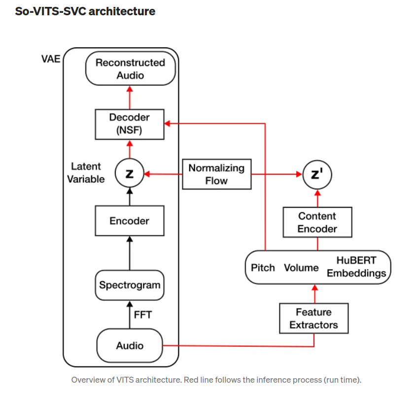

## Voice-Conversion
*Voice-Conversion*

[Definition](#definition) 

<a href='https://medium.com/qosmo-lab/state-of-the-art-singing-voice-conversion-methods-12f01b35405b'>Overall Description</a>

***

### <strong>Definition</strong>

- Voice Conversion (VC): source speaker의 입력 음성을 말의 의미 (linguistic content) 변화 없이 마치 target speaker가 말하는 것처럼 만드는 task다. VC는 데이터 조건에 따라 parallel VC와 non-parallel VC로 나눌 수 있다.
  - Parallel VC 방법론은 같은 말 (linguistic content)을 다른 여러 사람들이 발음한 데이터셋에 대해 설계된다. 이 경우, source speakers의 acoustic features를 target speakers의 features로 맵핑하는 acoustic models는 직접적으로 학습될 수 있다. Linguistic features가 동일하다고 생각하면 직관적으로 이해가능하다.
  - Non-parallel VC은 사람들마다 하는 말이 대부분 다른 데이터셋에 대해 설계된다. 당연히 parallel VC의 경우보다 더욱 challenging하다. Non-parallel VC는 크게 두 가지 카테고리로 나눌 수 있다. 첫 번째 카테고리는 non-parallel 조건을 parallel 조건으로 변환하고 parallel 방식처럼 mapping 함수를 학습하는 것이다. 예로, TTS (text-to-speech synthesis)를 통해 parallel 데이터를 생성하는 방식이 있다. 두 번째 카테고리는 linguistic representations와 speaker related representations를 분해한다 (factorize). 그러면은 conversion stage에서 source speaker의 linguistic content는 보존되는 반면 source speaker의 speaker representation은 target speaker의 representation으로 변형된다. 이것이 이 논문에서 제안하는 방법론의 카테고리다.

- Singing Voice Conversion (SVC): 가수 A(소스 보컬)의 보컬을 가수 B(대상 가수)처럼 들리도록 변환하는 작업을 다룬다. 이러한 기술은 단순히 좋아하는 가수처럼 노래를 부를 뿐만 아니라 새로운 음성 품질을 형성하고 창조한다.
  - SVC 모델은 원본 시그널에서 content feature를 추출하는 content encoder와 content features를 acoustic feature나 waveform으로 변환시키는 conversion model로 구성된다.
  - SVC는 음성 변환 (VC)과 유사하며 일반적인 언어에 대한 VC와 달리 SVC는 소스 보컬과 유사한 음성 피치로 노래 부르기에 중점을 둔다. 다른 유사한 분야로는 멜로디 라인과 가사에서 노래 목소리를 생성하는 Singing Voice Synthesis (SVS)이 있다.

- Parallel (one-to-one) SVC: 특정 가수의 노래를 다른 특정 가수로만 변환할 수 있는 시스템을 나타낸다.
- Non-parallel SVC
  - Any-to-one: 누구의 소스 보컬이든 대상 가수의 것으로 변환
  - Any-to-many: 다양한 대상 가수의 것으로 여러 가수의 보컬을 변환
    - E.g., FastSVC

- SVC의 목표는 언어적 내용, 음조 (남성에서 여성 또는 여성에서 남성으로 변환되는 경우 음조는 종종 이동됨), 및 동역학 (음량)을 유지하면서 보컬을 다른 사람의 것으로 변환하는 것이다. 따라서 이러한 요소들을 어떻게든 분리해야한다 (disentangle). Any-to-any SVC의 경우 가수 특성은 가수 ID로 인코딩되어야 한다 (스피커 A = 0, 스피커 B = 1, ...). 반면에 any-to-one SVC의 경우 생성자 네트워크는 단일 대상 가수만 모델링하므로 걱정할 필요가 없다.

- 나머지 요소들은 가수와 무관한 것으로 간주되며 SVC에 유용할 것이다. 볼륨은 RMS로 계산될 수 있으며 pitch (음조 또는 더 정확히는 기본 주파수)는 Harvest (PyWORLD에서 사용 가능), CREPE (pytorch 구현), 또는 PENN과 같은 방법으로 계산될 수 있다. 그러나 언어 정보의 표현을 얻는 것은 종종 어렵다. 소스 오디오를 transcribe 하고 가사 형태로 언어적 콘텐츠를 얻는 것이 단순한 방법일 수 있다. 그러나 이로 인해 언어적 콘텐츠의 일부 (강세, 전달 등과 같은 추가 언어 콘텐츠)가 손실될 수 있다 (또한 텍스트와 오디오 간의 시간 정렬과 같은 문제도 있다). HuBERT 및 ContentVec와 같은 신경 표현 학습 방법은 더 풍부한 음성 표현을 위해 사용될 수 있다.

- So-VITS-SVC: Soft-VC, VITS 및 Neural Source Filter (NSFs)의 조합
  - Soft-VC 이전에 HuBERT가 음성 표현으로 사용될 수 있다고 언급했습니다. SVC에서의 많은 이전 연구는 특징 추출기 네트워크 (HuBERT와 유사한)를 사용하고 나서 이산화된 음성 단위를 얻기 위해 k-평균 클러스터링을 수행했습니다. 이 이산화는 음성 단위에서 화자의 영향을 제거하는 효과적인 방법입니다. 그러나 Soft-VC의 저자들은 이 이산화가 실제로 발음의 일부 언어 정보를 파괴할 수 있어 발음 오류로 이어질 수 있다고 발견했습니다. 따라서 저자들은 이산 단위 위의 분포를 예측하기 위해 훈련된 선형 투영 레이어를 사용하는 것을 제안합니다. 결국, Soft-VC는 생성된 음성의 명료성과 자연스러움을 향상시킵니다.
  - VITS는 최첨단 음성 합성 방법입니다. 꽤 복잡하므로 모든 세부 사항을 설명할 수는 없습니다. 먼저 확률적 잠재 표현 오디오를 학습하기 위해 변분 오토인코더 (VAE, 이 기사 참조)를 활용합니다. VAE는 SVC에서 미처 못 본 조건에 대한 일반화 능력을 향상시킬 수 있다고 제안되었습니다. 그런 다음 일반화된 조건에서 오디오 및 음성 표현의 잠재 표현 간의 역함수 매핑을 학습하기 위해 정규화 플로우를 사용합니다. 실행 시에 음성 표현은 VAE 잠재 변수로 변환되고 이후 오디오로 디코딩됩니다. 이는 합성 품질을 향상시키기 위해 GANs와 유사한 판별자 네트워크를 특징으로 합니다.
  - Neural Source Filter 신경 원본 필터 (NSF)는 인간 목소리의 소스-필터 모델에 기반합니다. 기본적으로 성대는 진동 펄스 소리를 생성하며 이는 그 후 목소리 트랙트에 의해 필터링됩니다. NSF는 유사한 방식으로 오디오를 생성합니다. 기본 주파수를 기반으로 사인파가 생성됩니다. 그런 다음 컨볼루션 블록을 사용하여 고조파가 추가됩니다. 사인파 대신 흰 소음이 입력으로 컨볼루션 블록에 공급됩니다.
  - 중요한 점은 NSF가 명확하고 단일 피치를 갖는 소리에 대해서만 처리할 수 있다는 것입니다. 따라서 이는 목소리에 이상적이지만 피아노 연주와 같은 다중 음향의 오디오에는 사용할 수 없습니다.

### <strong>Component</a>
- Fourier Transform: 신호를 individual frequencies 와 frequency's amplitude 로 분해가능
  - 시간 도메인의 신호를 주파수 도메인으로 변환한다. 그 결과가 Spectrum

- 음성 파일 (wav): 특정 시간 내에서, 어떤 지점의 음압을 측정한 것이다.
  - 이때, 일정한 시간 간격으로 음압을 측정하는 주파수를 sampling rate 라고 한다. 
  - 채널의 개수: 녹음한 마이크의 개수

- STFT (Short Time Fourier Transform)
  - 음성을 작게 (0.01 sec 수준으로) 잘라서 각 작은 조각에 푸리에 변환을 적용
  - 음성 신호를 푸리에 변환을 하면 각 주파수 성분을 분해할 수는 있지만 시간 정보가 손실되어서 음성합성 & 인식에 이용하기에는 적절하지 않다.
  - 따라서, 음성 데이터를 시간 단위로 짧게 쪼개서 FFT 를 해준다.

- Spectrogram
  - $x$ 축은 시간, $y$ 축은 주파수, 해당 $(x,y)$ point 의 pixel 값은 진폭을 나타낸다. 즉, $z$ 축이 진폭

- Mel-Spectrogram
  - Spectrogram 에 mel-filter 라는 filter 를 적용해서 얻는다.
  - 이는 사람의 청각 기관이 저음에서 주파수 변화에 민감하고 고음에서는 주파수 변화에 덜 민감한 특징을 반영한다. 
  - 또한, Spectrogram 보다 크기가 작아서 학습 속도에서도 유리하다.

$$ Mel(f) = 2595 \log(1+\frac{f}{700}) $$

- Pitch: 음의 높낮이, 진동수 HZ 의 크고 작음과는 다르다. 좀 더 추상적인 개념

- Sampling rate
  - $2400$: $1$ 초에 음성 신호를 $2400$ 번 sampling 했다는 뜻이다.