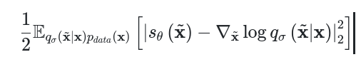

## Pixel-Wise Independent Learning
*in image generative models*

[Definition](#definition) 
[Update Definition](#update-definition)

***

### <strong>Definition</strong>

- 생성 모델에서 구하고자 하는 것은 데이터의 분포인 $p(x)$ 이다. 이 $p(x)$ 에서 확률 변수는 이미지 $x$ 이다. 이때, $p(x)$ 는 각 픽셀들을 확률 변수로 보고 다변수 확률 분포 (확률 변수가 여러개)로 표현할 수 있다. 또한, 다변수 확률 분포를 표현하기 위해 결합확률분포 (확률 변수들이 동시에 발생) 로 볼 수 있다. 이때, 일반적으로 각 픽셀간의 독립을 가정한다. 즉, 각 픽셀이 생성될 때 서로 영향을 주지 않음.

$$ p(x) = p(x_1,x_2, \cdots , x_{100}) = p(x_1) \times p(x_2) \times \cdots \times  p(x_{100})  \\ where, \  x \in R^{10 \times 10} $$

- 이미지의 차원이 $10 \times 10$ 이라면, 이미지 $x$ 는 $100$ 차원의 한 점이다. 우리는 이 점들의 분포를 알고 싶은 것이다. (e.g., 이미지 $1000$ 장의 sample($1000$ 개의 점) 을 가지고 있다면 이 $1000$ 장은 $p(x)$ 에서 sampling 된 값으로 볼 수 있다.) 이때, 이 점은 $10 \times 10$ 이라는 high dimension 을 가지는 점이다.
- 그럼 이미지 생성 모델에서, 결합확률분포에 대해 학습을 진행하는가? 
  - 아니다. pixel-wise independent learning (이후에 설명) 으로 인해, 사실상 $p(x_1,x_2, \cdots, x_{100})$ 을 한 번에 학습하는 게 아니라 $p(x_1), p(x_2),\cdots, p(x_{100})$ 을 각각 학습한다.
- 그럼 이미지에 노이즈를 추가할 때, 각 픽셀에 대해 서로 다른 노이즈를 더하는 이유는 뭘까? (같은 분포에서 sampling 된 노이즈) 
  - 바로, 이미지가 스칼라가 아닌 픽셀들의 배열이기 때문이다. 대부분의 경우, 각 픽셀은 해당 위치에 대한 정보를 나타내고 이미지를 생성하는 동안 각 픽셀은 모델에 의해 독립적으로 조작되고 생성되며 (각 픽셀은 pixel-wise independent learning 을 가정. 확률에서의 독립과는 다르다.) 다른 픽셀에 대한 정보나 특성은 직접적으로 공유되거나 전파되지 않는다. 이러한 독립적인 처리 방식은 모델이 이미지의 다양한 부분을 동시에 고려하고, 각 픽셀에 대해 독립적으로 다양한 특성이 생성될 수 있도록 한다. 또한, 이미지 생성에 있어서 모델이 더욱 복잡하고 다양한 패턴을 학습할 수 있다.
  - $Noise \sim N(0,I)$ 표준 정규 분포일 때, 노이즈가 더해진 이미지는 여전히 다변량 가우시안 분포이자 결합 확률 분포로 표현이 가능하다. 이때의 각 픽셀의 평균은 이미지를 sampling 했을 때의 픽셀 값 즉, $x_1,x_2,x_3, \cdots$ 가 된다. 분산은 동일하고 각 픽셀이 확률적으로 독립이니 완전한 원의 분포 형태를 가진다.

- pixel-wise independent learning 은 각 픽셀에 대한 확률 분포를 독립적으로 학습하는 것이다. 즉, 각 픽셀에 대한 확률 변수를 각각 독립적으로 모델링하고 학습한다. 따라서 $p(x_1,x_2,x_3, \cdots)$ 를 한 번에 학습하는 것이 아닌, $p(x_1),p(x_2),p(x_3), \cdots$ 처럼 개별적으로 학습을 한다. 이렇게 하면 각 픽셀의 특징과 패턴을 독립적으로 학습할 수 있고, 모델 구현이 단순해진다. 반면에 이 방식은 픽셀 간의 상호 작용을 무시하게 되므로, 이미지의 공간적 구조나 의존성을 고려하지 않는다는 단점이 존재한다. 따라서 문제에 맞춰 픽셀 간의 관계를 잘 모델링 할 수 있는 방법이나 구조를 고려해야 한다.
  - 예로, 모델 구조를 통해 pixel-wise independent learning 의 단점을 개선할 수 있다. Kernel 을 이용해 인접한 pixel 간의 공간적 정보를 담을 수 있는 CNN 이나 attention 구조를 통해 다른 pixel 간의 관계를 살펴볼 수도 있다.
- 그럼 왜 픽셀마다 개별적인 학습인가? 
  - loss fucntion 을 뜯어 보면 자세히 알 수 있다. 일반적으로 픽셀마다 값을 뽑은 뒤에 (이미지니까 $2$ or $3$ 차원) 같은 차원의 어떤 값 (e.g., noise) 를 빼주고 전체적으로 평균을 낸다. 이 과정에서 특정 픽셀이 다른 픽셀들과 상호작용을 한 것은 평균을 내기 위한 덧셈과 나눗셈이다. 실제로 결합확률로 해당 픽셀값을 샘플링하려면 그에 맞는 수식을 바탕으로 풀어써야하는데 그런게 없이 단일 확률에서 샘플링했다.
  - 개별적인 학습이 이해가 안된다면 generative model 의 목적 함수에서 일반적으로 나타나는 $\Vert \text{objective fucntion} \Vert_2^2$ 을 보자. Norm 을 구하는 것 자체가 이미 각 픽셀을 학습과정에서 개별적인 원소로 보고 각 확률적인 오차를 제곱하여 계산한다는 의미이다. 제곱하고 더하는 이 연산이 과연 픽셀 간의 상호작용을 고려한 것일까.

> Objective Function of Denoising Score Matching 

> Objective Function of DDPM

### <strong>Update Definition</strong>

*p(x) 를 모르는 상태인데, 아무런 근거없이 확장하여 픽셀에 대한 확률 변수로 표현한 것이 잘못이다.*

이미지 생성 분야에서 데이터 분포 $p(x)$ 를 추정하기 위해 활용하는 방법은 

크게 3 가지인거 같다. 

1. 베이지 룰

2. 깁스 분포 in score-based/energy-based

3. x 를 특정 확률 변수들로 쪼개서 $p(x)$ 를 계산. 
  - 즉, $p(x)$ 를 다변수 확률 분포이자 결합확률분포로 본다. 
  - 원래라면, $p(x)$ 는 알 수 없는 분포이기 때문에 $x$ 자체를 쪼개는 게 말이 되지 않는다.
  - 이렇게 쪼개는 것 자체가, $p(x)$ 에서 $x$ 를 결정하는 요인을 내가 결정하는 것이라고 볼 수 있다. 
  - E.g., $p(x)$ 를 결정하는 확률 변수는  
    - $R,G,B$ channel 이다. 
    - pixel 값 
    - (사람 눈, 사람 코) in 사람 데이터
  - E.g., Autoregressive models (pixelCNN/pixelRNN)

- 이 review 에서 살펴볼건, **1. & 2.** 에 대해서라고 볼 수 있다. 정확히는, $p(x)$ 를 모르기에 noise 를 이용하여 내가 표현할 수 있는 분포로 추정하는 방법들에 대해서 언급하고자 한다.

- Score-based model 중 NCSN 에 대해서 얘기를 해보자. 
  - 다음의 목적함수에서 $q_{\sigma}(\tilde{x}|x)$ 는 $x + z$, $x$: image data, $z \sim N(0,\sigma^2 I)$ 로 표현되는 확률 분포여서 
  - $q_{\sigma}(\tilde{x}|x) \sim N(x,\sigma^2 I)$ 를 만족하는 다변수 가우시안 분포가 된다. 이때 다변수 즉, 확률변수들은 각 픽셀이 된다. 주목해야 되는 건, 노이즈를 사용해서 픽셀에 대한 확률 분포로 표현하면서 $p(x)$ 와는 달리 정확하게 분포를 표현할 수 있는 것이다. ($x$ 를 확률 변수 (픽셀)로 쪼갤 수 있게 된다 $x_1,x_2,x_3, \cdots$)
  - 이때, noise 를 각 pixel 마다 독립적으로 더해주기 때문에 (일반적으로 noise 를 더해줄때, $N(0,\sigma^2I)$ 를 가정하는데 분산에 단위 행렬이 곱해진 걸 보면 독립이라는 걸 알 수 있다) 다변수 가우시안 분포의 공분산 행렬의 비대각 원소는 $0$ 이 된다. 
  - 심지어 각 pixel 마다 동일한 노이즈를 더해주기 때문에 공분산 행렬의 주대각 원소는 동일하게 $\sigma^2$ 이다.
  - 주대각 원소가 동일한 배열의 역함수는 각 원소에 역수를 취한 값이다.
  - 다변수 가우시안 분포 값은 스칼라 값이다. 
  - 다변수 가우시안 분포는 일변량 정규분포를 둘 이상의 변수로 일반화한 것 이다. 즉, 확률 변수를 쪼갠것
  - $x \in R^{d \times 1}, \mu \in R^{d \times 1}, \varSigma \in R^{d \times d}$
> Objective Function of Denoising Score Matching 

 

$$ N(x ; \mu, \Sigma) = \dfrac{1}{(2\pi)^{d/2} |\varSigma| ^{1/d}} \exp \left( -\dfrac{1}{2} (x-\mu)^T \varSigma^{-1} (x-\mu) \right) $$

- 위의 조건들을 바탕으로 풀어쓰면,

$$ N(x ; \mu, \varSigma) = \dfrac{1}{(2\pi)^{d/2} |\varSigma| ^{1/d}} \exp \left( -\dfrac{1}{2} \frac{(x-\mu)^2}{\sigma^2}  \right) = \dfrac{1}{(2\pi)^{d/2} |\varSigma| ^{1/d}} \exp \left( -\dfrac{1}{2} \sum_{i = 1}^{d}\frac{(x_{i}-\mu_{i})^2}{\sigma^2}  \right) $$

- Notation 을 NCSN 에 맞춰주면, 

$$ N(\tilde{x} ; x, \varSigma) = \dfrac{1}{(2\pi)^{d/2} |\varSigma| ^{1/d}} \exp \left( -\dfrac{1}{2} \frac{(\tilde{x}-x)^2}{\sigma^2}  \right) = \dfrac{1}{(2\pi)^{d/2} |\varSigma| ^{1/d}} \exp \left( -\dfrac{1}{2} \sum_{i = 1}^{d}\frac{(\tilde{x}_i-x_i)^2}{\sigma^2}  \right) $$

- 공분산 행렬의 비대각 원소는 $0$ 이고, 주대각 원소는 동일할 때의 역함수 계산

 

 

- 다음의 조건들을 바탕으로 목적 함수를 풀어쓰면, 다음과 같다.
  - $\nabla_{x}\log$ 를 주의

$$ Loss = E_{q_{\sigma}(x, \tilde{x})}[\frac{1}{2} \Vert S_{\theta}(\tilde{x}) - \nabla_{\tilde{x}} \log{q(\tilde{x}|x)} \Vert_2^2] = E_{q_{\sigma}(x, \tilde{x})}[\frac{1}{2} \Vert S_{\theta}(\tilde{x}) - \frac{x-\tilde{x}}{\sigma^2} \Vert_2^2] \\ = E_{q_{\sigma}(\tilde{x} | x)}E_{p_{data}}[\frac{1}{2} \Vert S_{\theta}(\tilde{x}) - \frac{x-\tilde{x}}{\sigma^2} \Vert_2^2] $$

- 스칼라 값 (다변수 확률 분포 값) 을 확률 분포 (픽셀) 로 미분하기 때문에 픽셀 개수만큼의 벡터가 나와야 한다. 실제 코딩에선 이미지 차원 형태로 output 이 나오므로 벡터가 아닌 tensor 형태로 나오겠지만 어쨌든, Loss 값은 스칼라가 나와야 하니 $\Vert \Vert_2^2$ 를 해주면 의미상 동일하다. 즉, $\Vert \Vert_2^2$ 부호 상관없이 크기를 측정하려고 쓰는 것이라는 걸 알 수 있었다.

- In DDPM, 역시나 $Noise \sim N(0,I)$ 를 더해줘서 다변량 가우시안 분포를 따른다. 정확히는 $\beta_t$ noise scheduling 을 거치긴 한다. 그래도 분산이 단위행렬인 즉, 각 확률 변수 (pixel) $x_1, x_2, \cdots$ 가 독립이기 때문에 공분산이 주대각 원소만 남고 주대각 원소들의 값이 모두 동일하다는 걸 알 수 있다. 
- 이건 목적 함수를 내가 표현할 수 있게 만들어준다. $\rightarrow$ noise 를 더해서 다변량 가우시안 분포 
- 계산상 편리함을 가져다 준다. $\rightarrow$ noise 의 확률변수 (픽셀)가 독립이고 분산이 동일해서 공분산 계산이 쉽다. 

 

 