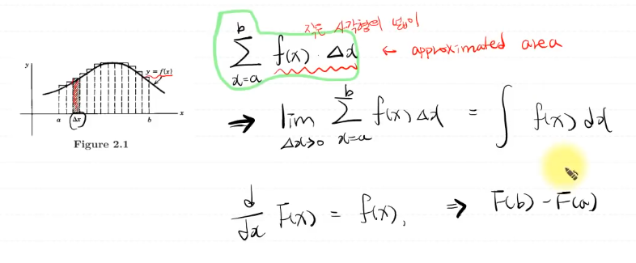

## 편미분, 전미분, 델타에 관한 정의

***

### <strong> 변화율 (델타) </strong>

- 과연 이 둘은 같을까?

$$ dx \leftrightarrow \Delta x $$

- 정답은 다르다. 시간적인 측면에서 $dx$ 는 연속적이고 $\Delta x$ 는 이산적인 상황에서 사용한다. 
  
- $x$ 가 변화할 때, **종속변수** $y$ 가 변하는 변화율
  - 이는 분수처럼 취급이 가능하다. (물론 아닌 경우도 있다)
  - $dx$ 는 $\Delta x$ 를 극한으로 보낸 것이기에 어떤 숫자로 정의할 수 없다. 
  - $\Delta x$ 는 분수다.

$$ \frac{dy}{dx} $$

- $y$ 는 $x$ 의 종속변수기 때문에 $x$ 를 극한으로 보내는 것만으로도 만족한다.

- 적분에서의 응용 사례를 보자.
  - $f$ 를 적분하고 싶은데 $f$ 는 $x$ 에 대한 종속 변수이다. 
  - 이때, $\Delta x$ 를 아주 작은 값으로 만들어서 더욱 근사를 한다. 

### <strong>편미분과 전미분</strong>

- 독립 변수: 다른 변수에 영향을 받지 않는 독립적인 변수
- 종속 변수: 다른 변수에 영향을 받는 변수 
- 다변수 함수: 함숫값을 결정할 대 $2$ 개 이상의 독립 변수가 필요한 함수
- 다변수 함수를 미분할 때 사용하는 것이 편미분과 전미분이다. 

1. 편미분: 다변수 함수에서 관심이 있는 한 변수만 변수로 생각하고, 나머지 변수들은 상수로 취급한 뒤 미분하는 방법이다. 
   1. 주로 다변수함수에서 $1$ 개의 변수의 값이 변화할 때의 변화율을 알기 위해 사용된다.
   2. 즉, 총 $3$ 개의 과목 $x,y,z$ 에서 $x$ 라는 과목의 점수만 변화했을 때 전체 평균이 얼마나 변할지 궁금하면 사용한다. 
   3. 직관적인 해석: $x$ 가 변화하면, $f$ 는 얼마나 변화하는가

$$ f_x(x,y,z) = \frac{\partial f}{\partial x} $$

2. 전미분: 전체 과목의 점수가 모두 변화할 때 전체 평균이 어떻게 변하는지 알고 싶을 때 사용한다. 즉, 다변수 함수를 모든 변수에 대해서 미분하는 것.

$$ df(x,y,z) = \frac{\partial f}{\partial x}dx + \frac{\partial f}{\partial y}dy + \frac{\partial f}{\partial z}dz  $$

- 전체 평균을 함수로 표현한다면, $f(x,y,z) = \frac{1}{3}x + \frac{1}{3}y + \frac{1}{3}z$ 이다. 이를 전미분하면 다음과 같다. 
  - $x$ 과목의 점수가 $6$ 점, $y$ 과목의 점수가 $12$ 점, $z$ 과목의 점수가 $30$ 점 떨어졌다면, 평균은 총 $2+4+10=16$ 점 떨어지게 된다. 
  - 직관적인 해석: $x$ 에 대해서만 보자면, $x$ 가 변화할 때 $f$ 가 변화하는 비율은 $1/3$ 인데, 실제로 $x$ 는 $-6$ 점의 변화가 있었으니 $f$ 는 $2$ 점이 떨어진다. 

$$ f(x,y,z) = \frac{1}{3}dx + \frac{1}{3}dy + \frac{1}{3}dz $$

3. 벡터장 

- $x$ 가 변할 때 $f$ 가 변하는 비율 (크기) $\times$ $x$ 방향으로의 단위 벡터: 크기 $\times$ 방향

$$ f(x,y) = \frac{\partial f}{\partial x} i + \frac{\partial f}{\partial y} j $$
